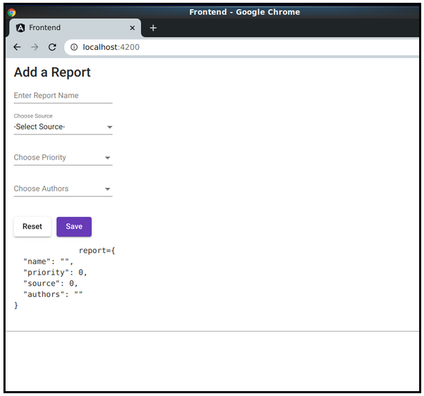

Lesson 3: Add Report Page
-------------------------
The Google Drive link is here:<br>
&nbsp;&nbsp;&nbsp;https://docs.google.com/document/d/1WNXCAORdByzjRXo2kI7IuSsbqQMaPHGwMaVbZECkC8A/edit?usp=sharing
      

The source code for this lesson is here:<br>
&nbsp;&nbsp;&nbsp;https://github.com/traderres/angularApp1Lessons/tree/lesson3/add-report-page
<br>
<br>


Agenda

- Add a page to your frontend
- Add Angular Material components -- e.g., dropdowns, multi-select, textboxes
- Discuss two-way binding


In this lesson, we will build this page:

```
Procedure
    1. Generate a component called add-report
        unix> cd ~/intellijProjects/angularApp1/frontend
        unix> ng generate component reports/addReport
        CREATE src/app/reports/add-report/add-report.component.css (0 bytes)
        CREATE src/app/reports/add-report/add-report.component.html (25 bytes)
        CREATE src/app/reports/add-report/add-report.component.spec.ts (650 bytes)
        CREATE src/app/reports/add-report/add-report.component.ts (290 bytes)
        UPDATE src/app/app.module.ts (606 bytes)


    2. Edit the frontend/src/app/app.component.html

        Replace the contents of this entire file with this:
        
        <app-add-report></app-add-report>


    3. Replace the frontend/src/app/reports/add-report/add-report.component.ts with this:

        import { Component, OnInit } from '@angular/core';

         export class Report {
           name: string;
           priority: number;
           source: number;
           authors: string;
         }

         @Component({
           selector: 'app-add-report',
           templateUrl: './add-report.component.html',
           styleUrls: ['./add-report.component.css']
         })
         export class AddReportComponent implements OnInit {

           public report: Report;

           constructor() { }

           ngOnInit() {
             this.report = new Report();
             this.report.name = "";
             this.report.priority = 0;
             this.report.source = 0;
             this.report.authors = "";
           }

           public reset() {
             this.report.name = "";
             this.report.priority = 0;
             this.report.source = 0;
             this.report.authors = "";
           }

           public save() {
             console.log('save() started  this.report=' , this.report);
           }
         }


    4. Replace the add-report.component.html with this:

          <mat-card>
            <mat-card-title>Add a Report</mat-card-title>

            <mat-card-content>

              <mat-form-field>
                <mat-label>Enter Report Name</mat-label>

                <!-- Use the matInput for input fields inside <mat-form-field>...</mat-form-field> tags -->
                <input matInput type="text" name="report.name"  [(ngModel)]="report.name"/>
              </mat-form-field>
              <br/>

              <mat-form-field>
                <mat-label>Choose Source</mat-label>

                <!-- Use the matNativeControl for select and input fields inside <mat-form-field>...</mat-form-field> tags -->
                <select matNativeControl name="report.source" [(ngModel)]="report.source">
                  <option value="0">-Select Source-</option>
                  <option value="100">Israel</option>
                  <option value="101">United Kingdom</option>
                  <option value="102">USA</option>
                </select>
              </mat-form-field>
              <br/>

              <mat-form-field>
                <mat-label>Choose Priority</mat-label>

                <!-- Single Select -->
                <mat-select name="report.priority" [(ngModel)]="report.priority">
                  <mat-option value="0">-Select Priority-</mat-option>
                  <mat-option value="1">Low</mat-option>
                  <mat-option value="2">Medium</mat-option>
                  <mat-option value="3">High</mat-option>
                  <mat-option value="4">Critical</mat-option>
                </mat-select>
              </mat-form-field>
              <br/>


              <mat-form-field>
                <mat-label>Choose Authors</mat-label>

                <!-- Multiple Select -->
                <mat-select multiple name="report.authors" [(ngModel)]="report.authors">
                  <mat-option value="10">Adam</mat-option>
                  <mat-option value="11">Ben</mat-option>
                  <mat-option value="12">Peter</mat-option>
                  <mat-option value="13">Justin</mat-option>
                </mat-select>
              </mat-form-field>
              <br/>

              <!-- Use the pretty material design buttons -->
              <button type="button" (click)="reset()" style="margin-top: 20px" mat-raised-button>Reset</button>&nbsp;&nbsp;
              <button type="button" (click)="save()" mat-raised-button color="primary">Save</button>
            </mat-card-content>


            <pre>
           report={{report | json}}
            </pre>

          </mat-card>


    5. Use IntelliJ to add the missing Angular Material modules to the angular app
        a. Go to add-report.component.html
        b. Put the mouse over <mat-card>
            -- You should see red lines on the right that say
            "Component or directive matching...is out of the current angular module scope"
            -- Press Alt-Enter
            -- You should get the option to "Import MatCardModule"
            -- Select this option


What happened when you selected to import the module?
-----------------------------------------------------
    • You have an app.module.ts that loads application modules
    • In order to use the material card tags -- e.g., <mat card>, <mat-form-field>, <mat-card-content>
        You must import the module within the app.module.ts
    • When you selected to import the module, IntelliJ added the appropriate module to app.module.ts


After Pressing Import, IntelliJ added the code in Bold
------------------------------------------------------
import { BrowserModule } from '@angular/platform-browser';
import { NgModule } from '@angular/core';

import { AppRoutingModule } from './app-routing.module';
import { AppComponent } from './app.component';
import { BrowserAnimationsModule } from '@angular/platform-browser/animations';
import { AddReportComponent } from './reports/add-report/add-report.component';
import {MatCardModule} from "@angular/material/card";

@NgModule({
  declarations: [
	AppComponent,
	AddReportComponent
  ],
  imports: [
	BrowserModule,
	AppRoutingModule,
	BrowserAnimationsModule,
	MatCardModule
  ],
  providers: [],
  bootstrap: [AppComponent]
})
export class AppModule { }


Helpful Hint
------------
You have a choice.  You can manually add the modules to app.module.ts or have IntelliJ do it for you. 

    6. Add the imports for the remaining tags in add-report.component.html  
        a. Put the mouse over <mat-form-field>
            -- Press Alt-Enter
            -- Select "Import Angular Module"
            -- Select MatFormFieldModule

        b. Put the mouse over the [(ngModel)]
            -- Press Alt-Enter
            -- Select "Import FormsModule"

        c. Put the mouse over the <mat-select> tag
            -- Press Alt-Enter
            -- Select "Import MatSelectModule"

        d. Put the mouse over the <mat-raised-button>
            -- Press Alt-Enter
            -- Select "Import MatButtonModule"

        e. Put the mouse over matNativeControl
            -- Press Alt-Enter
            -- Select "Import MatInputModule"


When completed, the app.module.ts file should look like this
------------------------------------------------------------
NOTE:  The code in bold was added by IntelliJ

import { BrowserModule } from '@angular/platform-browser';
import { NgModule } from '@angular/core';

import { AppRoutingModule } from './app-routing.module';
import { AppComponent } from './app.component';
import { BrowserAnimationsModule } from '@angular/platform-browser/animations';
import { AddReportComponent } from './reports/add-report/add-report.component';
import {MatCardModule} from "@angular/material/card";
import {FormsModule} from "@angular/forms";
import {MatSelectModule} from "@angular/material/select";
import {MatButtonModule} from "@angular/material/button";
import {MatInputModule} from "@angular/material/input";

@NgModule({
  declarations: [
	AppComponent,
	AddReportComponent
  ],
  imports: [
	BrowserModule,
	AppRoutingModule,
	BrowserAnimationsModule,
	MatCardModule,
	FormsModule,
	MatSelectModule,
	MatButtonModule,
	MatInputModule
  ],
  providers: [],
  bootstrap: [AppComponent]
})
export class AppModule { }


    7. Activate the debugger to see if your page shows
        a. Pull Run -> Debug 'Full WebApp'
        b. Verify that you see your "Add a Report" page

            WARNING:  Be Patient!!!
            -- You will see the compiling in the "Angular CLI Server" tab of your Debug window
            -- Compiling the modules the first time takes an extra 30-60 seconds

        c. You should see a chrome browser open up with this


	
    8. Change the fields in the web browser
        -- Set a report name
        -- Select multiple authors


Why does the reports JSON section on the bottom change in real-time???
-----------------------------------------------------------------------
Technique:  If you want to display a variable on a page w/o using breakpoints, then add a tag to display it and use the {{ variableName | json }} to show it as a JSON object

<pre>
  report={{report | json}}
 </pre>

The {{ report | json }} tag says to display the current value of the this.report object and display as JSON
-- So you see all of the fields inside of it

The assumption is that your typescript component has a public object called report
   public report: Report;


    9. Verify that the breakpoints still work (in the TypeScript code)
        a. Edit add-report.component.ts
        b. Set breakpoints in the save() and reset() TypeScript methods
        c. Activate the Debugger (using "Full WebApp")
        d. When the browser opens to the "Add Reports" page
            i. Enter some data on the page
            ii. Press save()
            -- You should hit your breakpoint (in the TypeScript code)
             -- Press F9 to continue


    10. While the webapp is running in debug mode, edit the add-report.component.html
        -- Change one of the author names
        -- Click in the browser
        -- You will see that the edit is applied in real-time
    
    Helpful Hint:  In debug mode, you can make frontend changes without restarting the webapp.
    Why?  In debug mode, The frontend will apply *most* html changes in real-time.  And, the browser (connected to localhost:4200) is actively listening for changes.


    11. Make sure you can still build the uber JAR
        a. Stop the debugger (if it's running)

        b. Build the Uber JAR
            unix> cd ~/intellijProjects/angularApp1
            unix> mvn clean package -Pprod

        c. Run the Uber JAR (starts-up the webapp, listening on port 8080)
            unix> java -jar ./backend/target/backend-1.0-SNAPSHOT-exec.jar


            When you see the "WebApp is Up" message, then you're read to connect

        d. Connect to the webapp
            Open a browser
            Connect to http://localhost:8080/app1

            -- You should see the "Add Reports" page
```
