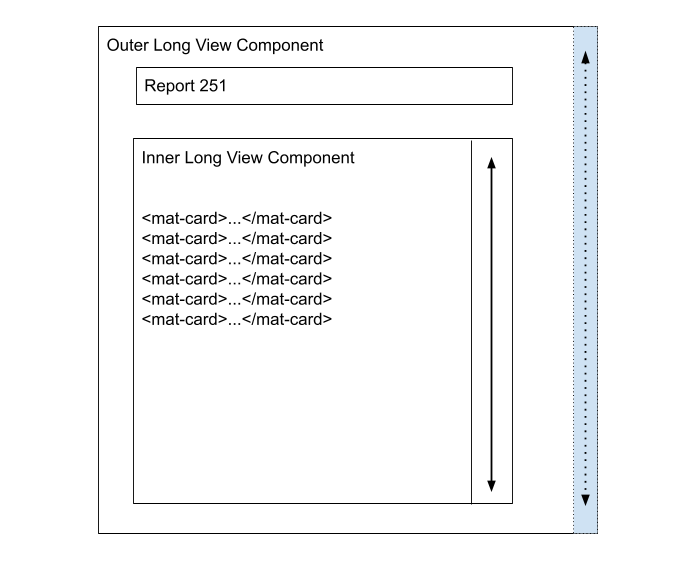

Lesson 15c:  Kitchen Drawer / Fixed Page Title
-------------------------
The Google Drive link is here:<br>
&nbsp;&nbsp;&nbsp;https://docs.google.com/document/d/1bjtgTRy0jskJmJ42p0fN8syKv5TxJruOgIMwg4PADII/edit?usp=sharing
      

The source code for this lesson is here:<br>
&nbsp;&nbsp;&nbsp;https://github.com/traderres/angularApp1Lessons/tree/lesson15c/fixed-page-title
<br>
<br>
<br>

<h3> Problem Set </h3>

Problem: I want the page title to be fixed (even if the user scrolls down)<br>

Solution: The Outer Long View Report Component has its scroll bar hidden (far right in dashes)<br>  
- The Inner Long View Component has its scroll bar visible
- This keeps the top of the page fixed and scrolls the lower part




<br>
<br>

<h3>Approach</h3>

1. Add a Long-view-inner-component (part of the page that scrolls)

   1. Generate the component  

1. Add a Long-view-outer-component (holds the header and inner-view component)

   1. Generate the component
   1. Add a route
   1. Add a navigation item
   1. Verify it shows  

1. Edit the Long-view-outer-component page

   1. Add a header to the top of the page
   1. Add the Long-view-report-details component to the bottom of the page  

1. Add lots of mat-cards to the Long-view-inner-component  

1. Change the components so that the scroll bar appears in the Long-view-report-details only


<br>
<br>

```
Procedure
---------
    1. Generate the Long View Inner Component
       unix> cd ~/intellijProjects/angularApp1/frontend
       unix> ng generate component reports/long-view-inner-report --skipTests


    2. Generate the Long View Outer Component
       unix> cd ~/intellijProjects/angularApp1/frontend
       unix> ng generate component reports/long-view-outer-report --skipTests


    3. Add the Long View Outer Component to the left-side nav bar
        a. Add a route to app.module.ts

            { path: 'page/longReport', 	component: LongViewOuterReportComponent },


        b. Add a navigation icon to navbar.component.html
            
            <!-- Long View Report -->
            <mat-list-item class="navItem" [routerLink]="'page/longReport'"
                            routerLinkActive="active">
                <a title="Long View Report">Long View Report</a>
                <div fxFlex fxLayoutAlign="end end" >
                <a [routerLink]="'page/longReport'" target="_blank">
                    <i class="fas fa-external-link-alt navItemIcon"
                    title="Open 'Long View Report' a new window"></i>
                </a>
                </div>
            </mat-list-item>


    4. Verify that the "Long View" navigation icon shows the Long View Outer Component
        a. Activate the Debugger on 'Full WebApp'
        b. Click on "Long View"
           -- Verify that you see "long-view-outer-report works!


    5. Add a header and the inner-report to the "long-view-outer-report" component
        a. Edit long-view-outer-report.component.html

        b. Replace its contents with a mat-card that acts as a header
            
            <div fxLayout="column" fxLayoutAlign="start stretch" fxFlexFill>
            
                <div fxFlex="none" fxLayout="row" fxLayoutGap="0">
            
                <!-- Left Side of the Top Row -->
                <div fxFlex="45%" fxLayoutAlign="left center" fxLayoutGap="0">
                        <mat-card style="width: 100%" class="mat-elevation-z0">
                            <!-- Page Title -->
                            <mat-card-title>Report 251</mat-card-title>
                        </mat-card>
                </div>
            
            
                <!-- Center Side of the Top Row -->
                <div fxFlex="10%" fxLayoutAlign="center center" fxLayout="row" fxLayoutGap="0">
            
                </div>
            
            
                <!-- Right Side of the Top Row -->
                <div fxFlex="45%"  fxLayoutAlign="end center" >
            
                </div> 	<!-- End of Right Side of the Top Row -->
            
                </div>  <!-- End of top row -->
            
            
                <!-- Rest of the page -->
                <app-long-view-inner-report></app-long-view-inner-report>
            
            
            </div>


    6. Verify that the outer page shows the inner component in it
        a. Activate the Debugger on "Full WebApp"
        b. Click on "Long View Report"
        c. You should see this "Report 251" title and "long-view-inner-report works!" inside


    7. Fill-in the long-view-inner-report
        a. Edit long-view-inner-report.component.html

        b. Replace its contents with this:
            
            <!-- Card 1 has a smaller margin-top than the other cards -->
            <mat-card class="mat-elevation-z4" style="margin: 5px 15px 15px 10px;">
              <mat-card-title>Section 1</mat-card-title>
            
              <mat-card-content>
                <p>This, that, and the other thing</p>
                <p>This, that, and the other thing</p>
                <p>This, that, and the other thing</p>
                <p>This, that, and the other thing</p>
              </mat-card-content>
            </mat-card>
            
            
            
            <!-- Cards 2 to N have a margin-top of 15px -->
            <mat-card class="mat-elevation-z4" style="margin: 15px 15px 15px 10px"
                    *ngFor="let number of [2,3,4,5,6,7,8]">
              <mat-card-title>Section {{number}}</mat-card-title>
            
              <mat-card-content>
                <p>This, that, and the other thing</p>
                <p>This, that, and the other thing</p>
                <p>This, that, and the other thing</p>
                <p>This, that, and the other thing</p>
              </mat-card-content>
            </mat-card>


    8. Verify that you see the regular scroll bar on the right
        a. Activate the Debugger on "Full WebApp"
        b. Click on "Long View Report"
           -- Verify that you see the regular scrollbar (and the header gets scrolled away)
```

```
In this example, the traditional scrollbar is visible (so "Report 251" is hidden as the user scrolls)


    9. Adjust the inner component so it has its own scroll bar and the outer scrollbar disappears
        a. Edit long-view-inner-report.component.css

        b. Add this CSS:
            
            :host {
              overflow: auto;
            }


        c. Edit long-view-outer-report.component.html

        d. Change these lines:
                <!-- Rest of the page -->
                <app-long-view-inner-report></app-long-view-inner-report>

           To this:
               <!-- Rest of the page -->
               <app-long-view-inner-report fxFlex="calc(100vh - 115px)"></app-long-view-inner-report>

            
            
            NOTE:  100vh is the height of the entire screen
                   115px is the height of the header.component.html and page title


    10. Verify that the scroll bar keeps the header fixed:
        a. Activate the Debugger on "Full WebApp"
        b. Click on "Long View Report"
```

```

Scroll Down -- and you see that the header stays fixed.

```

