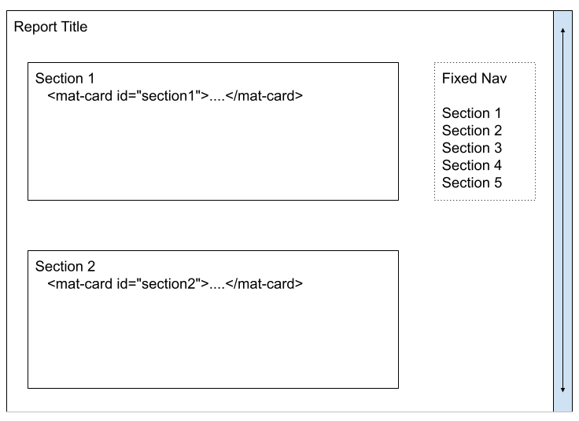

Lesson 15d:  Kitchen Drawer / Scroll into View w/Internal Nav
-------------------------------------------------------------
The Google Drive link is here:<br>
&nbsp;&nbsp;&nbsp;https://docs.google.com/document/d/1VQBA4kJyvu-ShFFBRSzxce2YhEzNUQuV_MPRm1lBetE/edit?usp=sharing
      

The source code for this lesson is here:<br>
&nbsp;&nbsp;&nbsp;https://github.com/traderres/angularApp1Lessons/tree/lesson15d/scroll-into-view
<br>
<br>
<br>

<h3> Problem Set </h3>

Problem:  I have a long page of details and want to be able to smoothly scroll between sections<br>
Solution:  Assign each section a CSS id and create an internal nav section that lets users switch sections.<br>

<br>
<br>



The "Fixed Nav" uses CSS properties to keep it fixed (so it's always visible even as the user scrolls down)

<br>
<br>

<h3>Approach</h3>

1. Create a long-details page that has many sections  
   Each section has its own CSS id
1. Add a typescript method that will scroll to a CSS id
1. Add a fixed area that will let users scroll into view


<br>
<br>

```
Procedure
---------
    1. Create a long page
       unix> cd ~/intellijProjects/angularApp1/frontend
       unix> ng generate component reports/LongViewInternalNavReport --skipTests

    2. Add a route
        a. Edit app.module.ts

        b. Add a route for the page so that 'page/longView/:id takes the user to the new component

    3. Edit the "View Reports" page so that there is a "Long View" icon
        a. Edit view-reports.components.ts

        b. Add a public method called goToLongView()
            that takes the user to the new page and passes-in the reportId:


        c. Edit view-reports.component.html

        d. Add a button (use mat-icon-button) that has a click handler that
            -- calls goToLongView() and passes-in the report Id
            -- Uses fa fa-file-alt for the icon


    4. Verify that it works
        a. Activate the Debugger on "Full WebApp"
        b. Click on "View Reports"
        c. Click on the "Long View" icon [you specified in step 3d]
            -- It should take the user to the "Long View" page
            


    5. Setup the long-view-internal-nav-report page so it has 2 columns
       -- Left column holds mat-cards
       -- Right column holds the internal nav
        a. Edit long-view-internal-nav-report.component.html

        b. Replace its contents with this:

            <div fxFlexFill fxLayoutAlign="start start" fxLayout="row" fxLayoutGap="0">
            
              <div fxFlex fxLayoutGap="0" style="overflow: auto" style="border: 1px solid green">
                <!-- Left Column -->
                Left
              </div>
            
            
              <div fxFlex="200px" style="border: 1px solid red">
                <!-- Right Column is fixed-width at 200 px -->
                Right
              </div>
            </div>

        c. Take a look in your browser
           -- You should see the left and right columns


    6. Add a number of cards (using a for loop) to the left side -- so the left side is long
        a. Edit long-view-internal-nav-report.component.html

        b. Add the cards to the left column

            
            <!-- Card 1 has a smaller margin-top than the other cards -->
            <mat-card class="mat-elevation-z4" style="margin: 5px 15px 15px 10px;">
              <mat-card-title>Section 1</mat-card-title>
            
              <mat-card-content>
                <p>This, that, and the other thing</p>
                <p>This, that, and the other thing</p>
                <p>This, that, and the other thing</p>
                <p>This, that, and the other thing</p>
              </mat-card-content>
            </mat-card>
            
            
            
            <!-- Cards 2 to N have a margin-top of 15px -->
            <mat-card class="mat-elevation-z4" style="margin: 15px 15px 15px 10px"
                    *ngFor="let number of [2,3,4,5,6,7,8]">
              <mat-card-title>Section {{number}}</mat-card-title>
            
              <mat-card-content>
                <p>This, that, and the other thing</p>
                <p>This, that, and the other thing</p>
                <p>This, that, and the other thing</p>
                <p>This, that, and the other thing</p>
              </mat-card-content>
            </mat-card>


        c. Take a look in your browser
            -- You should see the cards in the left side


    7. Add CSS ids to the <mat-card> tags
       -- Add id="section1" to the 1st <mat-card>
       -- Add id="section2" to the 2nd <mat-card>
       -- Add id="section3" to the 3rd <mat-card>

        a. Edit long-view-internal-nav-report.component.html

        b. Adjust the first <mat-card> so it has id="section1"
            <mat-card class="mat-elevation-z4" style="margin: 5px 15px 15px 10px;" id="section1">

        c. Adjust the looped mat-cards so that the id=" " is generated
            <mat-card class="mat-elevation-z4" style="margin: 15px 15px 15px 10px"
                        *ngFor="let number of [2,3,4,5,6,7,8]"
                 id="section{{number}}">


    8. Let's look at the page
        a. Activate the Debugger on "Full WebApp"
        b. Click on "View Reports"
        c. Click on the "Long View" icon
           -- You should see something like this:
```

```
NOTE:  As you scroll down the right-side navigation page disappears (which sucks!)


    9. Add a public method that will scroll into view
        a. Edit long-view-internal-nav-report.component.ts

        b. Add these 2 public methods:
            
             /*
              * Scroll the page into view so the user can see the tag that has id=" "
              */
              public scrollToTargetId(aElementId: string): void {
                // Get a reference to the DOM element
                const el: HTMLElement|null = document.getElementById(aElementId);
            
                if (el) {
                // The DOM element exists.  So, scroll to it.
                setTimeout(() =>
                    el.scrollIntoView({behavior: 'smooth', block: 'start', inline: 'nearest'}), 0);
                }
              }
            
            
              /*
               * Scroll the page into view so the user can see the *FIRST* tag that has class=" "
               * NOTE:  If you need to scroll to a class item in an innerHtml, then this would work
               */
              public scrollToTargetClass(aClassName: string): void {
                const elementList = document.getElementsByClassName(aClassName);
                const element = elementList[0] as HTMLElement;
            
                if (element) {
                setTimeout(() =>
                    element.scrollIntoView({behavior: 'smooth', block: 'start', inline: 'nearest'}), 0);
                }
              }
            


    10. Add the internal hyperlinks to the right column
        a. Edit long-view-internal-nav-report.component.html

        b. Replace Right Column div with this
            
             <div fxFlex="200px">
                <!-- Right Column is fixed-width at 200 px -->
            
                <!-- Use padding-inline-start to reduce the left-side padding on this ul tag -->
                <ul class="internal-nav" style="margin-top: 10px;  padding-inline-start: 10px;">
            
                <li class="internal-nav"><mat-divider></mat-divider></li>
            
            
                <li class="internal-nav">
                    <!-- Go to Section 1 -->
                    <a title="Go to 'Section 1'" (click)="this.scrollToTargetId('section1')"  class="clickable">Section 1</a>
                </li>
                <li class="internal-nav"><mat-divider></mat-divider></li>
            
            
                <li class="internal-nav">
                    <!-- Go to Section 2 -->
                    <a title="Go to 'Section 2'" (click)="this.scrollToTargetId('section2')"  class="clickable">Section 2</a>
                </li>
                <li class="internal-nav"><mat-divider></mat-divider></li>
            
            
                <li class="internal-nav">
                    <!-- Go to Section 3 -->
                    <a title="Go to 'Section 3'" (click)="this.scrollToTargetId('section3')"  class="clickable">Section 3</a>
                </li>
                <li class="internal-nav"><mat-divider></mat-divider></li>
            
            
                <li class="internal-nav">
                    <!-- Go to Section 4 -->
                    <a title="Go to 'Section 4'" (click)="this.scrollToTargetId('section4')"  class="clickable">Section 4</a>
                </li>
                <li class="internal-nav"><mat-divider></mat-divider></li>
            
            
                <li class="internal-nav">
                    <!-- Go to Section 5 -->
                    <a title="Go to 'Section 5'" (click)="this.scrollToTargetId('section5')"  class="clickable">Section 5</a>
                </li>
                <li class="internal-nav"><mat-divider></mat-divider></li>
            
            
                <li class="internal-nav">
                    <!-- Go to Section 6 -->
                    <a title="Go to 'Section 6'" (click)="this.scrollToTargetId('section6')"  class="clickable">Section 6</a>
                </li>
                <li class="internal-nav"><mat-divider></mat-divider></li>
            
                 
                </ul>
            
              </div>  <!-- End of Right-side column -->


    11. Add the CSS classes (to make the internal nav links look pretty)
        a. Edit long-view-internal-nav-report.component.css

        b. Add these CSS classes:
            
            .internal-nav  {
              list-style-type: none;
              margin: 0;
              padding: 4px;
              white-space: nowrap;  /* Stop the wrapping */
            }
            
            .internal-nav a {
              white-space: nowrap;  /* Stop the wrapping */
              font-family: Roboto;
              font-size: 1.2em;
              font-weight: 400;
            }
            
            .internal-nav a:hover {
              /* The user has hovered over any anchor */
              white-space: nowrap;  /* Stop the wrapping */
              color: #007bff;
              font-family: Roboto;
              font-size: 1.2em;
              font-weight: 400;
            }
            
            .mat-divider {
              /* Set the length of the mat-divider */
              width: 140px;
            }


    12. Verify that the internal navigation bar works
        a. Activate the Debugger on "Full WebApp"
        b. Click on "View Reports"
        c. Click on the "Long View" icon on one of the reports
        d. Click on one of the internal-nav items
           -- Verify that it scrolls until that section is "in view"
```

```
NOTE:  When you put the mouse over the internal-nav-link, it changes color


    13. Make the right-column fixed (so it does not scroll up/down)
        This is the icing on the cake:

        a. Edit long-view-internal-nav-report.component.css

        b. Add this CSS class called "fixed":

            .fixed {
              position: fixed;
              width: 200px;      /* should be the same width as the column */
            }
            


        c. Edit long-view-internal-nav-report.component.html

        d. Add the <div class="fixed" immediately after the right-column starts:
            
              <div fxFlex="200px">
                <!-- Right Column is fixed-width at 200 px -->
            
                <div class="fixed">
            
                    <ul class="internal-nav">
                    
            
            
                    </ul>
            
                </div>  <!-- End of fixed div -->
            
            </div>  <!-- End of Right-side column -->


    14. Verify that the right-side nav stays fixed
        a. Activate the Debugger on "Full WebApp"
        b. Click on "View Reports"
        c. Click on the "Long View" icon one one of the reports
        d. In the "Long View" page, click on one of the internal nav icons
           -- You should scroll down but the internal navigation section stays fixed


    15. Give the mat-cards some depth
        a. Edit  long-view-internal-nav-report.component.css

        b. Added this CSS
            
            mat-card{
              margin: 15px;
              margin-right: 10px !important;	/* Needed to show the right-side of the mat-card */
            }

        c. Edit long-view-internal-nav-report.component.html

        d. Remove the style="border: 1px solid..." from the left and right columns


    16. Verify that the mat-cards now have depth
        a. Activate the Debugger on "Full WebApp"
        b. Click on "View Reports"
        c. Click the "Long View" button
           -- Look at the mat-cards
           -- You should see a 3D effect around each card
```


