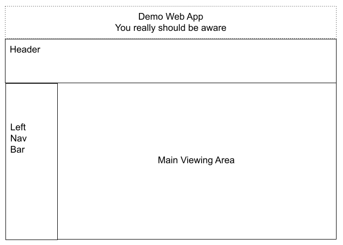

Lesson 17a:  Add Banner / Center Horizontally & Vertically
----------------------------------------------------------
The Google Drive link is here:<br>
&nbsp;&nbsp;&nbsp;https://docs.google.com/document/d/1dZ-roxWCVJzv0nRrZ8h7SgWyZXXl1E8E15lxqBdUSxw/edit?usp=sharing
      

The source code for this lesson is here:<br>
&nbsp;&nbsp;&nbsp;https://github.com/traderres/angularApp1Lessons/tree/lesson17a/add-banner
<br>
<br>
<br>

<h3> Problem Set </h3>
Problem:  Add a two-line banner to the top of my webapp and center it horizontally & vertically.<br>
Solution: There are multiple approaches<br>

<br>
<br>



<br>
<br>
<h3>Approaches</h3>

1. Use div & line-height technique
1. Use div & span technique
1. Use Angular Flex w/one div: one div holds all text
1. Use Angular Flex w/multiple divs holding text: one div for each line


<br>
<br>
<h3>Requirements</h3>

- The background of the entire banner to be #159818
- The foreground color should be white
- The font size is 12px
- The font family is Roboto
- The font weight is 500
- The entire banner will be 50px in height


<br>
<br>

```
Approach 1:  Use a single div and set line-height and height to the same  (does not work w/multiple lines)
----------------------------------------------------------------------------------------------------------
    1. Edit app.component.html

    2. Add this inside the first div:
        a. Add a new div
        b. Set fxFlex="50px" so that this banner is 50 pixels height
        c. Set the line height the same as the banner height
        d. Set the font-family,
        e. Set the font-size
        f. Set the font-weight
        g. Set the background-color
        h. Set the foreground color
        i. Set the text-align to center

    3. Activate the debugger
        -- You should see the "Demo Web App" centered 


Approach 1:  Answer for Single Row
----------------------------------

      <div fxFlex="50px" style="width: 100%; line-height: 50px; font-family: Roboto; font-size: 12px !important; 
                                            font-weight: 500; text-align: center; background-color: #159818; color: white">
        Demo Web App
      </div>


Problem:  This banner has only 1 line of text.  This will not work with 2 lines of text.

How do we get this to work with 2 lines of text?    [use two divs]
Since this div technique only works with one line of text, then we can replace one 50px div with two 25px divs

      <div fxFlex="25px" style="width: 100%; line-height: 25px; font-family: Roboto; font-size: 12px !important; font-weight: 500; text-align: center; background-color: #159818; color: white">
        Demo Web App
      </div>
    
      <div fxFlex="25px" style="width: 100%; line-height: 25px; font-family: Roboto; font-size: 12px !important; font-weight: 500; text-align: center; background-color: #159818; color: white">
        You really should be aware
      </div>


Approach 2:  Use div & span
---------------------------
    1. Edit app.component.html

    2. Add this inside the first div:
        
          <div fxFlex="50px" style="width: 100%;  line-height: 50px; font-family: Roboto; font-size: 12px !important; font-weight: 500; text-align: center;background-color: #159818; color: white">
        
            <span style="display: inline-block; vertical-align: middle; line-height: normal;">
        
                    Demo Web App  <br/>
                    You really should be aware
        
            </span>
          </div>

    3. Activate the debugger
       -- You should see the "Demo Web App" centered 
       -- Change the banner height to 100px and verify that the banner is centered horizontally and vertically


Approach 3:  Use Angular Flex and put content in a Single Div
-------------------------------------------------------------
    4. Edit app.component.html

    5. Add this inside the first div:
        
          <div fxFlex="50px" fxLayout="column" fxLayoutAlign="center center">
        
            <div fxFlexFill fxLayoutAlign="center center"  style="text-align: center; font-family: Roboto; font-size: 12px !important; font-weight: 500; background-color: #159818; color: white">
        
                Demo Web App  <br/>
                You really should be aware
        
            </div>
          </div>


    6. Activate the debugger
       -- You should see the "Demo Web App" centered 
       -- Change the banner height to 100px and verify that the banner is centered horizontally and vertically


Approach 4:  Use Angular Flex and put content into Multiple Divs
----------------------------------------------------------------
    7. Edit app.component.html

    8. Add this inside the first div:
        
          <div fxFlex="50px" fxLayout="column" style="background-color: #159818; color: white">
        
            <div fxFlex fxLayoutAlign="center center"  style="font-family: Roboto; font-size: 12px !important; font-weight: 500;">
                Demo Web App
            </div>
        
            <div fxFlex fxLayoutAlign="center center" style="font-family: Roboto; font-size: 12px !important; font-weight: 500;">
                You really should be aware
            </div>
        
          </div>


    9. Activate the debugger
       -- You should see the "Demo Web App" centered 
       -- Change the banner height to 100px and verify that the banner is centered horizontally and vertically
        


```
