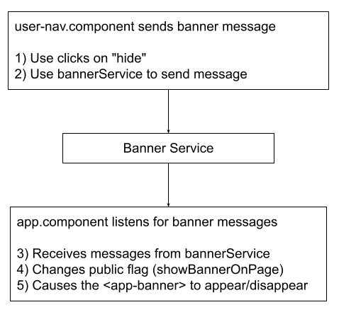

Lesson 17c:  Add Banner / Let Users Toggle It
---------------------------------------------
The Google Drive link is here:<br>
&nbsp;&nbsp;&nbsp;https://docs.google.com/document/d/1e_MuVPXzM7oHON3noXYHg1flssRZZDI6rKfgg3zpKIQ/edit?usp=sharing
      

The source code for this lesson is here:<br>
&nbsp;&nbsp;&nbsp;https://github.com/traderres/angularApp1Lessons/tree/lesson17c/toggle-banner
<br>
<br>
<br>

<h3> Problem Set </h3>
Problem:  The "Hide" button does not let users show it (without reloading the page).<br>
Solution:  Add right-side menu options that let users show/hide the banner<br>

<br>
<br>


<br>
<br>

 <br>
The Hide Banner / Show Banner will be placed in the right-side navbar

<br>
<br>

<h3>Approach</h3>

1. Remove the "Hide" button from the banner component
   1. Remove the "Hide" button
   1. Remove the injected banner service  

1. Adjust the right-side-banner TypeScript class
   1. Inject the banner service (as a public variable)  
   1. Add a public boolean (so the page knows if the banner is visible or not)  
          public bannerIsVisible: boolean;  
   1. Listen for messages from the bannerService in ngOnInit  

1. Adjust the right-side-banner HTML
   1. Add two navbar options:  
      "Hide Banner" which calls this.bannerService.hideBanner() (show if bannerIsVisible==true)  
      "Show Banner" which calls this.bannerService.showBanner() (show if bannerIsVisible==false)
      

<br>
<br>

```
Procedure
---------
    1. Remove the "Hide" button from the banner component
        a. Edit banner.component.html

        b. Remove the "Hide" button from the html

        c. Edit banner.component.ts

        d. Remove the BannerService from the banner component typescript class


    2. Adjust the right-side navbar TypeScript class
        a. Edit user-navbar.component.ts

        b. Inject the banner service   (as a public variable)

        c. Add a public boolean (so the page knows if the banner is visible or not)
             public bannerIsVisible: boolean;

        d. On ngOnInit subscribe to the banner service and listen for messages
           -- If we receive a message from the banner service with the message of true 
              Then set this.bannerIsVisible = true

           -- If we receive a message from the banner service with the message of false 
              Then set this.bannerIsVisible = false

              Hint:  See the app.component.ts  ngOnInit() for how the app.component.ts does this


    3. Add the "Show Banner" and "Hide Banner" navigation options
        a. Edit user-navbar.component.html

        b. Add a "Show Banner" option has a click event that calls this.bannerService.showBanner()
           NOTE:  We do not need the option to open this in a new window

        c. Add a "Hide Banner" option has a click event that calls this.bannerService.hideBanner()
           NOTE:  We do not need the option to open this in a new window


    4. Verify that you see both "Show Banner" and "Hide Banner" in the right side menu
        a. Activate the Debugger on "Full WebApp"
        b. Press on "John.Smith" to open the right-side menu
        c. Press "Show Banner" -- the banner should appear
        d. Press "Hide Banner" -- the banner should disappear


    5. Adjust the right-side navbar so only one option appears at a time
        a. Edit user-navbar.component.html

        b. Change the navigation items
           -- We do not want to show the "Show Banner" if the banner is visible
           -- We do not want to show the "Hide Banner" if the banner is not visible

           Hint:  *ngIf would be appropriate


    6. Verify that only one of the options appears
        a. Activate the Debugger on "Full WebApp"
        b. Press on "John.Smith" to open the right-side menu
        c. You should only see one option
```

```
NOTE:  The banner is visible so give users the "Hide Banner" option


```

```
NOTE:  The banner is not visible so give users the "Show Banner" option


    7. Problem:  The showing and hiding of the bar is abrupt.  I want to animate the effect over 500 msecs.
        a. Verify that your app.module.ts has the BrowserAnimationsModule (in the imports section) 

        b. Create a trigger called fadeInOut in the app.component.ts

            i. Edit app.component.ts

            ii. In the @Component annotation add this after styleUrls:
                
                  animations: [
                    trigger('fadeInOut', [
                    transition(':enter', [   // :enter is alias to 'void => *'
                        style({opacity:0}),
                        animate(500, style({opacity:1}))
                    ]),
                    transition(':leave', [   // :leave is alias to '* => void'
                        animate(500, style({opacity:0}))
                    ])
                    ])
                  ]

        c. Use the fadeInOut trigger in the app.component.html
            i. Edit app.component.html

            ii. Change the div around the banner to use the fadeInOut trigger
                
                    <div fxFlex="50px" *ngIf="this.showBannerOnPage">
                        <!-- Banner is 50 pixels high -->
                        <app-banner fxFlex></app-banner>
                    </div>

                To this:
                
                    <div fxFlex="50px" *ngIf="this.showBannerOnPage" [@fadeInOut]>
                        <!-- Banner is 50 pixels high -->
                        <app-banner fxFlex></app-banner>
                    </div>

    8. Verify it works
        a. Activate the Debugger on "Full WebApp"
        b. Press on "John.Smith" to open the right-side menu
        c. Press the "Hide Banner" and "Show Banner"
           -- You should see the banner appear/disappear over 500 msecs


    9. There is a new problem:  I want to disable the animation on page load
       Solution:  Set a flag=true and set the flag to false in ngAfterViewInit() 

        a. Edit app.component.ts

        b. Add a public boolean and initialize it to true:
             public disableAnimations: boolean = true;

        c. Adjust the AppComponent so it implemented AfterViewInit

        d. Set the disableAnimations flag to false in the ngAfterViewInit method:
            
               public ngAfterViewInit(): void {
            
                setTimeout(() => {
                    // The page has finished loading, so set the flag so that animations proceed
                    // NOTE:  This flag must be set in a setTimeout for this trick to work.
                    this.disableAnimations = false;
                }, 0);
            
              }


        e. Edit app.component.html

        f. Disable the animation if this.disableAnimations == true
            
           Change the banner div from this:
            
                <div fxFlex="50px" *ngIf="this.showBannerOnPage" [@fadeInOut] >
                  <!-- Banner is 50 pixels high -->
                  <app-banner fxFlex></app-banner>
                </div>
            
           To this:
                
                <div fxFlex="50px" *ngIf="this.showBannerOnPage" [@fadeInOut] 
                                             [@.disabled]="this.disableAnimations">
                  <!-- Banner is 50 pixels high -->
                  <app-banner fxFlex></app-banner>
                </div>


    10. Verify that the banner appears instantly on page load  (No animation on page load)
        a. Activate the Debugger on Full WebApp
        b. Verify that the banner appears immediately on page load
        c. Verify that the banner animates when the user presses "Show Banner" or "Hide Banner"

```
