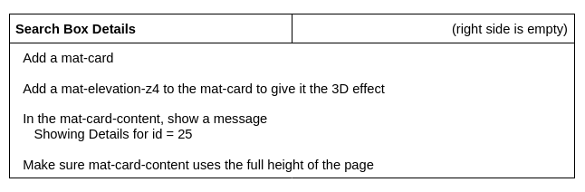

Lesson 18b:  Auto-Complete / Navigate to Page on Selection
----------------------------------------------------------
The Google Drive link is here:<br>
&nbsp;&nbsp;&nbsp;https://docs.google.com/document/d/1oXHqIb6m3J-YExaxCzRrNn7050mXDoQBA8bE3bEDAH8/edit?usp=sharing
      

The source code for this lesson is here:<br>
&nbsp;&nbsp;&nbsp;https://github.com/traderres/angularApp1Lessons/tree/lesson18b/autocomplete/selection-change
<br>
<br>
<br>

<h3> Problem Set </h3>
Problem:  I want to navigate to a details page when a user selects an auto-complete entry<br>
Solution:  Use the (optionSelected) event handler and pass-in the matching item object<br>
<br>
<br>


<br>
<br>

```
Procedure
---------
    1. Have your mat-autocomplete call a method and pass-in a match when a user chooses an optoin
        a. Edit search-box.component.ts

        b. Add a public method:  goToDetailsPage()

              /*
               * The user selected an auto-complete entry
               * So, clear the textbox and take the user to the details page
               */
              public goToDetailsPage(aMatch: AutoCompleteMatchDTO): void {
                console.log('aMatch.id='+ aMatch?.id + '  aMatch.name=' + aMatch?.name);
            
                // Clear the search box
                this.searchTextBox.setValue('');
            
                // TODO: Navigate to a new page
            
              }


        c. Edit search-box.component.html

        d. Adjust the <mat-autocomplete> so it has this event handler set:
             (optionSelected)="this.goToDetailsPage($event.option.value)"
            
            
           When finished, the mat-autocomplete looks like this:
            
              <!-- Show Popup autocomplete entries for matching search results -->
              <mat-autocomplete #autocomplete1="matAutocomplete" panelWidth="auto"
                                (optionSelected)="this.goToDetailsPage($event.option.value)">
            
                <mat-option *ngFor="let match of this.searchMatchesToShowObs | async"
                                         [value]="match">
                    {{match.name}}
                </mat-option>
            
              </mat-autocomplete>
            

NOTE:  When an option is selected, you are passing in the entire match object
	   Why?  Because of [value]="match"

    2. Verify that (upon clicking on an autocomplete entry), the console shows the match information and the search box gets cleared
        a. Activate the Debugger on "Full WebApp"
        b. Type-in A in the search box
        c. Select an entry
           -- Verify that the search box is cleared
           -- Verify that you see the matching information in your browser F12 console


    3. Create a SearchBoxDetails page  (a destination page)
        a. Add a new SearchBoxDetails page component (in the search/ directory)
           (You got this....)

        b. Add a route for the SearchBoxDetails page such that

                page/search/details/:id  --> SearchBoxDetailsComponent


    4. Have the SearchBoxDetails page display the id that is passed-in
        a. Edit search-box-details.component.ts

        b. Inject the ActivatedRoute service

        c. Inject the ErrorService

        d. Add a public numeric id to this class

        e. Adjust the ngOnInit() so it gets the passed-in id and set this.id to it.
               
                // Get the raw id from the activatedRoute
                let rawId: string | null = this.activatedRoute.snapshot.paramMap.get("id");
            
                if (! isNumeric(rawId))  {
                // No id was passed-in.  So, display an error and stop here
                this.errorService.addError(new HttpErrorResponse({
                    statusText: "Invalid Page Parameters",
                    error:  	"The ID is invalid or not passed-in"
                }));
            
                // Stop here -- so the user sees nothing on the edit reports page
                return;
                }

                // Convert the rawId into a numeric value (using the plus sign trick)
                this.id = +rawId;


    5. Change the search-box-details HTML to show the id
        a. Edit search-box-details.component.html

        b. Add a wrapper div with class="page-container" (to give it margin of 10 px)

        c. Add a 2 column layout
```

```


    6. Adjust the search-box component to navigate to the new search-box-details page
        a. Edit search-box.component.ts

        b. Inject the router

        c. Adjust goToDetailsPage so it navigates to the new page

                // Navigate to the new page  
                this.router.navigateByUrl('/', {skipLocationChange: true}).then(()=> {
                    // This is needed to ensure that the details page gets reloaded
                    this.router.navigate(['page/search/details/', aMatch.id]).then(() =>{} )
                });


    7. Verify that you see the details page when a user selects an auto-complete entry
        a. Activate the Debugger on "Full WebApp"
        b. Type-in A in the search box
        c. Select an entry
```

```
NOTE:  Upon selecting an entry, we are taken to a details page


```
