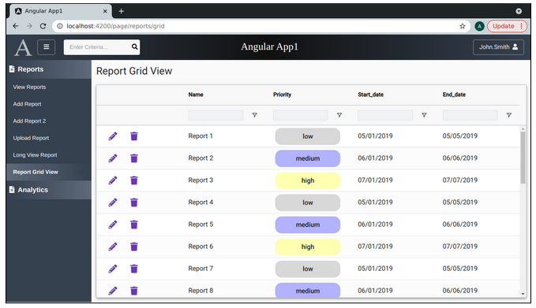
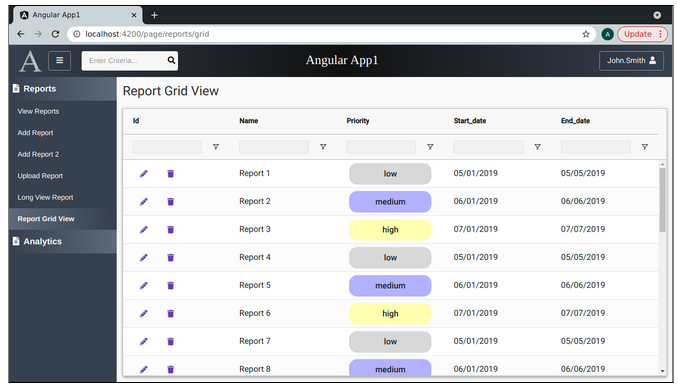
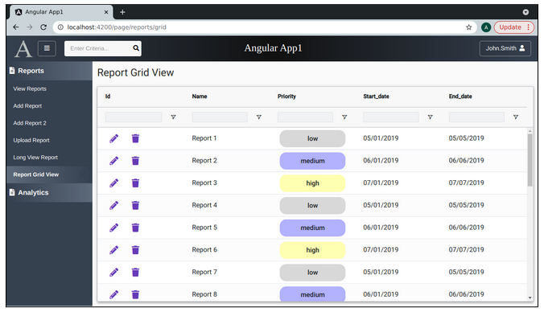
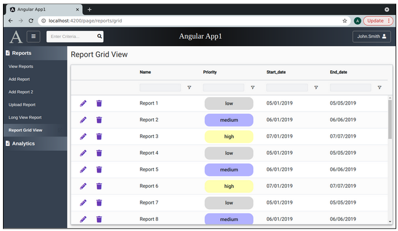

Lesson 22f:  Ag Grid / Client Side / Add Cell Controls using Cell Renderers
---------------------------------------------------------------------------
The Google Drive link is here:<br>
&nbsp;&nbsp;&nbsp;https://docs.google.com/document/d/1nKPTP-5DCtGhcopYUOPr5fYSSTk72E-6PaLfmtDXqvA/edit?usp=sharing
      

The source code for this lesson is here:<br>
&nbsp;&nbsp;&nbsp;https://github.com/traderres/angularApp1Lessons/tree/lesson22f/custom-cell-renderers-buttons
<br>
<br>
<br>

<h3> Problem Set </h3>
Problem 1:  I want to add a button (or two) in a cell that runs some TypeScript code in the grid page<br>
Problem 2:  I want to add a control (or two) in a cell that opens a popup<br><bR>

Solution:     Make a custom cell renderer that has a button inside of it<br>
    NOTE:  We can have the custom-cell-renderer run code back in the grid page 


<br>
<br>
Custom Cell Renderer that shows "Edit" and "Delete" icon buttons in the id column.<br>


```

Procedure:  Create a Custom Cell that has Buttons
-------------------------------------------------
    1. Create the custom cell renderer component
       Create a new component called report-grid-action-cell-renderer  
           (inside the reports/report-grid-view directory)

        a. Edit report-grid-action-cell-renderer.component.ts

        b. Change the class so it implements ICellRendererAngularComp

        c. Create the required methods to implement the ICellRendererAngularComp interface
            i.   Put your cursor on the class name
            ii.   Press Alt-Enter
            iii. Select Implement all required members
            iv.   In the "Select Members to Implement", use the defaults and press OK

        d. Add a public variable called params:
                public params: ICellRendererParams

        e. Change the agInit() method so that it sets the class variable
                 this.params = params

        f. Add a public method called editClick() that has a console.log that prints a message

        g. Add a public method called deleteClick() that has a console log that print a message


    2. Edit report-grid-action-cell-renderer.component.html
        
       Replace its contents with this:
        
        <div>
        
          <!-- Edit Button -->
          <button type="button" mat-icon-button color="primary" title="Edit Entry"
                (click)="this.editClick()">
            <i class="fa fa-pencil-alt"></i>
          </button>
          
          <!-- Delete Button -->
          <button type="button" mat-icon-button color="primary" title="Delete Entry"
            style="margin-left: 10px" 	(click)="this.deleteClick()">
            <i class="fa fa-trash"></i>
          </button>
        
        </div>


    3. Register the custom cell renderer with your grid
       Edit report-grid-view.component.ts
        
        Add another entry to the frameworkComponents
            Add key=actionCellRenderer and value=ReportGridActionCellRendererComponent
        
        So, the frameworkComponents map looks like this:
        
          // Tell ag-grid which cell-renderers will be available
          public frameworkComponents: any = {
            priorityCellRenderer: PriorityCellCustomRendererComponent,
            actionCellRenderer: ReportGridActionCellRendererComponent
          };


    4. Assign the custom cell renderer to the id column
       -- So, instead of showing the ID, we will show two buttons
        a. Edit report-grid-view.component.ts

        b. Add this to the column definition for the 'id':
            cellRenderer: 'actionCellRenderer'

        
        
        When finished, the columnDefs should look like this:
        
         public columnDefs = [
            {
            field: 'id',
            cellClass: 'grid-text-cell-format',
            cellRenderer: 'actionCellRenderer'
            },
            {
            field: 'name',
            cellClass: 'grid-text-cell-format'
            },
            {
            field: 'priority',
            cellRenderer: 'priorityCellRenderer',
            },
            {
            field: 'start_date',
            cellClass: 'grid-text-cell-format'
            },
            {
            field: 'end_date',
            cellClass: 'grid-text-cell-format'
            }
          ];


    5. Verify that the buttons appear in the "id" column
       a. Activate your Debugger on "Full WebApp"
       b. Click on "Report Grid View"
```

```
ActionCellRender V1:  We have buttons.  But, the cell has a box around it when we click on it.


    6. Remove the box that appears when you click on the ID cell
        a. Edit report-grid-view.component.ts

        b. Edit the gridOptions and add this setting:
             suppressCellSelection: true

           With this set, if the user clicks on a cell, the cell is not highlighted


    7. Verify that clicking on a cell does not highlight the cell
        a. Activate your Debugger on "Full WebApp"
        b. Click on "Report Grid View"
        c. Single-Click on a cell
           -- You should not see a box around any of the cells


    8. Make the buttons larger
       NOTE:  The buttons are created using font-awesome.  These are fonts.  So, increase the font-size.
        a. Edit report-grid-action-cell-renderer.component.html

        b. Adjust the font-awesome tag by adding 
             style="font-size: 20px" 

            Add this style tag to both font-awesome icons


    9. Verify that the fonts are bigger
        a. Activate your Debugger on "Full WebApp"
        b. Click on "Report Grid View"
```

```
ActionCellRender V3:  The buttons are bigger and clicking on the cell does not show the box.

But, why do we let the user sort and filter the id column!?!?  We shouldn't.....


    10. Clear the header label and remove the filter textbox from the "Id" column
        a. Edit report-grid-view.component.ts

        b. Adjust the 'id' column definition by adding these 4 values:
                headerName:   '',
                filter:       false,
                suppressMenu: true,
                sortable:     false


    11. Verify that the 'id' column shows buttons but has no header
        a. Activate your Debugger on "Full WebApp"
        b. Click on "Report Grid View"
```

```
ActionCellRender V4:  The header and filter have been removed from the 'id' column
  
  
    12. Have the button clicks run code back on the grid page
        Why?  It's better for the grid page to be running the show 
              (as it can easily reload the grid)

        a. Edit report.grid-view.component.ts

        b. Add a public method called openDeleteDialog()

              public openDeleteDialog(params: ICellRendererParams): void {
                console.log('openDeleteDialog()  params=', params);
              }


        c. Add a public method called openEditDialog()

              public openEditDialog(params: ICellRendererParams): void {
                console.log('openEditDialog() params=', params);
              }


        d. Edit the columnDefs for the 'id' column so that it has this map:
 
             cellRendererParams: {
                deleteButtonGridMethod: (params: ICellRendererParams) => this.openDeleteDialog(params),
                editButtonGridMethod: (params: ICellRendererParams) => this.openEditDialog(params)
             }, 
        
        
        When completed, the 'id' column definition looks like this:
        {
            field: 'id',
            cellClass: 'grid-text-cell-format',
            cellRenderer: 'actionCellRenderer',
            cellRendererParams: {
                deleteButtonGridMethod: (params: ICellRendererParams) => 
                                        this.openDeleteDialog(params),
                editButtonGridMethod: (params: ICellRendererParams) => this.openEditDialog(params)
            },
        
            headerName: '',
            filter: false,
            suppressMenu: true,
            sortable: false
        },


    13. Have the click buttons (in the action-renderer-cell call the grid methods)
        a. Edit report-grid-action-cell-render.component.ts

        b. Change the editClick() by adding this to it:

            // @ts-ignore
            // Call the edit method back on the grid page
            this.params.editButtonGridMethod(this.params);
        

        c. Change the deleteClick() method by adding this to it:

            // @ts-ignore
            // Call the "delete" method back on the grid page
            this.params.deleteButtonGridMethod(this.params);


    14. Verify that the grid method is called when you click on the buttons
        a. Activate your Debugger on "Full WebApp"
        b. Press F12 to open your web browser console
        c. Click on "Report Grid View"
        d. Click on an "Edit" button
           -- You should see the console message that proves that the grid method is called


```
