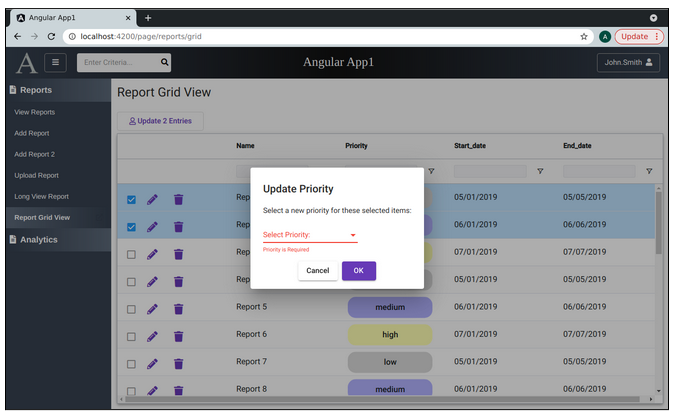
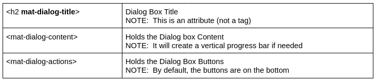
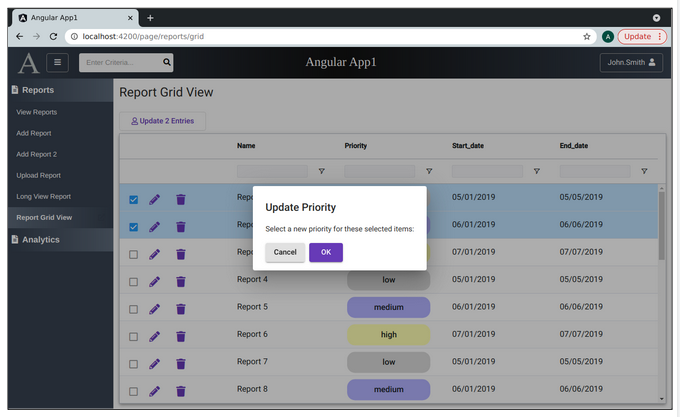
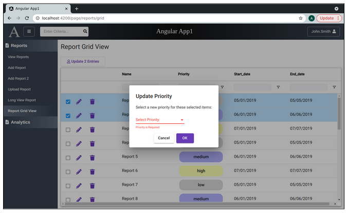

Lesson 22h:  Ag Grid / Client Side / Open a Dialog Box    
------------------------------------------------------
The Google Drive link is here:<br>
&nbsp;&nbsp;&nbsp;https://docs.google.com/document/d/1plzlhBa8aBZ7HUxYgP3JoCVhx85juntpxyRAVQDOUNg/edit?usp=sharing
      

The source code for this lesson is here:<br>
&nbsp;&nbsp;&nbsp;https://github.com/traderres/angularApp1Lessons/tree/lesson22h/grid/dialog
<br>
<br>
<br>

<h3> Problem Set </h3>
Problem:  The user needs a way to update 1 or more records (selected in the grid)<br>
Solution:  Have the user select those rows and open a popup<br>
<br>


Example Angular Material Dialog Component <br>


<br>

```
Thoughts on the Grid Page
-------------------------
    • The layout is the same on every grid page  (3 rows) 
      There is the row that holds the page title
      There is the row that holds the page buttons   (that often open popups)
      There is the row that holds the grid
    • Making the grid behave involves configuring column definitions and grid options
    • The page uses more dialog boxes than other pages (as we do not want to leave the page)
    • So, dialog boxes give the grid page its power


Thoughts on Dialog Boxes
------------------------
    • Don't go crazy with them.  Why?   
     (1) They scare your beginner with big commitments -- e.g., "Are you sure you want to...?"  
         What if I screw it up?  There is no undo button.....So, the beginner user is scared.

     (2) They slow down your expert users -- e.g., why do I have to click "Yes" 20 times?  
         Why can't I select 20 rows and press "Yes" once?  So, the power user is frustrated,

    • Dialog boxes often involve the user confirming something 
     -- which means a REST call is involved


So, this raises a question:  Where is the REST call made?
---------------------------------------------------------
You have two choices:
 Option 1:  The Dialog Box invokes the REST call
            Use this approach if you want the dialog box 
            to stay *open* while waiting for the REST call to finish
            - More complicated dialog box

 Option 2:  The page that opened the dialog box invokes the REST call
            Use this approach if you want the main page to be *visible*
            while waiting for the REST call to finish
            + Simpler dialog box
            - Requires passing data in and out of the dialog box

In Option 2, the dialog box returns a formData object with data and the opening page does the work
-- This keeps the dialog boxes simpler


Approach for Opening a Dialog Box that Updates Records
------------------------------------------------------
    A. Create a DialogFormData object (that holds info passed-in and passed-out of the dialog box)
    B. Create a DialogComponent    (it's just like any other component)
    C. Have the Grid Page open the dialog box
        a. Inject the matDialog service in the grid page    (used to open a Material Dialog Box)
        b. Edit the code that is called when the user presses the Update Button to:
            i. Create a formData object
            ii. Use the matDialog service to open a dialog box and pass-in formData
            iii. Listen for the dialog box closing.  When it does, run some code


Dialog Box HTML Structure
The dialog box HTML has 3 main elements:
```

```


Procedure
---------
    1. Reorganize the reports-grid-view
        a. Create a new directory under report-grid-view called "report-grid-view"
        b. Drag & Drop the report-grid-view.component.html, .ts, css files into the newly-created dir
            
           When finished, the frontend/src/app/reports/report-grid-view/ directory should look like this:
                reports/
                    reports-grid-view/
                        priority-cell-custom-renderer/
                        report-grid-action-cell-renderer/
                        report-grid-view/


    2. Add the MatDialogModule
        a. Edit app.module.ts

        b. Add the MatDialogModule to the imports section

        c. Verify that your debugger still works


    3. Create a new front-end class: UpdatePriorityDialogFormData
        a. Create this class  (in the models/ directory)

        b. This class should have a few public fields:
               reportIds   (holds an array of numeric values)
               newPriorityId   (holds a single numeric value)
            


    4. Create the UpdatePriorityDialogComponent
        a. Create the UpdatePriorityDialog component  (in reports/reports-grid-view/ directory)
        
            When finished, the frontend/src/app/reports/report-grid-view/ directory should look like this:
                reports/
                    reports-grid-view/
                        priority-cell-custom-renderer/
                        report-grid-action-cell-renderer/
                        report-grid-view/
                        update-priority-dialog-component/
            
        b. Edit update-priority-dialog.component.ts

        c. Inject a reference to the dialog itself and the passed-in form data:
            
              /*
               * Inject Useful Dialog Elements:
               *  1) Inject a reference to this dialog itself  		(dialogRef)
               *  2) Inject a reference to the passed-in data    	(data)
               */
              constructor(private dialogRef: MatDialogRef<UpdatePriorityDialogComponent>,
                                 @Inject(MAT_DIALOG_DATA) public data: UpdatePriorityDialogFormData) 
               { }


        d. Add a public method called cancelClicked() that closes the dialog and returns null
            
              /*
               * User pressed Cancel so close this dialog box and return null
               */
            
              public cancelClicked() {
                // Close this dialog box and return null back
                this.dialogRef.close(null)
              }


        e. Add a public method called okClicked() that closes the dialog and returns data
            
              /*
               * User pressed OK so close this dialog box and return the formData object with info
               */
              public okClicked() {
                // Close this dialog box and return the formData object back
                this.dialogRef.close(this.data)
              }

        f. Edit update-priority-dialog.component.html


        g. Setup a simple dialog box with a title, content, and buttons
           Replace its contents with this:

            <!-- Dialog Title -->
            <h2 mat-dialog-title>Update Priority</h2>
            
            <mat-dialog-content>
              <!-- Dialog Content -->
            
            
            
              Select a new priority for these selected items:
             
            </mat-dialog-content>
            
            
            
            <mat-dialog-actions>
              <!-- Dialog Buttons are here -->
             
              <!-- Cancel Button -->
              <button mat-raised-button (click)="this.cancelClicked()" title="Cancel">Cancel</button>
             
              <!-- OK Button -->
              <button mat-raised-button color="primary" (click)="this.okClicked()" title="OK">OK</button>
            </mat-dialog-actions>


    5. Adjust the Report Grid's Update button so it calls a method in the grid page
        a. Edit report-grid-view.component.ts

        b. Inject the matDialog service

        c. Add a public method to be called when a user clicks on the "Update Entries" button
 
              public openUpdatePriorityPopup(): void {
                  console.log('openUpdatePriorityPopup'); 
              }

        d. Have the "Update Entries" button call this method when you click on it  


    6. Verify that the "Update Entries" button calls the openUpdatePriorityPopup method
        a. Set a breakpoint in openUpdatePriorityPopup()
        b. Activate your debugger on "Full WebApp"
        c. Click on "Reports Grid View"
        d. Select a few items
        e. Press "Update N Entries"
           -- Verify that your breakpoint is hit


    7. In your Grid page component, create a private method called reloadPage()
       This method does everything that onGridReady() after the gridApi and gridColumnAPI are set

         private reloadPage(): void {
        
         }

    8. Change onGridReady so it uses the reloadPage() method you created
       -- When finished your onGridReady() method should be just this:
        
          public onGridReady(params: any): void {
            // Get a reference to the gridApi and gridColumnApi (which we will need later to get selected rows)
            this.gridApi = params.api;
            this.gridColumnApi = params.columnApi;
        
            // Reload the page
            this.reloadPage();
          }
        


    9. Change the openUpdatePriorityPopup() method to actually open the dialog box
        a. Create a local variable selectedReportIds that is a an array of numbers

        b. Make sure selectedReportIds is initialized as an empty array

        c. Loop through the selected rows and add them to the array:

            // Loop through the array of selected rows and add the selected ids to the list
            this.gridApi.getSelectedRows().forEach((row: ReportRowDataDTO) => {
                selectedReportIds.push(row.id);
            });


        d. Create a local variable called formData of type UpdatePriorityDialogFormData
           NOTE:  Use new to create this object

        e. We want to set formData.reportIds equal to a list of ids that were selected


        f. Open the dialog box in modal mode:

            // Open the dialog box in modal mode
            let dialogRef = this.matDialog.open(UpdatePriorityDialogComponent, {
            data: formData
            });


        g. Run some code when the dialog box closes

           // Listen for the dialog box to close
           dialogRef.afterClosed().subscribe((returnedFormData: UpdatePriorityDialogFormData) => {
            // The dialog box has closed
        
            if (returnedFormData) {
                // The user pressed OK.  So, update the data
        
                // TODO: Invoke the REST call
        
                // Reload the list
                this.reloadPage();
            }
            });


    
    
    When finished, the openUpdatePriorityPopup() should look like this:
    
    
      public openUpdatePriorityPopup(): void {
        console.log('openUpdatePriorityPopup');
    
        // Create an empty array of numbers
        let selectedReportIds: number[] = [];
    
        // Loop through the array of selected rows and add the selected ids to the list
        this.gridApi.getSelectedRows().forEach((row: ReportRowDataDTO) => {
        selectedReportIds.push(row.id);
        });
    
        let formData: UpdatePriorityDialogFormData = new UpdatePriorityDialogFormData();
        formData.reportIds = selectedReportIds;
    
        // Open the dialog box in modal mode
        let dialogRef = this.matDialog.open(UpdatePriorityDialogComponent, {
            data: formData
        });
    
        // Listen for the dialog box to close
        dialogRef.afterClosed().subscribe((returnedFormData: UpdatePriorityDialogFormData)
         => {
            // The dialog box has closed
    
            if (returnedFormData) {
                    // The user pressed OK.  So, update the data
    
                    // TODO: Invoke the REST call
    
                    // Reload the list
                    this.reloadPage();
            }
        });
    
      }   // end of openUpdatePriorityPopup()


    10. Verify that the simple popup shows up
        a. Activate the Debugger on "Full WebApp"
        b. Click on "Report Grid View"
        c. Check off one or more rows
        d. Press the "Update N Entries" button
```

```
NOTE:  Press OK in the modal dialog should simulate reloading the page.
But, there is a problem:   "Update N Entries" is not reset


    11. Fix the "Update" button so it is reset when a user reloads the page
        Problem:  When we call reloadPage(), the grid is cleared but the update button label is not  (bad!)
        Solution:  Have reloadPage() do two things:
                      1) Unselect all rows in the grid
                      2) Call generateDerivedValuesOnUserSelection() after records are unselected


This call will unselect all rows in your grid:
     this.gridApi.deselectAll();


    12. When you have made that fix, verify it works
        a. Activate the Debugger on "Full WebApp"
        b. Click on "Report Grid View"
        c. Check off one or more rows
        d. Press the "Update N Entries" button
        e. In the popup, click OK  
           -- This causes reloadPage() to be called
        f. Verify that the "Update Entries" button is disabled and has the label "Update Entries" in the grid


    13. Center the "OK" and "Cancel" buttons in the <mat-dialog-actions> tag
        a. Edit update-priority-dialog.component.html

        b. Approach 1
              <mat-dialog-actions align="center">                		<!-- Considered sloppy but works -->

           Approach 2
              <mat-dialog-ations style="justify-content: center">	    <!--  Safer practice -->


           Why does Approach 1 actually work?
           Because the Angular Material replace align="center" with style="justify-content: center"
            
           So, Approach 2 would be the safer approach.


    14. Verify that the popup buttons are centered
        a. Activate the Debugger on "Full WebApp"
        b. Click on "Report Grid View"
        c. Check off one or more rows
        d. Press the "Update N Entries" button
        e. Verify that the buttons are centered

    15. Add a Priority dropdown to the popup
        a. Edit update-priority-dialog.component.ts

        b. Inject the formBuilder service

        c. Add a public form variable:
             public myForm: FormGroup;

        d. Adjust the ngOnInit() so we initialize the myForm to have a field called newPriority

            // Initialize the form
            this.myForm = this.formBuilder.group({
                newPriority: [null, Validators.required]
            });


        e. Adjust the okClicked() so it will mark all fields as touched and stops if there are errors
            i.   Have the form mark all fields as touched
            ii.  If the form is invalid, then return -- so that the users will see the error
            iii. If the form is valid, then store the value of the selected priority into this.data.newPriorityId

        f. Edit update-priority-dialog.component.html

        g. Add the priority dropdown (inside the mat-dialog-content) 
            
              <form novalidate autocomplete="off" [formGroup]="myForm">
                <mat-form-field>
                    <mat-label>Select Priority:</mat-label>
            
                    <!-- Priority Drop Down -->
                    <mat-select formControlName="newPriority">
                            <mat-option [value]=1>Low</mat-option>
                            <mat-option [value]=2>Medium</mat-option>
                            <mat-option [value]=3>High</mat-option>
                            <mat-option [value]=4>Priority</mat-option>
                    </mat-select>
            
                    <mat-error>
                            Priority is Required
                    </mat-error>
                </mat-form-field>
              </form>


    16. Verify that the priority dropdown is a required field in the popup
        a. Activate the Debugger on "Full WebApp"
        b. Click on "Report Grid View"
        c. Check off one or more rows
        d. Press the "Update N Entries" button
        e. In the popup, click OK    (without selecting a priority)
           -- You should see the "Priority is required" message
```

```


    17. Problem:  The lookup values are hard-coded in the update-priority-dialog.component.html
        Solution:  Replace the hard-coded priority mat-options values with values from a lookupService
        a. Edit  update-priority-dialog.component.ts

        b. Inject the lookupService

        c. Add a public variable called prioritiesObs
           NOTE:  This variable is an observable that holds an array of LookupDTO objects

        d. Edit the ngOnInit() and initialize the priorityObs variable
               
                // Get the observable to the List of LookupDTO objects
                // NOTE:  The AsyncPipe will subscribe and unsubscribe automatically
                this.prioritiesObs = this.lookupService.getLookupWithTypeAndOrder( 
                                        "priority", "display_order");
            


        e. Edit update-priority-dialog.component.html

        f. Use the ng-container / async pipe trick to invoke the REST associated with prioritiesObs

        g. Replace the hard-coded <mat-option> tags with a new <mat-option> tag 
           -- Use the *ngFor technique to loop through the values 


    18. Verify that the priorities are loaded from the lookupService
        a. Activate the Debugger on "Full WebApp"
        b. Click on "Report Grid View"
        c. Check off one or more rows
        d. Press the "Update N Entries" button
           -- You should see the 4 priority values in the dropdown


```
