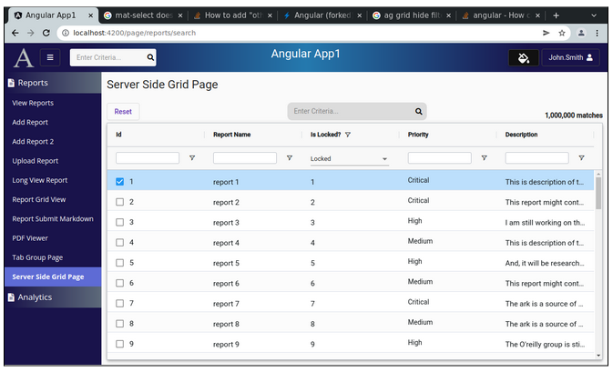

Lesson 22z:  Ag Grid / Tricks & Techniques
------------------------------------------
The Google Drive link is here:<br>
&nbsp;&nbsp;&nbsp;https://docs.google.com/document/d/19z0SFD7OYLUe9-sbbOzB0cuDgXaCUcihl3jUajYHxXI/edit?usp=sharing
      
<br>
<br>

```
Tricks & Techniques
-------------------
    1. Problem:  I want to hide the "id" column
       Why? Because you may want to have an id in the column but have no need to show it
        a. Edit report-grid-view.component.ts

        b. Edit the grid class and replace the 'id' field with this definition:

            {
                field: 'id',
                minWidth: 0,
                maxWidth: 0,
                hide: true,
                sortable: false,
                filter: false,
                suppressColumnsToolPanel: true
            }

        c. Verify that the ID column is really gone
            i.   Activate the debugger on "Full WebApp"
            ii.  Make sure the ID column is not visible
            iii. Make sure the 


    2. Problem:  I want to run some typescript code when a user double-clicks on a row
        a. Edit report-grid-view.component.ts

        b. Create a method to call when a user double-clicks
            public goToDetails(aTicketId: number): void {
                console.log('goToDetails()  aTicketId=' + aTicketId);
            } 

        c. Edit gridOptions:
            onRowDoubleClicked: (event) => this.goToDetails(event.data.ticketId)


    3. Problem:  I want the column headers to be centered
        a. Edit the CSS page for your grid.

        b. Add this CSS:

            :host ::ng-deep .ag-header-cell-label {
              /* Set the formatting for column headers */
              justify-content: center;
            }


    4. Problem:  I want the grid columns to resize to fit when the left-side navbar appears/disappears
       Showing/Hiding the navbar adjusts the available width.  I want the ag-grid to adjust

        a. Inject the navbar service
               constructor(private navbarService: NavbarService) 

        b. Add a private variable:
               private navbarSubscription: Subscription;
               public showGrid: boolean = true;

        c. Add a private method to reinitializeGrid
             private reloadGridToFit(): void {
                // Hide the grid
                this.showGrid = false;
            
                setTimeout( () => {
                        // Show the grid (so it loads and takes the full width)
                        this.showGrid = true;
                });
              }

        d. Change the HTML so that there is an *ngIf on the grid
             <ag-grid-angular *ngIf="this.showGrid"  ...>


        e. Change the ngOnInit() to listen for the navbar changes:
            
              this.navbarSubscription = this.navbarService.getNavbarStateAsObservable().subscribe( () => {
                // Left Side navbar was opened or closed.
                
                // Reload the entire grid to fit
                this.reloadGridToFit();
               });


        f. Make sure your ngOnDestroy() method unsubscribes:

              ngOnDestroy(): void {
                // Unsubscribe from the subscription (to avoid memory leaks)
                if (this.navbarSubscription) {
                    this.navbarSubscription.unsubscribe();
                }
              }


    5. Problem:  I have a small ag-grid that is one component of a larger dashboard 
	             I want the small ag-grid to adjust columns widths when the navbar opens/closes

        a. In the dashboard page, inject the navbar service
  	            constructor(private navbarService: NavbarService) 

        b. In the dashboard page, add this method:
            
             /*
              * Send a 'resize' event
              * This will cause HighCharts to resize all charts to fit inside their parent containers
              */
              public resizeChartsToFitContainers(): void {
            
                setTimeout(()=> {
                // Send a 'resize' event
                // NOTE:  The window.dispatchEvent() call MUST be in a setTimeout or it will not work
                window.dispatchEvent(new Event('resize'));
                }, 5);
            
              }


        c. In the dashboard page, add a private subscription:
             private navbarSubscription: Subscription;


        d. In the dashboard page, edit the ngOnInit() to listen for navbar open/close events and send a resize event
            
            public ngOnInit(): void {
              this.navbarSubscription = this.navbarService.getNavbarStateAsObservable().subscribe( () => {
                // Left Side navbar was opened or closed.
                this.resizeChartsToFitContainers();
                });
            }


        e. In the dashboard page, edit the ngOnDestroy to unsubscribe

              ngOnDestroy(): void {
                // Unsubscribe from the subscription (to avoid memory leaks)
            
                if (this.navbarSubscription) {
                    this.navbarSubscription.unsubscribe();
                }
              }


        f. In the small grid page, add a public boolean:
              public  showGrid: boolean = true;


        g. In the small grid page HTML, add an *ngIf="this.showGrid" to the ag-grid-angular tag
              <ag-grid-angular *ngIf="this.showGrid"  ...>


        h. In the small grid page, add a method to reloadTheGrid

              private resizeGridToFit(): void {
            
                // Hide the grid
                this.showGrid = false;
            
                setTimeout( () => {
                    // Show the grid (so it loads and takes the full width)
                    this.showGrid = true;
                });
              }

        i. In the small grid page, listen for resize events by adding this code:
              @HostListener('window:resize', ['$event'])
              onResize() {
                this.resizeGridToFit();
              }


    6. Problem:  My text filters are disabled
       Solution:  Make sure you have filter and filterParams set   [see code in bold]

          private textFilterParams = {
            filterOptions: ['contains', 'notContains'],
            caseSensitive: false,
            debounceMs: 200,
            suppressAndOrCondition: true,
          };

        
          public defaultColDefs: any = {
            flex: 1,
            sortable: true,
            filter: true,
            floatingFilter: true,	// Causes the filter row to appear below column names
          };
        

          public columnDefs = [
           {
            field: 'id',
            headerName: 'Action',
            cellRenderer: 'actionCellRenderer',
            filter: false
           },
           {
            field: 'cage_code',
            headerName: 'CAGE Code',
            filter: 'agTextColumnFilter',
            filterParams: this.textFilterParams,
           }
         ]


    7. Problem:  I want to go to a page when a user double-clicks on a row in the grid
       In the gridOptions, use the onRowDoubleClicked handler
        
        
       NOTE:  Make sure rowSelection = 'single'
        
       public gridOptions: GridOptions = {
            debug: false,
            suppressCellSelection: true,
            rowSelection: 'single',  	// Possible values are 'single' and 'multiple'
            domLayout: 'normal',
        
            overlayNoRowsTemplate: "<span class='no-matches-found-message'>No Matches were Found</span>",
        
            onRowDoubleClicked: () => {
                this.userDoubleClickedOnRow();
            },
        
          }
        
        
          /*
           * User double-clicked on a row.  So, take the user to the details page
           */
          private userDoubleClickedOnRow(): void {
            let selectedRows: any[] = this.gridApi.getSelectedRows();
            if(selectedRows.length != 1){
                // Either zero or multiple rows are selected -- which should never happen
                return;
            }
        
            let dataFromSelectedRow = selectedRows[0];
        
            // Navigate the user to the reviewer-details-page
            let myId = dataFromSelectedRow.id
            this.router.navigate([ 'page/somewhere/', myId]).then();
          } 
        
        


    8. Problem:  I want the vertical scrollbar to appear all of the time
       Why do I need this?  
        a. When a user searches for something in my server side grid and no matches are found, the vertical scrollbar disappears.
        b. When a user searches for something and find matches, the vertical scrollbar appears.  
           -- The vertical scrollbar appear/disappear causes a bump.  

       Solution:  Add this to the css of your grid page:

            :host ::ng-deep .ag-body-viewport.ag-layout-normal {
                 /* Force ag-grid to show a vertical scrollbar all of the time to avoid the "bump" */
                  /* The bump appears when the user searches for something that has no matches, then vertical scrollbar disappears and the columns move over */
                overflow-y: scroll;
            }
            


    9. Problem:  My grid is getting a date as a string in the format of mm/dd/yyyy HH:MI:SS but I want an easy way to format the dates as mm/dd/yyyy
       Solution:  Use the CellRenderer and formatDate() method

        a. Inject the locale value in your constructor

         constructor(private userService: UserService,
          	private router: Router,
          	private preferenceService: PreferenceService,
          	private gridService: GridService,
          	@Inject(LOCALE_ID) private locale: string   )  {}


        b. Add these imports to your typescript class:

            import {formatDate} from "@angular/common";
            


        c. Adjust the columnDefs to use the cellRenderer
            
              public columnDefs = [
               {
                field: 'last_login_date',
                headerName: 'Last Login Date',
                cellStyle: {'white-space': 'normal'},
                filter: 'agTextColumnFilter',
                flex: 1,
                filterParams: this.textFilterParams,
                cellRenderer: (data: any) => { return formatDate(data.value, 'MM/dd/yyyy', this.locale); }
               }


    10. Problem:  I want to replace the ag-grid filter with a simple dropdown
        Solution:  Build a custom filter that shows a dropdown and returns a text filter with a string of "true" or "false" but shows the labels "Locked" and "Unlocked"

        a. Create a custom drop down filter
           unix> ng generate component DropDownFloatingFilter --skipTests

        b. Replace drop-down-floating-filter.component.ts with this:
                
                import { Component } from '@angular/core';
                import {AgFrameworkComponent} from "ag-grid-angular";
                import {FilterChangedEvent, IFloatingFilter, IFloatingFilterParams} from "ag-grid-community";
                
                @Component({
                  selector: 'app-drop-down-floating-filter',
                  templateUrl: './drop-down-floating-filter.component.html',
                  styleUrls: ['./drop-down-floating-filter.component.css']
                })
                export class DropDownFloatingFilterComponent implements IFloatingFilter, AgFrameworkComponent<any> {
                
                  public params: IFloatingFilterParams;
                  public options: any;
                  public currentValue: null | string = null;
                
                  constructor() { }
                
                
                  /*
                   * Filter is initialized here
                   */
                  public agInit(params: any): void {
                    this.params = params;
                    this.options = params.options;
                  }
                
                
                  public onParentModelChanged(parentModel: any, filterChangedEvent?: FilterChangedEvent | null): void {
                    // When the filter is empty we will receive a null value here
                    if (!parentModel) {
                    this.currentValue = null;
                    }
                    else {
                    this.currentValue = parentModel.filter;
                    }
                  }
                
                
                  /*
                   * User selected a dropdown value in the filter
                   *   If the user cleared the filter, set an empty filter in the parent grid
                   *   If the user selected an option, set the filter in the parent grid
                   */
                  public onSelectionChanged() {
                
                   if (this.currentValue == null) {
                    // User cleared the filter
                    this.params?.parentFilterInstance((instance: any) => {
                        instance.onFloatingFilterChanged(null, null);
                    });
                   }
                   else {
                    // Filter has a value
                    this.params?.parentFilterInstance((instance: any) => {
                        instance.onFloatingFilterChanged('equals', this.currentValue);
                    });
                    }
                
                  }  // end of onSelectionChanged()

            }


        c. Replace drop-down-floating-filter.component.html with this:

            <mat-form-field style="width: 90%;" floatLabel="never" appearance="standard">
              <mat-select [disableRipple]=true placeholder="(All Values)" [(ngModel)]="this.currentValue" (selectionChange)="this.onSelectionChanged()">
                <mat-option [value]=null>(All Values)</mat-option>
                <mat-option [value]="'true'">Locked</mat-option>
                <mat-option [value]="'false'">Unlocked</mat-option>
              </mat-select>
            </mat-form-field>


        d. In your grid typescript class, register the custom drop down filter

             public  frameworkComponents: any = {
                customDropdownFilter: DropDownFloatingFilterComponent
              };


        e. In your grid html, make sure you are using the framework components

            <ag-grid-angular
              style="width: 100%; height: 100%"
              [rowData]="this.rowData"
              [defaultColDef]="this.defaultColDefs"
              [columnDefs]="this.columnDefs"
              [gridOptions]="this.gridOptions"
              [frameworkComponents]="this.frameworkComponents"
              (gridReady)="this.onGridReady($event)">
            </ag-grid-angular>


        f. In your grid typescript class, assign the filter to a column definition

            {
                headerName: 'Is Locked?',
                field: 'id',
                filter: 'agTextColumnFilter',
                floatingFilter: true,
                floatingFilterComponent: 'customDropdownFilter',
                floatingFilterComponentParams: {
                        suppressFilterButton: true
                },
                suppressMenu: true,
                cellClass: 'grid-text-cell-format'
            },


        g. Verify it works.  Your grid filter should be a regular 
```

```
The "Is Locked?" filter is a dropdown with 3 options:  Locked, Unlocked, and (All Values)


    11. Problem:  I want to add a row to my client grid but it does not appear
        Solution:  Use this.gridApi.setRowData(this.rowData)

        
          private gridApi: GridApi;
          private gridColumnApi: ColumnApi;
          private rowData: SingleRowDTO[];    
        
        
          public onGridReady(params: any): void {
            // Get a reference to the gridApi and gridColumnApi (which we will use to set row data)
            this.gridApi = params.api;
            this.gridColumnApi = params.columnApi;
        
            // Initialize rowData to an empty list
            this.rowData = [];
        
            // Set the row data in the grid
            this.gridApi.setRowData(this.rowData);
        
            // Reset row heights
            this.gridApi.resetRowHeights();
        
            // Tell the grid to resize when user resizes the browser window
            window.onresize = () => {
            this.gridApi.sizeColumnsToFit();
            }
          }
        
        
        In my click handler, I want to add a record to the grid:
        
            // Add the record to the list of data
            this.rowData.push(data);

            // Set the updated list in the grid
            this.gridApi.setRowData(this.rowData);
        
        NOTE:  You do not need to set the rowData in the HTML.  We are setting it with code.
        

```
