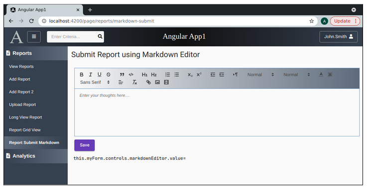
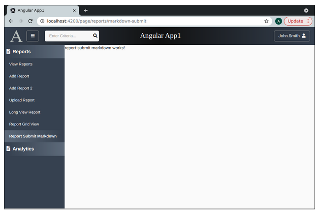
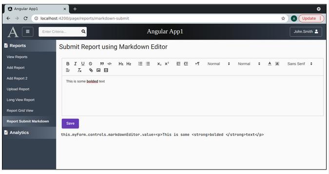
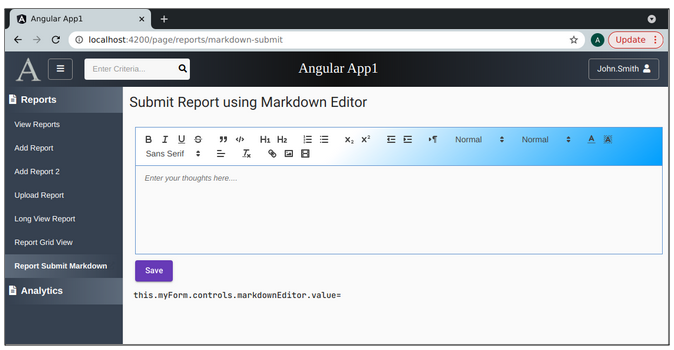
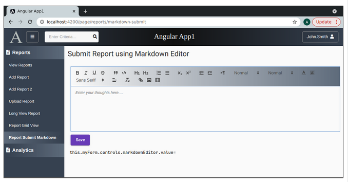
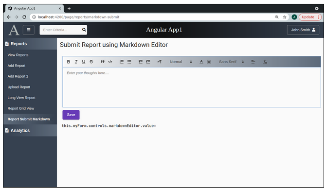

Lesson 23a:  Handy Components / Add the Quill Markdown Editor
-------------------------------------------------------------
The Google Drive link is here:<br>
&nbsp;&nbsp;&nbsp;https://docs.google.com/document/d/169JGDs5j-QGs76ScFtKt0_WiYY8ekdXduYyOpMOCcoM/edit?usp=sharing
      

The source code for this lesson is here:<br>
&nbsp;&nbsp;&nbsp;https://github.com/traderres/angularApp1Lessons/tree/lesson23a
<br>
<br>
<br>

<h3> Problem Set </h3>
Problem:  My customers want to write comments using markdown<br>
Solution:  Install the Quill Markdown Editor (ngx-quill)<br>
<br>
<br>
<br>
Example Markdown Editor<br>


```

Procedure
---------
    1. Install the Quill Markdown Editor
        a. Install the NPM dependencies
           unix> cd ~/intellijProjects/angularApp1/frontend
           unix> npm install ngx-quill@14.1.2
           unix> npm install quill@1.3.7
           unix> npm install quill-emoji@0.2.0
           unix> npm install quill-mention@3.0.3


        b. Look at the package.json
           You should see these entries:

                "ngx-quill": "^14.1.2",
                "quill": "^1.3.7",
                "quill-emoji": "^0.2.0",
                "quill-mention": "^3.0.3",


        c. Install the @types/quill so it has the same version as "quill"
           unix> npm install @types/quill@1.3.7    	# This version should match the version of quill


        d. Edit the tsconfig.json so that it has this "allowSyntheticDefaultImports" setting set to true:

              "angularCompilerOptions": {
                "fullTemplateTypeCheck": true,
                "strictInjectionParameters": true,
                "allowSyntheticDefaultImports": true
              }


        e. Edit the angular.json and add additional styles 
           NOTE:  Modify the architecture -> build -> styles so it has these settings (before styles.css)

        	"./node_modules/quill/dist/quill.core.css",
          	"./node_modules/quill/dist/quill.bubble.css",
          	"./node_modules/quill/dist/quill.snow.css",
          	"./node_modules/quill-emoji/dist/quill-emoji.css",
          	"./node_modules/quill-mention/dist/quill.mention.min.css",


           When finished, the styles section should look like this  (changes in bold):

        	"styles": [
          	"./node_modules/@angular/material/prebuilt-themes/deeppurple-amber.css",
          	"./node_modules/@fortawesome/fontawesome-free/css/all.css",
          	"./node_modules/ag-grid-enterprise/dist/styles/ag-grid.css",
          	"./node_modules/ag-grid-enterprise/dist/styles/ag-theme-alpine.css",
          	"./node_modules/quill/dist/quill.core.css",
          	"./node_modules/quill/dist/quill.bubble.css",
          	"./node_modules/quill/dist/quill.snow.css",
          	"./node_modules/quill-emoji/dist/quill-emoji.css",
          	"./node_modules/quill-mention/dist/quill.mention.min.css",
          	"src/styles.css"
        	],


        f. Add the QuillModule
            i. Edit app.module.ts

            ii. Add this to the imports: [ ... ] section
                 QuillModule.forRoot(),

            iii. Verify that this import is located at the top:
                 import {QuillModule} from "ngx-quill";


    2. Rebuild the front-end to make sure everything still compiles
       a. Delete the frontend/node_modules directory
       b. Right-click on frontend/package.json -> Run 'npm install'
       c. Wait for Intellij to finish reindexing
       d. Activate the Debugger on "Full WebApp"
       e. Verify that the webapp still comes up


    3. Create a new page that has a markdown editor
        a. Create the component called ReportsSubmitMarkdown
           unix> cd ~/intellijProjects/angularApp1/frontend
           unix> ng generate component reports/ReportSubmitMarkdown --skipTests

        b. Edit constants.ts and add a route constant:
             REPORT_SUBMIT_MARKDOWN = "page/reports/markdown-submit"


        c. Add a route so that reports/markdown --> ReportsSubmitMarkdownComponent
            i.  Edit app.module.ts
            ii. Add a route
                 { path: Constants.REPORT_SUBMIT_MARKDOWN, 	component: ReportSubmitMarkdownComponent,  canActivate: [PageGuard] },

        d. Add a navbar item for this new route
            i.  Edit navbar.component.html

            ii. Add this entry to the "Reports" section
                    
                    <!-- Report Submit Markdown -->
                    <mat-list-item class="navItem" [routerLink]="constants.REPORT_SUBMIT_MARKDOWN" routerLinkActive="active"                     *ngIf="userInfo.pageRoutes.get(constants.REPORT_SUBMIT_MARKDOWN)">
                        <a title="Report Submit Markdown">Report Submit Markdown</a>
                                    <div fxFlex fxLayoutAlign="end end" >
                                    <a [routerLink]="constants.REPORT_SUBMIT_MARKDOWN" target="_blank">
                                            <i class="fas fa-external-link-alt navItemIcon" title="Open 'Report Submit Markdown' a new window"></i>
                                    </a>
                                </div>
                      </mat-list-item>

        e. Add security for the page to all roles
            i.   Edit R__security.sql
            ii.  Insert an additional record for the new route
                     insert into uicontrols(id, name) values(1017, 'page/reports/markdown-submit');

            iii. Grant this route to the admin role by adding this line:
                     insert into roles_uicontrols(role_id, uicontrol_id) values(1, 1017);

            iv.  Grant this route to the reader role by adding this line:
                     insert into roles_uicontrols(role_id, uicontrol_id) values(2, 1017);


        f. Run flyway migrate (to make sure there are no problems)
           unix> cd ~/intellijProjects/angularApp1/backend
           unix> mvn flyway:migrate


        g. Make sure that the text in the navbar does not wrap
            i. Edit navbar.component.css

            ii. Change the .mat-list-item and .navHeader CSS classes os they have
                  white-space:  nowrap;
            

            When finished, they look like this:
            
            .mat-list-item {
              font-family: Verdana, sans-serif;
              font-size: 13px;
              color: white;
              height: 25px;
              white-space: nowrap;   /* stop wrapping of text */
            }
            
            .navHeader{
              /* The navHeader has a background gradient that goes to the left */
              background: linear-gradient(to left, #5e6b7b, rgba(94, 107, 123, 0));
              font-family: Verdana, sans-serif;
              font-size: 16px;
              font-weight: bold;
              padding: 0;
              margin-top: 0;
              height: 44px;
              display: flex;
              align-items: center;
              white-space: nowrap;   /* stop wrapping of text */
            }
            
            


    4. Verify that the page is visible
        a. Activate the Debugger on "Full WebApp"
        b. Click on "Report Submit Markdown"
           -- You should see an empty page
```

```


    5. Initialize a Reactive Form in the typescript class
        a. Edit report-submit-markdown.component.ts

        b. Inject the formBuilder
               constructor(private formBuilder: FormBuilder) { }


        c. Add a public variable:
               public myForm: FormGroup;


        d. Update the ngOnInit() so it initializes the myForm object

              public ngOnInit(): void {
            
                // Initialize the reactive form
                this.myForm = this.formBuilder.group({
                markdownEditor:   	[null, null],
                });
            
              }  // end of ngOnInit()


    6. Add a reactive form to the page along with the markdown editor
        a. Edit report-submit-markdown.component.html

        b. Replace its contents with this:
            
            <div class="page-container">
            
              <div fxFlexFill fxLayout="column" fxLayoutGap="5px">
            
                <div fxFlex fxLayout="row" fxLayoutGap="0">
            
                    <!-- Left Side of the Top Row -->
                    <div fxFlex fxLayoutAlign="left center" fxLayout="row" fxLayoutGap="0">
                            <h1 class="mat-h1">Submit Report using Markdown Editor</h1>
                    </div>
            
                    <!-- Right Side of the Top Row -->
                    <div fxFlex fxLayoutAlign="end center">
                    </div>
            
                </div>  <!-- End of top row -->
            
                <!-- Start of the 2nd row -->
                <div fxFlex  fxLayout="column" fxLayoutGap="0">
            
                <form novalidate autocomplete="off" [formGroup]="myForm">
            
                    <div style="margin-left: 10px; margin-top: 5px">
            
                    <!-- Markdown Editor -->
                    <quill-editor class="content-editor" formControlName="markdownEditor" [placeholder]="'Enter your thoughts here....'" [styles]="{'min-height': '150px', 'max-height': '450px'}"
                    ></quill-editor>
            
                    <!-- Save Button -->
                    <button mat-raised-button type="button" color="primary" style="margin-top: 10px" title="Save Comment">Save</button>
            
                    </div>
            
                </form>
            
                </div> <!-- End of 2nd row -->
            
              </div> <!-- End of Angular flex column -->
            
            </div>  <!-- End of page container -->
            
            <pre>
              this.myForm.controls.markdownEditor.value={{this.myForm.controls.markdownEditor.value}}
            </pre>


    7. Verify that the Markdown Editor shows
        a. Activate the Debugger on "Full WebApp"
        b. Click on "Report Submit Markdown"
```

```


    8. Add some color to the markdown editor
        a. Edit report-submit-markdown.component.css

        b. Add these CSS classes
            
            :host ::ng-deep .ql-toolbar {
              /* Set the background for the markdown toolbar to be a gradient */
            
              /* Permalink - use to edit and share this gradient: https://colorzilla.com/gradient-editor/#ffffff+20,ffffff+40,009ffd+100 */
              background: #ffffff; /* Old browsers */
              background: -moz-linear-gradient(-45deg,  #ffffff 20%, #ffffff 40%, #009ffd 100%); /* FF3.6-15 */
              background: -webkit-linear-gradient(-45deg,  #ffffff 20%,#ffffff 40%,#009ffd 100%); /* Chrome10-25,Safari5.1-6 */
              background: linear-gradient(135deg,  #ffffff 20%,#ffffff 40%,#009ffd 100%); /* W3C, IE10+, FF16+, Chrome26+, Opera12+, Safari7+ */
              filter: progid:DXImageTransform.Microsoft.gradient( startColorstr='#ffffff', endColorstr='#009ffd',GradientType=1 ); /* IE6-9 fallback on horizontal gradient */
            }
            
            :host ::ng-deep .ql-toolbar.ql-snow {
              border: 1px solid #6294CF;
            }
            
            :host ::ng-deep  .ql-container.ql-snow {
              border: 1px solid #6294CF;
            }


    9. Verify that the Quill Markdown Editor looks nicer
       a. Activate the Debugger on "Full WebApp"
       b. Click on "Report Submit Markdown"
```

```


    10. Replace the gradient so it uses the same background as the left-side navbar
        a. Edit report-submit-markdown.component.css

        b. Change the ql-toolbar class to this:

            :host  ::ng-deep .ql-toolbar {
              /* Set the background for the markdown toolbar to be a gradient */
              background: linear-gradient(to left, #5e6b7b, rgba(94, 107, 123, 0));
            }


    11. Verify that the Markdown has a grey gradient background
        a. Activate the Debugger on "Full WebApp"
        b. Click on "Report Submit Markdown"
```

```


    12. Adjust the toolbar that comes with the qill-editor to have fewer options

        a. Edit report-submit-markdown.component.ts

        b. Add this public variable:
            
              // Configure the Quill Editor so it does not have image, link, or, video options
              public quillModules: QuillModules = {
                toolbar: [
                ['bold', 'italic', 'underline', 'strike'],    	// toggled buttons
                ['blockquote', 'code-block'],
                // [{ 'header': 1 }, { 'header': 2 }],           	// custom button values
                [{ 'list': 'ordered'}, { 'list': 'bullet' }],
                // [{ 'script': 'sub'}, { 'script': 'super' }],  	// superscript/subscript
                [{ 'indent': '-1'}, { 'indent': '+1' }],      	// outdent/indent
                [{ 'direction': 'rtl' }],                     	// text direction
                // [{ 'size': ['small', false, 'large', 'huge'] }],  // custom dropdown
                [{ 'header': [1, 2, 3, 4, 5, 6, false] }],
                [{ 'color': [] }, { 'background': [] }],      	// dropdown with defaults from theme
                [{ 'font': [] }],
                [{ 'align': [] }],
                ['clean'],                                     	// remove formatting button
                ]
              };

        c. Edit eport-submit-markdown.component.html

        d. Assign the modules in the html

            <!-- M A R K D O W N     	E D I T O R  -->
            <quill-editor formControlName="markdownEditor" class="content-editor"
                            [placeholder]="'Enter your thoughts here....'"
                            [modules]="this.quillModules"
                            [styles]="{'min-height': '150px', 'max-height': '450px'}"
            ></quill-editor>


    13. Verify that the Markdown Editor has fewer options
        a. Activate the Debugger on "Full WebApp"
        b. Click on "Report Submit Markdown"
```

```
Notice that there are fewer formatting options now.


```
