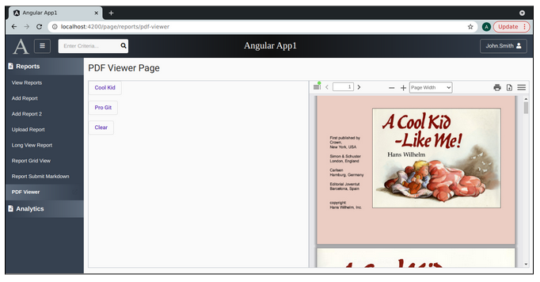
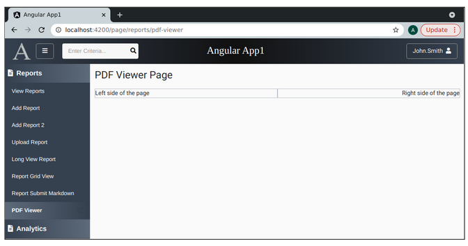
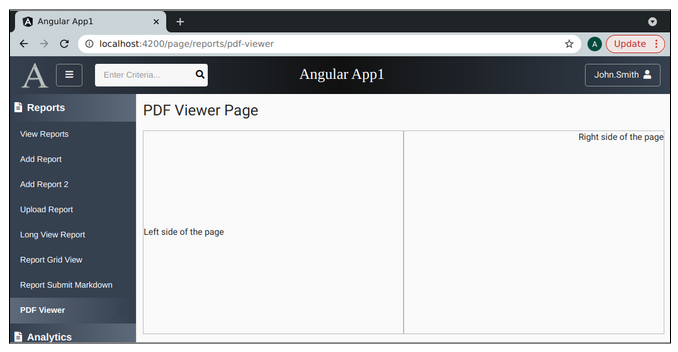
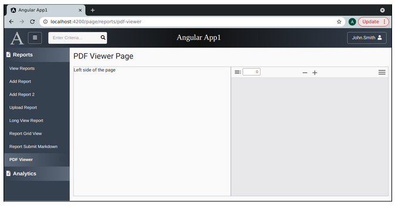
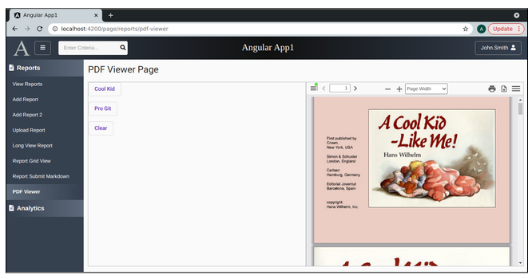

Lesson 23b:  Handy Components / Add the Extended PDF Viewer
-----------------------------------------------------------
The Google Drive link is here:<br>
&nbsp;&nbsp;&nbsp;https://docs.google.com/document/d/1fAy-X9d7QNR-FAGAqnlJR_Y0gA0kYvYXdkp21aOI2-c/edit?usp=sharing
      

The source code for this lesson is here:<br>
&nbsp;&nbsp;&nbsp;https://github.com/traderres/angularApp1Lessons/tree/lesson23b
<br>
<br>
<br>

<h3> Problem Set </h3>
Problem:  My customers want to view pdf files within the webapp<br>
Solution:  Install the Extended PDF Viewer<br>
<br>
<br>
Screen Shot of the Extended PDF Viewer<br>



<br>
<br>

```

Procedure
---------
    1. Install the Extended PDF Viewer
       a. Install the NPM dependencies
       unix> cd ~/intellijProjects/angularApp1/frontend
       unix> npm install ngx-extended-pdf-viewer@8.3.0

       NOTE:  These procedures were tested with version 8.3.0


        b. Have the webapp add all of the ngx_extended_pdf_viewer/assets to the assets/ on build
            i.  Edit angular.json

            ii. Change the architect -> build -> assets section 
                
                From this:
                            "assets": [
                                "src/favicon.ico",
                                "src/assets"
                            ],
                
                To this:
                            "assets": [
                                "src/favicon.ico",
                                "src/assets",
                                {
                                    "glob": "**/*",
                                    "input": "node_modules/ngx-extended-pdf-viewer/assets/",
                                    "output": "/assets/"
                                }
                            ],


        c. Add the NgxExtendedPdfViewerModule to your project
            i.  Edit app.module.ts

            ii. Add this to the imports: [ ... ] section
                    NgxExtendedPdfViewerModule

            iii. Verify that this import is located at the top:
                    import {NgxExtendedPdfViewerModule} from "ngx-extended-pdf-viewer";


        d. Adjust the index.dev.html and index.prod.html so that they have some extra javascript

            i.   Edit index.dev.html
 
            ii.  Add this after <app-root></app-root> and before the closing </body>

                    <script type="application/l10n">{"default_locale":"en-US","locales":{"en-US":{"previous":{"title":"Previous Page"},"previous_label":{"textContent":"Previous"},"next":{"title":"Next Page"},"next_label":{"textContent":"Next"},"page":{"title":"Page"},"of_pages":{"textContent":"of {{pagesCount}}"},"page_of_pages":{"textContent":"({{pageNumber}} of {{pagesCount}})"},"zoom_out":{"title":"Zoom Out"},"zoom_out_label":{"textContent":"Zoom Out"},"zoom_in":{"title":"Zoom In"},"zoom_in_label":{"textContent":"Zoom In"},"zoom":{"title":"Zoom"},"presentation_mode":{"title":"Switch to Presentation Mode"},"presentation_mode_label":{"textContent":"Presentation Mode"},"open_file":{"title":"Open File"},"open_file_label":{"textContent":"Open"},"print":{"title":"Print"},"print_label":{"textContent":"Print"},"download":{"title":"Download"},"download_label":{"textContent":"Download"},"bookmark":{"title":"Current view (copy or open in new window)"},"bookmark_label":{"textContent":"Current View"},"tools":{"title":"Tools"},"tools_label":{"textContent":"Tools"},"first_page":{"title":"Go to First Page"},"first_page_label":{"textContent":"Go to First Page"},"last_page":{"title":"Go to Last Page"},"last_page_label":{"textContent":"Go to Last Page"},"page_rotate_cw":{"title":"Rotate Clockwise"},"page_rotate_cw_label":{"textContent":"Rotate Clockwise"},"page_rotate_ccw":{"title":"Rotate Counterclockwise"},"page_rotate_ccw_label":{"textContent":"Rotate Counterclockwise"},"cursor_text_select_tool":{"title":"Enable Text Selection Tool"},"cursor_text_select_tool_label":{"textContent":"Text Selection Tool"},"cursor_hand_tool":{"title":"Enable Hand Tool"},"cursor_hand_tool_label":{"textContent":"Hand Tool"},"scroll_vertical":{"title":"Use Vertical Scrolling"},"scroll_vertical_label":{"textContent":"Vertical Scrolling"},"scroll_horizontal":{"title":"Use Horizontal Scrolling"},"scroll_horizontal_label":{"textContent":"Horizontal Scrolling"},"scroll_wrapped":{"title":"Use Wrapped Scrolling"},"scroll_wrapped_label":{"textContent":"Wrapped Scrolling"},"spread_none":{"title":"Do not join page spreads"},"spread_none_label":{"textContent":"No Spreads"},"spread_odd":{"title":"Join page spreads starting with odd-numbered pages"},"spread_odd_label":{"textContent":"Odd Spreads"},"spread_even":{"title":"Join page spreads starting with even-numbered pages"},"spread_even_label":{"textContent":"Even Spreads"},"document_properties":{"title":"Document Properties…"},"document_properties_label":{"textContent":"Document Properties…"},"document_properties_file_name":{"textContent":"File name:"},"document_properties_file_size":{"textContent":"File size:"},"document_properties_kb":{"textContent":"{{size_kb}} KB ({{size_b}} bytes)"},"document_properties_mb":{"textContent":"{{size_mb}} MB ({{size_b}} bytes)"},"document_properties_title":{"textContent":"Title:"},"document_properties_author":{"textContent":"Author:"},"document_properties_subject":{"textContent":"Subject:"},"document_properties_keywords":{"textContent":"Keywords:"},"document_properties_creation_date":{"textContent":"Creation Date:"},"document_properties_modification_date":{"textContent":"Modification Date:"},"document_properties_date_string":{"textContent":"{{date}}, {{time}}"},"document_properties_creator":{"textContent":"Creator:"},"document_properties_producer":{"textContent":"PDF Producer:"},"document_properties_version":{"textContent":"PDF Version:"},"document_properties_page_count":{"textContent":"Page Count:"},"document_properties_page_size":{"textContent":"Page Size:"},"document_properties_page_size_unit_inches":{"textContent":"in"},"document_properties_page_size_unit_millimeters":{"textContent":"mm"},"document_properties_page_size_orientation_portrait":{"textContent":"portrait"},"document_properties_page_size_orientation_landscape":{"textContent":"landscape"},"document_properties_page_size_name_a3":{"textContent":"A3"},"document_properties_page_size_name_a4":{"textContent":"A4"},"document_properties_page_size_name_letter":{"textContent":"Letter"},"document_properties_page_size_name_legal":{"textContent":"Legal"},"document_properties_page_size_dimension_string":{"textContent":"{{width}} × {{height}} {{unit}} ({{orientation}})"},"document_properties_page_size_dimension_name_string":{"textContent":"{{width}} × {{height}} {{unit}} ({{name}}, {{orientation}})"},"document_properties_linearized":{"textContent":"Fast Web View:"},"document_properties_linearized_yes":{"textContent":"Yes"},"document_properties_linearized_no":{"textContent":"No"},"document_properties_close":{"textContent":"Close"},"print_progress_message":{"textContent":"Preparing document for printing…"},"print_progress_percent":{"textContent":"{{progress}}%"},"print_progress_close":{"textContent":"Cancel"},"toggle_sidebar":{"title":"Toggle Sidebar"},"toggle_sidebar_notification2":{"title":"Toggle Sidebar (document contains outline/attachments/layers)"},"toggle_sidebar_label":{"textContent":"Toggle Sidebar"},"document_outline":{"title":"Show Document Outline (double-click to expand/collapse all items)"},"document_outline_label":{"textContent":"Document Outline"},"attachments":{"title":"Show Attachments"},"attachments_label":{"textContent":"Attachments"},"layers":{"title":"Show Layers (double-click to reset all layers to the default state)"},"layers_label":{"textContent":"Layers"},"thumbs":{"title":"Show Thumbnails"},"thumbs_label":{"textContent":"Thumbnails"},"current_outline_item":{"title":"Find Current Outline Item"},"current_outline_item_label":{"textContent":"Current Outline Item"},"findbar":{"title":"Find in Document"},"findbar_label":{"textContent":"Find"},"additional_layers":{"textContent":"Additional Layers"},"page_landmark":{"textContent":"Page {{page}}"},"thumb_page_title":{"textContent":"Page {{page}}"},"thumb_page_canvas":{"textContent":"Thumbnail of Page {{page}}"},"find_input":{"title":"Find","placeholder":"Find in document…"},"find_previous":{"title":"Find the previous occurrence of the phrase"},"find_previous_label":{"textContent":"Previous"},"find_next":{"title":"Find the next occurrence of the phrase"},"find_next_label":{"textContent":"Next"},"find_highlight":{"textContent":"Highlight all"},"find_match_case_label":{"textContent":"Match case"},"find_entire_word_label":{"textContent":"Whole words"},"find_reached_top":{"textContent":"Reached top of document, continued from bottom"},"find_reached_bottom":{"textContent":"Reached end of document, continued from top"},"find_match_count":{"textContent":"{[ plural(total) ]}"},"find_match_count[one]":{"textContent":"{{current}} of {{total}} match"},"find_match_count[two]":{"textContent":"{{current}} of {{total}} matches"},"find_match_count[few]":{"textContent":"{{current}} of {{total}} matches"},"find_match_count[many]":{"textContent":"{{current}} of {{total}} matches"},"find_match_count[other]":{"textContent":"{{current}} of {{total}} matches"},"find_match_count_limit":{"textContent":"{[ plural(limit) ]}"},"find_match_count_limit[zero]":{"textContent":"More than {{limit}} matches"},"find_match_count_limit[one]":{"textContent":"More than {{limit}} match"},"find_match_count_limit[two]":{"textContent":"More than {{limit}} matches"},"find_match_count_limit[few]":{"textContent":"More than {{limit}} matches"},"find_match_count_limit[many]":{"textContent":"More than {{limit}} matches"},"find_match_count_limit[other]":{"textContent":"More than {{limit}} matches"},"find_not_found":{"textContent":"Phrase not found"},"error_more_info":{"textContent":"More Information"},"error_less_info":{"textContent":"Less Information"},"error_close":{"textContent":"Close"},"error_version_info":{"textContent":"PDF.js v{{version}} (build: {{build}})"},"error_message":{"textContent":"Message: {{message}}"},"error_stack":{"textContent":"Stack: {{stack}}"},"error_file":{"textContent":"File: {{file}}"},"error_line":{"textContent":"Line: {{line}}"},"rendering_error":{"textContent":"An error occurred while rendering the page."},"page_scale_width":{"textContent":"Page Width"},"page_scale_fit":{"textContent":"Page Fit"},"page_scale_auto":{"textContent":"Automatic Zoom"},"page_scale_actual":{"textContent":"Actual Size"},"page_scale_percent":{"textContent":"{{scale}}%"},"loading":{"textContent":"Loading…"},"loading_error":{"textContent":"An error occurred while loading the PDF."},"invalid_file_error":{"textContent":"Invalid or corrupted PDF file."},"missing_file_error":{"textContent":"Missing PDF file."},"unexpected_response_error":{"textContent":"Unexpected server response."},"annotation_date_string":{"textContent":"{{date}}, {{time}}"},"text_annotation_type":{"alt":"[{{type}} Annotation]"},"password_label":{"textContent":"Enter the password to open this PDF file."},"password_invalid":{"textContent":"Invalid password. Please try again."},"password_ok":{"textContent":"OK"},"password_cancel":{"textContent":"Cancel"},"printing_not_supported":{"textContent":"Warning: Printing is not fully supported by this browser."},"printing_not_ready":{"textContent":"Warning: The PDF is not fully loaded for printing."},"web_fonts_disabled":{"textContent":"Web fonts are disabled: unable to use embedded PDF fonts."},"find_ignore_accents":{"textContent":"Ignore accents and diacritics"},"find_input_line_by_line":{"textContent":"Multiple search terms. Each line is a search term."},"find_multiple_texts_label":{"textContent":"multiple search terms"},"find_individual_words_label":{"textContent":"separated by word boundaries"},"find_fuzzy":{"textContent":"Fuzzy search"},"unverified_signature_warning":{"textContent":"This PDF file contains a digital signature. The PDF viewer can't verify if the signature is valid. Please download the file and open it in Acrobat Reader to verify the signature is valid."}}}}</script>

            iii. When finished, the index.dev.html should look like this

                    <!doctype html>
                    <html lang="en">
                    <head>
                      <meta charset="utf-8">
                      <title>Angular App1</title>
                      <base href="/">
                      <meta name="viewport" content="width=device-width, initial-scale=1">
                      <link rel="icon" type="image/x-icon" href="favicon.ico">
                    </head>
                    <body class="mat-typography">
                      <app-root></app-root>
                    
                      <script type="application/l10n">{"default_locale":"en-US","locales": ... "}}}}</script>
                    </body>
                    </html>

        e. Add the long <script>...</script> tag to the index.prod.html


        f. Recompile everything to make sure it works
            i.   Delete the frontend/node_modules directory
            ii.  Right-click on frontend/package.json -> Run 'npm install'
            iii. Wait for Intellij to finish re-indexing
            iv.  Activate the debugger on "Full WebApp"
            v.   Make sure the web app comes up


    2. Create a new page component called PdfViewer
       a. Create a component called PdfViewer  (in the reports/ directory)
       unix> cd ~/intellijProjects/angularApp1
       unix> ng generate component reports/PdfViewer --skipTests


        b. Edit constants.ts and add a route constant:
             REPORT_PDFVIEWER_ROUTE = "page/reports/pdf-viewer"


        c. Add a route so that reports/markdown --> ReportsSubmitMarkdownComponent
            i.  Edit app.module.ts
            ii. Add a route
                    { path: Constants.REPORT_PDFVIEWER_ROUTE, 		component: PdfViewerComponent,  canActivate: [PageGuard] },


        d. Add a navbar item for this new route
            i. Edit navbar.component.html

            ii. Add this entry to the "Reports" section
                    
                    <!-- Report PDF Viewer Page -->
                    <mat-list-item class="navItem" [routerLink]="constants.REPORT_PDFVIEWER_ROUTE" routerLinkActive="active"                     *ngIf="userInfo.pageRoutes.get(constants.REPORT_PDFVIEWER_ROUTE)">
                        <a title="PDF Viewer">PDF Viewer</a>
                                    <div fxFlex fxLayoutAlign="end end" >
                                    <a [routerLink]="constants.REPORT_PDFVIEWER_ROUTE" target="_blank">
                                            <i class="fas fa-external-link-alt navItemIcon" title="Open PDF Viewer a new window"></i>
                                    </a>
                                </div>
                      </mat-list-item>

        e. Add security for the page to all roles
            i. Edit R__security.sql

            ii. Insert an additional record for the new route
                  insert into uicontrols(id, name) values(1018, 'page/reports/pdf-viewer');

            iii. Grant this route to the admin role by adding this line:
                  insert into roles_uicontrols(role_id, uicontrol_id) values(1, 1018);

            iv. Grant this route to the reader rolee by adding this line:
                  insert into roles_uicontrols(role_id, uicontrol_id) values(2, 1018);


        f. Run flyway migrate (to make sure there are no problems)
           unix> cd ~/intellijProjects/angularApp1/backend
           unix> mvn flyway:migrate


        g. Verify that the page is visible
           i.  Activate the Debugger on "Full WebApp"
           ii. Click on "PDF Viewer"
               -- Verify that you see the empty page that says "pdf-viewer works!"


    3. Adjust the new page so that it has a title and side-by-side layout
       a. Edit pdf-viewer.component.html
       b. Setup a layout with a title and a side-by-side setup
            
            <div class="page-container">
            
              <div fxFlexFill fxLayout="column">
            
                <div fxFlex fxLayout="row" fxLayoutGap="0">
            
                    <!-- Left Side of the Top Row -->
                    <div fxFlex fxLayoutAlign="left center" fxLayout="row" fxLayoutGap="0">
                            <h1 cla	ss="mat-h1">PDF Viewer Page</h1>
                    </div>
            
                    <!-- Right Side of the Top Row -->
                    <div fxFlex fxLayoutAlign="end center">
            
                    </div>
            
                </div>  <!-- End of top row -->
            
                <!-- Start of the second row -->
                <div fxFlex  fxLayout="column" fxLayoutGap="0">
            
                <div fxFlex fxLayout="row" fxLayoutGap="0" >
            
                        <div fxFlex="50%" fxLayoutAlign="left center" fxLayout="row" fxLayoutGap="15px"  style="border: 1px solid #babfc7">
                            <!-- Left Side of the Page -->
                            Left side of the page
                        </div>
            
                        <div fxFlex="50%" fxLayoutAlign="end center"  style="border: 1px solid #babfc7">
                            <!-- Right Side of the Page -->
                            Right side of the page
                        </div>
            
                </div>  <!-- End of angular flex left/row setup -->
            
                </div> <!-- End of 2nd row -->
            
              </div> <!-- End of Angular flex column -->
            
            </div>  <!-- End of page-container -->


        c. Verify that the page layout has the right/left setup
```

```


    4. Adjust the the right or left side of the page so is uses the full height of the page
       If one side uses the full height, the other side will as well

       a. Edit pdf-viewer.component.html

       b. Change this label
            Left side of the page
            
            To this:
                    <!-- Use the full height of the page (minus some height for the header and title) -->
                    <div style="height: calc(100vh - 135px)">
            
                        Left side of the page
            
                    </div>

        c. Verify that the left/right side rows uses the full page
```

```
NOTE:  As you resize your web browser, the height adjusts accordingly


    5. Add a new directory:  sample    (Where we will store the sample pdf files)
        a. Create this directory:  frontend/src/assets/sample


    6. Add 2 sample PDFs to the directory
        a. Download the cool_kid.pdf file and place it frontend/src/assets/sample/
           https://drive.google.com/file/d/1En-XexgJUnR9GNXMoX2M9g6IJRKqSaD1/view?usp=sharing

        b. Download the professional git book and place it frontend/src/assets/sample/
           https://github.com/progit/progit2/releases/download/2.1.317/progit.pdf

           Verify that your frontend/src/app/assets/sample/ directory has these two files:
             cool_kid.pdf
             progit.pdf


        c. Build the webapp  (so that the debugger can access these files from the target directory)
           unix> cd ~/intellijProjects/angularApp1
           unix> mvn clean package -Pprod

        d. When finished building, run this command in Intellij
           Pull Build -> Rebuild Project


    7. Add some code to the PdfViewerComponent  (so we can find the sample/ directory)
        a. Edit pdf-viewer.component.ts


        b. Add these 2 variables:
              public  pdfSrc: string | null = null;       // Has the path of the pdf file that the viewer will open
             
              private pdfSrcSampleDirectoryPath: string;   // Holds the url path to get to assets/sample  


        c. Adjust the ngOnInit() to calculate the file path of pdfSrcSampleDirectoryPath
            
              public ngOnInit(): void {
            
                // Setup the path of the sample directory path
                if (environment.production) {
                    this.pdfSrcSampleDirectoryPath = "/app1/assets/sample/";
                }
                else {
                    this.pdfSrcSampleDirectoryPath = environment.baseUrl + "/assets/sample/";
                }
            
              }  // end of ngOnInit()  


        d. Add a public method to clear the pdf viewer

              public clearPdfViewer(): void {
                this.pdfSrc = null;
              }


        e. Add a public method to show a samplePdf
              public showSampleFileInPdfViewer(aFilename: string): void {
                // Set the pdfSrc file path
                // NOTE:  IF the pdfSrc file path is valid, then pdf viewer will display the PDF file
                this.pdfSrc = this.pdfSrcSampleDirectoryPath + aFilename;
              }


    8. Add the PDF Viewer to the the right side
        a. Edit pdf-viewer.component.html

        b. Change this text:
             Right side of the page
            
            To this
                	<ngx-extended-pdf-viewer style="height: 100%; width: 100%"
                                   	[src]="this.pdfSrc"
                                   	[logLevel]=0
                                   	[page]=1
                                   	[showBorders]=true
                                   	[showToolbar]=true
                                   	[showSidebarButton]=true
                                   	[sidebarVisible]=false
                                   	[showFindButton]=true
                                   	[showPagingButtons]=true
                                   	[showZoomButtons]=true
                                   	[showOpenFileButton]=false
                                   	[showPresentationModeButton]=true
                                   	[showPrintButton]=true
                                   	[showDownloadButton]=true
                                   	[showBookmarkButton]=false
                                   	[showSecondaryToolbarButton]=true
                                   	[showRotateButton]=true
                                   	[showHandToolButton]=true
                                   	[showScrollingButton]=true
                                   	[showSpreadButton]=true
                                   	[showPropertiesButton]=true
                                   	[useBrowserLocale]=false
                                   	[zoom]="'page-width'"
                                   	[language]="'en-us'">
          	        </ngx-extended-pdf-viewer>


    9. Verify that you see an empty PDF Viewer in the web page (and it uses the full height of the page)
        a. Activate the Debugger on "Full WebApp"
        b. Click on "PDF Viewer"
```

```
V1:  The PDF Viewer is loaded but not showing any files


    10. Add a button to the left side that will open the cool_kid.pdf and progit.pdf"
        a. Edit pdf-viewer.component.html

        b. Change the left side of the page 
            
           From this:
               Left side of the page

            
           To this:
              <div style="display: block">
                <!-- "Cool Kid" button -->
                <button type="button" mat-stroked-button color="primary" (click)="this.showSampleFileInPdfViewer('cool_kid.pdf')" title="Show the 'Cool Kid' PDF File">Cool Kid</button>
              </div>
            
              <div style="display: block; margin-top: 15px">
                <!-- "Pro Git" button -->
                <button type="button" mat-stroked-button color="primary" (click)="this.showSampleFileInPdfViewer('progit.pdf')" title="Show 'Pro Git' PDF File">Pro Git</button>
              </div>
            
              <div style="display: block; margin-top: 15px">
                <!-- Clear button -->
                <button type="button" mat-stroked-button  color="primary" (click)="this.clearPdfViewer()" title="Clear the PDF Viewer">Clear</button>
              </div>


    11. Verify that the new buttons load and clear the PDF Viewer
        a. Activate the Debugger on "Full WebApp"
        b. Click on "PDF Viewer"
        c. Press "Cool Kid"
```

```


        d. Press the "Clear" button 
           -- Verify that the PDF Viewer is cleared

        e. Press the "Pro Git" button
           -- Verify that the "Professional Git" pdf loads.

        f. Stop your debugger


    12. Build the webapp from command line and verify it works from command-line
        a. Build the webapp
           unix> cd ~/intellijProjects/angularApp1
           unix> mvn clean package -Pprod

        b. Run the webapp
           unix> java -jar ./backend/target/backend-1.0-SNAPSHOT-exec.jar

        c. Open a browser

        d. Connect to http://localhost:8080/app1

        e. Click on "PDF Viewer"
           -- Verify that the PDF Viewer works


```
