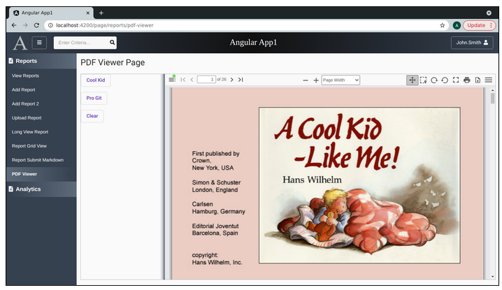
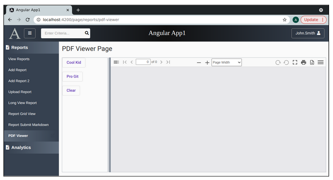

Lesson 23c:  Handy Components / Add Drag & Drop Driver to PdfViewer
-------------------------------------------------------------------
The Google Drive link is here:<br>
&nbsp;&nbsp;&nbsp;https://docs.google.com/document/d/1rJCxMgFiuCp76XNK8zYUKYLQbUfIswm6WngvkCiua28/edit?usp=sharing
      

The source code for this lesson is here:<br>
&nbsp;&nbsp;&nbsp;https://github.com/traderres/angularApp1Lessons/tree/lesson23c
<br>
<br>
<br>

<h3> Problem Set </h3>
Problem:  My customers want to adjust the width of the side-by-side layout<br>
Solution:  Add a drag & drop divider<br>
<br>
<br>
Screen Shot of the Extended PDF Viewer w/draggable column sizer<br>


<br>
NOTE:  The scrollbar can be dragged to the left or right
<br>
<br>
```

Procedure
---------
    1. Add the Angular Material Drag & Drop Module
       a. Edit app.module.ts

       b. Add this module to the imports: [ ] section
                DragDropModule

       c. Make sure that the import statement appears at the top
                import { DragDropModule } from '@angular/cdk/drag-drop';


    2. Add a CSS class for the divider itself
       a. Edit pdf-viewer.component.css

       b. Add this CSS class:
            
            .divider {
              background: linear-gradient(to left, #5e6b7b, rgba(94, 107, 123, 0));
              z-index: 25;        	/* The z-index must be high so we can see the divider over the pdf-viewer */
              cursor: col-resize; 	/* Set the pointer to the east-west column resizer */
            }


    3. Add some code to the TypeScript class
       a. Edit pdf-viewer.component.ts

       b. Add these 3 public variables:
              public rightFlexValue: string = "50%";	// Used to set the width of the right column
              public leftFlexValue: string = "50%"; 	// Used to set the width of the left column
              public showDivider: boolean = true;   	// Used to refresh the divider

       c. Add these 2 view child elements
              @ViewChild("leftDiv") leftDiv: ElementRef;   // Used to get the width of left column
              @ViewChild("rightDiv") rightDiv: ElementRef; // used to get the width of right column


       d. Add this public method:  refreshDivider()
            
              private refreshDivider(): void {
                // Hide the divider
                this.showDivider = false;
            
                // use setTimeout to show the divider
                // -- Show the divider (which will cause the divider to be placed in the correct spot)
                setTimeout(() => {
            
                    // Show the divider (inside setTimeout, Angular change detection will pick this up)
                    this.showDivider = true;
            
                }, 1);
            
              }


        e. Add this public method called dragEnded():
            
              /*
               * The drag-and-drop operation finished
               *
               *  1) Calculate the new width of the left and right columns
               *  2) Set the new widths of the left and right columns
               *  3) Send a resize event (so the pdf-viewer resizes)
               *  4) Show & Hide the divider (so it appears in the correct place)
               */
              public dragEnded(aEvent: CdkDragEnd): void {
                // Get the total number of pixels that were dragged
                let changeInX: number = aEvent.distance.x;
            
                // Calculate the new widths of the left and right columns
                let leftSideNewWidth = this.leftDiv.nativeElement.offsetWidth + changeInX;
                let rightSideNewWidth = this.rightDiv.nativeElement.offsetWidth - changeInX;
            
                // Set the new widths of the left and right columns
                this.leftFlexValue = leftSideNewWidth + "px";
                this.rightFlexValue = rightSideNewWidth + "px";
            
                // Send a resize event so that the pdf viewer will resize
                setTimeout(() => {
                window.dispatchEvent(new Event('resize'));
                }, 1);
            
                // Refresh the divider (so it appears the correct location)
                this.refreshDivider();
            
              }  // end of dragEnded()


    4. Make a few minor changes to the pdf-viewer html
       a. Edit pdf-viewer-component.html

       b. Change the left-side div:
            
          From this:
               <div fxFlex="50%" fxLayoutAlign="left center" fxLayout="row" fxLayoutGap="15px" style="border: 1px solid #babfc7">
            
          To this:
               <div [fxFlex]="this.leftFlexValue" #leftDiv fxLayoutAlign="left center" fxLayout="row" fxLayoutGap="15px" style="border: 1px solid #babfc7" >


        c. Change the right-side div     	
            
           From this:
               <div fxFlex="50%" fxLayoutAlign="end center"  style="border: 1px solid #babfc7">
            
           To this:
               <div [fxFlex]="this.rightFlexValue" #rightDiv fxLayoutAlign="end center" style="border: 1px solid #babfc7">


        d. In between the left-div and right-div, add a center div:
            
              <div fxFlex="10px" *ngIf="this.showDivider" cdkDrag cdkDragLockAxis="x" class="divider"
                (cdkDragEnded)="dragEnded($event)">
            
                <!-- Draggable Column Divider (that will adjust the column widths  -->
            
              </div>

            
            
          NOTE:  
             cdkDrag tells Angular that this div is draggable
             cdkDragLockAxis="x" says that it can only be dragged on the x-axis
             (cdkDragEnded) is used to call our dragEnded() method when the drag operation has finished


    5. Verify it works
        a. Activate the Debugger on "Full WebApp"
        b. Click on "PDF Viewer"
        c. Click on "Cool Kid" to load that pdf file
        d. Drag and drop the vertical divider
           -- The pdf-viewer should expand accordingly


    6. Problem:  When I resize the browser, the left and right column width needs to be calculated differently
       Solution:  Calculate the ratio of old width to new width.  And, then set the left and right widths.

       a. Adjust the NavbarService so it uses a BehaviorSubject instead of a Subject
           NOTE:  a BehaviorSubject has an initial value

            i.   Edit navbar.service.ts

            ii.  Change the navbarSubject variable to this:
                  private navbarStateSubject: BehaviorSubject<NavbarState>;

            iii. Change the constructor() by adding this line to the end
                
                  public constructor() {
                    // Initialize the navbarState
                
                    // The AppNavBar will be visible on startup
                    this.navbarState.isAppNavbarDisplayed = true;
                
                    // The UserNavBar will not be visible on startup
                    this.navbarState.isUserNavbarDisplayed = false;
                
                    // Start of the navbar state with an initial value
                    this.navbarStateSubject = new BehaviorSubject(this.navbarState)
                  }


       b. Change the PDF Viewer class so that it listens on the navbar state
            i.  Edit pdf-viewer.component.ts


            ii.  Change the class so it implements AfterViewInit


            iii. Add these public variables::
                  private secondResize: boolean = false;
                  private columnResize: boolean = false;
                  private navbarSubscription: Subscription;
                  private adjustWidthOffsetForNavbar: number;
                  private previousPageWidth: number;
                  private previousLeftPageWidth: number;
                  private previousRightPageWidth: number;


            iv. Add the ngAfterViewInit() method so it has the starting left and right widths:
                
                  public ngAfterViewInit(): void {
                    this.previousLeftPageWidth = this.leftDiv.nativeElement.offsetWidth;
                    this.previousRightPageWidth = this.rightDiv.nativeElement.offsetWidth;
                  }


            v. Inject the navbarService


            vi. Change the ngOnInit() so that it listens on the navbar state and sets the adjustWidthOffsetForNavbar variable accordingly
                
                  public ngOnInit(): void {
                
                    // Setup the path of the sample directory path
                    if (environment.production) {
                        this.pdfSrcSampleDirectoryPath = "/app1/assets/sample/";
                    }
                    else {
                        this.pdfSrcSampleDirectoryPath = environment.baseUrl + "/assets/sample/";
                    }
                
                    // This app-component will listen for messages from the navbarService
                    this.navbarSubscription =
                    this.navbarService.getNavbarStateAsObservable().subscribe((navbarState) => {
                        // We received a message from the navbarService
                            // -- Someone has toggled the one of the navbars
                
                            if (navbarState.isAppNavbarDisplayed) {
                            // The left-side navbar is visible (so the we need to subtract it from our calculations)
                                    this.adjustWidthOffsetForNavbar = -200;
                            }
                            else {
                                this.adjustWidthOffsetForNavbar = 0;
                            }
                
                        this.previousPageWidth = window.innerWidth + this.adjustWidthOffsetForNavbar;
                    });
                
                  }  // end of ngOnInit()
                


            vii. Change the pdf-viewer.component.ts so it it implements onDestroy


            viii. Add this public method:  ngOnDestroy:

                  public ngOnDestroy(): void {
                    if (this.navbarSubscription) {
                    this.navbarSubscription.unsubscribe();
                    }
                  } 


            ix. Change the dragEnded() method to this:   [changes in bold]
                
                  /*
                   * The drag-and-drop operation finished
                   *
                   *  1) Calculate the new width of the left and right columns
                   *  2) Set the new widths of the left and right columns
                   *  3) Send a resize event (so the pdf-viewer resizes)
                   *  4) Show & Hide the divider (so it appears in the correct place)
                   */
                  public dragEnded(aEvent: CdkDragEnd): void {
                
                    // Get the total number of pixels that were dragged
                    let changeInX: number = aEvent.distance.x;
                
                    // Calculate the new widths of the left and right columns
                    let leftSideNewWidth = this.leftDiv.nativeElement.offsetWidth + changeInX;
                    let rightSideNewWidth = this.rightDiv.nativeElement.offsetWidth - changeInX;
                
                    // Set the new widths of the left and right columns
                    this.leftFlexValue = leftSideNewWidth + "px";
                    this.rightFlexValue = rightSideNewWidth + "px";
                
                    // Store the previous left and right widths  (we need this if the user resizes the browser)
                    this.previousLeftPageWidth = leftSideNewWidth;
                    this.previousRightPageWidth = rightSideNewWidth;
                
                    // Set columnResize = true (so our own resize listener does nothing)
                    this.columnResize = true;
                
                    // Send a resize event so that the pdf viewer will resize
                    setTimeout(() => {
                    window.dispatchEvent(new Event('resize'));
                    }, 1);
                
                    // Refresh the divider (so it appears the correct location)
                    this.refreshDivider();
                
                  }  // end of dragEnded()


            x. Change refreshDivider() so it resets columnResize to false
                
                  private refreshDivider(): void {
                    // Hide the divider
                    this.showDivider = false;
                
                    // use setTimeout to show the divider
                    // -- Show the divider (which will cause the divider to be placed in the correct spot)
                    setTimeout(() => {
                    // Show the divider (inside setTimeout, Angular change detection will pick this up)
                    this.showDivider = true;
                
                    // Set the columnResize flag to false so that the onResize() method knows to ignore this
                    this.columnResize = false;
                    }, 1);
                
                  }


            xi. Add a resize listener by adding this code:
                
                  /*
                   * We received a resize event
                   *  1) If columnResize==true, then we kicked-off this resize event (so ignore it)
                   *  2) If secondResize==true, then just refresh the divider
                   *  3) Else
                   * 	a. Calculate the ratio of the old-width to new-width
                   * 	b. Calculate the newLeftWidth = ratio * oldLeftWidth
                   * 	c. Calculate the newRightWidth = ratio * oldRightWidth
                   * 	d. Set the new leftWidth and newRightWidths
                   */
                  @HostListener('window:resize', ['$event'])
                  public onResize(event: any): void {
                    if (this.columnResize) {
                    return;
                    }
                
                    if (this.secondResize) {
                    this.showDivider = true;
                    this.secondResize = false;
                    return;
                    }
                
                    // Calculate the ratio of the old width to new-width
                    let newPageWidth: number = event.target.innerWidth + this.adjustWidthOffsetForNavbar;
                    let ratioOfPageWidths: number = newPageWidth / this.previousPageWidth;
                
                    // Calculate the new left and right side widths
                    let newLeftSideWidth: number = this.previousLeftPageWidth * ratioOfPageWidths;
                    let newRightSideWidth: number = this.previousRightPageWidth * ratioOfPageWidths;
                
                    // Set the new widths of the left and right columns
                    this.leftFlexValue = String(newLeftSideWidth) + "px";
                    this.rightFlexValue = String(newRightSideWidth) + "px";
                
                    // Refresh the divider by hiding it and showing it
                    this.showDivider = false;
                
                    // Send a resize event so that the pdf viewer will resize
                    setTimeout(() => {
                    this.secondResize = true;
                    window.dispatchEvent(new Event('resize'));
                    }, 1);
                
                    // Store the current page width as (previousPageWidth)
                    this.previousLeftPageWidth = newLeftSideWidth;
                    this.previousRightPageWidth = newRightSideWidth;
                    this.previousPageWidth = newPageWidth;
                  }


    7. Verify that the page columns resize when we resize our browser
        a. Activate the Debugger on "Full WebApp"
        b. Click on "PDF Viewer"
        c. Click on "Cool Kid"
        d. Resize the column by dragging it left and right
           -- The resize should work correctly

        e. Resize the browser itself
           -- The left and right columns should maintain their percentage of the page


Part 2:  Stop the User from Dragging too far Right or Left
----------------------------------------------------------
    1. Adjust the dragEnded() method so it cancels the drag & drop if the left or right side is too small
        a. Edit pdf-viewer.component.ts

        b. Change the dragEnded() method to this:
            
              /*
               * The drag-and-drop operation finished
               *
               *  1) Calculate the new width of the left and right columns
               *  2) Set the new widths of the left and right columns
               *  3) Send a resize event (so the pdf-viewer resizes)
               *  4) Show & Hide the divider (so it appears in the correct place)
               */
              public dragEnded(aEvent: CdkDragEnd): void {
                const SMALLEST_LEFT_SIDE_IN_PIXELS: number = 100;
                const SMALLEST_RIGHT_SIDE_IN_PIXELS: number = 325;
            
                // Get the total number of pixels that were dragged
                let changeInX: number = aEvent.distance.x;
            
                // Calculate the new widths of the left and right columns
                let leftSideNewWidth = this.leftDiv.nativeElement.offsetWidth + changeInX;
                let rightSideNewWidth = this.rightDiv.nativeElement.offsetWidth - changeInX;
            
                if (leftSideNewWidth < SMALLEST_LEFT_SIDE_IN_PIXELS) {
                    // The left side is too small.  Cancel the drag & drop.
                    aEvent.source._dragRef.reset();
                    return;
                }
                else if (rightSideNewWidth < SMALLEST_RIGHT_SIDE_IN_PIXELS) {
                    // The right side is too small.  Cancel the drag & drop.
                    aEvent.source._dragRef.reset();
                    return;
                }
            
                // Set the new widths of the left and right columns
                this.leftFlexValue = leftSideNewWidth + "px";
                this.rightFlexValue = rightSideNewWidth + "px";
            
                // Store the previous left and right widths  (we need this if the user resizes the browser)
                this.previousLeftPageWidth = leftSideNewWidth;
                this.previousRightPageWidth = rightSideNewWidth;
            
                // Set columnResize = true (so our own resize listener does nothing)
                this.columnResize = true;
            
                // Send a resize event so that the pdf viewer will resize
                setTimeout(() => {
                window.dispatchEvent(new Event('resize'));
                }, 1);
            
                // Refresh the divider (so it appears the correct location)
                this.refreshDivider();
            
              }  // end of dragEnded()


        c. Also, change the ngOnInit() so that if the user opens/closes the app navbar, then we refresh
            
              public ngOnInit(): void {
            
                // Setup the path of the sample directory path
                if (environment.production) {
                this.pdfSrcSampleDirectoryPath = "/app1/assets/sample/";
                }
                else {
                this.pdfSrcSampleDirectoryPath = environment.baseUrl + "/assets/sample/";
                }
            
                // This app-component will listen for messages from the navbarService
                this.navbarSubscription =
                this.navbarService.getNavbarStateAsObservable().subscribe((navbarState) => {
                    // We received a message from the navbarService
                    // -- Someone has toggled the one of the navbars
            
                    if (navbarState.isAppNavbarDisplayed) {
                    // The left-side navbar is visible (so the we need to subtract it from our calculations)
                        this.adjustWidthOffsetForNavbar = -200;
                    }
                    else {
                        this.adjustWidthOffsetForNavbar = 0;
                    }
            
                this.previousPageWidth = window.innerWidth + this.adjustWidthOffsetForNavbar;
            
            
                    this.refreshDivider();
            
                });
            
              }  // end of ngOnInit()


    2. Verify that a user cannot scroll to far left or right
        a. Activate the Debugger on "Full WebApp"
        b. Click on "PDF Viewer"
        c. Attempt to scroll to far left or right
           -- Those scrolling attempts should be canceled
```

```
If you scroll too far to the left, the drag & drop is canceled


    3. Enhancement:  It would be better if the drag & drop stopped at the left edge
       -- So, the user does not have to guess where the left edge is
        a. Edit pdf-viewer.component.ts

        b. Change the dragEnded() so that it 
            
             /*
               * The drag-and-drop operation finished
               *
               *  1) Calculate the new width of the left and right columns
               *  2) Set the new widths of the left and right columns
               *  3) Send a resize event (so the pdf-viewer resizes)
               *  4) Show & Hide the divider (so it appears in the correct place)
               */
              public dragEnded(aEvent: CdkDragEnd): void {
            
                const SMALLEST_LEFT_SIDE_IN_PIXELS: number = 100;
                const SMALLEST_RIGHT_SIDE_IN_PIXELS: number = 325;
            
                // Get the total number of pixels that were dragged
                let changeInX: number = aEvent.distance.x;
            
                let oldWidthTotal =  this.leftDiv.nativeElement.offsetWidth + this.rightDiv.nativeElement.offsetWidth;
            
                // Calculate the new widths of the left and right columns
                let leftSideNewWidth = this.leftDiv.nativeElement.offsetWidth + changeInX;
                let rightSideNewWidth = this.rightDiv.nativeElement.offsetWidth - changeInX;
            
            
                if (leftSideNewWidth < SMALLEST_LEFT_SIDE_IN_PIXELS) {
                    // The left side is too small.
            
                    // Set the left side=(smallest size) and right side=(what's left)
                    leftSideNewWidth = SMALLEST_LEFT_SIDE_IN_PIXELS;
                    rightSideNewWidth = oldWidthTotal - leftSideNewWidth;
                }
                else if (rightSideNewWidth < SMALLEST_RIGHT_SIDE_IN_PIXELS) {
                    // The right side is too small.
            
                    // Set the right side=(smallest size) and left side=(what's left)
                    rightSideNewWidth = SMALLEST_RIGHT_SIDE_IN_PIXELS;
                    leftSideNewWidth = oldWidthTotal - rightSideNewWidth;
                }
            
                // Set the new widths of the left and right columns
                this.leftFlexValue = leftSideNewWidth + "px";
                this.rightFlexValue = rightSideNewWidth + "px";
            
                // Store the previous left and right widths  (we need this if the user resizes the browser)
                this.previousLeftPageWidth = leftSideNewWidth;
                this.previousRightPageWidth = rightSideNewWidth;
            
                // Set columnResize = true (so our own resize listener does nothing)
                this.columnResize = true;
            
                // Send a resize event so that the pdf viewer will resize
                setTimeout(() => {
                window.dispatchEvent(new Event('resize'));
                }, 1);
            
                // Refresh the divider (so it appears the correct location)
                this.refreshDivider();
            
              }  // end of dragEnded()


    4. Verify that the scrollbar moved to the minimal width if you scroll too far left
        a. Activate the Debugger on "Full WebApp"
        b. Click on "PDF Viewer"
        c. Scroll to the left too far
           -- The scrollbar should be set 100 pixels from the left

        d. Scroll to the right too far
           -- The scrollbar should be set 300 pixels from right

```
