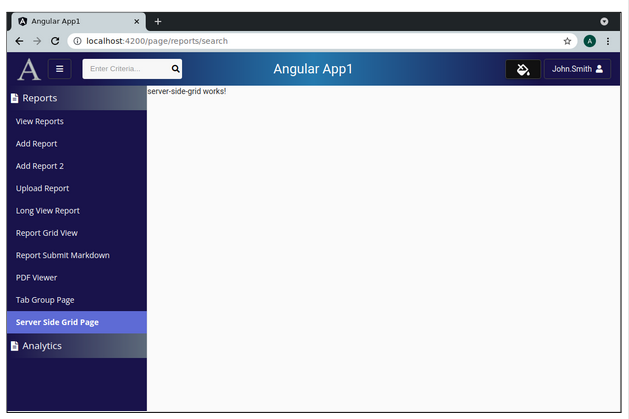

Lesson 26a:  AG Grid / Server Side / Add Page
---------------------------------------------
The Google Drive link is here:<br>
&nbsp;&nbsp;&nbsp;https://docs.google.com/document/d/1d7mFFZ9VzMC7TgKuLZ3UUg0VAmA-BNX9A-5DTLbQGvA/edit?usp=sharing
      

The source code for this lesson is here:<br>
&nbsp;&nbsp;&nbsp;https://github.com/traderres/angularApp1Lessons/tree/lesson26a/server-side-grid/page
<br>
<br>
<br>

<h3> Problem Set </h3>

Problem:  I need to search 1 million records and want a grid that shows it with an infinity scroll<br>
Solution:  Setup the AG-grid to run in server-side mode and add a REST call that searches ElasticSearch<br>
<br>
<br>
WARNING:  This code works best on ag-grid 25.3.0 or later<br><br>

In this lesson, we will simply create the empty page


<br>
<br>

```
Assumptions
-----------  
    1. You have already followed the steps to add ag-grid to the project
       https://docs.google.com/document/d/1HDmu-lfcoXCWeoNfHm7B18jLGqUd3foyMzqFKO1urAA/edit?usp=sharing

    2. You have added the "Upload Report" page to the project:
       https://docs.google.com/document/d/1y9sU5YB885kVRYd3B8vEMzeIVE71qwoPYug4_en8v5g/edit?usp=sharing


Procedure
---------
    1. Verify that the package.json shows ag-grid version 25.3.0:

        "ag-grid-angular": "25.3.0",
        "ag-grid-community": "25.3.0",
        "ag-grid-enterprise": "25.3.0",
        
        NOTE:  If the ag-grid version does not match then in IntelliJ, 
            (1) change the version to 25.3.0, 
            (2) erase the node_modules directory and 
            (3) right-click on package.json -> Run NPM Install


    2. Add a Server Side Grid page
       a. Create the tab group component
          unix> cd ~/intellijProjects/angularApp1/frontend
          unix> ng generate component reports/serverSideGrid --skipTests


       b. Add a constant to constants.ts  (for the route)
            SERVER_SIDE_GRID_ROUTE          	= "page/reports/search"


       c. Add the route to app.module.ts
            { path: Constants.SERVER_SIDE_GRID_ROUTE,   component: ServerSideGridComponent, canActivate: [PageGuard] },


       d. Add the page to the navbar.component.html

              <!-- Server Side Grid Page -->
              <mat-list-item class="navItem" 
                    [routerLink]="constants.SERVER_SIDE_GRID_ROUTE" 
                    routerLinkActive="active"
                            *ngIf="userInfo.pageRoutes.get(constants.SERVER_SIDE_GRID_ROUTE)">
                <a title="Tab Group Page">Server Side Grid Page</a>
                <div fxFlex fxLayoutAlign="end end" >
                    <a [routerLink]="constants.SERVER_SIDE_GRID_ROUTE" target="_blank">
                                <i class="fas fa-external-link-alt navItemIcon" title="Open Server Side Grid Page in a new window"></i>
                    </a>
                </div>
              </mat-list-item>


        e. Add security for that route (so that the roles are authorized to see the page)
            i.   Edit R__security.sql


            ii.  Add a uicontrol record for the server side grid page:
                 insert into uicontrols(id, name) values(1020, 'page/reports/search');


            iii. Assign the uicontrols record to the 'admin' role
                 insert into roles_uicontrols(role_id, uicontrol_id) values(1, 1020);


            iv.  Assign the uicontrols record to the 'reader' role
                 insert into roles_uicontrols(role_id, uicontrol_id) values(2, 1020);
   


        f. Verify that you can get to the page
            i.  Activate the Debugger on "Full WebApp"
            ii. Click on the "Server Side Grid Page" page  (in the navbar)
                -- You should see an empty page
```

