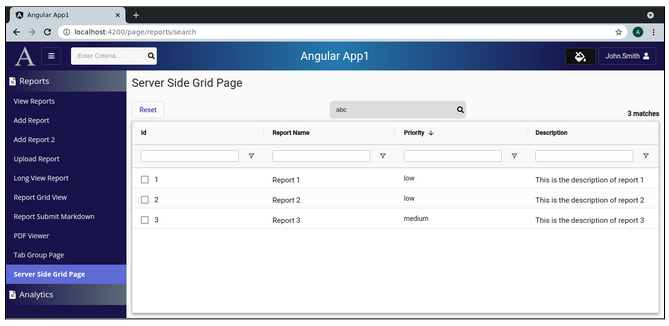

Lesson 26c:  AG Grid / Server Side / Setup Page
-----------------------------------------------
The Google Drive link is here:<br>
&nbsp;&nbsp;&nbsp;https://docs.google.com/document/d/1NMBp7iqcCoxuNd7k-o4ihI2Mt_q2BkX05-Z4Nqe9l3s/edit?usp=sharing
      

The source code for this lesson is here:<br>
&nbsp;&nbsp;&nbsp;https://github.com/traderres/angularApp1Lessons/tree/lesson26c/server-side-grid/setup-grid
<br>
<br>
<br>

<h3> Problem Set </h3>
We have a REST endpoint.  Now, let's setup the ag-grid in server-side mode so it runs in server side mode<br>
-- If the user changes a filter, then the grid invokes the REST endpoint<br>
-- If the user changes sorting, then the grid invokes the REST endpoint<br>
-- If the user scrolls down, then the grid invokes the REST endpoint to get another page<br>
-- If the user presses the Search button, then tell the grid to invoke the REST endpoint<br>
<br>
<br>
At the end of the lesson, we will have a grid but it will always return hard-coded data<bR>


<br>
<br>

```

Approach
--------
    A. Add the front-end model class

    B. Update the grid.service.ts so that it has a public method that calls our backend REST endpoint

    C. Setup the HTML layout to have a grid and a search box

    D. Add the CSS to format the search box

    E. Setup the TypeScript to put the grid into server side mode and employ infinity scroll


Procedure
---------
    1. Add the front-end model classes
       a. Add this front-end model class:  GridGetRowsRequestDTO
          unix> cd ~/intellijProjects/angularApp1/frontend
          unix> ng generate class models/grid/GridGetRowsRequestDTO --skipTests

       b. Replace its contents with this:
            
            import {ColumnVO} from "ag-grid-community/dist/lib/interfaces/iColumnVO";
            import {IServerSideGetRowsRequest} from "ag-grid-community";
            
            export class GridGetRowsRequestDTO implements IServerSideGetRowsRequest {
              public endRow: number;
              public filterModel: any;
              public groupKeys: string[];
              public pivotCols: ColumnVO[];
              public pivotMode: boolean;
              public rowGroupCols: ColumnVO[];
              public sortModel: any;
              public startRow: number;
              public valueCols: ColumnVO[];
              public searchAfterClause: string | null;  	// Holds information about the last row so ElasticSearch can get page2, page3, ...
              public rawSearchQuery: string;
            
            
              public constructor(aParams: IServerSideGetRowsRequest, aSearchAfterClause: string | null, aRawSearchQuery: string) {
                this.endRow = aParams.endRow;
                this.filterModel = aParams.filterModel;
                this.groupKeys = aParams.groupKeys;
                this.pivotCols = aParams.pivotCols;
                this.pivotMode = aParams.pivotMode;
                this.rowGroupCols = aParams.rowGroupCols;
                this.sortModel = aParams.sortModel;
                this.startRow = aParams.startRow;
                this.valueCols = aParams.valueCols;
                this.searchAfterClause = aSearchAfterClause;
                this.rawSearchQuery = aRawSearchQuery;
              }
            }
            

       c. Add this front-end model class:  GridGetRowsResponseDTO
          unix> cd ~/intellijProjects/angularApp1/frontend
          unix> ng generate class models/grid/GridGetRowsResponseDTO --skipTests

       d. Replace its contents with this:
            
            export class GridGetRowsResponseDTO {
              public data: any[];
              public lastRow: number;         	// If lastRow==-1, then infinite scrolling is ON.  If lastRow==totalMatches, then infinite scrolling is OFF
              public totalMatches: number;
              public secondaryColumnFields: string[];
              public searchAfterClause: string;  // Holds information about the last row so ElasticSearch can get page2, page3, ...
            }


       e. Add this front-end model class:  ServerSideGridRowDataDTO
          unix> cd ~/intellijProjects/angularApp1/frontend
          unix> ng generate class models/grid/ServerSideGridRowDataDTO --skipTests

       f. Replace its contents with this:
            
            export class ServerSideGridRowDataDTO {
              public id: number;
              public description: string;
              public priority: string;
              public display_name: string;
            }


    2. Update the grid.service.ts so that it has a public method that calls our backend REST endpoint
       a. Edit grid.service.ts

       b. Inject the httpClient

       c. Add this public method:
        
          /*
           * This is the REST endpoint used for the server-side ag-grid
           */
          public getServerSideData(aGridGetRowsRequestDTO: GridGetRowsRequestDTO): Observable<GridGetRowsResponseDTO> {
            // Construct the URL of the REST call
            const restUrl = environment.baseUrl + '/api/grid/getRows';
        
            // Use a POST call to send a JSON body of info
            return this.httpClient.post <GridGetRowsResponseDTO> (restUrl, aGridGetRowsRequestDTO, {} );
          }


    3. Setup the HTML layout to have a grid and a search box
       a. Edit server-side-grid.component.html

       b. Replace its contents with this:
            
            <div class="page-container" style="background: inherit">
            
              <div fxFlexFill fxLayout="column" fxLayoutGap="5px">
            
                <div fxFlex fxLayout="row" fxLayoutGap="0">
            
                <!-- Left Side of the Top Row -->
                <div fxFlex fxLayoutAlign="left center" fxLayout="row" fxLayoutGap="0">
                    <h1 class="mat-h1">Server Side Grid Page</h1>
                </div>
            
            
                <!-- Right Side of the Top Row -->
                <div fxFlex fxLayoutAlign="end center">
            
                </div>
            
                </div>  <!-- End of top row -->
            
            
            
                <!-- Start of the "button row" -->
                <div fxFlex  fxLayout="row" fxLayoutGap="5px">
            
                <!-- Left Side of the "button row"  -->
            
                <!-- Reset Button -->
                <div fxFlex fxLayoutAlign="left end" fxLayout="row" fxLayoutGap="0">
                    <button mat-stroked-button type="button" color="primary" (click)="this.resetGrid()" title="Reset the Grid">
                    Reset
                    </button>
                </div>
            
            
                <!-- Center of the "button row"  -->
                <div fxFlex fxLayoutAlign="center center" fxLayout="row" fxLayoutGap="0">
            
                    <div class="searchBoxWrapper fa-border">
            
                    <!-- Search Box -->
                    <input matInput type="text"  #searchBox [(ngModel)]="this.rawSearchQuery" (keyup.enter)="this.runSearch()"
                            class="searchBox"
                            placeholder="Enter Criteria..."
                            autocomplete="off"
                            aria-label="search box" />
            
                    <!-- Search Icon -->
                    <span class="searchBoxIcon" (click)="this.runSearch()">
                        <i class="fa fa-search"></i>
                    </span>
            
                    </div>
                </div>
            
                <!-- Right Side of the "button row" -->
                <div fxFlex fxLayoutAlign="end end">
            
                    <!-- Display the total matches -->
                    <b>{{this.totalMatches | number }} matches</b>
                </div>
            
                </div>  <!-- End of "button row" -->
            
            
            
                <!-- Start of the 3rd row -->
                <div fxFlex  fxLayout="column" fxLayoutGap="0">
            
                <mat-card class="mat-elevation-z4" style="margin: 0; padding: 0">
                    <mat-card-content>
            
                    <!-- Setup a wrapper div that uses the entire available height (total height - 165px) -->
                    <div style="height: calc(100vh - 175px);">
            
                        <!-- AG-Grid -->
                        <ag-grid-angular
                        style="width: 100%; height: 100%"
                        class="ag-theme-alpine"
                        [rowData]="this.rowData"
                        [defaultColDef]="this.defaultColDefs"
                        [columnDefs]="this.columnDefs"
                        [gridOptions]="this.gridOptions"
                        [frameworkComponents]="this.frameworkComponents"
                        (gridReady)="this.onGridReady($event)">
                        </ag-grid-angular>
            
                    </div>
            
                    </mat-card-content>
                </mat-card>
            
                </div> <!-- End of 3rd row -->
            
              </div> <!-- End of Angular flex column -->
            
            </div>  <!-- End of grid container -->


    4. Add the CSS to format the search box
       a. Edit server-side-grid.component.css

       b. Replace its contents with this:
            
            .searchBoxWrapper {
              background-color: #dcdcdc;
              border-radius: 8px;  	/* Controls the rounded corners */
              border: 0;
            
              /* Center the search box and the icon */
              display: flex;
              flex-direction: row;
              align-items: center;
            
              margin-left: 10px;
            }
            
            
            
            .searchBox {
              width: 250px; 	/* Set the width of the search box */
              padding: 6px 0 6px 10px;
              background-color: #dcdcdc;   /* light white color */
              border: 0;
              color: #111;
            
              /* Remove the outline that appears when clicking in textbox */
              outline: none;
            }
            
            
            .searchBoxIcon {
              color: black;
              padding: 6px 1px 6px 1px;
              cursor: pointer;
              border: 0;
              background-color: transparent;
            }
            
            


    5. Setup the TypeScript to put the grid into server side mode and employ infinity scroll
       a. Edit server-side-grid.component.ts

       b. Replace its contents with this:
            
            import {AfterViewInit, Component, ElementRef, OnDestroy, OnInit, ViewChild} from '@angular/core';
            import {ColumnApi, GridApi, GridOptions, IServerSideDatasource, IServerSideGetRowsParams, ServerSideStoreType} from "ag-grid-community";
            import {GridGetRowsResponseDTO} from "../../models/grid/grid-get-rows-response-dto";
            import {ServerSideGridRowDataDTO} from "../../models/grid/server-side-grid-row-data-dto";
            import {GridService} from "../../services/grid.service";
            import {GridGetRowsRequestDTO} from "../../models/grid/grid-get-rows-request-dto";
            
            @Component({
              selector: 'app-server-side-grid',
              templateUrl: './server-side-grid.component.html',
              styleUrls: ['./server-side-grid.component.css']
            })
            export class ServerSideGridComponent implements OnInit, OnDestroy, AfterViewInit {
            
            
              private searchAfterClause: string | null;
              public  totalMatches: number = 0;
              public  rawSearchQuery: string = "";
            
            
              public gridOptions: GridOptions = {
                debug: false,
                suppressCellSelection: true,
                rowSelection: 'multiple',  	// Possible values are 'single' and 'multiple'
                domLayout: 'normal',
                rowModelType: 'serverSide',	// Possible values are 'clientSide', 'infinite', 'viewport', and 'serverSide'
                pagination: false,         	// Do not show the 1 of 20 of 20, page 1 of 1 (as we are doing infinite scrolling)
            
                serverSideStoreType: ServerSideStoreType.Partial,   // Use partial Server Side Store Type so that pages of data are loaded
                cacheBlockSize: 50,                             	// Load 50 records at a time with each REST call
                blockLoadDebounceMillis: 100,
                debounceVerticalScrollbar: true,
                overlayNoRowsTemplate: "<span class='no-matches-found-message'>No matches were found</span>",
            
                onFilterChanged: () => {
                // The user changed a filer.  So, clear the grid cache before the REST endpoint is invoked
                this.clearGridCache();
                },
            
                onSortChanged: () => {
                // The user changed a sort.  So, clear the grid cache before the REST endpoint is invoked
                this.clearGridCache();
                }
              }
            
            
              private clearGridCache(): void {
                // Move the scrollbar to the top
                if (this.totalMatches > 0) {
                this.gridApi.ensureIndexVisible(0, 'top');
                }
            
                // Clear the cache
                this.gridApi?.setServerSideDatasource(this.serverSideDataSource);
              }
            
            
              /*
               * Clear all grid sorting
               */
              private clearGridSorting(): void {
            
                // Tell the grid to clear sorting on all columns
                this.gridColumnApi.applyColumnState({
                defaultState: { sort: null }
                });
                
              }
             
            
            
              /*
               * User pressed the Reset Button
               *  1. Clear the grid cache
               *  2. Clear all sorting
               *  3. Clear all filters
               *  4. Empty the search box
               *  5. Force the grid to invoke the REST endpoint by calling onFilterChanged()
               */
              public resetGrid(): void {
                // Clear the grid cache and move the vertical scrollbar to the top
                this.clearGridCache();
            
                // Clear all sorting
                this.clearGridSorting();
            
                // Clear the filters
                this.gridApi.setFilterModel(null);
            
                // Clear the search box
                this.rawSearchQuery = "";
            
                // Force the grid to invoke the REST endpoint
                this.gridApi.onFilterChanged();
            
                // Reset columns (so they are visible and restored to default)
                this.gridColumnApi.resetColumnState();
              }
            
            
              /*
               * User clicked to run a search
               *  1. Clear the grid cache
               *  2. Clear all sorting
               *  3. Clear all filters
               *  4. Force the grid to invoke the REST endpoint by calling onFilterChanged()
               */
              public runSearch(): void {
                this.clearGridCache();
            
                // Clear all sorting
                this.clearGridSorting();
            
                // Clear the filters
                this.gridApi.setFilterModel(null);
            
                // Force the grid to invoke the REST endpoint
                this.gridApi.onFilterChanged();
              }
            
            
              /*
               * Create a server-side data source object
               *
               * The getRows() method is invoked when a user scrolls down (to get more rows)
               * The getRows() method is invoked when a user changes a filter
               * The getRows() method is invoked when a user changes sorting
               * The getRows() method is invoked manually when the code calls this.gridApi.onFilterChanged()
               */
              private serverSideDataSource: IServerSideDatasource = {
                getRows: (params: IServerSideGetRowsParams) => {
                // The grid needs to load data.  So, subscribe to gridService.getServerSideData() and load the data
            
                if (params.request.startRow == 0) {
                    // The user is requesting a first page (so we are not getting a 2nd or 3rd page)
                    // -- Reset the additional sort fields  (needed for the 2nd, 3rd, 4th pages)
                    this.searchAfterClause = null;
                }
            
                if (this.totalMatches == 0) {
                    this.gridApi.hideOverlay();
                }
            
                // Add the additional sort fields to the request object
                let getRowsRequestDTO: GridGetRowsRequestDTO = new GridGetRowsRequestDTO(params.request, this.searchAfterClause, this.rawSearchQuery)
            
                // Subscribe to this service method to get the data
                this.gridService.getServerSideData(getRowsRequestDTO)
                    .subscribe((response: GridGetRowsResponseDTO) => {
                    // REST Call finished successfully
            
                    // Save the additional sort fields  (we will use when getting the next page)
                    this.searchAfterClause = response.searchAfterClause;
            
                    // Update total matches on the screen
                    this.totalMatches = response.totalMatches;
            
                    if (this.totalMatches == 0) {
                        this.gridApi.showNoRowsOverlay();
                    }
            
                    // Load the data into the grid and turn on/off infinite scrolling
                    // If lastRow == -1,       	then Infinite-Scrolling is turned ON
                    // if lastRow == totalMatches, then infinite-scrolling is turned OFF
                    params.successCallback(response.data, response.lastRow)
                    });
            
                }
              };
            
            
              public defaultColDefs: any = {
                flex: 1,
                sortable: true,
                filter: true,
                floatingFilter: true,	// Causes the filter row to appear below column names
                autoHeight: true,
                resizable: true
              };
            
            
              private textFilterParams = {
                filterOptions: ['contains', 'notContains'],
                caseSensitive: false,
                debounceMs: 200,
                suppressAndOrCondition: true,
              };
            
              public columnDefs = [
                {
                headerName: 'Id',
                field: 'id',
                filter: 'agNumberColumnFilter',       	// numeric filter
                filterParams: this.textFilterParams,
                cellClass: 'grid-text-cell-format',
                checkboxSelection: true
                },
                {
                headerName: 'Report Name',
                field: 'display_name',
                filter: 'agTextColumnFilter',
                filterParams: this.textFilterParams,
                cellClass: 'grid-text-cell-format'
                },
                {
                headerName: 'Priority',
                field: 'priority',
                filter: 'agTextColumnFilter',
                filterParams: this.textFilterParams,
                },
                {
                headerName: 'Description',
                field: 'description',
                sortable: false,                  	// The description field is not sortable
                filter: 'agTextColumnFilter',
                filterParams: this.textFilterParams,
                cellClass: 'grid-text-cell-format'
                }
              ];
            
              // This is a map of component names that correspond to components that implement ICellRendererAngularComp
              public  frameworkComponents: any = {  };
            
              public  rowData: ServerSideGridRowDataDTO[];
              private gridApi: GridApi;
              private gridColumnApi: ColumnApi;
            
              @ViewChild('searchBox',  { read: ElementRef }) searchBox: ElementRef;
            
              constructor(private gridService: GridService) {}
            
              public ngOnInit(): void {
              }
            
            
              public ngAfterViewInit(): void {
                // Set the focus on the search box
                setTimeout(() => this.searchBox.nativeElement.focus(), 10);
              }
            
            
              public ngOnDestroy(): void {
              }
            
            
              /*
               * The grid calls onGridReady() once it is fully initialized.  This is the start of this page.
               */
              public onGridReady(params: any): void {
                // Get a reference to the gridApi and gridColumnApi (which we will need later to get selected rows)
                this.gridApi = params.api;
                this.gridColumnApi = params.columnApi;
            
            
                // Set the server-side data source
                // NOTE:  The grid will asynchronously call getRows() as it needs to load data
                this.gridApi.setServerSideDatasource(this.serverSideDataSource);
              }
            
            
            }


    6. Verify it works
        a. Activate the Debugger on "Full WebApp"
        b. Click on Server Side Grid Page
        c. In this page, click on a filter -- and the REST endpoint returns the same 3 rows
        d. In this page, change the sorting -- and the REST endpoint returns the same 3 rows
        e. In this page, press search -- and the REST endpoint returns the same 3 rows
```

```
The grid is running in server side mode, but the REST endpoint always returns the same 3 rows


```
