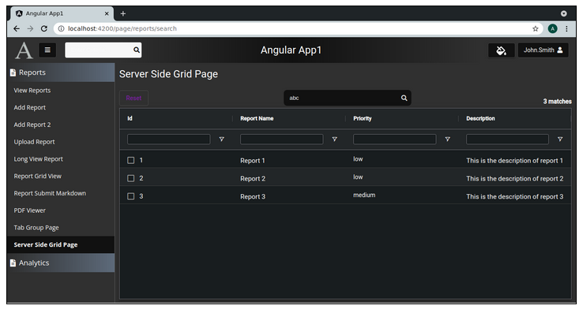
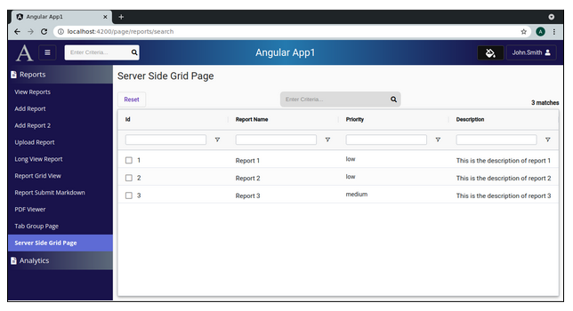
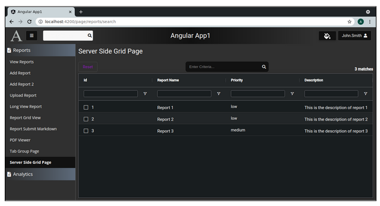

Lesson 26d:  AG Grid / Server Side / Add Dark Mode
--------------------------------------------------
The Google Drive link is here:<br>
&nbsp;&nbsp;&nbsp;https://docs.google.com/document/d/1r100pm_WET7mBZ3_jd1296PrhVyVjg3Ez3U8Xqyh4LE/edit?usp=sharing
      

The source code for this lesson is here:<br>
&nbsp;&nbsp;&nbsp;https://github.com/traderres/angularApp1Lessons/tree/lesson26d/server-side-grid/dark-mode
<br>
<br>
<br>

<h3> Problem Set </h3>
In this lesson, we will make sure the grid and search box look good in dark mode.<br>




<br>
<br>

```
Procedure
---------
    1. Edit the html so that the grid and search box look at the his.currentTheme.isLightMode
       a. Edit server-side-grid.component.html

       b. Change the "Center of the button row" div so that there is an extra div that sets light or dark
          [Changes are in bold]
            
                <!-- Center of the "button row"  -->
                <div fxFlex fxLayoutAlign="center center" fxLayout="row" fxLayoutGap="0">
            
                    <div [ngClass]="{   'light': 	this.currentTheme.isLightMode == true,
                                                'dark':  	this.currentTheme.isLightMode == false
                                }">
            
                    <div class="searchBoxWrapper fa-border">
            
                        <!-- Search Box -->
                        <input matInput type="text"  #searchBox [(ngModel)]="this.rawSearchQuery" (keyup.enter)="this.runSearch()"
                                class="searchBox"
                                placeholder="Enter Criteria..."
                                autocomplete="off"
                                aria-label="search box" />
            
                        <!-- Search Icon -->
                        <span class="searchBoxIcon" (click)="this.runSearch()">
                            <i class="fa fa-search"></i>
                        </span>
                            </div>
            
                    </div>
                </div>


        c. Adjust the <ag-grid-angular> tag so that it has this 

          	[ngClass]="{   'ag-theme-alpine':    	this.currentTheme.isLightMode == true,
                         	'ag-theme-alpine-dark':   this.currentTheme.isLightMode == false
                	}"
        


        When finished, the <ag-grid-angular> tag looks like this:
        
            <!-- AG-Grid -->
            <ag-grid-angular
              style="width: 100%; height: 100%"
              [ngClass]="{   'ag-theme-alpine':        	 this.currentTheme.isLightMode == true,
                             'ag-theme-alpine-dark':     this.currentTheme.isLightMode == false
                    }"
              [rowData]="this.rowData"
              [defaultColDef]="this.defaultColDefs"
              [columnDefs]="this.columnDefs"
              [gridOptions]="this.gridOptions"
              [frameworkComponents]="this.frameworkComponents"
              (gridReady)="this.onGridReady($event)">
            </ag-grid-angular>


    2. Adjust the server-side-grid-component to listen for theme changes
       a. Edit server-side-grid-component.ts


       b. Add these 2 class variables:
             private themeStateSubscription: Subscription;
             public  currentTheme: ThemeOptionDTO;


       c. Inject the ThemeService


       d. Adjust the ngOnInit() to listen for theme changes by adding this to ngOnInit():
            
              public ngOnInit(): void {
            
                // Listen for changes from the theme service
                this.themeStateSubscription = this.themeService.getThemeStateAsObservable().subscribe( (aNewTheme: ThemeOptionDTO) => {
                    // The theme has changed.
                    this.currentTheme = aNewTheme;
                });
            
              }


       e. Adjust the ngOnDestroy() to unsubscribe from this subscription:

              public ngOnDestroy(): void {
                if (this.themeStateSubscription) {
                    this.themeStateSubscription.unsubscribe();
                }
              }


    3. Change the CSS to handle light and dark mode
       a. Edit server-side-grid.component.css

       b. Replace its contents with this:
            
            
            /**********   L I G H T  	M O D E  **********/
            .light .searchBox {
              width: 250px; 	/* Set the width of the search box */
              padding: 6px 0 6px 10px;
              background-color: #dcdcdc;   /* light white color */
              border: 0;
            
              /* Remove the outline that appears when clicking in textbox */
              outline: none;
            }
            
            
            .light .searchBoxWrapper {
              background-color: #dcdcdc;
              border-radius: 9px;  	/* Controls the rounded corners */
              border: 0;
            
              /* Center the search box and the icon */
              display: flex;
              flex-direction: row;
              align-items: center;
            
              margin-left: 10px;
            }
            
            
            .light .searchBoxIcon {
              color: black;
              padding: 6px 6px 6px 1px;
              cursor: pointer;
              border: 0;
              background-color: transparent;
            }
            
            
            
            
            /**********   D A R K   	M O D E  **********/
            .dark .searchBox {
              width: 250px; 	/* Set the width of the search box */
              padding: 6px 0 6px 10px;
              background-color: #111111;   /* light white color */
              color: white;
              caret-color: white;
              border: 0;
            
              /* Remove the outline that appears when clicking in textbox */
              outline: none;
            }
            
            
            .dark .searchBoxWrapper {
              background-color: #111111;
              caret-color: white;
              border-radius: 9px;  	/* Controls the rounded corners */
              border: 0;
            
              /* Center the search box and the icon */
              display: flex;
              flex-direction: row;
              align-items: center;
            
              margin-left: 10px;
            }
            
            
            .dark .searchBoxIcon {
              color: #dcdcdc;
              padding: 6px 6px 6px 10px;
              cursor: pointer;
              border: 0;
              background-color: transparent;
            }
            


    4. Verify that your angular.json includes both ag-theme-alpine.css and ag-theme-alpine-dark.css
       a. Go to angular.json

       b. Verify that architect -> build -> styles has the entries in bold

        	"styles": [
          	"./node_modules/@fortawesome/fontawesome-free/css/all.css",
          	"./node_modules/ag-grid-community/dist/styles/ag-grid.css",
          	"./node_modules/quill/dist/quill.core.css",
          	"./node_modules/quill/dist/quill.bubble.css",
          	"./node_modules/quill/dist/quill.snow.css",
          	"./node_modules/quill-emoji/dist/quill-emoji.css",
          	"./node_modules/quill-mention/dist/quill.mention.min.css",
          	"./node_modules/ag-grid-community/dist/styles/ag-theme-alpine.css",
          	"./node_modules/ag-grid-community/dist/styles/ag-theme-alpine-dark.css",
          	"src/styles.css"
        	],


    5. Verify it works
       a. Activate the Debugger on "Full WebApp:
       b. Click on "Server Side Grid Page"
       c. Switch from light mode to dark mode

```

```
Server Side Grid Page in Light Mode


```

```
Server Side Grid Page in Dark Mode


```
