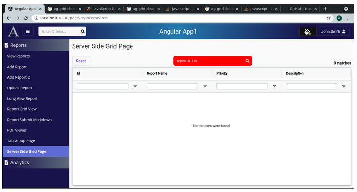

Lesson 26f:  AG Grid / Server Side / Validate ES Query
------------------------------------------------------
The Google Drive link is here:<br>
&nbsp;&nbsp;&nbsp;https://docs.google.com/document/d/117r8wyTXII2j0r8wv44o5CWkP0VfDsp6uRL444SssbI/edit?usp=sharing
      

The source code for this lesson is here:<br>
&nbsp;&nbsp;&nbsp;https://github.com/traderres/angularApp1Lessons/tree/lesson26f/server-side-grid/validate-query
<br>
<br>
<br>

<h3> Problem Set </h3>
Problem:  User enters an invalid query -- e.g.,  Report and 10 and    (extra and)<br>
then the ErrorInterceptor shows an error<br><br>

Solution:      Have the getRows() REST endpoint check if the query is valid<br>
    If the query is valid, then the response.isValidQuery == true<br>
    If the query is invalid, then the response.isValidQuery == false<br>
<br>
<br>    The class will check this field and set a flag (this.isValidQuery)
<br>    The html template will look for this.isValidQuery to set CSS (to change the search box's color)
<br>
<br>



The search box turns red if the user enters an invalid query (in light mode)<br>

<br>
<br>
<br>
<br>


The search box turns red if the user enters an invalid query (in dark mode)
<br>
<br>
<br>
```
Procedure
---------
    1. Add the isValidQuery field to GridGetRowsResponseDTO
       a. Edit GridGetRowsResponseDTO.java

       b. Add the field

            @JsonProperty("isValidQuery")
            private boolean isValidQuery = true;


       c. Add the getters and setters

            public boolean getIsValidQuery() {
                    return isValidQuery;
            }
        
            public void setIsValidQuery(boolean validQuery) {
                    isValidQuery = validQuery;
            }


    2. Add this method to ElasticSearchService.java
       a. Edit ElasticSearchService.java

       b. Add the isQueryValid() method:
            
            public boolean isQueryValid(String aIndexName, String aJsonBodyForQuery) throws Exception {
                if (StringUtils.isEmpty(aIndexName)) {
                    throw new RuntimeException("The passed-in aIndexName is null or empty.");
                }
                else if (StringUtils.isEmpty(aJsonBodyForQuery)) {
                    throw new RuntimeException("The passed-in aJsonBody is null or empty.");
                }
            
                // Make a synchronous POST call to run a _validate/query Call -- to see if this query is valid
                Response response = this.asyncHttpClient.prepareGet(this.elasticSearchUrl + "/" + aIndexName + "/_validate/query")
                        .setRequestTimeout(this.ES_REQUEST_TIMEOUT_IN_MILLISECS)
                        .setHeader("accept", "application/json")
                        .setHeader("Content-Type", "application/json")
                        .setBody(aJsonBodyForQuery)
                        .execute()
                        .get();
            
                if (response.getStatusCode() != 200) {
                    throw new RuntimeException("Critical error in isQueryValid():  ElasticSearch returned a response status code of " +
                            response.getStatusCode() + ".  Response message is " + response.getResponseBody() + "\n\n" + aJsonBodyForQuery);
                }
            
                // Get the JSON response from the response object
                String jsonResponse = response.getResponseBody();
            
                // Convert the response JSON string into a map and examine it to see if the request really worked
                Map<String, Object> mapResponse = objectMapper.readValue(jsonResponse, new TypeReference<Map<String, Object>>() {});
            
                boolean isQueryValid = (boolean) mapResponse.get("valid");
                return isQueryValid;
            }


    3. Change GridService so it validates a query
        a. Edit GridService.java

        b. Replace the getPageOfData() with this    [changes in bold]
            
            /**
             *  1. Run a search
             *  2. Put the results into a list
             *  3. Create a GridGetRowsResponseDTO object
             *  4. Return the GridGetRowsResponseDTO object
             *
             * @param aGridRequestDTO holds information about the request
             * @return holds the response object (that holds the list of data)
             */
            public GridGetRowsResponseDTO getPageOfData(String aIndexName, List<String> aFieldsToSearch, List<String> aFieldsToReturn, GridGetRowsRequestDTO aGridRequestDTO) throws Exception {
            
                logger.debug("getPageOfData()  startRow={}   endRow={}", aGridRequestDTO.getStartRow(), aGridRequestDTO.getEndRow() );
            
                // Calculate the page size  (to determine how many records to request from ES)
                int pageSize = aGridRequestDTO.getEndRow() - aGridRequestDTO.getStartRow();
            
                // Build the search_after clause  (which is used to get page 2, page 3, page 4 from an ES query)
                String esSearchAfterClause = "";
                if (aGridRequestDTO.getStartRow() > 0) {
                    // Getting the 2nd, 3rd, 4th page....
                    esSearchAfterClause = " \"search_after\": [" + aGridRequestDTO.getSearchAfterClause() + "],";
                }
            
                // Construct the *SORT* clause
                String esSortClauseWithComma = generateSortClauseFromSortParams(aGridRequestDTO.getSortModel() );
            
                // Construct the *FILTER* clause (this holds the contains filters)
                String filterClause = generateFilterClause(aGridRequestDTO.getFilterModel() );
            
                // Construct the *MUST_NOT* clause (this holds the notContains filters)
                String mustNotClause = generateMustNotClause(aGridRequestDTO.getFilterModel() );
            
                // Construct the *QUERY* clause
                String cleanedQuery = this.elasticSearchService.cleanupQuery( aGridRequestDTO.getRawSearchQuery()  );
                String queryStringClause = generateQueryStringClause(cleanedQuery, aFieldsToSearch);
            
                // Construct the _source clause (so ElasticSearch only returns a subset of the fields)
                String esSourceClause = generateSourceClause(aFieldsToReturn);
            
                // Assemble the pieces to build the JSON query
                String jsonQuery = "{\n" +
                        esSourceClause + "\n" +
                        esSearchAfterClause + "\n" +
                        esSortClauseWithComma + "\n" +
                        "   \"track_total_hits\": true,\n" +
                        "   \"size\": " + pageSize +",\n" +
                        "  \"query\": {\n" +
                        "	\"bool\": {\n" +
                        "  	\"must\": {\n" +
                        queryStringClause + "\n" +
                        "  	},\n" +
                        filterClause + "," +
                        mustNotClause +
                        "	}\n" +
                        "  }\n" +
                        "}";
            
            
                boolean isValidQuery = true;
                if ((StringUtils.isNotEmpty(cleanedQuery)) && (aGridRequestDTO.getStartRow() == 0)) {
                    String fullQueryClause = "{ \"query\": { \n" + queryStringClause + "\n" + "}}\n";
            
                    // The user entered a search query and this is the first page -- so validate it
                    isValidQuery = this.elasticSearchService.isQueryValid(aIndexName, fullQueryClause);
                }
            
                if (! isValidQuery) {
                    // The query is not valid.  So, return a GridGetRowsResponseDTO object with the isValidQuery=false
                    GridGetRowsResponseDTO responseDTO = new GridGetRowsResponseDTO(null, 0, null);
                    responseDTO.setIsValidQuery(false);
                    return responseDTO;
                }
            
                // Execute the search and generate a GetResponsRowsResponseDTO object
                // -- This sets responseDTO.setData() and responseDTo.setTotalMatches()
                GridGetRowsResponseDTO responseDTO  = this.elasticSearchService.runSearchGetRowsResponseDTO(aIndexName, jsonQuery);
            
            
                // Set the lastRow  (so the ag-grid's infinite scrolling works correctly)
                if (aGridRequestDTO.getEndRow() < responseDTO.getTotalMatches() ) {
                    // This is not the last page.  So, set lastRow=-1  (which turns on infinite scrolling)
                    responseDTO.setLastRow(-1);
                }
                else {
                    // This is the last page.  So, set lastRow=totalMatches (which turns off infinite scrolling)
                    responseDTO.setLastRow( responseDTO.getTotalMatches() );
                }
            
                return responseDTO;
            }


    4. On the front-end, add isValidQuery to the GridGetRowsResponseDTO
        a. Edit grid-get-rows-response-dto.ts

        b. Add this field

             public isValidQuery: boolean;


    5. Change the server-side-grid-component.ts to look for the isValidQuery flag
        a. Edit server-side-grid-component.ts

        b. Add this field:
              public  isValidQuery: boolean = true;

        c. Change the serverSideDataSource to look for the flag    (changes in bold)
            
              /*
               * Create a server-side data source object
               *
               * The getRows() method is invoked when a user scrolls down (to get more rows)
               * The getRows() method is invoked when a user changes a filter
               * The getRows() method is invoked when a user changes sorting
               * The getRows() method is invoked manually when the code calls this.gridApi.onFilterChanged()
               */
              private serverSideDataSource: IServerSideDatasource = {
                getRows: (params: IServerSideGetRowsParams) => {
                // The grid needs to load data.  So, subscribe to gridService.getServerSideData() and load the data
            
                if (params.request.startRow == 0) {
                    // The user is requesting a first page (so we are not getting a 2nd or 3rd page)
                    // -- Reset the additional sort fields  (needed for the 2nd, 3rd, 4th pages)
                    this.searchAfterClause = null;
                }
            
                if (this.totalMatches == 0) {
                    this.gridApi.hideOverlay();
                }
            
                // Add the additional sort fields to the request object
                let getRowsRequestDTO: GridGetRowsRequestDTO = new GridGetRowsRequestDTO(params.request, this.searchAfterClause, this.rawSearchQuery)
            
                // Subscribe to this service method to get the data
                this.gridService.getServerSideData(getRowsRequestDTO)
                    .subscribe((response: GridGetRowsResponseDTO) => {
                    // REST Call finished successfully
            
                    this.isValidQuery = response.isValidQuery;
            
                    if (! response.isValidQuery) {
                        // The user entered an invalid search
            
                        // Set the flag to false (so the search box changes color)
                        this.isValidQuery = false;
            
                        // Update total matches on the screen
                        this.totalMatches = 0;
            
                        // Show the 'no matches were found'
                        this.gridApi.showNoRowsOverlay();
            
                        // Tell the ag-grid that there were no results
                        params.successCallback([], 0);
                        return;
                    }
            
                    // Save the additional sort fields  (we will use when getting the next page)
                    this.searchAfterClause = response.searchAfterClause;
            
                    // Update total matches on the screen
                    this.totalMatches = response.totalMatches;
            
                    if (this.totalMatches == 0) {
                        this.gridApi.showNoRowsOverlay();
                    }
            
                    // Load the data into the grid and turn on/off infinite scrolling
                    // If lastRow == -1,       	then Infinite-Scrolling is turned ON
                    // if lastRow == totalMatches, then infinite-scrolling is turned OFF
                    params.successCallback(response.data, response.lastRow)
                    });
            
                }
              };


    6. Change the HTML to set different CSS based on if the grid is query is valid or not
       a. Edit server-side-grid.component.html

       b. Replace the "Center of the button row" with this:
            
              <!-- Center of the "button row"  -->
              <div fxFlex fxLayoutAlign="center center" fxLayout="row" fxLayoutGap="0">
            
                <div [ngClass]="{   'light': 	this.currentTheme.isLightMode == true,
                                                       'dark':  	this.currentTheme.isLightMode == false
                            }">
            
                    <div   [ngClass]="{   'light searchBoxWrapperValid   fa-border':this.isValidQuery == true,
                                             'dark searchBoxWrapperInvalid fa-border':   this.isValidQuery == false }">
            
                            <!-- Search Box -->
                            <input matInput type="text"  #searchBox [(ngModel)]="this.rawSearchQuery" (keyup.enter)="this.runSearch()"
                                [ngClass]="{   'searchBoxValid':  this.isValidQuery == true,
                                                'searchBoxInvalid':   this.isValidQuery == false } "
                                placeholder="Enter Criteria..."
                                autocomplete="off"
                                aria-label="search box" />
            
                            <!-- Search Icon -->
                            <span class="searchBoxIcon" (click)="this.runSearch()">
                            <i class="fa fa-search"></i>
                            </span>
                    </div>
            
                </div>
              </div>


    7. Change the CSS so that there are different colors for valid/invalid queries and light/dark mode
       a. Edit server-side-grid.component.css

       b. Replace its contents with this:
            
            
            :host ::ng-deep .ag-body-viewport.ag-layout-normal {
              /* Force ag-grid to show a vertical scrollbar all of the time to avoid the "bump" */
              /* The bump appears when the user searches for something that has no matches, then vertical scrollbar disappears and the columns move over */
              overflow-y: scroll;
            }
            
            /**********   L I G H T  	M O D E  **********/
            .light .searchBoxValid  {
              width: 250px;            	/* Set the width of the search box */
              padding: 6px 0 6px 8px;  	/* The last padding value determines how far indented the textbox appears in the wrapper */
              background-color: #dcdcdc;   /* light white color */
              border: 0;
            
              /* Remove the outline that appears when clicking in textbox */
              outline: none;
            
              margin-left: 3px;   /* Push the search box to the right inside the wrapper */
            }
            
            
            .light .searchBoxInvalid  {
              width: 250px;        	/* Set the width of the search box */
              padding: 6px 0 6px 8px;
              background-color: red;   /* light white color */
              color: white;
              caret-color: white;
              border: 0;
            
              /* Remove the outline that appears when clicking in textbox */
              outline: none;
            
              margin-left: 3px;   /* Push the search box to the right inside the wrapper */
            }
            
            
            .light .searchBoxWrapperValid  {
              background-color: #dcdcdc;
              border-radius: 9px;  	/* Controls the rounded corners */
              border: 0;
            
              /* Center the search box and the icon */
              display: flex;
              flex-direction: row;
              align-items: center;
            }
            
            
            .light .searchBoxWrapperInvalid {
              background-color: red;
              color: white;
              border-radius: 9px;  	/* Controls the rounded corners */
              border: 0;
            
              /* Center the search box and the icon */
              display: flex;
              flex-direction: row;
              align-items: center;
            }
            
            
            .light .searchBoxIcon {
              color: black;
              padding: 6px 6px 6px 1px;
              cursor: pointer;
              border: 0;
              background-color: transparent;
            }
            
            
            
            
            /**********   D A R K   	M O D E  **********/
            .dark .searchBoxValid {
              width: 250px;               	/* Set the width of the search box */
              padding: 6px 0 6px 8px;     	/* The last padding value determines how far indented the textbox appears in the wrapper */
              background-color: transparent;  /* The searchboxWrapper sets the background-color */
              color: white;
              caret-color: white;
              border: 0;
            
              /* Remove the outline that appears when clicking in textbox */
              outline: none;
            
              margin-left: 3px;   /* Push the search box to the right inside the wrapper */
            }
            
            
            .dark .searchBoxInvalid {
              width: 250px;        	/* Set the width of the search box */
              padding: 6px 0 6px 8px;
              background-color: red;   /* invalid background color */
              color: white;
              caret-color: white;
              border: 0;
            
              /* Remove the outline that appears when clicking in textbox */
              outline: none;
            
              margin-left: 3px;   /* Push the search box to the right inside the wrapper */
            }
            
            
            .dark .searchBoxWrapperValid {
              background-color: #111111;
              caret-color: white;
              border-radius: 9px;  	/* Controls the rounded corners */
              border: 0;
            
              /* Center the search box and the icon */
              display: flex;
              flex-direction: row;
              align-items: center;
            }
            
            
            .dark .searchBoxWrapperInvalid {
              background-color: red;
              caret-color: white;
              border-radius: 9px;  	/* Controls the rounded corners */
              border: 0;
            
              /* Center the search box and the icon */
              display: flex;
              flex-direction: row;
              align-items: center;
            }
            
            
            .dark .searchBoxIcon {
              color: #dcdcdc;
              padding: 6px 6px 6px 10px;
              cursor: pointer;
              border: 0;
              background-color: transparent;
            }
            


    8. Verify that it works
        a. Activate the Debugger on "Full WebApp"
        b. Click on Server Side Grid Page
        c. Enter a valid query -- e.g., "report OR 1"
        d. Enter an invalid query -- e.g., "report OR 1 OR"
           -- You should see the box change to red on invalid

```
