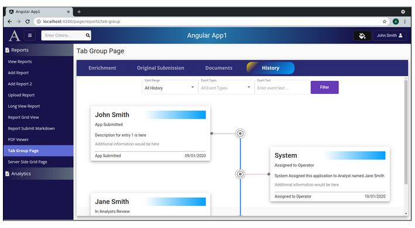

Lesson 27a:  History Page / Add Timeline Components
---------------------------------------------------
The Google Drive link is here:<br>
&nbsp;&nbsp;&nbsp;https://docs.google.com/document/d/1eVLS3a1eqDcsEVQK5EUt52o2tjnsqdHaEo9m5KZs3-8/edit?usp=sharing
      

The source code for this lesson is here:<br>
&nbsp;&nbsp;&nbsp;https://github.com/traderres/angularApp1Lessons/tree/lesson27a/history/add-component
<br>
<br>
<br>

<h3> Problem Set </h3>
Problem:  I want to make a pretty history page.<br>
Solution: Create a special timeline and timeline-item components to make it appear as such.<BR>
NOTE:  timeline.component.css is the parent that has all of the CSS
<br>
<br>




```
<timeline> tag is used for the parent component  (holds the CSS for the timeline)<br>
<timeline-item> tag is used for the child elements  (holds data for the cards)<br>
```

<br>
<br>
<br>

```
Procedure
---------
    1. Add the timeline component
       a. Generate the component:
          unix> cd ~/intellijProjects/angularApp1/frontend
          unix> ng generate component timeline --skipTests


       b. Edit timeline.component.ts
          NOTE 1:  ViewEncapsulation is set to none so the children tags pick-up the CSS
          NOTE 2:  The selector is <timeline>


       c. Replace its contents with this:
            
            import {Component, OnInit, ViewEncapsulation} from '@angular/core';
            
            @Component({
              selector: 'timeline',
              templateUrl: './timeline.component.html',
              styleUrls: ['./timeline.component.css',
              ],
              encapsulation: ViewEncapsulation.None   /* This is needed so that styles applied to the timeline parent are applied to the timeline-item children */
            })
            export class TimelineComponent implements OnInit {
            
              constructor() { }
            
              ngOnInit(): void {
              }
            
            }


       d. Edit timeline.component.html

       e. Replace its contents with this:

            <ng-content></ng-content>


       f. Edit timeline.component.css

       g. Replace its contents with this:
            
            timeline {
              display: block;
              margin-top: 10px;
              position: relative;
              text-align: justify;
              width: inherit;
            }
            timeline:before {
              top: 100px;                	/* Have the vertical line start 100px down from the top of the page (so it appears to start the first circle) */
              bottom: 100px;             	/* Have the vertical line STOP  100px from the bottom of the page */
              position: absolute;
              content: " ";
              width: 3px;             	/* Width of the vertical line */
              background-color: #007bff;  /* Color of the vertical line */
              left: 50%;
              margin-left: -1.5px;
            }
            timeline timeline-item:nth-child(odd) {
              position: relative;
              list-style: none;
              width: 50%;
              margin-top: -30px;
              display: block;
            }
            timeline timeline-item:nth-child(odd) > div:first-child {
              width: 80%;
              z-index: 13;
              background-color: white;
            }
            timeline timeline-item:nth-child(odd) .line {
              height: 1px;
              position: absolute;
              left: 0;
              top: 50%;
              bottom: 50%;
              margin-right: -5px;
              background-color: gray;
              z-index: 9;
              right: 15px;
            }
            timeline timeline-item:nth-child(odd) .dot-a {
              width: 10px;
              height: 10px;
              border-radius: 50%;
              position: absolute;
              top: 50%;
              right: 20%;
              margin-right: -10px;
              margin-top: -5px;
              background-color: #ff6090;
              z-index: 12;
              box-shadow: none;
            }
            timeline timeline-item:nth-child(odd) .dot {
              width: 10px;
              height: 10px;
              border-radius: 50%;
              position: absolute;
              top: 50%;
              right: 0;
              margin-right: -5px;
              margin-top: -5px;
              background-color: #ff6090;
              z-index: 12;
              box-shadow: none;
            }
            timeline timeline-item:nth-child(even) {
              display: block;
              position: relative;
              list-style: none;
              width: 50%;
              margin-left: 50%;
              margin-top: -50px;
            }
            timeline timeline-item:nth-child(even) > div:first-child {
              width: 80%;
              background-color: white;
              z-index: 13;
              margin-left: auto;
            }
            timeline timeline-item:nth-child(even) .line {
              height: 1px;
              position: absolute;
              left: 0;
              right: 5px;
              top: 50%;
              bottom: 50%;
              background-color: #ff6090;
              z-index: 9;
            }
            timeline timeline-item:nth-child(even) .dot-a {
              width: 10px;
              height: 10px;
              border-radius: 50%;
              position: absolute;
              top: 50%;
              left: 20%;
              margin-left: -10px;
              margin-top: -5px;
              background-color: #534bae;
              z-index: 12;
              box-shadow: none;
            }
            timeline timeline-item:nth-child(even) .dot {
              width: 10px;
              height: 10px;
              border-radius: 50%;
              position: absolute;
              top: 50%;
              left: 0;
              margin-left: -5px;
              margin-top: -5px;
              z-index: 12;
              background-color: #534bae;
              box-shadow: none;
            }
            timeline timeline-item:first-child {
              margin-top: 0;
            }
            timeline timeline-item:nth-child(6n+1) .dot {
              background-color: #ec407a;
              box-shadow: none;
            }
            timeline timeline-item:nth-child(6n+1) .dot-a {
              background-color: #ec407a;
            }
            timeline timeline-item:nth-child(6n+2) .dot {
              background-color: #ab47bc;
              box-shadow: none;
            }
            timeline timeline-item:nth-child(6n+2) .dot-a {
              background-color: #ab47bc;
            }
            timeline timeline-item:nth-child(6n+3) .dot {
              background-color: #26c6da;
              box-shadow: none;
            }
            timeline timeline-item:nth-child(6n+3) .dot-a {
              background-color: #26c6da;
            }
            timeline timeline-item:nth-child(6n+4) .dot {
              background-color: #ffc107;
              box-shadow: none;
            }
            timeline timeline-item:nth-child(6n+4) .dot-a {
              background-color: #ffc107;
            }
            timeline timeline-item:nth-child(6n+5) .dot {
              background-color: #006064;
              box-shadow: none;
            }
            timeline timeline-item:nth-child(6n+5) .dot-a {
              background-color: #006064;
            }
            timeline timeline-item:nth-child(6n) .dot {
              background-color: #ff7043;
              box-shadow: none;
            }
            timeline timeline-item:nth-child(6n) .dot-a {
              background-color: #ff7043;
            }
            
            
            @media (max-width: 1200px) {
              /* Switch the view so that the line is on the left and boxes on the right when screen under 1200px wide */
              timeline:before {
                left: 5%;
                top: 100px;               	/* Have the vertical line start 100px down from the top of the page (so it appears in the first circle) */
              }
              timeline timeline-item:nth-child(n) {
                margin-left: 0;
                width: 100%;
                margin-top: 50px;
              }
              timeline timeline-item:nth-child(1) {
                /* Reduce the margin-top for the *first* timeline-item */
                margin-left: 0;
                width: 100%;
                margin-top: 5px;
              }
              timeline timeline-item:nth-child(n) > div:first-child {
                margin-left: auto;
              }
              timeline timeline-item:nth-child(n) .line {
                left: 5%;
              }
              timeline timeline-item:nth-child(n) .dot-a {
                width: 10px;
                height: 10px;
                border-radius: 50%;
                position: absolute;
                top: 50%;
                left: 20%;
                margin-left: -10px;
                margin-top: -5px;
                z-index: 12;
                box-shadow: none;
              }
              timeline timeline-item:nth-child(n) .dot {
                width: 10px;
                height: 10px;
                border-radius: 50%;
                position: absolute;
                top: 50%;
                left: 5%;
                margin-left: -5px;
                margin-top: -5px;
              }
            }


    2. Add the timelineItem component
       a. Generate the component:
          unix> cd ~/intellijProjects/angularApp1/frontend
          unix> ng generate component timelineItem --skipTests

       b. Edit timeline-item.component.ts
          NOTE:  The usage will be <timeline-item>

       c. Replace the contents with this:
            
            import {Component, Input, OnInit} from '@angular/core';
            
            @Component({
              selector: 'timeline-item',
              templateUrl: './timeline-item.component.html',
              styleUrls: ['./timeline-item.component.css']
            })
            export class TimelineItemComponent implements OnInit {
            
              @Input() color: string;
              public dot: { [klass: string]: any; };
              public dotA: { [klass: string]: any; };
            
              constructor() {
              }
            
              ngOnInit(): void {
                if (this.color) {
                this.dot = {
                    'background-color': this.color,
                    'box-shadow': `0 0 2px 5px #fff,0 0 0 7px #808080,0 0 0 12px #fff,0 0 0 13px ${this.color}`
                };
                this.dotA = {
                    'background-color': this.color
                };
                }
              }
             
            }


       d. Edit timeline-item.component.html

       e. Replace the contents with this:
            
            <div>
              <ng-content></ng-content>
            </div>
            <span class="dot-a" [ngStyle]="dotA"></span>
            <span class="line"></span>
            <span class="dot" [ngStyle]="dot"></span>
            


            NOTE:  timeline-item.component.css is blank


    3. Activate the debugger on "Full WebApp" to make sure everything still compiles
	
```
