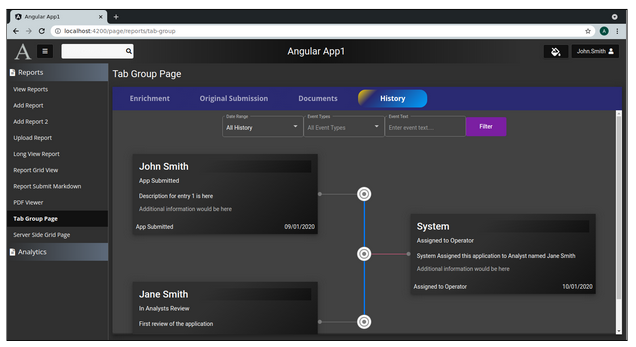
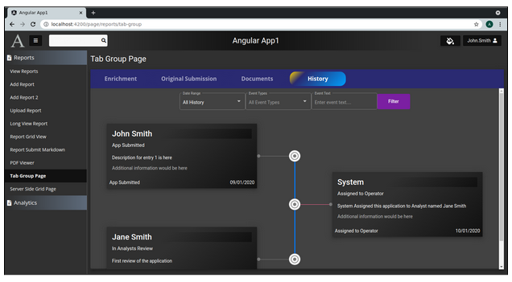

Lesson 27c:  History Page / Add Dark Mode
-----------------------------------------
The Google Drive link is here:<br>
&nbsp;&nbsp;&nbsp;https://docs.google.com/document/d/1cN_geee-C9E6uFn_4Hgb2bq1a2Yik8zye2sO23Z4gv4/edit?usp=sharing
      

The source code for this lesson is here:<br>
&nbsp;&nbsp;&nbsp;https://github.com/traderres/angularApp1Lessons/tree/lesson27c/history/add-dark-mode
<br>
<br>
<br>

<h3> Problem Set </h3>
Problem: I want the timeline to look good in dark mode.<br>
Solution: Have the tab listen for light-mode/dark-mode changes and apply different CSS<BR>



History Tab in Dark Mode

<br>
<br>

```
Procedure
---------
    1. Change the tab-history component so it listens for theme changes
       a. Edit tab-history.component.ts

       b. Make sure the TabHistoryComponent implements OnInit, OnDestroy

       c. Inject the themeService

       d. Add these 2 variables:
              private themeStateSubscription: Subscription;
              public currentTheme: ThemeOptionDTO;


       e. Add these lines to the ngOnInit() so it listens for theme changes

            // Listen for changes from the themeService
            this.themeStateSubscription = this.themeService.getThemeStateAsObservable().subscribe( (aNewTheme: ThemeOptionDTO) => {
                // The theme has changed
                this.currentTheme = aNewTheme;
            });


       f. Update the ngOnDestroy() method so that it will unsubscribe from themeStateSubscription

              public ngOnDestroy(): void {
            
                if (this.themeStateSubscription) {
                    this.themeStateSubscription.unsubscribe();
                }
              }


    2. Change the tab-history.component.html so it changes the CSS based-on the current theme
       a. Edit tab-history.component.html

       b. Erase the top 2 divs to this:

       c. Add these 2 divs
            
            <!-- Wrapper div that adds the "dark" or "light class -->
            <div style="margin-top: 10px"  [ngClass]="{
                    'light':   this.currentTheme.isLightMode == true,
                    'dark':	this.currentTheme.isLightMode == false
             }">
            
                <div class="tab-content">


    3. Add CSS for the light mode and dark mode
       a. Edit tab-history.component.css

       b. Replace its contents with this:
            
            section {
              /* Wrapper tag used to align the "filter" button with the form fields */
              display: flex;
              align-items: flex-start;
            }
            
            section button {
              /* Align the "Filter" button with the form fields */
              margin-top: 0.50em;
              padding: 0.38em	0   0.38em  0;
              width: 100px;
            }
            
            
            
            /******** L I G H T     	M O D E  ***************/
            .light .timeline-card {
              padding: 5px 0 5px 0;
            
              /* Permalink - use to edit and share this gradient: https://colorzilla.com/gradient-editor/#ffffff+20,ffffff+45,009ffd+100 */
              background: #ffffff; /* Old browsers */
              background: -moz-linear-gradient(left,  #ffffff 20%, #ffffff 45%, #009ffd 100%); /* FF3.6-15 */
              background: -webkit-linear-gradient(left,  #ffffff 20%,#ffffff 45%,#009ffd 100%); /* Chrome10-25,Safari5.1-6 */
              background: linear-gradient(to right,  #ffffff 20%,#ffffff 45%,#009ffd 100%); /* W3C, IE10+, FF16+, Chrome26+, Opera12+, Safari7+ */
              filter: progid:DXImageTransform.Microsoft.gradient( startColorstr='#ffffff', endColorstr='#009ffd',GradientType=1 ); /* IE6-9 */
            }
            
            .light mat-card {
              border-radius: 4px;
            }
            
            
            /******** D A R K     	M O D E  ***************/
            .dark .timeline-card {
              padding: 5px 0 5px 0;
            
              /* Permalink - use to edit and share this gradient: https://colorzilla.com/gradient-editor/#303030+20,303030+40,111111+100 */
              background: #303030; /* Old browsers */
              background: -moz-linear-gradient(-45deg,  #303030 20%, #303030 40%, #111111 100%); /* FF3.6-15 */
              background: -webkit-linear-gradient(-45deg,  #303030 20%,#303030 40%,#111111 100%); /* Chrome10-25,Safari5.1-6 */
              background: linear-gradient(135deg,  #303030 20%,#303030 40%,#111111 100%); /* W3C, IE10+, FF16+, Chrome26+, Opera12+, Safari7+ */
              filter: progid:DXImageTransform.Microsoft.gradient( startColorstr='#303030', endColorstr='#111111',GradientType=1 ); /* IE6-9 fallback on horizontal gradient */
            }
            
            .dark mat-card {
              /* Permalink - use to edit and share this gradient:
            https://colorzilla.com/gradient-editor/#303030+20,303030+40,111111+100 */
              background: #303030; /* Old browsers */
              background: -moz-linear-gradient(-45deg,  #303030 20%, #303030 40%, #111111 100%); /* FF3.6-15 */
              background: -webkit-linear-gradient(-45deg,  #303030 20%,#303030 40%,#111111 100%); /* Chrome10-25,Safari5.1-6 */
              background: linear-gradient(135deg,  #303030 20%,#303030 40%,#111111 100%); /* W3C, IE10+, FF16+, Chrome26+, Opera12+, Safari7+ */
              filter: progid:DXImageTransform.Microsoft.gradient( startColorstr='#303030', endColorstr='#111111',GradientType=1 ); /* IE6-9 fallback on horizontal gradient */
            
              border-radius: 0;
            }


    4. Remove the hard-coded background of white on the <mat-card> tag
       a. Edit tab-history.component.html

       b. Change the <mat-card> tag from this:
             <mat-card class="mat-elevation-z6" style="z-index: 20; background: white">
            
          To this:
             <mat-card class="mat-elevation-z6" style="z-index: 20">


    5. Try it out
       a. Activate the debugger on "Full WebApp"
       b. Click on Tab Group Page
       c. Click on the History Tab
       d. Switch from light mode to dark mode
```

```
History Tab in Light Mode


```

```
History Tab in Dark Mode


```
