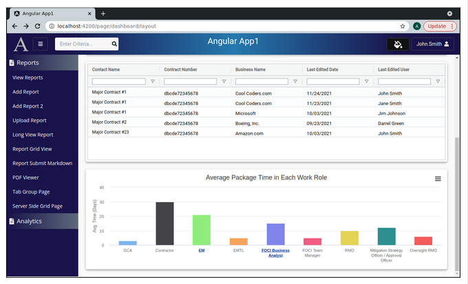

Lesson 28b:  Advanced Dashboard / Drag & Drop Charts and Grids / Separate Components
------------------------------------------------------------------------------------
The Google Drive link is here:<br>
&nbsp;&nbsp;&nbsp;https://docs.google.com/document/d/1tcB5qrjD0kJwNXnve-VGIQFNInaQG5zlS4eMKURE0YY/edit?usp=sharing
      

The source code for this lesson is here:<br>
&nbsp;&nbsp;&nbsp;https://github.com/traderres/angularApp1Lessons/tree/lesson28b/dashboard/drag-and-drop/separate
<br>
<br>
<br>

<h3> Problem Set </h3>
Problem 1:  I want my welcome page to reference separate grid and chart components<br>
    (to reduce the complexity of the welcome.component.ts)<br>
Problem 2: I want the user to double-click on a chart and go to a page with a larger version of the chart


<br>
<br>

```
Approach
--------
    A. Create a separate grid component (to be displayed in the Welcome page)
    B. Create a separate grid page
    C. Create a separate chart component (to be displayed in the Welcome page)
    D. Create a separate chart page
    E. Remove all of the chart and grid stuff from welcome.component.ts
    F. Handle resize events (so charts and grids look good upon resize)


Procedure
---------
    1. Create the empty components 
       a. Create the new dashboard page  (dashboard2)
          unix> cd ~/intellijProjects/angularApp1/frontend
          unix> ng generate component analytics/dashboard2/dashboard-layout --skipTests

       b. Create the client-side grid component (visible in the dashboard page)
          unix> ng generate component analytics/dashboard2/grid-little --skipTests

       c. Create the client-side grid page  (visible on double-click) 
          unix> ng generate component analytics/dashboard2/grid-page --skipTests

       d. Create the bar chart component (visible in the dashboard page)
          unix> ng generate component analytics/dashboard2/bar-chart-little --skipTests

       e. Create the bar chart page  (visible on double-click) 
          unix> ng generate component analytics/dashboard2/bar-chart-page --skipTests

       f. Create the usa-map component (visible in the dashboard)
          unix> ng generate component analytics/dashboard2/usa-map-little --skipTests

       g. Create the usa-map page (visible on double-click)
          unix> ng generate component analytics/dashboard2/usa-map-page --skipTests


       At this point the frontend/src/app/analytics/dashboard2/ directory has 7 directories
          bar-chart-little
          bar-chart-page
          dashboard-layout
          grid-little
          grid-page
          usa-map-little
          usa-map-page


    2. Add routes for the full size page version of the grid
       a. Edit constants.ts

       b. Add these constants:
            
              DASHBOARD_LAYOUT_ROUTE   	= "page/dashboard/layout",
              DASHBOARD_GRID_PAGE      	= "page/dashboard/grid",
              DASHBOARD_BAR_CHART_PAGE 	= "page/dashboard/bar_chart",
              DASHBOARD_USA_MAP_PAGE   	= "page/dashboard/map",


    3. Add security for that route (so that the roles are authorized to see the page)
       a. Edit R__security.sql


       b. Add a uicontrol record for the server side grid page:
            insert into uicontrols(id, name) values(1021, 'page/dashboard/layout');
            insert into uicontrols(id, name) values(1022, 'page/dashboard/grid');
            insert into uicontrols(id, name) values(1023, 'page/dashboard/bar_chart');
            insert into uicontrols(id, name) values(1024, 'page/dashboard/map');


       c. Assign the uicontrols record to the 'admin' role
            insert into roles_uicontrols(role_id, uicontrol_id) values(1, 1021);
            insert into roles_uicontrols(role_id, uicontrol_id) values(1, 1022);
            insert into roles_uicontrols(role_id, uicontrol_id) values(1, 1023);
            insert into roles_uicontrols(role_id, uicontrol_id) values(1, 1024);


       d. Assign the uicontrols record to the 'reader' role
            insert into roles_uicontrols(role_id, uicontrol_id) values(2, 1021);
            insert into roles_uicontrols(role_id, uicontrol_id) values(2, 1022);
            insert into roles_uicontrols(role_id, uicontrol_id) values(2, 1023);
            insert into roles_uicontrols(role_id, uicontrol_id) values(2, 1024);


    4. Change the app.module.ts so that dashboard-layout is the *default* page
       a. Edit app.module.ts


       b. Change this line:
              { path: '',              	component: WelcomeComponent},
            
          To this:
              { path: '',              	component: DashboardLayoutComponent},


       c. Add these paths:
            
              { path: Constants.DASHBOARD_BAR_CHART_PAGE,   component: BarChartPageComponent, canActivate: [PageGuard] },
              { path: Constants.DASHBOARD_USA_MAP_PAGE,   component: UsaMapPageComponent, canActivate: [PageGuard] },
              { path: Constants.DASHBOARD_GRID_PAGE,   component: GridPageComponent,  canActivate: [PageGuard] },
              { path: Constants.DASHBOARD_LAYOUT_ROUTE,   component: DashboardLayoutComponent,  canActivate: [PageGuard] },
            


    5. Setup the layout for the dashboard-welcome page as
```

```

       a. Edit dashboard-layout.component.html

       b. Replace all of the html with this:
            
            <div fxLayout="column" fxLayoutAlign="start stretch" fxLayoutGap="20px">
            
              <div fxLayout="row" fxLayoutAlign="space-between stretch">
                <div fxFlex="50%" fxLayoutAlign="start start">
                <!-- Left Side of Row 1 -->
                Page Title
                </div>
            
                <div fxFlex="50%"  fxLayoutAlign="end start">
                <!-- Right Side of Row 1-->
                Drop Downs
                </div>
              </div>
            
              <div>
                <!-- Row 2 -->
                USA Map
              </div>
            
              <div>
                <!-- Row 3 -->
                Grid
              </div>
            
              <div>
                <!-- Row 4 -->
                Bar Chart
              </div>
            
            </div>


        c. Activate the debugger on "Full WebApp" and verify the page looks like this:
```

```


    6. Add the dropdowns and popup controls
       a. Edit dashboard-layout.component.ts

       b. Change its contents to this:
            
            import { Component, OnInit } from '@angular/core';
            import {FormBuilder, FormControl} from "@angular/forms";
            
            @Component({
              selector: 'app-dashboard-layout',
              templateUrl: './dashboard-layout.component.html',
              styleUrls: ['./dashboard-layout.component.css']
            })
            export class DashboardLayoutComponent implements OnInit {
            
              public selectedVisibleControls: FormControl;
              public listOfVisibleCharts: number[] = [1, 2, 3];
            
              constructor(private formBuilder: FormBuilder) { }
            
              ngOnInit(): void {
                // Create a form control that lists which controls are visible
                this.selectedVisibleControls = this.formBuilder.control(this.listOfVisibleCharts, null);
              }
            
            }


       c. Edit dashboard-layout.component.css

       d. Add these CSS classes:

            /* Removes the extra padding on the top of the form field */
            /* Padding comes from the MAT_FORM_FIELD_DEFAULT_OPTIONS */
            :host  ::ng-deep .mat-form-field-appearance-standard .mat-form-field-flex{
              padding-top: 0 !important;
            }
            
            :host  ::ng-deep .mat-form-field-infix {
              /* Adjust the drop down so it aligns with the "Drag & Drop Mode" button */
              padding-top: 7px !important;
            }
            
            .chart-wrapper {
              border: 1px solid black;
              padding: 15px;
            }


       e. Edit dashboard-layout.component.html

       f. Replace its contents with this:
            
            <div class="page-container">
              <div fxLayout="column" fxLayoutAlign="start stretch" fxLayoutGap="20px">
            
                <div fxLayout="row" fxLayoutAlign="space-between stretch">
                <div fxFlex="50%"  fxLayoutAlign="start start">
                    <!-- Left Side of Row 1 -->
                    <h1 class="mat-h1">Welcome to Angular App1</h1>
                </div>
            
                <div fxFlex="50%"  fxLayoutAlign="end start">
                    <!-- Right Side of Row 1-->
            
            
                    <div>
                    <!-- Popup to change the mode of the page -->
                    <button [matMenuTriggerFor]="menu" mat-raised-button aria-label="Select Drag & Drop Mode" title="Select Drag & Drop Mode"
                            style="width: 150px; margin-top: 5px">
                        Drag & Drop Mode
                    </button>
            
                    <mat-menu #menu="matMenu">
                        <mat-radio-group>
            
                        <button mat-menu-item style="height: fit-content;">
                            <mat-radio-button [value]=10>
                            Enable Chart Drag & Drop
                            </mat-radio-button>
                        </button>
            
                        <button mat-menu-item style="height: fit-content;">
                            <mat-radio-button [value]=11>
                            Enable Grid Column Drag & Drop
                            </mat-radio-button>
                        </button>
                        </mat-radio-group>
            
                    </mat-menu>
                    </div>
            
            
            
                    <!-- Multiple dropdown that sets a list of numbers (which determines which charts/grids are visible -->
                    <mat-form-field style="width: 175px; margin-left: 20px" appearance="standard">
            
                    <!-- Show this label if a user unchecks all charts/grids -->
                    <mat-label *ngIf="this.selectedVisibleControls.value.length == 0">Showing No Charts</mat-label>
            
                    <mat-select multiple [formControl]="this.selectedVisibleControls">
            
                        <mat-option [value]=1>USA Map</mat-option>
                        <mat-option [value]=2>Grid</mat-option>
                        <mat-option [value]=3>Bar Chart</mat-option>
            
                        <!-- Change the visible item to show how many charts/grids are visible -->
                        <mat-select-trigger>
                        <ng-container *ngIf="this.selectedVisibleControls.value.length > 1">Showing {{this.selectedVisibleControls.value.length}} Charts</ng-container>
                        <ng-container *ngIf="this.selectedVisibleControls.value.length == 1">Showing 1 Chart</ng-container>
                        </mat-select-trigger>
                    </mat-select>
                    </mat-form-field>
            
                </div>
                </div>
            
                <div class="chart-wrapper">
                <!-- Row 2 -->
                USA Map
                </div>
            
                <div class="chart-wrapper">
                <!-- Row 3 -->
                Grid
                </div>
            
                <div class="chart-wrapper">
                <!-- Row 4 -->
                Bar Chart
                </div>
            
              </div>
            
            </div>
            


       g. Activate the debugger on "Full WebApp" and verify the page looks like this:
```

```


    7. Place the charts and grids in <mat-card> tags
       a. Edit dashboard-layout.component.html

       b. Replace its contents with this:
            
            <div class="page-container">
              <div fxLayout="column" fxLayoutAlign="start stretch" fxLayoutGap="20px">
            
                <div fxLayout="row" fxLayoutAlign="space-between stretch">
                <div fxFlex="50%"  fxLayoutAlign="start start">
                    <!-- Left Side of Row 1 -->
                    <h1 class="mat-h1">Welcome to Angular App1</h1>
                </div>
            
                <div fxFlex="50%"  fxLayoutAlign="end start">
                    <!-- Right Side of Row 1-->
            
            
                    <div>
                    <!-- Popup to change the mode of the page -->
                    <button [matMenuTriggerFor]="menu" mat-raised-button aria-label="Select Drag & Drop Mode" title="Select Drag & Drop Mode"
                            style="width: 150px; margin-top: 5px">
                        Drag & Drop Mode
                    </button>
            
                    <mat-menu #menu="matMenu">
                        <mat-radio-group>
            
                        <button mat-menu-item style="height: fit-content;">
                            <mat-radio-button [value]=10>
                            Enable Chart Drag & Drop
                            </mat-radio-button>
                        </button>
            
                        <button mat-menu-item style="height: fit-content;">
                            <mat-radio-button [value]=11>
                            Enable Grid Column Drag & Drop
                            </mat-radio-button>
                        </button>
            
                        </mat-radio-group>
            
                    </mat-menu>
                    </div>
            
            
            
                    <!-- Multiple dropdown that sets a list of numbers (which determines which charts/grids are visible -->
                    <mat-form-field style="width: 175px; margin-left: 20px" appearance="standard">
            
                    <!-- Show this label if a user unchecks all charts/grids -->
                    <mat-label *ngIf="this.selectedVisibleControls.value.length == 0">Showing No Charts</mat-label>
            
                    <mat-select multiple [formControl]="this.selectedVisibleControls">
            
                        <mat-option [value]=1>USA Map</mat-option>
                        <mat-option [value]=2>Grid</mat-option>
                        <mat-option [value]=3>Bar Chart</mat-option>
            
                        <!-- Change the visible item to show how many charst/grids are visible -->
                        <mat-select-trigger>
                        <ng-container *ngIf="this.selectedVisibleControls.value.length > 1">Showing {{this.selectedVisibleControls.value.length}} Charts</ng-container>
                        <ng-container *ngIf="this.selectedVisibleControls.value.length == 1">Showing 1 Chart</ng-container>
                        </mat-select-trigger>
                    </mat-select>
                    </mat-form-field>
            
                </div>
            
                </div>
            
                <mat-card class="mat-elevation-z4">
                <mat-card-content>
                    <!-- Row 2 -->
                    USA Map
                </mat-card-content>
                </mat-card>
            
            
                <mat-card class="mat-elevation-z4">
                <mat-card-content>
                    <!-- Row 3 -->
                    Grid
                </mat-card-content>
                </mat-card>
            
            
                <mat-card class="mat-elevation-z4">
                <mat-card-content>
                    <!-- Row 4 -->
                    <div style="width: 100%; height: 100%;">
                    Bar Chart
                    </div>
                </mat-card-content>
                </mat-card>
            
              </div>
            
            </div>
            


        c. Activate the debugger on "Full WebApp" and verify the page looks like this:
```

```


    8. Add a for loop so that the <mat-card> tags are created dynamically
       a. Edit dashboard-layout.component.css

       b. Replace its contents with this
          NOTE:  We updated .chart-content and added the mat-card class
            
            /* Removes the extra padding on the top of the form field */
            /* Padding comes from the MAT_FORM_FIELD_DEFAULT_OPTIONS */
            :host  ::ng-deep .mat-form-field-appearance-standard .mat-form-field-flex{
              padding-top: 0 !important;
            }
            
            :host  ::ng-deep .mat-form-field-infix {
              /* Adjust the drop down so it aligns with the "Drag & Drop Mode" button */
              padding-top: 7px !important;
            }
            
            .chart-content {
              height: 100% !important;	/* Needed to ensure the chart fills uses all of the height */
            }
            
            mat-card {
              /* Set spacing between cards */
              position: absolute;
              top: 10px;
              left: 10px;
              right: 10px;
              bottom: 10px;
              overflow: hidden; /* Removing the vertical scroll bar */
            
              padding: 5px;    /* Reduce the padding so the chart uses-up more space in the card */
            }


        c. Edit dashboard-layout.component.html

        d. Replace its contents with this:
            
            <div class="page-container">
              <div fxLayout="column" fxLayoutAlign="start stretch" fxLayoutGap="20px">
            
                <div fxLayout="row" fxLayoutAlign="space-between stretch">
                <div fxFlex="50%"  fxLayoutAlign="start start">
                    <!-- Left Side of Row 1 -->
                    <h1 class="mat-h1">Welcome to Angular App1</h1>
                </div>
            
                <div fxFlex="50%"  fxLayoutAlign="end start">
                    <!-- Right Side of Row 1-->
            
            
                    <div>
                    <!-- Popup to change the mode of the page -->
                    <button [matMenuTriggerFor]="menu" mat-raised-button aria-label="Select Drag & Drop Mode" title="Select Drag & Drop Mode"
                            style="width: 150px; margin-top: 5px">
                        Drag & Drop Mode
                    </button>
            
                    <mat-menu #menu="matMenu">
                        <mat-radio-group>
            
                        <button mat-menu-item style="height: fit-content;">
                            <mat-radio-button [value]=10>
                            Enable Chart Drag & Drop
                            </mat-radio-button>
                        </button>
            
                        <button mat-menu-item style="height: fit-content;">
                            <mat-radio-button [value]=11>
                            Enable Grid Column Drag & Drop
                            </mat-radio-button>
                        </button>
            
                        </mat-radio-group>
            
                    </mat-menu>
                    </div>
            
            
                    <!-- Multiple dropdown that sets a list of numbers (which determines which charts/grids are visible -->
                    <mat-form-field style="width: 175px; margin-left: 20px" appearance="standard">
            
                    <!-- Show this label if a user unchecks all charts/grids -->
                    <mat-label *ngIf="this.selectedVisibleControls.value.length == 0">Showing No Charts</mat-label>
            
                    <mat-select multiple [formControl]="this.selectedVisibleControls">
            
                        <mat-option [value]=1>USA Map</mat-option>
                        <mat-option [value]=2>Grid</mat-option>
                        <mat-option [value]=3>Bar Chart</mat-option>
            
                        <!-- Change the visible item to show how many charts/grids are visible -->
                        <mat-select-trigger>
                        <ng-container *ngIf="this.selectedVisibleControls.value.length > 1">Showing {{this.selectedVisibleControls.value.length}} Charts</ng-container>
                        <ng-container *ngIf="this.selectedVisibleControls.value.length == 1">Showing 1 Chart</ng-container>
                        </mat-select-trigger>
                    </mat-select>
                    </mat-form-field>
            
                </div>
            
                </div>
            
              </div>
            
             
              <mat-grid-list [cols]=1 [rowHeight]=400>
                <mat-grid-tile [colspan]=1 [rowspan]=1 
                                *ngFor="let chartType of this.listOfVisibleCharts">
            
                <mat-card class="mat-elevation-z4">
                    <mat-card-content class="chart-content">
            
                    <div style="width: 100%; height: 100%" *ngIf="chartType == 1">
                        <!-- This is chartType==1.  So, show the "USA Map" -->
                        USA Map
                    </div>
            
                    <div style="width: 100%; height: 100%" *ngIf="chartType == 2">
                        <!-- This is chartType==2.  So, show the "Grid" -->
                        Grid
                    </div>
            
                    <div style="width: 100%; height: 100%" *ngIf="chartType == 3">
                        <!-- This is chartType==3.  So, show the "Bar Chart" -->
                        Bar Chart
                    </div>
            
                    </mat-card-content>
                </mat-card>
            
                </mat-grid-tile>
              </mat-grid-list>
            
            </div>


       e. Activate the debugger on "Full WebApp" and verify the page looks like this:
```

```
NOTE:  The chart height is set by the [rowHeight]=400 in the <mat-grid-list> tag


    9. Add drag & drop to the mat-card tags
       a. Edit app.module.ts

       b. Add DragDropModule to the imports section

       c. Verify that this import is present at the top:
             import { DragDropModule } from '@angular/cdk/drag-drop';


       d. Edit dashboard-layout.component.ts

       e. Change its contents to this:
            
            import {Component, OnDestroy, OnInit} from '@angular/core';
            import {FormBuilder, FormControl} from "@angular/forms";
            import {CdkDragDrop, moveItemInArray} from "@angular/cdk/drag-drop";
            import {Subscription} from "rxjs";
            
            @Component({
              selector: 'app-dashboard-layout',
              templateUrl: './dashboard-layout.component.html',
              styleUrls: ['./dashboard-layout.component.css']
            })
            export class DashboardLayoutComponent implements OnInit, OnDestroy {
              public selectedVisibleControls: FormControl;
              public listOfVisibleCharts: number[] = [1, 2, 3];
              private selectedVisibleControlsSubscription: Subscription;
            
              constructor(private formBuilder: FormBuilder) { }
            
              public ngOnInit(): void {
                // Create a form control that lists which controls are visible
                this.selectedVisibleControls = this.formBuilder.control(this.listOfVisibleCharts, null);
            
                this.selectedVisibleControlsSubscription = this.selectedVisibleControls.valueChanges.subscribe((arrayOfSelectedValues: number[]) => {
                    // User selected some values in the multi-select dropdown
                
                    // Tell the *ngFor loop to re-render the components
                    //   1) set the listOfVisibleCharts to be empty
                    //   2) use setTimeout to set the listOfVisibleCharts to hold the new array
                    //  	This causes components to be re-rendered in the updated *ngFor loop
                    this.listOfVisibleCharts = [ ];
                    setTimeout( () => {
                            this.listOfVisibleCharts = arrayOfSelectedValues;
                    });
            
                })
              }


            
              public ngOnDestroy(): void {
                if (this.selectedVisibleControlsSubscription) {
                this.selectedVisibleControlsSubscription.unsubscribe();
                }
              }
            
            
              public drop(aEvent: CdkDragDrop<number[]>) {
                // Re-order the array
                moveItemInArray(this.listOfVisibleCharts, aEvent.previousIndex, aEvent.currentIndex);
              }
            
            }


       f. Edit dashboard-layout.component.html

            i. Change the <mat-grid-list> opening tag to this:
                	<mat-grid-list [cols]=1 rowHeight="400px" 
                              cdkDropList (cdkDropListDropped)="this.drop($event)">

            ii. Change the <mat-grid-tile> opening tag to this:
	                <mat-grid-tile [colspan]=1 [rowspan]=1 *ngFor="let chartType of this.listOfVisibleCharts"
               	        cdkDrag>


       g. Activate the debugger on "Full WebApp" and verify the page now lets you drag & drop:
```

```
NOTE:  We can now drag & drop these large <mat-card> tags up and down


    10. Add logic to turn on/off drag & drop and add an existing page for grid 1
        a. Edit dashboard-layout.component.ts

        b. Add this public boolean:
              public disableGridDragDrop: boolean = false;

        c. Add this public method:

              public userChangedDragAndDropMode(aNewDragMode: number) {
                if (aNewDragMode == 10) {
                // User selected to enable chart drag & drop
                this.disableGridDragDrop = false;
                }
                else if (aNewDragMode == 11) {
                // User selected to enable Grid drag & drop  (so disable the cdk drag and drop)
                this.disableGridDragDrop = true;
                }
              }


        d. Edit dashboard-layout.component.html

            i. Change the radio group so it calls this method on click:
                
                <mat-radio-group>
                  <button mat-menu-item style="height: fit-content;">
                    <mat-radio-button  [value]=10
                                 (click)="this.userChangedDragAndDropMode(10)" 
                                [checked]="this.disableGridDragDrop == false">
                    Enable Chart Drag & Drop
                    </mat-radio-button>
                  </button>
                
                  <button mat-menu-item style="height: fit-content;">
                    <mat-radio-button  [value]=11 
                                (click)="this.userChangedDragAndDropMode(11)" 
                                 [checked]="this.disableGridDragDrop == true">
                    Enable Grid Column Drag & Drop
                    </mat-radio-button>
                  </button>
                </mat-radio-group>

            ii. Change the <mat-grid-tile> to this:
                
                 <mat-grid-tile [colspan]=1 [rowspan]=1 *ngFor="let chartType of this.listOfVisibleCharts"
                                cdkDrag [cdkDragDisabled]="this.disableGridDragDrop">


    11. Add the empty components to the layout
        a. Edit dashboard-layout.component.html

        b. Change rowHeight="400px" to rowHeight="300px"

        c. Change this section:
                <div style="width: 100%; height: 100%" *ngIf="chartType == 1">
                        <!-- This is chartType==1.  So, show the "USA Map" -->
                        USA Map
                </div>
        
                <div style="width: 100%; height: 100%" *ngIf="chartType == 2">
                        <!-- This is chartType==2.  So, show the "Grid" -->
                        Grid
                </div>
        
                <div style="width: 100%; height: 100%" *ngIf="chartType == 3">
                        <!-- This is chartType==3.  So, show the "Bar Chart" -->
                        Bar Chart
                </div>
            
           To this:
                <div style="width: 100%; height: 100%" *ngIf="chartType == 1">
                        <!-- This is chartType==1.  So, show the "USA Map" -->
                        <app-usa-map-little></app-usa-map-little>
                </div>
        
                <div style="width: 100%; height: 100%" *ngIf="chartType == 2">
                        <!-- This is chartType==2.  So, show the "Grid" -->
                        <app-grid-little></app-grid-little>
                </div>
        
                <div style="width: 100%; height: 100%" *ngIf="chartType == 3">
                        <!-- This is chartType==3.  So, show the "Bar Chart" -->
                        <app-bar-chart-little></app-bar-chart-little>
                </div>


        d. Activate the debugger on "Full WebApp" and verify the page now lets you drag & drop:
```

```
NOTE:  The drag & drop only works when the "Drag & Drop Mode" is set on the 1st option


    12. For the Grid, add a fake DashboardService method (that simulates the REST call)
        a. Add this model class:  dashboard-grid-row-dto
           unix> cd ~/intellijProjects/angularApp1/frontend
           unix> ng generate class models/dashboard-grid-row-dto --skipTests

        b. Edit dashboard-grid-row-dto.ts

        c. Replace its contents with this:
            
            export class GcaGridRowDTO {
              public id: number;
              public contractName: string;
              public contractNumber: string;
              public businessName: string;
              public lastEditedDate: string;
              public lastEditedFullName: string;
            }


        d. Edit dashboard.service.ts

        e. Add this public method:
            
              public getGridData(): Observable<DashboardGridRowDTO[]> {
                let data: DashboardGridRowDTO[] = [
                {
                    id: 1,
                    contractName: 'Major Contract #1',
                    contractNumber: 'dbcde72345678',
                    businessName: 'Cool Coders.com',
                    lastEditedDate: '11/24/2021',
                    lastEditedFullName: 'John Smith'
                },
                {
                    id: 2,
                    contractName: 'Major Contract #1',
                    contractNumber: 'dbcde72345678',
                    businessName: 'Cool Coders.com',
                    lastEditedDate: '11/23/2021',
                    lastEditedFullName: 'Jane Smith'
                },
                {
                    id: 3,
                    contractName: 'Major Contract #1',
                    contractNumber: 'dbcde72345678',
                    businessName: 'Microsoft',
                    lastEditedDate: '10/03/2021',
                    lastEditedFullName: 'Jim Johnson'
                },
                {
                    id: 4,
                    contractName: 'Major Contract #2',
                    contractNumber: 'dbcde72345678',
                    businessName: 'Boeing, Inc.',
                    lastEditedDate: '09/23/2021',
                    lastEditedFullName: 'Darrel Green'
                },
                {
                    id: 5,
                    contractName: 'Major Contract #23',
                    contractNumber: 'dbcde72345678',
                    businessName: 'Amazon.com',
                    lastEditedDate: '10/03/2021',
                    lastEditedFullName: 'John Smith'
                },
            
                ];
            
                return of(data);
              }


    13. Fill-in the little grid component
        a. Add the "ag-theme-balham" theme to the project
            i. grid Edit angular.json

            ii. Change the "architect" -> "build" -> "styles" so it has this new entry [in bold]

                "styles": [
                    "./node_modules/@fortawesome/fontawesome-free/css/all.css",
                    "./node_modules/ag-grid-community/dist/styles/ag-grid.css",
                    "./node_modules/ag-grid-community/dist/styles/ag-theme-balham.css",
                    "./node_modules/ag-grid-community/dist/styles/ag-theme-alpine.css",
                    "./node_modules/ag-grid-community/dist/styles/ag-theme-alpine-dark.css",
                    "./node_modules/quill/dist/quill.core.css",
                    "./node_modules/quill/dist/quill.bubble.css",
                    "./node_modules/quill/dist/quill.snow.css",
                    "./node_modules/quill-emoji/dist/quill-emoji.css",
                    "./node_modules/quill-mention/dist/quill.mention.min.css",
                    "src/styles.css"
                ],


        b. Edit  grid-little.component.ts

        c. Replace its contents with this:
            
            import {Component, OnDestroy, OnInit} from '@angular/core';
            import {ColumnApi, GridApi, GridOptions} from "ag-grid-community";
            import {DashboardGridRowDTO} from "../../../models/dashboard-grid-row-dto";
            import {Router} from "@angular/router";
            import {DashboardService} from "../../../services/dashboard.service";
            import {Constants} from "../../../utilities/constants";
            
            
            @Component({
              selector: 'app-grid-little',
              templateUrl: './grid-little.component.html',
              styleUrls: ['./grid-little.component.css']
            })
            export class GridLittleComponent implements OnInit, OnDestroy {
            
              private gridApi: GridApi;
              private gridColumnApi: ColumnApi;
              public  rowData: DashboardGridRowDTO[];
            
            
              private textFilterParams = {
                filterOptions: ['contains', 'notContains'],
                caseSensitive: false,
                debounceMs: 100,
                suppressAndOrCondition: true,
              };
            
            
              public gridOptions: GridOptions = {
                overlayLoadingTemplate:
                '<span class="ag-overlay-loading-center">Loading data now...</span>',
            
                pagination: false,
                paginationPageSize: 100,
                rowGroupPanelShow: 'never',   // Possible options are 'never', 'always', and 'onlyWhenGrouping'
                suppressRowHoverHighlight: false,
                debug: false,
                masterDetail: false,
                suppressCellSelection: true,
                domLayout: 'normal'
              }
            
            
              public defaultColDefs: any = {
                flex: 1,
                sortable: true,
                filter: true,
                floatingFilter: true,	// Causes the filter row to appear below column names
                wrapText: true,
                resizable: true,
                autoHeight: true
              };
            
              public columnDefs = [
                {
                field: 'contractName',
                minWidth: 200,
                headerName: 'Contact Name',
                filter: 'agTextColumnFilter',
                filterParams: this.textFilterParams,
                },
                {
                field: 'contractNumber',
                minWidth: 130,
                headerName: 'Contract Number',
                cellClass: 'grid-text-cell-format',
                filter: 'agTextColumnFilter',
                filterParams: this.textFilterParams,
                },
                {
                field: 'businessName',
                minWidth: 150,
                headerName: 'Business Name',
                cellClass: 'grid-text-cell-format',
                filter: 'agTextColumnFilter',
                filterParams: this.textFilterParams,
                },
                {
                field: 'lastEditedDate',
                minWidth: 150,
                headerName: 'Last Edited Date',
                cellClass: 'grid-text-cell-format',
                filter: 'agTextColumnFilter',
                filterParams: this.textFilterParams,
                },
                {
                field: 'lastEditedFullName',
                minWidth: 150,
                headerName: 'Last Edited User',
                cellClass: 'grid-text-cell-format',
                filter: 'agTextColumnFilter',
                filterParams: this.textFilterParams,
                },
              ];
            
              constructor(private router: Router,
                        private dashboardService: DashboardService) { }
            
            
              public ngOnInit(): void {
            
              }
             
            
            
              public ngOnDestroy(): void {
              }
            
              /*
               * The grid is ready.  So, perform grid initialization here:
               *  1) Invoke the REST call to get grid preferences
               *  2) When the REST call returns
               * 	a) Invoke the REST call to get data
               * 	b) Set preferences in the grid (if there are any)
               */
              public onGridReady(params: any): void {
                // Get a reference to the gridApi and gridColumnApi
                this.gridApi = params.api;
                this.gridColumnApi = params.columnApi;
            
                this.reloadPage();
              }
            
            
              private reloadPage(): void {
                // Show the loading overlay
                this.gridApi.showLoadingOverlay();
            
                // Invoke a REST call to get data for the initial page load
                this.dashboardService.getGridData().subscribe((aData: DashboardGridRowDTO[]) => {
                // We got row data from the REST call
            
                // Put the data into the grid
                this.rowData = aData;
            
                // We did not get any column state on page load.  So, resize the columns to fit
                this.gridApi.sizeColumnsToFit();
                });
              }
            
            
              public goToFullSizePage() {
                this.router.navigate( [Constants.DASHBOARD_GRID_PAGE] ).then();
              }
            }
            
            


        d. Edit grid-little.component.html

        e. Replace its contents with this:
            
            <ag-grid-angular
              style="width: 100%; height: 100%; border-radius: 3px"
              (dblclick)="this.goToFullSizePage()"
              class="ag-theme-balham"
              [rowData]="this.rowData"
              [gridOptions]="this.gridOptions"
              [defaultColDef]="this.defaultColDefs"
              [columnDefs]="this.columnDefs"
              (gridReady)="this.onGridReady($event)">
            </ag-grid-angular>


        f. Activate the debugger on "Full WebApp" and verify the grid appears in the dashboard
```

```
You should be able to drag & drop the dashboard up and down
Press Drag & Drop Mode -> Enable Grid Column Drag & Drop
-- Now, you should be able to drag & drop columns left and right
If you double-click on the little grid, it should take you to the big grid
(which is an empty page)


    14. Fill in the Big Grid Page (and add breadcrumbs back to the dashboard page)
        a. Edit grid.page.component.ts

        b. Replace its contents with this
            
            import {Component, OnDestroy, OnInit} from '@angular/core';
            import {ColumnApi, GridApi, GridOptions} from "ag-grid-community";
            import {DashboardService} from "../../../services/dashboard.service";
            import {Router} from "@angular/router";
            import {DashboardGridRowDTO} from "../../../models/dashboard-grid-row-dto";
            import {Constants} from "../../../utilities/constants";
            
            
            @Component({
              selector: 'app-grid-page',
              templateUrl: './grid-page.component.html',
              styleUrls: ['./grid-page.component.css']
            })
            export class GridPageComponent implements OnInit, OnDestroy {
            
              private gridApi: GridApi;
              private gridColumnApi: ColumnApi;
              public  rowData: DashboardGridRowDTO[];
            
            
              private textFilterParams = {
                filterOptions: ['contains', 'notContains'],
                caseSensitive: false,
                debounceMs: 100,
                suppressAndOrCondition: true,
              };
            
            
              public gridOptions: GridOptions = {
                overlayLoadingTemplate:
                '<span class="ag-overlay-loading-center">Loading data now...</span>',
            
                pagination: false,
                paginationPageSize: 100,
                rowGroupPanelShow: 'never',   // Possible options are 'never', 'always', and 'onlyWhenGrouping'
                suppressRowHoverHighlight: false,
                debug: false,
                masterDetail: false,
                suppressCellSelection: true,
                domLayout: 'normal'
              }
            
            
              public defaultColDefs: any = {
                flex: 1,
                sortable: true,
                filter: true,
                floatingFilter: true,	// Causes the filter row to appear below column names
                wrapText: true,
                resizable: true,
                autoHeight: true
              };
            
              public columnDefs = [
                {
                field: 'contractName',
                minWidth: 200,
                headerName: 'Contact Name',
                filter: 'agTextColumnFilter',
                filterParams: this.textFilterParams,
                },
                {
                field: 'contractNumber',
                minWidth: 130,
                headerName: 'Contract Number',
                cellClass: 'grid-text-cell-format',
                filter: 'agTextColumnFilter',
                filterParams: this.textFilterParams,
                },
                {
                field: 'businessName',
                minWidth: 150,
                headerName: 'Business Name',
                cellClass: 'grid-text-cell-format',
                filter: 'agTextColumnFilter',
                filterParams: this.textFilterParams,
                },
                {
                field: 'lastEditedDate',
                minWidth: 150,
                headerName: 'Last Edited Date',
                cellClass: 'grid-text-cell-format',
                filter: 'agTextColumnFilter',
                filterParams: this.textFilterParams,
                },
                {
                field: 'lastEditedFullName',
                minWidth: 150,
                headerName: 'Last Edited User',
                cellClass: 'grid-text-cell-format',
                filter: 'agTextColumnFilter',
                filterParams: this.textFilterParams,
                },
            
              ];
            
              constructor(private router: Router,
                        private dashboardService: DashboardService) { }
            
            
              public ngOnInit(): void {
              }
            
            
            
              public ngOnDestroy(): void {
              }
            
              /*
               * The grid is ready.  So, perform grid initialization here:
               *  1) Invoke the REST call to get grid preferences
               *  2) When the REST call returns
               * 	a) Invoke the REST call to get data
               * 	b) Set preferences in the grid (if there are any)
               */
              public onGridReady(params: any): void {
                // Get a reference to the gridApi and gridColumnApi
                this.gridApi = params.api;
                this.gridColumnApi = params.columnApi;
            
                this.reloadPage();
              }
            
            
              private reloadPage(): void {
                // Show the loading overlay
                this.gridApi.showLoadingOverlay();
            
                // Invoke a REST call to get data for the initial page load
                this.dashboardService.getGridData().subscribe((aData: DashboardGridRowDTO[]) => {
                // We got row data from the REST call
            
                // Put the data into the grid
                this.rowData = aData;
            
                // We did not get any column state on page load.  So, resize the columns to fit
                this.gridApi.sizeColumnsToFit();
                });
              }
            
              /*
               * Add this public get method so that we can reference constants in the HTML template
               */
              public get constants(): typeof Constants {
                // Get a reference to the enumerated object
                // -- This is needed so that the html page can use the enum class
                return Constants;
              }
            
            }
            


        c. Edit grid.page.component.html

        d. Replace its contents with this
                
                <div class="page-container">
                
                  <div fxFlexFill fxLayout="column">
                
                    <div fxFlex fxLayout="row" fxLayoutGap="0">
                
                    <!-- Left Side of the Top Row -->
                    <div fxFlex fxLayoutAlign="left center" fxLayout="row" fxLayoutGap="0">
                
                        <div fxLayout="column">
                        <div>
                            <!-- Page Title -->
                            <h1 class="mat-h1 nowrap" style="margin-bottom: 0">Grid Page</h1>
                        </div>
                
                        <div class="breadcrumbs" style="margin-left: 20px">
                            <!-- Bread Crumbs -->
                            <a class="breadcrumbs_current_page" [routerLink]="'/' + constants.DASHBOARD_LAYOUT_ROUTE" title="Dashboard">Dashboard</a> >
                            <span class="breadcrumbs_current_page">Grid Page</span>
                        </div>
                
                        <!-- Divider -->
                        <div style="height: 15px"></div>
                
                        </div>
                
                    </div>
                
                
                    <!-- Right Side of the Top Row -->
                    <div fxFlex fxLayoutAlign="end center">
                
                    </div>
                
                    </div>  <!-- End of top row -->
                
                
                    <!-- Start of the second row -->
                    <div fxFlex  fxLayout="column" fxLayoutGap="0">
                
                    <mat-card class="mat-elevation-z4">
                        <mat-card-content>
                
                        <!-- Setup a wrapper div that uses the entire available height (total height - 147px) -->
                        <div style="height: calc(100vh - 147px);">
                
                            <!-- Grid -->
                            <ag-grid-angular
                            style="width: 100%; height: 100%; border-radius: 3px"
                            class="ag-theme-alpine"
                            [rowData]="this.rowData"
                            [gridOptions]="this.gridOptions"
                            [defaultColDef]="this.defaultColDefs"
                            [columnDefs]="this.columnDefs"
                            (gridReady)="this.onGridReady($event)">
                            </ag-grid-angular>
                
                        </div>
                
                        </mat-card-content>
                    </mat-card>
                
                    </div> <!-- End of 2nd row -->
                
                  </div> <!-- End of Angular flex column -->
                
                </div>  <!-- End of grid container -->


        e. Edit grid-page.component.css

        f. Replace its contents with this:
            
            mat-card {
              /* Reduce the padding around the card so we do not have a double border around the grid */
              padding: 0;
            }


    15. Verify that the "big grid" page looks good
        a. Activate the Debugger on Full WebApp
        b. Double-click on the small grid (in the dashboard)
        c. You should see this page
```

```


    16. For the Bar Chart, add a fake DashboardService method (that simulates the REST call)
        a. Add this model class:  dashboard-grid-row-dto
           unix> cd ~/intellijProjects/angularApp1/frontend
           unix> ng generate class models/BarChartDTO --skipTests

        b. Edit bar-chart-dto.ts

        c. Replace its contents with this:
                
                export class BarChartDTO {
                  public chartData: any;
                  public drillDownData: any;
                }


        d. Edit dashboard.service.ts

        e. Add this public method:

              public getBarChartData(): Observable<BarChartDTO> {
                let data: BarChartDTO = new BarChartDTO();
            
                data.chartData = [{
                name: 'Average Package Time in Each Work Role', 	 // Named used for the "Back to <>" when drilled-in
                colorByPoint: true,
                data: [{
                    name: 'GCA',
                    y: 3
                }, {
                    name: 'Contractor',
                    y: 30
                }, {
                    name: 'EM',
                    y: 21,
                    drilldown: 'emAnalysts'
                }, {
                    name: 'EMTL',
                    y: 5
                }, {
                    name: 'FOCI Business Analyst',
                    y: 15,
                    drilldown: 'fociAnalysts'
                }, {
                    name: 'FOCI Team Manager',
                    y: 5,
                }, {
                    name: 'RMO',
                    y: 10,
                }, {
                    name: 'Mitigation Strategy Officer / Approval Officer',
                    y: 12,
                }, {
                    name: 'Oversight RMO',
                    y: 6,
                }]
                }];
            
                data.drillDownData = {
                series: [{
                    id: 'emAnalysts',
                    data: [
                    {
                        name: 'John Smith',
                        y: 30
                    },
                    {
                        name: 'Dave Lewis',
                        y: 21
                    },
                    {
                        name: 'Carl Johnson',
                        y: 40
                    },
                    {
                        name: 'Steve Young',
                        y: 15
                    }
                    ]
                }, {
                    id: 'fociAnalysts',
                    data: [
                    ['Nick Foles', 13],
                    ['Blake Bortles', 15],
                    ['Daniel Jones', 8]
                    ]
                }]
                };
            
                return of(data);
              }  // end of getBarChartData()


    17. Fill-in the little bar chart component
        a. Edit bar-chart-little.component.ts

        b. Replace its contents with this:
            
            import {AfterViewInit, Component, ElementRef, OnInit, ViewChild} from '@angular/core';
            import {DashboardService} from "../../../services/dashboard.service";
            import {Router} from "@angular/router";
            import {BarChartDTO} from "../../../models/bar-chart-dto";
            import {Chart} from "highcharts";
            import {Constants} from "../../../utilities/constants";
            import * as Highcharts from "highcharts";
            
            window.Highcharts = Highcharts;
            
            // Turn on the highchart context menu view/print/download options
            import HC_exporting from "highcharts/modules/exporting";
            HC_exporting(Highcharts);
            
            // Turn on the highchart context menu *export* options
            // NOTE:  This provides these menu options: Download CSV, Download XLS, View Data Table
            import HC_exportData from "highcharts/modules/export-data";
            HC_exportData(Highcharts);
            
            // Do client-side exporting (so that the exporting does *NOT* go to https://export.highcharts.com/
            // NOTE:  This does not work on all web browsers
            import HC_offlineExport from "highcharts/modules/offline-exporting";
            HC_offlineExport(Highcharts);
            
            // Turn on the drill-down capabilities
            import HC_drillDown from "highcharts/modules/drilldown";
            HC_drillDown(Highcharts);
            
            
            @Component({
              selector: 'app-bar-chart-little',
              templateUrl: './bar-chart-little.component.html',
              styleUrls: ['./bar-chart-little.component.css']
            })
            export class BarChartLittleComponent implements OnInit, AfterViewInit {
              @ViewChild('myChart') myChartDiv: ElementRef;
            
              private chart: Chart;
            
              constructor(private dashboardService: DashboardService,
                        private router: Router) { }
            
            
              public ngOnInit(): void {
            
                // Set options for all highchart menus on this page
                Highcharts.setOptions( {
                lang: {
                    thousandsSep: ','    // Set the thousand separator as a comma
                }
                });
            
              }  // end of ngOnInit()
            
            
            
              /*
               * The HTML div exists.  Now we can render the chart
               */
              public ngAfterViewInit(): void {
                this.reloadPage();
              }
            
            
            
              private reloadPage(): void {
                // Run this code in setInterval() so the code is executed after angular does a refresh
                // NOTE:  The 1 ms number doesn't matter as it will only run once
                let intervalFunction = setTimeout(() => {
            
                if (this.myChartDiv != undefined) {
                    // The chart div HTML exists.  So, now we can tell Highcharts to rener (as the div actually exists
            
                    // Invoke a REST call to get data for the initial page load
                    this.dashboardService.getBarChartData().subscribe((aData: BarChartDTO) => {
                    // We got row data from the REST call
            
                    this.chartOptions.series = aData.chartData;
                    this.chartOptions.drilldown = aData.drillDownData;
            
                    if (this.chart != undefined) {
                        // Destroy the existing chart
                        this.chart.destroy();
                    }
            
                    // Render the chart
                    this.chart = Highcharts.chart('barChart1', this.chartOptions);
            
                    // Resize the chart to fit its container
                    this.chart.reflow();
                    });
            
                    // Charts are rendered.  So, stop the interval
                    clearInterval(intervalFunction);
                }
            
                }, 1);  // end of setTimeout()
            
              }  // end of reloadPage()
            
            
            
              public goToFullSizePage(): void {
                this.router.navigate( [Constants.DASHBOARD_BAR_CHART_PAGE] ).then();
              }
            
            
              private chartOptions: any = {
                chart: {
                type: 'column',
                displayErrors: true
                },
                credits: {
                enabled: false   	 // Hide the highcharts.com label
                },
                title: {
                text: 'Average Package Time in Each Work Role'
                },
                xAxis: {
                type: 'category'
                },
                yAxis: {
                min: 0,
                title: {
                    text: 'Avg. Time (Days)'
                }
                },
                lang: {
                drillUpText: ' Go Back'
                },
                legend: {
                enabled: false
                },
                plotOptions: {
                series: {
                    borderWidth: 0,
                    dataLabels: {
                    enabled: false
                    }
                }
                },
                exporting: {
                buttons: {
                    contextButton: {
                    menuItems: [
                        'viewFullscreen',
                        'separator',
                        'downloadPNG',
                        'downloadJPEG',
                        'downloadPDF',
                        'downloadSVG',
                        'separator',
                        'downloadCSV',
                        'downloadXLS'
                    ]
                    }
                }
                }
              };
            
            }


        c. Edit bar-chart-little.component.html

        d. Replace its contents with this:

            <div style="width: 100%; height: 100%" id="barChart1"
                 (dblclick)="this.goToFullSizePage()" #myChart>
            </div>
            


    18. Verify that the "big grid" page looks good
        a. Activate the Debugger on Full WebApp
        b. Verify that the bar chart appears
        c. Verify that double-clicking on the chart takes you to the (empty) big chart page
```

```


    19. Problem:  The charts and grid do not resize when the navbar is opened/closed
        Solution:  Have the Dashboard Layout Page listen for navbar changes and refresh the grids/charts
        
        a. Edit dashboard-layout.component.ts

        b. Add these class variables:
            
              private navbarSubscription: Subscription;
              private contentIsInitialized: boolean = false;
              public  showGrid: boolean = true;


        c. Inject the navbarService into the constructor

              constructor(private formBuilder: FormBuilder,
                        private navbarService: NavbarService) { }


        d. Change the ngOnInit() so it listens for navbar opening/closings:

            this.navbarSubscription = this.navbarService.getNavbarStateAsObservable().subscribe( () => {
                // Left Side navbar was opened or closed.
                if (this.contentIsInitialized) {
                        this.resizeChartsToFitContainers();
                        this.initializeGridsToFitContainers();
                }
            });


        e. Make sure the class implements AfterViewInit


        f. Add this ngAfterViewInit() public method:
            
              public ngAfterViewInit(): void {
                this.contentIsInitialized=true;
              }


        g. Adjust the ngOnDestroy so it unsubscribes:
            
              public ngOnDestroy(): void {
                if (this.selectedVisibleControlsSubscription) {
                    this.selectedVisibleControlsSubscription.unsubscribe();
                }
            
                if (this.navbarSubscription) {
                    this.navbarSubscription.unsubscribe();
                }
              }


        h. Add these 2 private methods:
            
              /*
               * Send a 'resize' event
               * This will cause HighCharts to resize all charts to fit inside their parent containers
               */
              private resizeChartsToFitContainers(): void {
                setTimeout(()=> {
                // Send a 'resize' event
                // NOTE:  The window.dispatchEvent() call MUST be in a setTimeout or it will not work
                // NOTE:  The timeout must be ATLEAST 200ms (as the mat-sidenav needs that much time to shrink/grow)
                window.dispatchEvent(new Event('resize'));
                }, 200);
              }
            
              /*
               * Hide and show the grids (so the grid resizes to fit its container)
               */
              private initializeGridsToFitContainers(): void {
                // Hide the grid
                this.showGrid = false;
            
                setTimeout( () => {
                // Show the grid (so it loads and takes the full width)
                // NOTE:  The timeout must be ATLEAST 200ms (as the mat-sidenav needs that much time to shrink/grow)
                this.showGrid = true;
                }, 225);
              }


        i. Edit dashboard-layout.component.html

        j. Change the <app-grid-little> line 
            
           From this:
             <app-grid-little></app-grid-little>
            
           To this:
             <app-grid-little *ngIf="this.showGrid"></app-grid-little>


    20. Verify that the bar chart and ag-grid resizes when the user opens/closes the navbar
        a. Activate the Debugger on Full WebApp
        b. Press the hamburger button to hide the left-side navbar
           -- The chart and ag-grid should resize

        c. Press the hamburger button to restore the left-side navbar
           -- The chart and ag-grid should resize
```

```


    21. Fill in the bar chart "big page"
        a. Edit bar-chart-page.component.ts

        b. Replace its contents with this:
                
                import {AfterViewInit, Component, ElementRef, OnDestroy, OnInit, ViewChild} from '@angular/core';
                import {Constants} from "../../../utilities/constants";
                import * as Highcharts from "highcharts";
                
                window.Highcharts = Highcharts;
                
                // Turn on the highchart context menu view/print/download options
                import HC_exporting from "highcharts/modules/exporting";
                HC_exporting(Highcharts);
                
                // Turn on the highchart context menu *export* options
                // NOTE:  This provides these menu options: Download CSV, Download XLS, View Data Table
                import HC_exportData from "highcharts/modules/export-data";
                HC_exportData(Highcharts);
                
                // Do client-side exporting (so that the exporting does *NOT* go to https://export.highcharts.com/
                // NOTE:  This does not work on all web browsers
                import HC_offlineExport from "highcharts/modules/offline-exporting";
                HC_offlineExport(Highcharts);
                
                // Turn on the drill-down capabilities
                import HC_drillDown from "highcharts/modules/drilldown";
                import {BarChartDTO} from "../../../models/bar-chart-dto";
                import {Chart} from "highcharts";
                import {DashboardService} from "../../../services/dashboard.service";
                import {NavbarService} from "../../../services/navbar.service";
                import {Subscription} from "rxjs";
                HC_drillDown(Highcharts);
                
                
                @Component({
                  selector: 'app-bar-chart-page',
                  templateUrl: './bar-chart-page.component.html',
                  styleUrls: ['./bar-chart-page.component.css']
                })
                export class BarChartPageComponent implements OnInit, OnDestroy, AfterViewInit {
                  @ViewChild('myChart') myChartDiv: ElementRef;
                
                  private chart: Chart;
                  private navbarSubscription: Subscription;
                  private contentIsInitialized: boolean = false;
                
                  constructor(private dashboardService: DashboardService,
                            private navbarService: NavbarService) { }
                
                  public ngOnInit(): void {
                    // Set options for all highchart menus on this page
                    Highcharts.setOptions( {
                    lang: {
                        thousandsSep: ','    // Set the thousand separator as a comma
                    }
                    });
                
                    this.navbarSubscription = this.navbarService.getNavbarStateAsObservable().subscribe( () => {
                    // Left Side navbar was opened or closed.
                    if (this.contentIsInitialized) {
                        this.resizeChartsToFitContainers();
                    }
                    });
                
                  }
                
                  public ngOnDestroy(): void {
                    if (this.navbarSubscription) {
                    this.navbarSubscription.unsubscribe();
                    }
                  }
                
                  /*
                   * The HTML div exists.  Now we can render the chart
                   */
                  public ngAfterViewInit(): void {
                    this.reloadPage();
                    this.contentIsInitialized = true;
                  }
                
                
                  /*
                   * Send a 'resize' event
                   * This will cause HighCharts to resize all charts to fit inside their parent containers
                   */
                  private resizeChartsToFitContainers(): void {
                
                    setTimeout(()=> {
                    // Send a 'resize' event
                    // NOTE:  The window.dispatchEvent() call MUST be in a setTimeout or it will not work
                    // NOTE:  The timeout must be ATLEAST 200ms (as the mat-sidenav needs that much time to shrink/grow)
                    window.dispatchEvent(new Event('resize'));
                    }, 200);
                  }
                
                
                
                  private reloadPage(): void {
                    // Run this code in setInterval() so the code is executed after angular does a refresh
                    // NOTE:  The 1 ms number doesn't matter as it will only run once
                    let intervalFunction = setTimeout(() => {
                
                    if (this.myChartDiv != undefined) {
                        // The chart div HTML exists.  So, now we can tell Highcharts to rener (as the div actually exists
                
                        // Invoke a REST call to get data for the initial page load
                        this.dashboardService.getBarChartData().subscribe((aData: BarChartDTO) => {
                        // We got row data from the REST call
                
                        this.chartOptions.series = aData.chartData;
                        this.chartOptions.drilldown = aData.drillDownData;
                
                        if (this.chart != undefined) {
                            // Destroy the existing chart
                            this.chart.destroy();
                        }
                
                        // Render the chart
                        this.chart = Highcharts.chart('barChartPage1', this.chartOptions);
                
                        // Resize the chart to fit its container
                        this.chart.reflow();
                        });
                
                        // Charts are rendered.  So, stop the interval
                        clearInterval(intervalFunction);
                    }
                
                    }, 1);  // end of setTimeout()
                
                  }  // end of reloadPage()
                
                
                
                  /*
                   * Add this public get method so that we can reference constants in the HTML template
                   */
                  public get constants(): typeof Constants {
                    // Get a reference to the enumerated object
                    // -- This is needed so that the html page can use the enum class
                    return Constants;
                  }
                
                
                
                  private chartOptions: any = {
                    chart: {
                    type: 'column',
                    displayErrors: true
                    },
                    credits: {
                    enabled: false   	 // Hide the highcharts.com label
                    },
                    title: {
                    text: 'Average Package Time in Each Work Role'
                    },
                    xAxis: {
                    type: 'category'
                    },
                    yAxis: {
                    min: 0,
                    title: {
                        text: 'Avg. Time (Days)'
                    }
                    },
                    lang: {
                    drillUpText: ' Go Back'
                    },
                    legend: {
                    enabled: false
                    },
                    plotOptions: {
                    series: {
                        borderWidth: 0,
                        dataLabels: {
                        enabled: false
                        }
                    }
                    },
                    exporting: {
                    buttons: {
                        contextButton: {
                        menuItems: [
                            'viewFullscreen',
                            'separator',
                            'downloadPNG',
                            'downloadJPEG',
                            'downloadPDF',
                            'downloadSVG',
                            'separator',
                            'downloadCSV',
                            'downloadXLS'
                        ]
                        }
                    }
                    }
                  };
                
                }


        c. Edit bar-chart-page.component.html

        d. Replace its contents with this:
            
            <div class="page-container">
            
              <div fxFlexFill fxLayout="column">
            
                <div fxFlex fxLayout="row" fxLayoutGap="0">
            
                <!-- Left Side of the Top Row -->
                <div fxFlex fxLayoutAlign="left center" fxLayout="row" fxLayoutGap="0">
            
                    <div fxLayout="column">
                    <div>
                        <!-- Page Title -->
                        <h1 class="mat-h1 nowrap" style="margin-bottom: 0">Bar Chart Page</h1>
                    </div>
            
                    <div class="breadcrumbs" style="margin-left: 20px">
                        <!-- Bread Crumbs -->
                        <a class="breadcrumbs_current_page" [routerLink]="'/' + constants.DASHBOARD_LAYOUT_ROUTE" title="Dashboard">Dashboard</a> >
                        <span class="breadcrumbs_current_page">Bar Chart Page</span>
                    </div>
            
                    <!-- Divider -->
                    <div style="height: 15px"></div>
            
                    </div>
            
                </div>
            
            
                <!-- Right Side of the Top Row -->
                <div fxFlex fxLayoutAlign="end center">
            
                </div>
            
                </div>  <!-- End of top row -->
            
            
                <!-- Start of the second row -->
                <div fxFlex  fxLayout="column" fxLayoutGap="0">
            
                <mat-card class="mat-elevation-z4">
                    <mat-card-content>
            
                    <!-- Setup a wrapper div that uses the entire available height (total height - 180px) -->
                    <div style="height: calc(100vh - 180px);">
            
                        <div style="width: 100%; height: 100%" id="barChartPage1"  #myChart>
                        </div>
            
                    </div>
            
                    </mat-card-content>
                </mat-card>
            
                </div> <!-- End of 2nd row -->
            
              </div> <!-- End of Angular flex column -->
            
            </div>  <!-- End of grid container -->


    22. Fill-in the little grid component
        a. Activate the Debugger on Full WebApp
        b. Double-click on the bar chart
           -- Verify that you see the big chart
```

```


        c. Press the hamburger icon to open/close the left-side nav bar
           -- Verify that the chart adjusts to use the space


    23. Create a fake dashboard service method to provide data for the USA map
        a. Edit dashboard.service.ts

        b. Add this public method:
            
              public getUsaMapData(): Observable<any> {
                let data =  [
                ['us-ma', 0],
                ['us-wa', 1],
                ['us-ca', 2],
                ['us-or', 3],
                ['us-wi', 4],
                ['us-me', 5],
                ['us-mi', 6],
                ['us-nv', 7],
                ['us-nm', 8],
                ['us-co', 9],
                ['us-wy', 10],
                ['us-ks', 11],
                ['us-ne', 12],
                ['us-ok', 13],
                ['us-mo', 14],
                ['us-il', 15],
                ['us-in', 16],
                ['us-vt', 17],
                ['us-ar', 18],
                ['us-tx', 19],
                ['us-ri', 20],
                ['us-al', 21],
                ['us-ms', 22],
                ['us-nc', 23],
                ['us-va', 24],
                ['us-ia', 25],
                ['us-md', 26],
                ['us-de', 27],
                ['us-pa', 28],
                ['us-nj', 29],
                ['us-ny', 30],
                ['us-id', 31],
                ['us-sd', 32],
                ['us-ct', 33],
                ['us-nh', 34],
                ['us-ky', 35],
                ['us-oh', 36],
                ['us-tn', 37],
                ['us-wv', 38],
                ['us-dc', 39],
                ['us-la', 40],
                ['us-fl', 41],
                ['us-ga', 42],
                ['us-sc', 43],
                ['us-mn', 44],
                ['us-mt', 45],
                ['us-nd', 46],
                ['us-az', 47],
                ['us-ut', 48],
                ['us-hi', 49],   // Hawaii
                ['us-ak', 50],   // Alaska
                ['gu-3605', 51],
                ['mp-ti', 52],
                ['mp-sa', 53],
                ['mp-ro', 54],
                ['as-6515', 55],
                ['as-6514', 56],
                ['pr-3614', 57],
                ['vi-3617', 58],
                ['vi-6398', 59],
                ['vi-6399', 60]
                ];
            
                return of(data);
              }  // end of getUsaMapData()
             


    24. Fill-in the little USA Map component
        a. Edit usa-map-little.component.ts

        b. Replace its contents with this:
            
            import {AfterViewInit, Component, ElementRef, OnDestroy, OnInit, ViewChild} from '@angular/core';
            import * as Highcharts from "highcharts";
            import MapModule from 'highcharts/modules/map';
            
            declare var require: any;
            const usaMapDataAsJson = require("@highcharts/map-collection/countries/us/custom/us-all-territories.geo.json");
            MapModule(Highcharts);
            
            // Turn on the highchart context menu *View/Print/Download* options
            //  -- Gives you these menu options: View in Full Screen, Print Chart, Download PNG, Download JPEG, Download PDF, Download SVG
            import HC_exporting from 'highcharts/modules/exporting';
            HC_exporting(Highcharts);
            
            // Turn on the highchart context menu *export* options
            // -- Gives you these menu options: Download CSV, Download XLS, View Data Table
            import HC_exportData from 'highcharts/modules/export-data';
            HC_exportData(Highcharts);
            
            // Do client-side exporting (so that calls do *NOT* go to https://export.highcharts.com/ but does not work on all browsers
            import HC_offlineExport from 'highcharts/modules/offline-exporting';
            import {DashboardService} from "../../../services/dashboard.service";
            import {Chart} from "highcharts";
            import {Router} from "@angular/router";
            import {Constants} from "../../../utilities/constants";
            HC_offlineExport(Highcharts);
            
            
            @Component({
              selector: 'app-usa-map-little',
              templateUrl: './usa-map-little.component.html',
              styleUrls: ['./usa-map-little.component.css']
            })
            export class UsaMapLittleComponent implements OnInit, OnDestroy, AfterViewInit {
              @ViewChild('myChart') myChartDiv: ElementRef;
            
              private mapChart: any;
            
              constructor(private dashboardService: DashboardService,
                        private router: Router) { }
            
              public ngOnInit(): void {
                // Set the thousands separator as a comma for all charts
                Highcharts.setOptions({
                lang: {
                    thousandsSep: ','
                }
                });
            
              }  // end of ngOnInit()
            
              public ngAfterViewInit(): void {
                this.reloadPage();
              }
            
            
              public ngOnDestroy(): void {
                // Destroy all charts
                Highcharts.charts.forEach(function (chart: Chart | undefined) {
                if (chart) {
                    chart.destroy();
                }
                });
              }
            
            
              public goToFullSizePage(): void {
                this.router.navigate( [Constants.DASHBOARD_USA_MAP_PAGE] ).then();
              }
            
            
              private reloadPage(): void {
                // Run this code in setInterval() so the code is executed after angular does a refresh
                // NOTE:  The 1 ms number doesn't matter as it will only run once
                let intervalFunction = setTimeout(() => {
            
                if (this.myChartDiv != undefined) {
                    // The chart div HTML exists.  So, now we can tell Highcharts to rener (as the div actually exists
            
                    // Invoke a REST call to get data for the initial page load
                    this.dashboardService.getUsaMapData().subscribe((aData: any) => {
                    // We got row data from the REST call
            
                    // Set the map options series here (so that reset zoom works)
                    this.mapOptions.series = [
                        {
                        type: "map",
                        name: "Prime Contracts Per State",
                        states: {
                            hover: {
                            color: "#BADA55"
                            }
                        },
                        dataLabels: {
                            enabled: true,
                            format: "{point.name}<br>{point.value:,.0f}"	// Format the point.value with commas
                        },
                        allAreas: false,
                        data: []
                        }
                    ];
            
                    // Set the data
                    this.mapOptions.series[0].data = aData;
            
            
                    if (this.mapChart != undefined) {
                        // Destroy the existing chart
                        this.mapChart.destroy();
                    }
            
                    // Render the chart
                    this.mapChart = Highcharts.mapChart('usaMapLittlePage1', this.mapOptions);
            
                    // Resize the chart to fit its container
                    this.mapOptions.reflow();
                    });
            
                    // Charts are rendered.  So, stop the interval
                    clearInterval(intervalFunction);
                }
            
                }, 1);  // end of setTimeout()
            
              }  // end of reloadPage()
            
            
            
              private mapOptions: any = {
                chart: {
                map: usaMapDataAsJson as any
                },
                title: {
                text: "Prime Contracts Per State"
                },
                credits: {
                enabled: false    	// Hide the highcharts.com label
                },
                mapNavigation: {
                enabled: true,             	// Enable map navigation
                buttonOptions: {
                    alignTo: "spacingBox"
                },
                enableMouseWheelZoom: false,   // Disable mouse wheel zooming (so the map does not swallow scrolling)
                enableDoubleClickZoom: false   // Disable the double-click zoom-in, disable the +, disable the - buttons
                },
                legend: {
                enabled: false
                },
                colorAxis: {
                min: 0
                },
                exporting: {
                buttons: {
                    contextButton: {
                    menuItems:  [
                        'viewFullscreen',
                        {
                        text: 'Reset Zoom',
                        onclick: () => {
                            this.reloadPage();
                        }
                        },
                        'separator',
                        'downloadPNG',
                        'downloadJPEG',
                        'downloadPDF',
                        'downloadSVG',
                        'separator',
                        'downloadCSV',
                        'downloadXLS'
                    ]
                    }
                }
                }
              };
            
            }

        c. Edit usa-map-little.component.html

        d. Replace its contents with this:
            
            <div style="width: 100%; height: 100%" id="usaMapLittlePage1" (dblclick)="this.goToFullSizePage()" #myChart>
            </div>


    25. Verify that the little map shows on the dashboard
        a. Activate the Debugger on Full WebApp
           -- Verify that you see the USA map at the top:
```

```


    26. Fill-in the big-page USA map
        a. Edit usa-map-page.component.ts

        b. Replace its contents with this:
            
            import {AfterViewInit, Component, ElementRef, OnDestroy, OnInit, ViewChild} from '@angular/core';
            import {Constants} from "../../../utilities/constants";
            import {Subscription} from "rxjs";
            import {Chart} from "highcharts";
            
            import * as Highcharts from "highcharts";
            import MapModule from 'highcharts/modules/map';
            
            declare var require: any;
            const usaMapDataAsJson = require("@highcharts/map-collection/countries/us/custom/us-all-territories.geo.json");
            MapModule(Highcharts);
            
            // Turn on the highchart context menu *View/Print/Download* options
            //  -- Gives you these menu options: View in Full Screen, Print Chart, Download PNG, Download JPEG, Download PDF, Download SVG
            import HC_exporting from 'highcharts/modules/exporting';
            HC_exporting(Highcharts);
            
            // Turn on the highchart context menu *export* options
            // -- Gives you these menu options: Download CSV, Download XLS, View Data Table
            import HC_exportData from 'highcharts/modules/export-data';
            HC_exportData(Highcharts);
            
            // Do client-side exporting (so that calls do *NOT* go to https://export.highcharts.com/ but does not work on all browsers
            import HC_offlineExport from 'highcharts/modules/offline-exporting';
            import {DashboardService} from "../../../services/dashboard.service";
            import {NavbarService} from "../../../services/navbar.service";
            HC_offlineExport(Highcharts);
            
            
            @Component({
              selector: 'app-usa-map-page',
              templateUrl: './usa-map-page.component.html',
              styleUrls: ['./usa-map-page.component.css']
            })
            export class UsaMapPageComponent implements OnInit, OnDestroy, AfterViewInit {
              @ViewChild('myChart') myChartDiv: ElementRef;
            
              private contentIsInitialized: boolean = false;
              private navbarSubscription: Subscription;
              private mapChart: any;
            
              constructor(private dashboardService: DashboardService,
                        private navbarService: NavbarService) { }
            
              public ngOnInit(): void {
                // Set the thousands separator as a comma for all charts
                Highcharts.setOptions({
                lang: {
                    thousandsSep: ','
                }
                });
            
                this.navbarSubscription = this.navbarService.getNavbarStateAsObservable().subscribe( () => {
                // Left Side navbar was opened or closed.
                if (this.contentIsInitialized) {
                    this.resizeChartsToFitContainers();
                }
                });
            
              }  // end of ngOnInit()
            
              public ngAfterViewInit(): void {
                this.reloadPage();
                this.contentIsInitialized = true;
              }
            
            
              public ngOnDestroy(): void {
            
                // Destroy all charts
                Highcharts.charts.forEach(function (chart: Chart | undefined) {
                if (chart) {
                    chart.destroy();
                }
                });
              }
            
              /*
               * Send a 'resize' event
               * This will cause HighCharts to resize all charts to fit inside their parent containers
               */
              private resizeChartsToFitContainers(): void {
            
                setTimeout(()=> {
                // Send a 'resize' event
                // NOTE:  The window.dispatchEvent() call MUST be in a setTimeout or it will not work
                // NOTE:  The timeout must be ATLEAST 200ms (as the mat-sidenav needs that much time to shrink/grow)
                window.dispatchEvent(new Event('resize'));
                }, 200);
              }
            
            
            
              private reloadPage(): void {
                // Run this code in setInterval() so the code is executed after angular does a refresh
                // NOTE:  The 1 ms number doesn't matter as it will only run once
                let intervalFunction = setTimeout(() => {
            
                if (this.myChartDiv != undefined) {
                    // The chart div HTML exists.  So, now we can tell Highcharts to rener (as the div actually exists
            
                    // Invoke a REST call to get data for the initial page load
                    this.dashboardService.getUsaMapData().subscribe((aData: any) => {
                    // We got row data from the REST call
            
                    // Set the map options series here (so that reset zoom works)
                    this.mapOptions.series = [
                        {
                        type: "map",
                        name: "Prime Contracts Per State",
                        states: {
                            hover: {
                            color: "#BADA55"
                            }
                        },
                        dataLabels: {
                            enabled: true,
                            format: "{point.name}<br>{point.value:,.0f}"	// Format the point.value with commas
                        },
                        allAreas: false,
                        data: []
                        }
                    ];
            
                    // Set the data
                    this.mapOptions.series[0].data = aData;
            
            
                    if (this.mapChart != undefined) {
                        // Destroy the existing chart
                        this.mapChart.destroy();
                    }
            
                    // Render the chart
                    this.mapChart = Highcharts.mapChart('usaMapPage1', this.mapOptions);
            
                    // Resize the chart to fit its container
                    this.mapOptions.reflow();
                    });
            
                    // Charts are rendered.  So, stop the interval
                    clearInterval(intervalFunction);
                }
            
                }, 1);  // end of setTimeout()
            
              }  // end of reloadPage()
            
            
            
              /*
               * Add this public get method so that we can reference constants in the HTML template
               */
              public get constants(): typeof Constants {
                // Get a reference to the enumerated object
                // -- This is needed so that the html page can use the enum class
                return Constants;
              }
            
            
            
              private mapOptions: any = {
                chart: {
                map: usaMapDataAsJson as any
                },
                title: {
                text: "Prime Contracts Per State"
                },
                credits: {
                enabled: false    	// Hide the highcharts.com label
                },
                mapNavigation: {
                enabled: true,             	// Enable map navigation
                buttonOptions: {
                    alignTo: "spacingBox"
                },
                enableMouseWheelZoom: true,   // Enable mouse wheel zooming (so the map does not swallow scrolling)
                enableDoubleClickZoom: true   // enable the double-click zoom-in, disable the +, disable the - buttons
                },
                legend: {
                enabled: true      	// Enable the navigation as we have more room
                },
                colorAxis: {
                min: 0
                },
                exporting: {
                buttons: {
                    contextButton: {
                    menuItems:  [
                        'viewFullscreen',
                        {
                        text: 'Reset Zoom',
                        onclick: () => {
                            this.reloadPage();
                        }
                        },
                        'separator',
                        'downloadPNG',
                        'downloadJPEG',
                        'downloadPDF',
                        'downloadSVG',
                        'separator',
                        'downloadCSV',
                        'downloadXLS'
                    ]
                    }
                }
                }
              };
            
            }
            
            
            


        c. Edit usa-map-page.component.html

        d. Replace its contents with this:
            
            <div class="page-container">
            
              <div fxFlexFill fxLayout="column">
            
                <div fxFlex fxLayout="row" fxLayoutGap="0">
            
                <!-- Left Side of the Top Row -->
                <div fxFlex fxLayoutAlign="left center" fxLayout="row" fxLayoutGap="0">
            
                    <div fxLayout="column">
                    <div>
                        <!-- Page Title -->
                        <h1 class="mat-h1 nowrap" style="margin-bottom: 0">USA Map Page</h1>
                    </div>
            
                    <div class="breadcrumbs" style="margin-left: 20px">
                        <!-- Bread Crumbs -->
                        <a class="breadcrumbs_current_page" [routerLink]="'/' + constants.DASHBOARD_LAYOUT_ROUTE" title="Dashboard">Dashboard</a> >
                        <span class="breadcrumbs_current_page">USA Map Page</span>
                    </div>
            
                    <!-- Divider -->
                    <div style="height: 15px"></div>
            
                    </div>
            
                </div>
            
            
                <!-- Right Side of the Top Row -->
                <div fxFlex fxLayoutAlign="end center">
            
                </div>
            
                </div>  <!-- End of top row -->
            
            
                <!-- Start of the second row -->
                <div fxFlex  fxLayout="column" fxLayoutGap="0">
            
                <mat-card class="mat-elevation-z4">
                    <mat-card-content>
            
                    <!-- Setup a wrapper div that uses the entire available height (total height - 180px) -->
                    <div style="height: calc(100vh - 180px);">
            
                        <div style="width: 100%; height: 100%" id="usaMapPage1"  #myChart>
                        </div>
            
                    </div>
            
                    </mat-card-content>
                </mat-card>
            
                </div> <!-- End of 2nd row -->
            
              </div> <!-- End of Angular flex column -->
            
            </div>  <!-- End of grid container -->


    27. Verify that the full page USA map works
        a. Activate the Debugger on Full WebApp
        b. Double-click on the USA Map
```

```
NOTE:  In this map, we show the legend on the bottom (as there is more space)

If you double-click on this map, it should zoom in.
If you select the "Reset Zoom" option in the right-side menu, then it should restore the zoom
If you show/hide the left-side navbar, then the map should adjust to ues the available space


```
