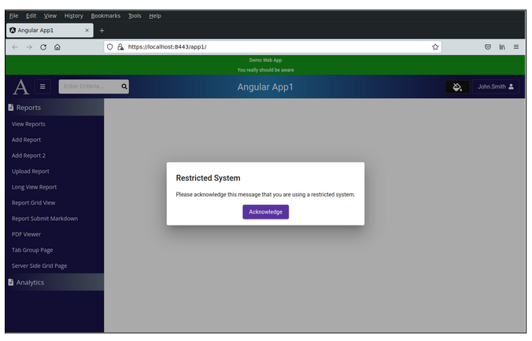
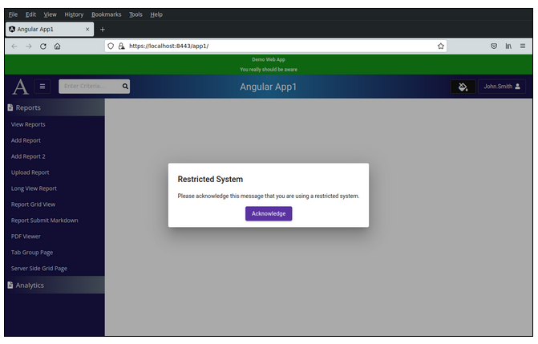

Lesson 29:  Show Acknowledgement Popup on Page Load
---------------------------------------------------
The Google Drive link is here:<br>
&nbsp;&nbsp;&nbsp;https://docs.google.com/document/d/1lF-QXlXxTGJVbEJJpH1OtafeC3fFiKxMQEfw8-6jbh0/edit?usp=sharing
      

The source code for this lesson is here:<br>
&nbsp;&nbsp;&nbsp;https://github.com/traderres/angularApp1Lessons/tree/lesson29/show-popup-on-load
<br>
<br>
<br>

<h3> Problem Set </h3>
Problem:  I want my users to acknowledge a popup message before using any pages<br>
Solution:  Create a guard and assign it to all routes<br>
<br>



<br>
<br>

```
Approach
--------
    A. Change the back-end session UserInfo object and add 2 REST endpoints
       a. Change the UserInfo.java object to hold a boolean indicating user acknowledged the popup

       b. Add 2 REST endpoints

          GET /api/user/ack/get      returns true if the user has acknowledged the popup in this session
          POST /api/users/ack/set    sets the user's session as having acknowledged the popup
         
    B. Add public methods to the front-end UserService
       a. Add a public method:  UserService.didUserAcknowledge() that returns an observable<boolean>

       b. Add a public method:  UserService.setUserAcknowledged() that returns an observable<string>

    C. Create a front-end dialog box

    D. Create a guard that implements canActivate
       -- This guard checks if the user has acknowledged
       -- If the user has not acknowledged, then open a dialog box and wait

    E. Assign the guard to all routes

    F. Try it out using local dev mode using HTTPS

    
    WARNING:  This implementation does not work in local dev mode using HTTP
    -- In local dev mode using HTTP, the backend session is re-created on every request
    -- In local dev mode using HTTP, we cannot change session info
    -- In local dev mode using HTTP, the user would have to acknowledge every fucking request!!!!
    
    But, this will work in local dev mode using HTTPS
    -- In local dev mode using HTTPS, there is a real session that can be manipulated


Procedure
---------
    1. Change the UserInfo.java to hold a boolean

       Edit UserInfo.java

        
       Add this class variable:
            private boolean userAcknowledgedMessage = false;
       
 
       Add the getter and setters:
        
            public boolean getUserAcknowledgedMessage() {
                return userAcknowledgedMessage;
            }
        
            public void setUserAcknowledgedMessage() {
                this.userAcknowledgedMessage = true;
            }


    2. Add the REST endpoints to UserController.java
       
       Edit UserController.java
        
       Add these 2 public methods:
        
            /**
            * GET /api/ack/get
            */
            @RequestMapping(value = "/api/user/ack/get", method = RequestMethod.GET, produces = "application/json")
            @PreAuthorize("hasAnyRole('READER', 'ADMIN')")
            public ResponseEntity<?> getUserAcknowledged() {
        
                // Get the UserInfo object (which holds the user's session info)
                UserInfo userInfo = this.userService.getUserInfo();
        
                // Get the boolean (which holds true if the user has acknowledged the popup)
                Boolean userHasAcknowledged = userInfo.getUserAcknowledgedMessage();
        
                // Return a response of 200 and the boolean object
                return ResponseEntity.status(HttpStatus.OK).body(userHasAcknowledged);
            }
        
            /**
            * POST /api/ack/set
            */
            @RequestMapping(value = "/api/user/ack/set", method = RequestMethod.POST, produces = "application/json")
            @PreAuthorize("hasAnyRole('READER', 'ADMIN')")
            public ResponseEntity<?> setUserAcknowledged() {
        
                // Get the UserInfo object (which holds the user's session info)
                UserInfo userInfo = this.userService.getUserInfo();
        
                // Set this session as having acknowledged the popup
                userInfo.setUserAcknowledgedMessage();
        
                // Return a response of 200
                return ResponseEntity.status(HttpStatus.OK).body(null);
            }


    3. Add public methods to the front-end UserService

       Edit user.service.ts


       Add this class variable:
           private cachedAckObservable: Observable<boolean> | null = null
      
  
       Add these public methods:
        
          public didUserAcknowledge() : Observable<boolean> {
            if (this.cachedAckObservable != null) {
            // This observable is in the cache.  So, return it from the cache
            return this.cachedAckObservable;
            }
        
            // Construct the URL of the REST call
            const restUrl = environment.baseUrl + '/api/user/ack/get';
        
            // Return an observable
            this.cachedAckObservable = this.httpClient.get <boolean>(restUrl).pipe(
            shareReplay(1),
            catchError(err => {
                console.error('There was an error getting user info.   Error is ', err);
        
                // Clear the cache
                this.cachedAckObservable = null;
        
                return EMPTY;
            }));
        
            return this.cachedAckObservable;
          }


          public setUserAcknowledged(): Observable<string> {
            // Construct the URL of the REST call
            const restUrl = environment.baseUrl + '/api/user/ack/set'
        
            // Return an observable
            return this.httpClient.post <string>(restUrl, {} ).pipe(
            map( (result) => {
                // The set-acknowledged REST call finished successfully
        
                // Set the cachedAckObservable to hold an observable holding true
                this.cachedAckObservable = of(true);
        
                return result;
            }),
            catchError(err => {
                console.error('There was an error getting user info.   Error is ', err);
        
                // Clear the cache
                this.cachedAckObservable = null;
        
                return EMPTY;
            }));
        
          }

 


    4. Create a User Acknowledge Dialog Box
       Verify that MatDialogModule is imported in app.module.ts
            i.  Go to app.module.ts

            ii. Verify that you see MatDialogModule in the imports section


    5. Create a popup component
       unix> cd ~/intellijProjects/angularApp1/frontend
       unix> ng generate component dialogs/UserAcknowledgeDialogComponent --skipTests


    6. Edit user-acknowledge-dialog-component.component.ts

       Replace its contents with this:
            
            import { Component, OnInit } from '@angular/core';
            import {MatDialogRef} from "@angular/material/dialog";
            import {UserService} from "../../services/user.service";
            
            @Component({
              selector: 'app-user-acknowledge-dialog-component',
              templateUrl: './user-acknowledge-dialog-component.component.html',
              styleUrls: ['./user-acknowledge-dialog-component.component.css']
            })
            export class UserAcknowledgeDialogComponentComponent implements OnInit {
            
              constructor(private userService: UserService,
                        private matDialogRef: MatDialogRef<UserAcknowledgeDialogComponentComponent>)
            { }
            
              public ngOnInit(): void {
              }
            
             
              /*
              * User clicked to acknowledge.
              *  1) Invoke the UserService method to acknowledge the popup
              *  2) return true back to the class that opened this dialog box
              */
              public userClickedAcknowledge() {
            
                this.userService.setUserAcknowledged().subscribe( () => {
                // The REST call came back successfully
            
                // Close the dialog box and return TRUE
                this.matDialogRef.close(true);
                })
            
              }  // end of userClickedAcknowledge()
            
            
            }


    7. Edit user-acknowledge-dialog-component.component.html
        
        <h2 mat-dialog-title>Restricted System</h2>
        
        <mat-dialog-content>
          <!-- Dialog Content -->
          Please acknowledge this message that you are using a restricted system.
        </mat-dialog-content>
        
        <mat-dialog-actions style="justify-content: center">
            <!-- Dialog Buttons -->
            <button mat-raised-button color="primary" type="button" 
                  (click)="this.userClickedAcknowledge()" title="Acknowledge" aria-label="Acknowledge">
            Acknowledge
            </button>
        
        </mat-dialog-actions>
        


    8. Create a guard that implements canActivate
       a. Create the guard called UserAcknowledgeGuard
          unix> cd ~/intellijProjects/angularApp1/frontend
          unix> ng generate guard guards/UserAcknowledge --implements CanActivate  --skipTests

       b. Edit user.acknowledge.guard.ts

          Replace its contents with this:
                        
            import { Injectable } from '@angular/core';
            import {CanActivate, ActivatedRouteSnapshot, RouterStateSnapshot, Router} from '@angular/router';
            import {Observable, of} from 'rxjs';
            import { map, switchMap,} from "rxjs/operators";
            import {UserService} from "../services/user.service";
            import {MatDialog, MatDialogRef} from "@angular/material/dialog";
            import {UserAcknowledgeDialogComponentComponent} from "../dialogs/user-acknowledge-dialog-component/user-acknowledge-dialog-component.component";
            
            
            
            @Injectable({
              providedIn: 'root'
            })
            export class UserAcknowledgeGuard implements CanActivate {
            
              private openedDialogRef: MatDialogRef<UserAcknowledgeDialogComponentComponent> | null = null;
            
            
              constructor(private router: Router,
                        private matDialog: MatDialog,
                        private userService: UserService) { }
            
            
              /*
               * If this method returns true, then proceed to the requested route
               * If this method returns false, then do not proceed to the requested route
               * If this method returns an observable<boolean>, then wait for the observable and then make a decision
                 */
              public canActivate(next: ActivatedRouteSnapshot, state: RouterStateSnapshot): Observable<boolean>  {
            
            
                return this.userService.didUserAcknowledge().pipe(
            
                // NOTE:  Use the switchMap because the dialogRef.afterClosed() generates an inner observable
                switchMap( (aAck: boolean) => {
                    if (aAck) {
                    // User has acknowledged message, so return an observable holding TRUE
                    return of(true);
                    }
            
                    else {
                    // User has not acknowledged message yet
            
                    if (this.openedDialogRef == null) {
                        // The dialog box has not been opened.
            
                        // Open the acknowledge system dialog box
                        // NOTE:  openedDialogRef is a private class variable instead of a local variable
                        //    	to ensure that only ONE dialog box opens
                        this.openedDialogRef = this.matDialog.open(UserAcknowledgeDialogComponentComponent,
                        {
                            disableClose: true
                        }
                        );
                    }
            
            
                    // Return the *inner* observable by waiting for the dialog box
                    // NOTE:  The dialog box acknowledge button invokes the REST endpoint to save the user-acknowledgement
                    return this.openedDialogRef.afterClosed().pipe(
                        map((aResult: boolean) => {
                        // The dialog box has closed
            
                        // Set the openedDialogRef back to null
                        this.openedDialogRef = null;
            
                        // Return an observable that holds either true or false
                        return aResult;
                        }) // end of map
                    )
            
                    }  // end of else
                })   // end of map
                );  // end of pipe
            
            
              } // end of canActivate()
            
            }


    9. Assign the guard to all routes
       NOTE:  Make sure the UserAcknowledgeGuard is the FIRST guard in the canActivate: [ ] array

       Edit app.module.ts


       Assign the UserAcknowledgeGuard to all routes 
       NOTE:  Do not assign it to NotFoundComponent and ForbiddenComponent

       Change the appRoutes to this   (changes are in bold)
            
            // Setup the routes.  If no route is found, then take the user to the NotFoundComponent
            const appRoutes: Routes = [
              { path: Constants.ADD_REPORTS_ROUTE,      	component: AddReportComponent,    	canActivate: [UserAcknowledgeGuard, PageGuard] },
              { path: Constants.REPORTS_GRID_VIEW_ROUTE,	component: ReportGridViewComponent,   canActivate: [UserAcknowledgeGuard, PageGuard] },
              { path: Constants.ADD_REPORTS2_ROUTE,     	component: AddReport2Component,   	canActivate: [UserAcknowledgeGuard, PageGuard] },
              { path: Constants.VIEW_REPORTS_ROUTE,     	component: ViewReportsComponent,  	canActivate: [UserAcknowledgeGuard, PageGuard] },
              { path: Constants.DASHBOARD_ROUTE,        	component: DashboardComponent,    	canActivate: [UserAcknowledgeGuard, PageGuard] },
              { path: Constants.USA_MAP_ROUTE,          	component: UsaMapComponent,       	canActivate: [UserAcknowledgeGuard, PageGuard] },
              { path: Constants.CHART_DRILLDOWN_ROUTE,  	component: ChartDrillDownComponent,   canActivate: [UserAcknowledgeGuard, PageGuard] },
              { path: Constants.LONGVIEW_INTERNAL_NAV_REPORT + ':id',  component: LongViewInternalNavReportComponent ,  canActivate: [UserAcknowledgeGuard, PageGuard] },
              { path: Constants.EDIT_REPORT_ROUTE +':id', 	component: EditReportComponent,       	canActivate: [UserAcknowledgeGuard, PageGuard] },
              { path: Constants.SEARCH_DETAILS_ROUTE + 'id',  component: SearchBoxDetailsComponent, 	canActivate: [UserAcknowledgeGuard, PageGuard] },
              { path: Constants.UPLOAD_REPORT_ROUTE,      	component: UploadReportComponent,   canActivate: [UserAcknowledgeGuard, PageGuard] },
              { path: Constants.CHART1_ROUTE,             	component: Chart1Component,     	canActivate: [UserAcknowledgeGuard, PageGuard] },
              { path: Constants.CHART2_ROUTE,             	component: Chart2Component,     	canActivate: [UserAcknowledgeGuard, PageGuard] },
              { path: Constants.REPORT_SUBMIT_MARKDOWN,   	component: ReportSubmitMarkdownComponent,   canActivate: [UserAcknowledgeGuard, PageGuard] },
              { path: Constants.LONGVIEW_REPORT,          	component: LongViewOuterReportComponent,	canActivate: [UserAcknowledgeGuard, PageGuard] },
              { path: Constants.REPORT_PDFVIEWER_ROUTE,   	component: PdfViewerComponent,  	canActivate: [UserAcknowledgeGuard, PageGuard] },
              { path: Constants.TAB_GROUP_ROUTE,          	component: TabGroupComponent,   	canActivate: [UserAcknowledgeGuard, PageGuard] },
              { path: Constants.FORBIDDEN_ROUTE,          	component: ForbiddenComponent },
              { path: Constants.SERVER_SIDE_GRID_ROUTE,   	component: ServerSideGridComponent, canActivate: [UserAcknowledgeGuard, PageGuard] },
              { path: '',                                 	component: WelcomeComponent,    	canActivate: [UserAcknowledgeGuard] },
              { path: '**',                               	component: NotFoundComponent}
            ];


    10. Try it out in local prod mode using HTTPS
        NOTE:  The admin_user.p12 was created as part of Step 20E
        https://docs.google.com/document/d/1T3m8JsRDL4sM7tE9TXXPbjdIsWbEkorADHtkAY9eeDA/edit?usp=sharing


        a. Configure Firefox by importing the Startup Firefox
            i.    In the url, type-in this:   about:preferences
            ii.   In the settings search box, type in certificates
            iii.  Press "View Certificates"
            iv.   Click on "Your Certificates"
            v.    Press "Import..."
            vi.   Browser to the backend/src/main/dev_resources/admin_user.p12
            vii.  Enter the password:  secret
            viii. Press OK


        b. Build the webapp
           unix> cd ~/intellijProjects/angluarApp1
           unix> mvn clean package -Pprod


        c. Run the webapp in local https mode (by running in the "prod" spring profile)
           unix> java -Dspring.profiles.active=prod -jar ./backend/target/backend-1.0-SNAPSHOT-exec.jar


        d. Connect to the webapp by going to https://localhost:8443/app1

           You should see the popup on page load
```

```
After you have acknowledged the popup, it stays in the session
-- If you open additional tabs in this browser, then you do NOT have to acknowledge again
-- If you close the browser and open a new browser, then you must acknowledge the popup


    11. To make life easier for your developers, set this as acknowledged so that we do NOT see it in local dev mode when running the debugger in Intellij (using HTTP mode)

        a. Edit MyAuthenticationManager.java

        b. Replace loadUserDetailsForDevelopment() with this:   [changes in bold]
            
               public UserDetails loadUserDetailsForDevelopment(Authentication authentication) {
                    String userUID = "my_test_user";
                    String userDN = "3.2.12.144549.1.9.1=#161760312e646576,CN=my_test_user,OU=Hosts,O=ZZTop.Org,C=ZZ";
            
                    if ((authentication != null) && (authentication.getPrincipal() != null)) {
                        userDN = authentication.getPrincipal().toString();
                        userUID = getCnValueFromLongDnString(userDN);
                        if (userUID == null) {
                            userUID = "my_test_user";
                        }
                    }
            
                    // Create a list of granted authorities
                    List<GrantedAuthority> grantedRoleAuthorities = new ArrayList<>();
                    grantedRoleAuthorities.add(new SimpleGrantedAuthority("ROLE_READER"));
                    grantedRoleAuthorities.add(new SimpleGrantedAuthority("ROLE_USER_FOUND_IN_VALID_LIST_OF_USERS"));
            
                    // User is about to login
                    // -- This would be the place to add/update a database record indicating that the user logged-in
                    Integer userId = this.userService.getOrAddUserRecordsToSystem(userUID);
            
                    // Get the user's granted access map
                    // NOTE:  This holds all authorized routes and UI controls (based on the user's granted roles)
                    Map<String, Boolean> accessMap = userService.generateAccessMap(grantedRoleAuthorities);
            
                    // Create a bogus UserInfo object
                    // NOTE:  I am hard-coding the user's userid=25
                    UserInfo anonymousUserInfo = new UserInfo()
                            .withId(userId)
                            .withUsernameUID(userUID)
                            .withUsernameDn(userDN)
                            .withGrantedAuthorities(grantedRoleAuthorities)
                            .withAccessMap(accessMap);
            
                    // Set the popup has disabled when running in dev mode
                    anonymousUserInfo.setUserAcknowledgedMessage();
            
                    return anonymousUserInfo;
            }


        c. Now, you will NOT see the acknowledge popup in local dev mode

```
