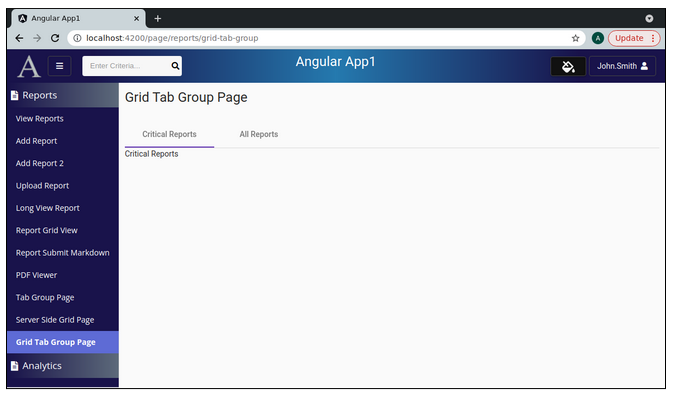
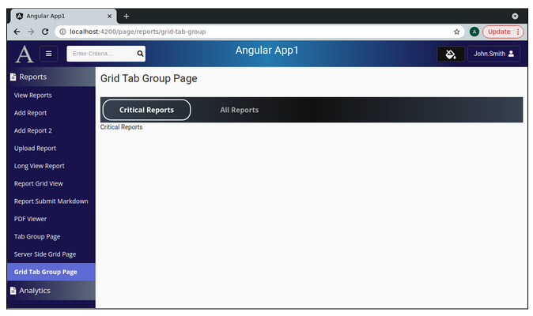

Lesson 30a: Tab Group Page / Add Page w/Empty Tabs
--------------------------------------------------
The Google Drive link is here:<br>
&nbsp;&nbsp;&nbsp;https://docs.google.com/document/d/110BDtwTpCC8TStNgi_5ePgDmJ7RL2HrBBpNhGmML0_g/edit?usp=sharing
      

The source code for this lesson is here:<br>
&nbsp;&nbsp;&nbsp;https://github.com/traderres/angularApp1Lessons/tree/lesson30a/tab-group/add-page
<br>
<br>
<br>

<h3> Problem Set </h3>
Problem:  I want to create a page that has a tab group with 2 tabs<br>
    Tab 1 holds "Critical Reports" showing a server-side grid limited to critical reports<br>
    Tab 2 holds "All Reports" showing a server-side grid<br>
<br>


<br>
<br>

```
Procedure
---------
    1. Verify that the MatTabsModule is found in app.module.ts
       a. Edit app.module.ts

       b. Add MatTabsModule to the imports section

       c. Stop and Start the debugger to make sure everything still compiles


    2. Add a Tab Group page
       a. Create the tab group component
          unix> cd ~/intellijProjects/angularApp1/frontend
          unix> ng generate component analytics/grid-tab-group/grid-tab-group-page --skipTests

       b. Add a constant to constants.ts  (for the route)
                GRID_TAB_GROUP_ROUTE          	= "page/reports/grid-tab-group"

       c. Add the route to app.module.ts
                { path: Constants.GRID_TAB_GROUP_ROUTE,   component: GridTabGroupPageComponent, canActivate: [PageGuard] },


       d. Add the page to the navbar.component.html
            
              <!-- Grid Tab Group Page -->
              <mat-list-item class="navItem"  [routerLink]="constants.GRID_TAB_GROUP_ROUTE" routerLinkActive="active"
                            *ngIf="userInfo.pageRoutes.get(constants.GRID_TAB_GROUP_ROUTE)">
                <a title="Tab Group Page">Grid Tab Group Page</a>
                <div fxFlex fxLayoutAlign="end end" >
                <a [routerLink]="constants.GRID_TAB_GROUP_ROUTE" target="_blank">
                    <i class="fas fa-external-link-alt navItemIcon" title="Open Grid Tab Group Page in a new window"></i>
                </a>
                </div>
              </mat-list-item>


       e. Add security for that route (so that the roles are authorized to see the page)
            i.   Edit R__security.sql

            ii.  Add a uicontrol record for the tab group:
                    insert into uicontrols(id, name) values(1025, 'page/reports/grid-tab-group');


            iii.  Assign the uicontrols record to the 'admin' role
                    insert into roles_uicontrols(role_id, uicontrol_id) values(1, 1025);


            iv.   Assign the uicontrols record to the 'reader' role
                    insert into roles_uicontrols(role_id, uicontrol_id) values(2, 1025);
   

       f. Verify that you can get to the page
            i.  Activate the Debugger on "Full WebApp"
            ii. Click on the "Grid Tab Groups" page  (in the navbar)
                -- You should see an empty page


    3. Format the Grid Tab Group Page (set it up with 2 empty tabs)
       a. Edit grid-tab-group-page.component.html

       b. Replace its contents with this:
            
            <div class="page-container">
            
              <div fxFlexFill fxLayout="column" style="margin: 0; padding: 0">
            
                <div fxFlex fxLayout="row" fxLayoutGap="0" style="margin: 0; padding: 0;">
            
            
                <div fxFlex fxLayoutAlign="left top" fxLayout="row" fxLayoutGap="0" class="top-row">
                    <!-- Left Side of the 1st Row -->
                    <h1 class="mat-h1">Grid Tab Group Page</h1>
                </div>
            
            
                <div fxFlex fxLayoutAlign="end top">
                    <!-- Right Side of the 1st Row -->
                </div>
            
                </div>  <!-- End of 1st row -->
            
                <div fxFlex fxLayout="row" fxLayoutGap="0" style="margin: 0 0 5px 0; padding: 0;">
                </div>  <!-- End of 2nd row -->
            
              </div>
            
            
              <div style="margin-top: 5px;">
            
                <!-- Tab Group  (by default show the 1st tab) -->
                <mat-tab-group animationDuration="0ms" [selectedIndex]=0 >
            
                <!-- Critical Reports Tab -->
                <mat-tab label="Critical Reports">
                    <div class="tab-content">
                    Critical Reports
                    </div>
                </mat-tab>
            
                <!-- All Reports Tab -->
                <mat-tab label="All Reports">
                    <div class="tab-content">
                    All Reports
                    </div>
                </mat-tab>
            
            
                </mat-tab-group>
            
              </div>
            </div>


    4. Verify that you see the tabs
       a. Activate the debugger on "Full Web App"
       b. Click on "Grid Tab Group Page"
```

```
This is our empty Grid Tab Group Page     


    5. Format the Tab Group mechanism
       a. Edit grid-tab-group-page.component.css

       b. Replace its contents with this:
            
            :host ::ng-deep .mat-tab-label{
              /* label style */
              min-width: 200px !important;
              color: white;
            
              font-family: 'Open Sans';
              font-style: normal;
              font-weight: 700;
              font-size: 16px;
              margin: 5px;
            
              /* Add a transparent border so that when a user clicks on a tab, there is no "bump" */
              border: 2px solid transparent;
              box-sizing: border-box;
              border-radius: 20px;
            }
            
            
            :host ::ng-deep .mat-tab-list .mat-tab-labels .mat-tab-label-active  {
              color: white;
            }
            
            
            :host ::ng-deep .mat-tab-label.mat-tab-label-active:not(.mat-tab-disabled),
            :host ::ng-deep .mat-tab-label.mat-tab-label-active.cdk-keyboard-focused:not(.mat-tab-disabled)
            {
              /* Set color when tab loses focus */
              opacity: 1;
            }
            
            
            :host ::ng-deep .mat-tab-header{
              /* Set the default background color of the header */
              
            
              /* Permalink - use to edit and share this gradient:  https://colorzilla.com/gradient-editor/#364150+0,111111+50,364150+100 */
              background: #364150; /* Old browsers */
              background: -moz-linear-gradient(left,  #364150 0%, #111111 50%, #364150 100%); /* FF3.6-15 */
              background: -webkit-linear-gradient(left,  #364150 0%,#111111 50%,#364150 100%); /* Chrome10-25,Safari5.1-6 */
              background: linear-gradient(to right,  #364150 0%,#111111 50%,#364150 100%); /* W3C, IE10+, FF16+, Chrome26+, Opera12+, Safari7+ */
              filter: progid:DXImageTransform.Microsoft.gradient( startColorstr='#364150', endColorstr='#364150',GradientType=1 ); /* IE6-9 */
            
            }
            
            :host ::ng-deep mat-ink-bar.mat-ink-bar {
              /* Remove the purple underline */
              display: none;
            }
            
            
            :host  ::ng-deep .mat-tab-header, .mat-tab-nav-bar {
              border-bottom: 0;
            }
            
            
            :host ::ng-deep .mat-tab-label.mat-tab-label-active {
              /* Styles for the active tab label */
              border: 2px solid white;
              box-sizing: border-box;
              border-radius: 20px;
            }


    6. Verify that you see the formatted tab group 
       a. Activate the debugger on "Full Web App"
       b. Click on "Grid Tab Group Page"
```


