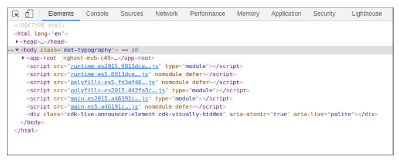

Lesson 32:  Showing / Hiding Angular Version
--------------------------------------------
The Google Drive link is here:<br>
&nbsp;&nbsp;&nbsp;
      

The source code for this lesson is here:<br>
&nbsp;&nbsp;&nbsp;https://docs.google.com/document/d/1IKru3ftu3aU0U-MCwqDrImAqFsWRAqus8001o4B_Mf8/edit?usp=sharing
<br>
<br>
<br>

<h3> Problem Set </h3>
Problem 1:  My users can see the version of Angular by looking at the source code<br>
Solution 1:  Do nothing (as the real protection is on the back end)<br>
Solution 2:  Hide the angular version from users<br>


<br>
<br>

   <br>
  The Firefox Inspector shows that this web app is using Angular 9.0.6

<br>
<br>

```

Procedure
---------
     1. Compile the web app to run from command line
        a. Compile the webapp to run locally
           unix> cd ~/intellijProjects/angularApp1
           unix> mvn clean package -Pprod

        b. Run the webapp locally
           unix> java -jar ./backend/target/backend-1.0-SNAPSHOT-exec.jar


     2. View the Angular Version using Chrome Browser
        a. Startup Chrome
        b. Connect to http://localhost:8080/app1
        c. Press F12 to open the developer tools (in Chrome)
```

```
You should see ng-version="9.0.6"


     3. View the Angular Version using Firefox Browser
        a. Startup Firefox
        b. Connect to http://localhost:8080/app1
        c. Press F12 to open the developer tools (in Chrome)
```

```
You should see ng-version="9.0.6"


    4. Hide the ng-version tag 
       a. Edit app.component.ts


       b. Verify that your AppComponent implements OnInit


       c. Inject the elementRef into the constructor

            constructor(private elementRef: ElementRef)   { }


        d. Add this one-liner to the ngOnInit():

            public ngOnInit(): void {
            
                // Hide the ng-version tag from public users
                this.elementRef.nativeElement.removeAttribute("ng-version");
            
            }


    5. Compile the web app to run from command line
       a. Compile the webapp to run locally
          unix> cd ~/intellijProjects/angularApp1
          unix> mvn clean package -Pprod

        b. Run the webapp locally
           unix> java -jar ./backend/target/backend-1.0-SNAPSHOT-exec.jar


    6. View the Angular Version using Chrome Browser
       a. Startup Chrome
       b. Connect to http://localhost:8080/app1
       c. Press F12 to open the developer tools (in Chrome)
```

```
          NOTE:  The app-root does not show ng-version anymore


    7. View the Angular Version using Firefox Browser
        a. Startup Firefox
        b. Connect to http://localhost:8080/app1
        c. Press F12 to open the developer tools (in Chrome)
```

```
        NOTE:  The app-root does not show ng-version anymore
