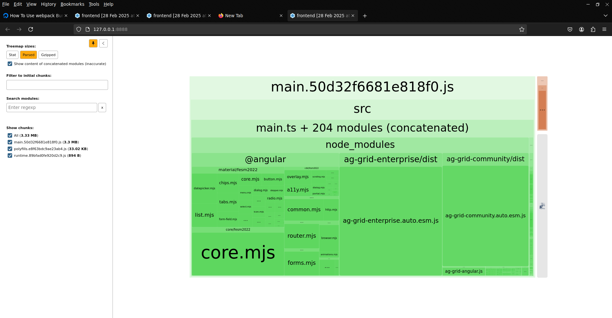
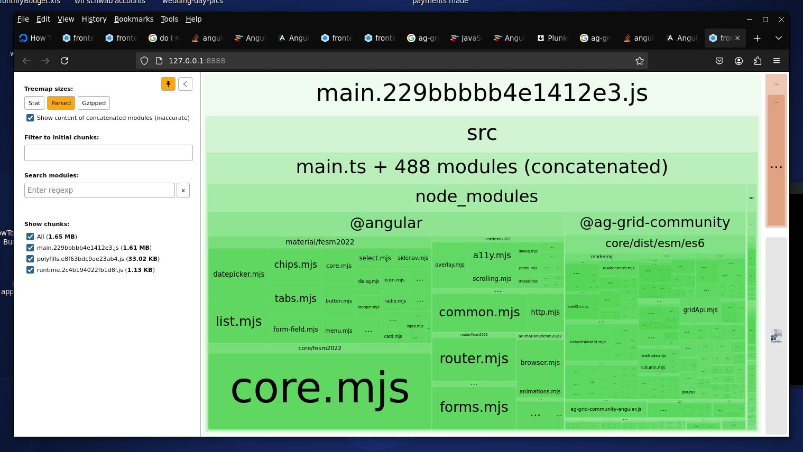

```
How to Reduce the Size of ag-grid JavaScript loading
----------------------------------------------------
Problem:  ag-grid can add a large bundle JavaScript to your project
Solution: Load only the ag-grid modules you need


Part 1:  Do a webpack analysis BEFORE making your changes
---------------------------------------------------------
Run the steps in howToRunWebPackAnalyzer.txt
  -- Save your analysis view
  -- Note the bundle size of 3.3 MB
```

```


Part 2:  Change your project to use ag-grid modules
---------------------------------------------------
 1. Change your package.json to only include those elements you need:
	a. edit frontend/package.json

	b. Remove these entries:
		 ag-grid-community
	     ag-grid-enterprise
	     ag-grid-angular


    c. Add the dependencies you need

		"@ag-grid-community/angular": "30.2.1",
		"@ag-grid-community/core": "30.2.1",
		"@ag-grid-community/styles": "30.2.1",
		"@ag-grid-community/client-side-row-model": "30.2.1",
		"@ag-grid-community/csv-export": "30.2.1",
		"@ag-grid-enterprise/set-filter": "30.2.1",
		"@ag-grid-enterprise/multi-filter": "30.2.1",
		"@ag-grid-enterprise/menu": "30.2.1",


	  	Possible Dependencies
	 	----------------------
		"@ag-grid-community/angular": "30.2.1",
		"@ag-grid-community/core": "30.2.1",
		"@ag-grid-community/styles": "30.2.1",
		"@ag-grid-community/client-side-row-model": "30.2.1",
		"@ag-grid-community/infinite-row-model": "30.2.1",
		"@ag-grid-community/csv-export": "30.2.1",
		"@ag-grid-enterprise/core": "30.2.1",
		"@ag-grid-enterprise/charts": "30.2.1",
		"@ag-grid-enterprise/sparklines": "30.2.1",
		"@ag-grid-enterprise/clipboard": "30.2.1",
		"@ag-grid-enterprise/column-tool-panel": "30.2.1",
		"@ag-grid-enterprise/excel-export": "30.2.1",
		"@ag-grid-enterprise/filter-tool-panel": "30.2.1",
		"@ag-grid-enterprise/master-detail": "30.2.1",
		"@ag-grid-enterprise/menu": "30.2.1",
		"@ag-grid-enterprise/range-selection": "30.2.1",
		"@ag-grid-enterprise/rich-select": "30.2.1",
		"@ag-grid-enterprise/row-grouping": "30.2.1",
		"@ag-grid-enterprise/server-side-row-model": "30.2.1",
		"@ag-grid-enterprise/set-filter": "30.2.1",
		"@ag-grid-enterprise/multi-filter": "30.2.1",
		"@ag-grid-enterprise/side-bar": "30.2.1",
		"@ag-grid-enterprise/status-bar": "30.2.1",
		"@ag-grid-enterprise/viewport-row-model": "30.2.1"


 2. Update your app.module.ts
	-- Register the modules you need

		import { ModuleRegistry } from '@ag-grid-community/core';
		import { ClientSideRowModelModule } from "@ag-grid-community/client-side-row-model";
		import { CsvExportModule } from "@ag-grid-community/csv-export";
		import {AgGridModule} from "@ag-grid-community/angular";

		...


		ModuleRegistry.registerModules([
		  ClientSideRowModelModule,
		  CsvExportModule,
		]);


 3. Change the imports in this file:  main.ts

		import { platformBrowserDynamic } from '@angular/platform-browser-dynamic';
		import { AppModule } from './app/app.module';
		import { LicenseManager } from "@ag-grid-enterprise/core";
		import {environment} from "./environments/environment";

		// Set the license key for ag-grid-enterprise
		LicenseManager.setLicenseKey(environment.agGridLicenseKey);

		platformBrowserDynamic().bootstrapModule(AppModule)
		  .catch(err => console.error(err));


 4. Change your angular.json to get the alpine and balham from new locations
	a. Edit angular.json

	b. Change the styles to this:

            "styles": [
              "./src/assets/themes/deeppurple-amber.css",
              "./node_modules/@fortawesome/fontawesome-pro/css/all.min.css",
              "./node_modules/@fortawesome/fontawesome-pro/css/sharp-light.min.css",
              "./node_modules/@fortawesome/fontawesome-pro/css/sharp-regular.min.css",
              "./node_modules/@fortawesome/fontawesome-pro/css/sharp-solid.min.css",
              "./node_modules/@ag-grid-community/styles/ag-grid.min.css",
              "./node_modules/@ag-grid-community/styles/ag-theme-alpine.min.css",
              "./node_modules/@ag-grid-community/styles/ag-theme-balham.min.css",
              "src/styles.scss"
            ],


 5. Change the imports in every grid typescript file:
	a. Erase the existing imports
	b. Import the new ones
		import {Component, HostListener, OnDestroy, OnInit} from '@angular/core';


Part 3:  Do a webpack analysis AFTER making your changes
---------------------------------------------------------
Run the steps in howToRunWebPackAnalyzer.txt
  -- Save your analysis view
  -- Note the bundle size of 1.65 MB  (we reduced the bundle from 3.33 MB to 1.65 MB!!!)
```

```

```