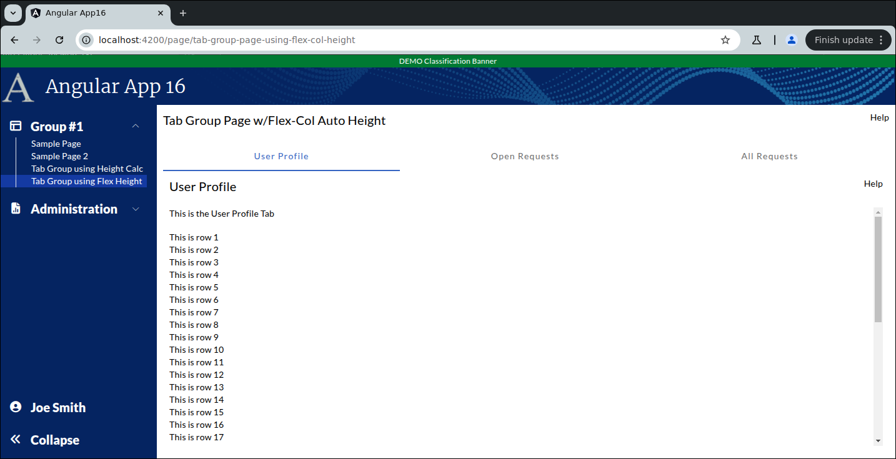

```
Exercise 5a / Use the Remaining Height in Tabs  (Answers)
---------------------------------------------------------
Problem:  I'm creating my "Details Page" and it will have a Tab Group
          I want each tab to use the *REMAINING HEIGHT*

Approach #1:  Use the height calc to set the height
Approach #2:  Use the flex col trick to grow the height

```

```


     Showing the "User Profile" tab
     +----------------------------------------------------------------------+
     | Tab Group Page w/Height Calc                                    Help |
     +----------------------------------------------------------------------+
     |                                                                      |
     |  +------------------+-----------------------+---------------------+  |
     |  | User Profile Tab | Open Requests Tab     | All Requests Tab    |  |
     |  +------------------+-----------------------+---------------------+  |
     |  | User Profile                                                   |  |
     |  |                                                                |  |    Each tab uses the
     |  | This is the User Profile Tab                                   |  |      **REMAINING**
     |  |                                                                |  |         Height
     |  |                                                                |  |
     |  |                                                                |  |
     |  +----------------------------------------------------------------+  |
     +----------------------------------------------------------------------+


	Showing the "Open Requests" tab
	+----------------------------------------------------------------------+
    | Tab Group Page w/Height Calc                                    Help |
	+----------------------------------------------------------------------+
	|                                                                      |
	|  +------------------+-----------------------+---------------------+  |
    |  | User Profile Tab | Open Requests Tab     | All Requests Tab    |  |
	|  +------------------+-----------------------+---------------------+  |
	|  | Open Requests                                                  |  |
	|  |                                                                |  |
	|  | This is the Open Requests Tab                                  |  |
	|  |                                                                |  |
	|  |                                                                |  |
	|  |                                                                |  |
	|  |                                                                |  |
	|  +----------------------------------------------------------------+  |
	+----------------------------------------------------------------------+


	Showing the "All Requests" tab
	+----------------------------------------------------------------------+
    | Tab Group Page w/Height Calc                                    Help |
	+----------------------------------------------------------------------+
	|                                                                      |
	|  +------------------+-----------------------+---------------------+  |
    |  | User Profile Tab | Open Requests Tab     | All Requests Tab    |  |
	|  +------------------+-----------------------+---------------------+  |
	|  | All Requests                                                   |  |
	|  |                                                                |  |
	|  | This is the All Requests Tab                                   |  |
	|  |                                                                |  |
	|  |                                                                |  |
	|  |                                                                |  |
	|  |                                                                |  |
	|  +----------------------------------------------------------------+  |
	+----------------------------------------------------------------------+


Part 1 / Build the Tabs using the Height Calc Trick
---------------------------------------------------
 1. Setup the Page
    a. Generate the component:                Call it TabGroupUsingHeightCalcPage
    b. Add the route to constants.ts:         the route will be this:   page/tab-group-page-using-height-calc
    c. Register the route
    d. Add the route to the database table:  ui_controls        (if using real security)
    e. Add a link to the navbar (using that route)
    f. Use the debugger to verify that the navbar link works


 2. Setup this page layout
     +-------------------------------------------------------------------+
     | Tab Group Page w/Height Calc                                 Help |
     +-------------------------------------------------------------------+
     | Bottom of Page                                                    |
     |                                                                   |
     +-------------------------------------------------------------------+


		<div class="p-2.5">

		  <div class="grid grid-cols-2">
			<div>
			  <span class="text-xl">Tab Group Page w/Height Calc</span>
			</div>

			<div class="flex place-content-end">
			  Help
			</div>
		  </div>

		  <div class="mt-2.5">
			Bottom of Page
		  </div>

		</div>


 3. Create a component for each tab
    NOTE:  Create these components in the same directory as your tab group page
 	a. Create this component:   TabUserProfile
 	b. Create this component:   TabOpenRequests
 	c. Create this component:   TabAllRequests


 4. Create the tab-group by adding a <mat-tab-group> tag to the main page


 5. Add each tab **COMPONENT** to the <mat-tab-group>

		Main Page HTML Looks like this
		------------------------------
		<div class="p-2.5">

		  <div class="grid grid-cols-2">
			<div>
			  <span class="text-xl">Tab Group Page w/Height Calc</span>
			</div>

			<div class="flex place-content-end">
			  Help
			</div>
		  </div>

		  <div class="mt-5">
			<!-- Bottom of the Page -->

			<mat-tab-group>

			  <!-- U S E R     P R O F I L E       T A B -->
			  <mat-tab label="User Profile">
				<app-tab-user-profile></app-tab-user-profile>
			  </mat-tab>


			  <!-- O P E N      R E Q U E S T S      T A B -->
			  <mat-tab label="Open Requests">
				<app-tab-open-requests></app-tab-open-requests>
			  </mat-tab>


			  <!-- A L L        R E Q U E S T S     T A B -->
			  <mat-tab label="All Requests">
				<app-tab-all-requests></app-tab-all-requests>
			  </mat-tab>

			</mat-tab-group>
		  </div>

		</div>


 6. Within each tab, create a simple outline with a tab title and a one-liner
	-- Setup each tab with a title and a one-sentence description

	Showing the "User Profile" tab
	+----------------------------------------------------------------------+
	| Tab Group Page                                                  Help |
	+----------------------------------------------------------------------+
	|                                                                      |
	|  +------------------+-----------------------+---------------------+  |
    |  | User Profile Tab | Open Requests Tab     | All Requests Tab    |  |
	|  +------------------+-----------------------+---------------------+  |
	|  | User Profile                                                   |  |
	|  |                                                                |  |
	|  | This is the User Profile Tab                                   |  |
	|  |                                                                |  |
	|  |                                                                |  |
	|  |                                                                |  |
	|  |                                                                |  |
	|  +----------------------------------------------------------------+  |
	+----------------------------------------------------------------------+

		The User Profile Tab looks like this
		------------------------------------
		<div class="p-2.5">

		  <div>
			User Profile
		  </div>

		  <div class="mt-2.5">
			This is the User Profile Tab
		  </div>

		</div>


 7. Update the User Profile Tab HTML / Add a for loop so that it shows 50 rows


 8. Have the tab use *REMAINING VISIBLE HEIGHT* of the web browser using the HEIGHT CALC trick
	-- At this point, you have 3 somewhat empty tabs


		The User Profile Tab looks like this:
		-------------------------------------
		<div class="p-2.5">

          <!-- Use the height calc trick to set the height -->
          <div class="overflow-y-auto" style="height: calc(100vh - 230px)">
            <div>
              <span class="text-xl">User Profile</span>
            </div>

            <div class="mt-2.5">
              This is the User Profile Tab
            </div>

            <div class="mt-2.5">
              <span *ngFor="let i of [1, 2, 3, 4, 5, 6, 7, 8, 9,10,11,12,13,14,15,16,17,18,19,20,21,22,23,24,25,26,27,28,29,30,31,32,33,34,35,36,37,38]">
                This is row {{i}} <br/>
              </span>
            </div>
          </div>

        </div>


Part 2 / Build the Tabs using flex-col to grow the height automatically
-----------------------------------------------------------------------
 1. Setup the Page
    a. Generate the component:                Call it TabGroupUsingFlexColHeightPage
    b. Add the route to constants.ts:         the route will be this:   page/tab-group-page-using-flex-col-height
    c. Register the route
    d. Add the route to the database table:  ui_controls        (if using real security)
    e. Add a link to the navbar (using that route)
    f. Use the debugger to verify that the navbar link works


 2. Setup this page layout
     +-------------------------------------------------------------------+
     | Tab Group Page w/Flex-Col Height                             Help |
     +-------------------------------------------------------------------+
     | Bottom of Page                                                    |
     |                                                                   |
     +-------------------------------------------------------------------+


		<div class="p-2.5">

		  <!--  T O P      O F      P A G E   -->
		  <div class="grid grid-cols-2">
			<div>
			  <span class="text-xl">Tab Group Page w/Height Calc</span>
			</div>

			<div class="flex place-content-end">
			  Help
			</div>
		  </div>

  		  <!--  B O T T O M        O F      T A B  -->
		  <div class="mt-2.5">
			Bottom of Page
		  </div>

		</div>


 3. Change the page so it uses flex-col for the auto height:

	 <div class="p-2.5 flex flex-col h-full">

	   <!--  T O P      O F      P A G E   -->
	   <div class="grid grid-cols-2">
		 <div>
		   <span class="text-xl">Tab Group Page w/Flex-Col Auto Height</span>
		 </div>
		 <div class="flex place-content-end">
		   Help
		 </div>

	   </div>


	   <!--  B O T T O M        O F      T A B  -->
	   <div class="flex flex-grow h-full mt-5 overflow-y-auto">
		 <div class="flex flex-col gap-y-2 w-full">

		   <div>
		   		Bottom of Page
		   	</div>

		 </div>

	 </div>


 4. Add the tab group to the bottom of the page


 5. Add the tabs inside the tab group


 6. Make sure the tabs stay *INSIDE* the tab group
    -- Add the overflow-y-hidden to the <mat-tab-group>


		 <div class="p-2.5 flex flex-col h-full">

		   <!--  T O P      O F      P A G E   -->
		   <div class="grid grid-cols-2">
			 <div>
			   <span class="text-xl">Tab Group Page w/Flex-Col Auto Height</span>
			 </div>
			 <div class="flex place-content-end">
			   Help
			 </div>

		   </div>


		   <!--  B O T T O M        O F      T A B  -->
		   <div class="flex flex-grow h-full mt-5 overflow-y-auto">
			 <div class="flex flex-col gap-y-2 w-full">

				 <!-- Use the overflow-y-hidden to ensure the tabs stay inside the tab group -->
				 <mat-tab-group class="overflow-y-hidden">

				   <!-- U S E R     P R O F I L E       T A B -->
				   <mat-tab label="User Profile">
					 <app-tab-user-profile></app-tab-user-profile>
				   </mat-tab>


				   <!-- O P E N      R E Q U E S T S      T A B -->
				   <mat-tab label="Open Requests">
					 <app-tab-open-requests></app-tab-open-requests>
				   </mat-tab>


				   <!-- A L L        R E Q U E S T S     T A B -->
				   <mat-tab label="All Requests">
					 <app-tab-all-requests></app-tab-all-requests>
				   </mat-tab>

				 </mat-tab-group>

			   </div>


		 </div>


 7. Change the User Profile tabs so that they use flex-col to grow the height automatically

		 <div class="p-2.5 flex flex-col h-full">

		   <!--  T O P      O F      P A G E   -->
		   <div class="grid grid-cols-2">
			 <div>
			   <span class="text-xl">User Profile</span>
			 </div>
			 <div class="flex place-content-end">
			   Help
			 </div>

		   </div>


			 <!--  B O T T O M        O F      T A B  -->
			 <div class="flex flex-grow h-full mt-5 overflow-y-auto">
			   <div class="flex flex-col gap-y-2">

				 <div>
				 This is the User Profile Tab
				 </div>

				 <div class="mt-2.5">
				  <span *ngFor="let i of [1, 2, 3, 4, 5, 6, 7, 8, 9,10,11,12,13,14,15,16,17,18,19,20,21,22,23,24,25,26,27,28,29,30,31,32,33,34,35,36,37,38]">
					 This is row {{i}} <br/>
				   </span>
				 </div>
			 </div>

		 </div>


```