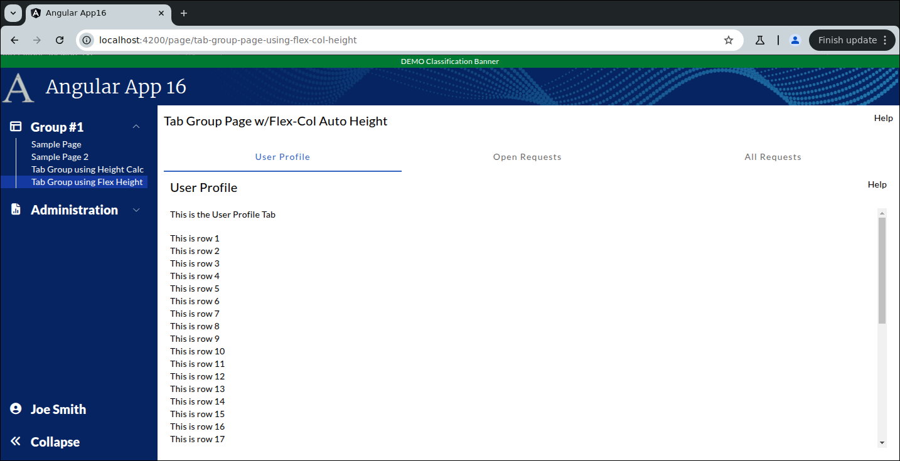

```
Exercise 5a / Use the Remaining Height in Tabs
----------------------------------------------
Problem:  I'm creating my "Details Page" and it will have a Tab Group
          I want each tab to use the *REMAINING HEIGHT*

Approach #1:  Use the height calc to set the height
Approach #2:  Use the flex col trick to grow the height


```

```


     Showing the "User Profile" tab
     +----------------------------------------------------------------------+
     | Tab Group Page w/Height Calc                                    Help |
     +----------------------------------------------------------------------+
     |                                                                      |
     |  +------------------+-----------------------+---------------------+  |
     |  | User Profile Tab | Open Requests Tab     | All Requests Tab    |  |
     |  +------------------+-----------------------+---------------------+  |
     |  | User Profile                                                   |  |
     |  |                                                                |  |    Each tab uses the
     |  | This is the User Profile Tab                                   |  |      **REMAINING**
     |  |                                                                |  |         Height
     |  |                                                                |  |
     |  |                                                                |  |
     |  +----------------------------------------------------------------+  |
     +----------------------------------------------------------------------+


	Showing the "Open Requests" tab
	+----------------------------------------------------------------------+
    | Tab Group Page w/Height Calc                                    Help |
	+----------------------------------------------------------------------+
	|                                                                      |
	|  +------------------+-----------------------+---------------------+  |
    |  | User Profile Tab | Open Requests Tab     | All Requests Tab    |  |
	|  +------------------+-----------------------+---------------------+  |
	|  | Open Requests                                                  |  |
	|  |                                                                |  |
	|  | This is the Open Requests Tab                                  |  |
	|  |                                                                |  |
	|  |                                                                |  |
	|  |                                                                |  |
	|  |                                                                |  |
	|  +----------------------------------------------------------------+  |
	+----------------------------------------------------------------------+


	Showing the "All Requests" tab
	+----------------------------------------------------------------------+
    | Tab Group Page w/Height Calc                                    Help |
	+----------------------------------------------------------------------+
	|                                                                      |
	|  +------------------+-----------------------+---------------------+  |
    |  | User Profile Tab | Open Requests Tab     | All Requests Tab    |  |
	|  +------------------+-----------------------+---------------------+  |
	|  | All Requests                                                   |  |
	|  |                                                                |  |
	|  | This is the All Requests Tab                                   |  |
	|  |                                                                |  |
	|  |                                                                |  |
	|  |                                                                |  |
	|  |                                                                |  |
	|  +----------------------------------------------------------------+  |
	+----------------------------------------------------------------------+


Part 1 / Build the Tabs using the Height Calc Trick
---------------------------------------------------
 1. Setup the Page
    a. Generate the component:                Call it TabGroupUsingHeightCalcPage
    b. Add the route to constants.ts:         the route will be this:   page/tab-group-page-using-height-calc
    c. Register the route
    d. Add the route to the database table:  ui_controls        (if using real security)
    e. Add a link to the navbar (using that route)
    f. Use the debugger to verify that the navbar link works


 2. Setup this page layout
     +-------------------------------------------------------------------+
     | Tab Group Page w/Height Calc                                 Help |
     +-------------------------------------------------------------------+
     | Bottom of Page                                                    |
     |                                                                   |
     +-------------------------------------------------------------------+


 3. Create a component for each tab
    NOTE:  Create these components in the same directory as your tab group page
 	a. Create this component:   TabUserProfile
 	b. Create this component:   TabOpenRequests
 	c. Create this component:   TabAllRequests


 4. Create the tab-group by adding a <mat-tab-group> tag to the main page


 5. Add each tab **COMPONENT** to the <mat-tab-group>


 6. Within each tab, create a simple outline with a tab title and a one-liner
	-- Setup each tab with a title and a one-sentence description

	Showing the "User Profile" tab
	+----------------------------------------------------------------------+
	| Tab Group Page                                                  Help |
	+----------------------------------------------------------------------+
	|                                                                      |
	|  +------------------+-----------------------+---------------------+  |
    |  | User Profile Tab | Open Requests Tab     | All Requests Tab    |  |
	|  +------------------+-----------------------+---------------------+  |
	|  | User Profile                                                   |  |
	|  |                                                                |  |
	|  | This is the User Profile Tab                                   |  |
	|  |                                                                |  |
	|  |                                                                |  |
	|  |                                                                |  |
	|  |                                                                |  |
	|  +----------------------------------------------------------------+  |
	+----------------------------------------------------------------------+


 7. Update the User Profile Tab HTML / Add a for loop so that it shows 50 rows


 8. Have the tab use *REMAINING VISIBLE HEIGHT* of the web browser using the *HEIGHT CALC* trick
	-- At this point, you have 3 somewhat empty tabs


Part 2 / Build the Tabs using flex-col to grow the height automatically
-----------------------------------------------------------------------
 1. Setup the Page
    a. Generate the component:                Call it TabGroupUsingFlexColHeightPage
    b. Add the route to constants.ts:         the route will be this:   page/tab-group-page-using-flex-col-height
    c. Register the route
    d. Add the route to the database table:  ui_controls        (if using real security)
    e. Add a link to the navbar (using that route)
    f. Use the debugger to verify that the navbar link works


 2. Setup this page layout
     +-------------------------------------------------------------------+
     | Tab Group Page w/Flex-Col Height                             Help |
     +-------------------------------------------------------------------+
     | Bottom of Page                                                    |
     |                                                                   |
     +-------------------------------------------------------------------+


 3. Change the page so uses flex-col to automatically grow the bottom of the page


 4. Add the tab group to the bottom of the page


 5. Add the tabs inside the tab group


 6. Make sure the tabs stay *INSIDE* the tab group
    -- Add the overflow-y-hidden to the <mat-tab-group>


 7. Change the User Profile tabs so that they use flex-col to grow the height automatically


```