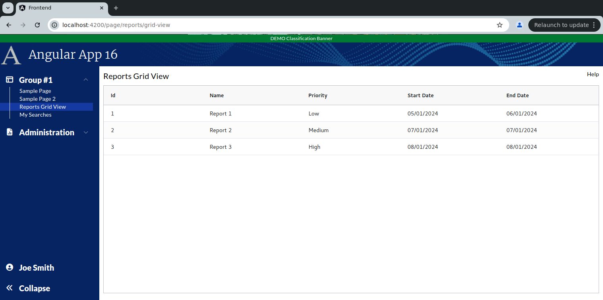

```
Exercise 11a / Client Grid / Add Grid Page  (Answers)
-----------------------------------------------------
Problem:  I want to create a full-size grid page that uses the ag-grid client-side grid

```

```


Exercise
--------
 1. Setup the Page
    a. Generate the component:                Call it ReportsGridView
    b. Add the route to constants.ts:         the route will be this:   page/reports/grid-view
    c. Register the route
    d. Add the route to the database table:  ui_controls        (if using real security)
    e. Add a link to the navbar (using that route)
    f. Use the debugger to verify that the navbar link works


 2. Setup this page layout
     +-------------------------------------------------------------------+
     | Reports Grid View                                            Help |
     +-------------------------------------------------------------------+
     |                                                                   |
     |                                                                   |
     +-------------------------------------------------------------------+


     At this point, the HTML looks like this
     ---------------------------------------      
        <div class="m-2.5">
        
         <!-- Top of Page -->
          <div class="grid grid-cols-2">
              <div>
                <span class="text-xl">Reports Grid View</span>
              </div>
        
              <div class="flex place-content-end">
                 Help
              </div>
          </div>
        
          <!-- Bottom of Page  -->
          <div class="mt-2.5">
              
            
          </div>
        
        </div>


 3. Change the bottom of the page so use the VISIBLE height of the browser
     +-------------------------------------------------------------------+
     | Reports Grid View                                            Help |
     +-------------------------------------------------------------------+
     | Grid is here                                                      |   Height of the bottom of page *STRETCHES*
     |                                                                   |
     +-------------------------------------------------------------------+
 
        <div class="m-2.5">
        
          <div class="grid grid-cols-2">
              <div>
                <span class="text-xl">Reports Grid View</span>
              </div>
        
              <div class="flex place-content-end">
                 Help
              </div>
          </div>
        
          <div class="mt-2.5">
              <!-- Add Grid Here -->
              <div class="overflow-y-auto" style="height: calc(100vh - 150px)">
        
                Grid is here
        
              </div>
        
          </div>
        
        
        </div>

 
 
 4. Add a public class variable:   gridOpptions
    -- The type is GridOptions
    
    -- Set these properties
        domLayout: 'normal',            // Requires the wrapper div to have a height set *OR* a class="h-full" on it
        debug: false,
        rowModelType: 'clientSide',   
        
        
        public gridOptions: GridOptions = {
          domLayout: 'normal',
          debug: true,
          rowModelType: 'clientSide'
        };
        
        
  5. Add a public class variable:  columnDefs
    -- The type is array of ColDef objects
    
    -- Initialize the array to hold an object for each column definition
    
    a. Define columnDefs to hold an array of 5 objects
        the field names will be
                id
                name
                priority
                start_date
                end_date


            public columnDefs: ColDef[] = [
              {
                field: 'id'
              },
              {
                field: 'name'
              },
              {
                field: 'priority'
              },
              {
                field: 'start_date'
              },
              {
                field: 'end_date'}
            ];                
                
                
 6. Add a public class variable:  defaultColumnDef
    -- The type is ColDef
    -- Initialize it so that flex = 1, sortable = true, filter = true, floatingFilter = true

        public defaultColumnDef: ColDef = {
          flex: 1,
          sortable: true,
          filter: true,
          floatingFilter: true
        }
        
        
 
 7. Create a DTO:  rowDataDTO
        id          // This is numeric
        name        // Every will hold text
        priority    // Every will hold text -- e.g., 'Low', 'Medium', or 'high'
        start_date  // This will hold text -- e.g., '05/01/2024'
        end_date    // This will hold text -- e.g., '06/01/2024'
   
   
        export class RowDataDTO {
          public id:         number;
          public name:       string;
          public priority:   string;
          public start_date: string;
          public end_date:   string;
        }


                 
 7. Add a public class variable:  rowData
    -- The type is an array of rowDataDTO objects
    -- Initialize this to be an array of 3 objects
    -- Put in some fake data
               
    public rowData: RowDataDTO[] = [
        {
          id: 1,
          name: 'Report 1',
          priority: 'Low',
          start_date: '05/01/2024',
          end_date: '06/01/2024'
        },
        {
          id: 2,
          name: 'Report 2',
          priority: 'Medium',
          start_date: '07/01/2024',
          end_date: '07/01/2024'
        },
        {
          id: 3,
          name: 'Report 3',
          priority: 'High',
          start_date: '08/01/2024',
          end_date: '08/01/2024'
        },
      ];
      
 
 8. Add the <ag-grid-angular> tag to your page 
    -- Place it where you want your grid to appear
    
    
 
 9. Tell the ag-grid-angular to use your class variables
    -- Set gridOptions property     to your public class variable
    -- Set columnDefs property      to use your public class variable
    -- Set defaultColDef property   to use your public class variable
    -- Set rowData property          to use your public class variable
    -- Set the grid to use 100% of the width 
    -- Set the grid to use 100% of the height
    -- Apply the ag-theme-alpine class to the grid (to set the grid's theme to "alpine"
    
        <ag-grid-angular
          [gridOptions]="this.gridOptions"
          [columnDefs]="this.columnDefs"
          [defaultColDef]="this.defaultColumnDef"
          [rowData]="this.rowData"
        ></ag-grid-angular>


10. Change the column headers so it shows "Start Date" instead of "Start_date"
    Change the column headers so it shows "End Date" instead of "End_date"

        public columnDefs: ColDef[] = [
          {
            headerName: 'Id',
            field: 'id'
          },
          {
            headerName: 'Name',
            field: 'name'
          },
          {
            headerName: 'Priority',
            field: 'priority'
          },
          {
            headerName: 'Start Date',
            field: 'start_date',
    
          },
          {
            headerName: 'End Date',
            field: 'end_date'}
        ];


    The Completed TypeScript looks like this
    ----------------------------------------
    import { Component } from '@angular/core';
    import {ColDef, GridOptions} from "ag-grid-community";
    import {RowDataDTO} from "../../models/row-data-dto";
    
    @Component({
      selector: 'app-reports-grid-view',
      templateUrl: './reports-grid-view.component.html',
      styleUrls: ['./reports-grid-view.component.scss']
    })
    export class ReportsGridViewComponent {
    
        public gridOptions: GridOptions = {
          domLayout: 'normal',
          debug: true,
          rowModelType: 'clientSide'
        };
    
    
        public columnDefs: ColDef[] = [
          {
            headerName: 'Id',
            field: 'id'
          },
          {
            headerName: 'Name',
            field: 'name'
          },
          {
            headerName: 'Priority',
            field: 'priority'
          },
          {
            headerName: 'Start Date',
            field: 'start_date',
    
          },
          {
            headerName: 'End Date',
            field: 'end_date'}
        ];
    
    
        public defaultColumnDef: ColDef = {
          flex: 1,
          sortable: true
        }
    
    
        public rowData: RowDataDTO[] = [
            {
              id: 1,
              name: 'Report 1',
              priority: 'Low',
              start_date: '05/01/2024',
              end_date: '06/01/2024'
            },
            {
              id: 2,
              name: 'Report 2',
              priority: 'Medium',
              start_date: '07/01/2024',
              end_date: '07/01/2024'
            },
            {
              id: 3,
              name: 'Report 3',
              priority: 'High',
              start_date: '08/01/2024',
              end_date: '08/01/2024'
            },
          ];
    
    }
 
 
    The Completed HTML looks like this
    ----------------------------------
    <div class="m-2.5">
    
      <div class="grid grid-cols-2">
          <div>
            <span class="text-xl">Reports Grid View</span>
          </div>
    
          <div class="flex place-content-end">
             Help
          </div>
      </div>
    
      <div class="mt-2.5">
         
          <div class="overflow-y-auto" style="height: calc(100vh - 145px)">
    
            <!-- A C T U A L        G R I D      -->
            <ag-grid-angular class="w-full h-full ag-theme-alpine"
              [gridOptions]="this.gridOptions"
              [columnDefs]="this.columnDefs"
              [defaultColDef]="this.defaultColumnDef"
              [rowData]="this.rowData"
            ></ag-grid-angular>
    
          </div>
    
      </div>
    
    
    </div>

 
```
