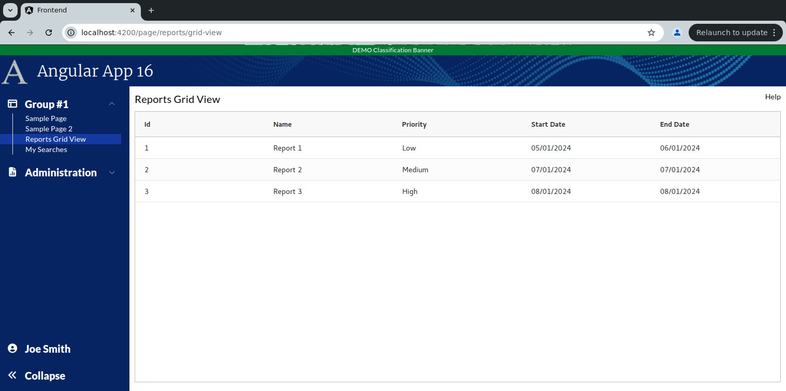

```
Exercise 11a / Client Grid / Add Grid Page
-----------------------------------------------------
Problem:  I want to create a full-size grid page that uses the ag-grid client-side grid

```

```


Exercise
--------
 1. Setup the Page
    a. Generate the component:                Call it ReportsGridView
    b. Add the route to constants.ts:         the route will be this:   page/reports/grid-view
    c. Register the route
    d. Add the route to the database table:  ui_controls        (if using real security)
    e. Add a link to the navbar (using that route)
    f. Use the debugger to verify that the navbar link works


 2. Setup this page layout
     +-------------------------------------------------------------------+
     | Reports Grid View                                            Help |
     +-------------------------------------------------------------------+
     |                                                                   |
     |                                                                   |
     +-------------------------------------------------------------------+


 3. Change the bottom of the page so use the VISIBLE height of the browser
     +-------------------------------------------------------------------+
     | Reports Grid View                                            Help |
     +-------------------------------------------------------------------+
     | Grid is here                                                      |   Height of the bottom of page *STRETCHES*
     |                                                                   |
     +-------------------------------------------------------------------+
 
 
 
 4. Add a public class variable:   gridOpptions
    -- The type is GridOptions
    
    -- Set these properties
        domLayout: 'normal',            // Requires the wrapper div to have a height set *OR* a class="h-full" on it
        debug: false,
        rowModelType: 'clientSide',   
        
        
        
  5. Add a public class variable:  columnDefs
    -- The type is array of ColDef objects
    
    -- Initialize the array to hold an object for each column definition
    
    a. Define columnDefs to hold an array of 5 objects
        the field names will be
                id
                name
                priority
                start_date
                end_date
          
                
                
 6. Add a public class variable:  defaultColumnDef
    -- The type is ColDef
    -- Initialize it so that flex = 1, sortable = true, filter = true, floatingFilter = true


 
 7. Create a DTO:  rowDataDTO
        id          // This is numeric
        name        // Every will hold text
        priority    // Every will hold text -- e.g., 'Low', 'Medium', or 'high'
        start_date  // This will hold text -- e.g., '05/01/2024'
        end_date    // This will hold text -- e.g., '06/01/2024'
   

                 
 7. Add a public class variable:  rowData
    -- The type is an array of rowDataDTO objects
    -- Initialize this to be an array of 3 objects
    -- Put in some fake data
  
      
 
 8. Add the <ag-grid-angular> tag to your page 
    -- Place it where you want your grid to appear
 
 
 
 9. Tell the ag-grid-angular to use your class variables
    -- Set gridOptions property     to your public class variable
    -- Set columnDefs property      to use your public class variable
    -- Set defaultColDef property   to use your public class variable
    -- Set rowData property          to use your public class variable
    -- Set the grid to use 100% of the width 
    -- Set the grid to use 100% of the height
    -- Apply the ag-theme-alpine class to the grid (to set the grid's theme to "alpine"
    
 

10. Change the column header's so it shows "Start Date" instead of "Start_date"

  
 
```
