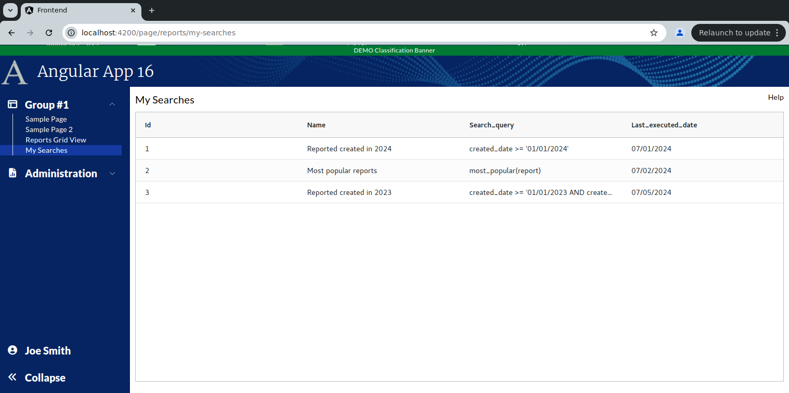

```
Exercise 11b / Client Grid / Load the grid with a frontend service
------------------------------------------------------------------
Problem:  I want to load the grid from a REST call
Solution: Once the grid is initialized, invoke the REST call to load the grid

```

```


Exercise
--------
 1. Setup the Page
    a. Generate the component:                Call it MySearchesGrid
    b. Add the route to constants.ts:         the route will be this:   page/reports/my-searches
    c. Register the route
    d. Add the route to the database table:  ui_controls        (if using real security)
    e. Add a link to the navbar (using that route)
    f. Use the debugger to verify that the navbar link works


 2. Setup this page layout
     +-------------------------------------------------------------------+
     | My Searches                                                  Help |
     +-------------------------------------------------------------------+
     |                                                                   |
     |                                                                   |
     +-------------------------------------------------------------------+


 3. Change the bottom of the page so use the VISIBLE height of the browser
     +-------------------------------------------------------------------+
     | My Searches                                                  Help |
     +-------------------------------------------------------------------+
     | Grid is here                                                      |   Height of the bottom of page *STRETCHES*
     |                                                                   |
     +-------------------------------------------------------------------+
 

 
    
Part 2 / Configure the gridOptions, columnDefs, defaultColumnDefs, and rowData
-------------------------------------------------------------------------------
 1. Add a public class variable:   gridOpptions
    -- The type is GridOptions
    
    -- Set these properties
        domLayout: 'normal',            // Requires the wrapper div to have a height set *OR* a class="h-full" on it
        debug: false,
        rowModelType: 'clientSide',   
        
        

        
 2. Add a public class variable:  columnDefs
    -- The type is array of ColDef objects
    
    -- Initialize the array to hold an object for each column definition
    
    a. Define columnDefs to hold an array of 4 objects
        the field names will be
                id
                name
                search_query
                last_executed_date
                
        
                
                
 3. Add a public class variable:  defaultColumnDef
    -- The type is ColDef
    -- Initialize it so that flex = 1, sortable = true

     
                
 
 6. Add the <ag-grid-angular> tag to your HTML 
    -- Place it where you want your grid to appear
    
    
 
 7. Tell the ag-grid-angular to use your class variables
    -- Set gridOptions property     to your public class variable
    -- Set columnDefs property      to use your public class variable
    -- Set defaultColDef property   to use your public class variable
    -- Set the grid to use 100% of the width 
    -- Set the grid to use 100% of the height
    -- Apply the ag-theme-alpine class to the grid (to set the grid's theme to "alpine"
    
 
At this point, the grid is shows "Loading..." because there is nothing       
```

```


Part 3 / Create the Frontend Service that will simulate a REST call (fake service)
----------------------------------------------------------------------------------
 1. Create a frontend DTO:  SavedSearchDTO
        id                  // This is numeric
        name                // Every will hold text
        search_query        // Every will hold text 
        last_executed_date  // This will hold text -- e.g., '05/01/2024'
   


 2. Create a frontend service:  MySearchService
     a. Create this front-end service:  MySearchService 
     
     b. Add a public method:  getUsersSavedSearches() 
        NOTE:  This method returns an observable that holds an array of SavedSearchDTO

     c. Fill-in this public method
        1) Create a local variable that holds an array of SavedSearchDTO objects 
        2) Fill-in the array with 3 fake objects
        3) Convert the array into an observable
        4) Return the observable

    


Part 4 / Configure the grid to load it's rowData with the fake service
----------------------------------------------------------------------
 1, In the Grid Page TypeScript / Inject your MySearchService
  
 
 2. In the Grid Page TypeScript / Add these 2 public class variables:
    
    
    
 3.  In the Grid Page TypeScript / Add a method:  onGridReady
    -- Pass-in aParams / type is GridReadyEvent
    -- initialize this.gridAPi
    -- initialize this.gridColumnApi
    -- Use the gridApi to show the "loading overlay"
    -- Invoke the fake REST call (you made in the previous step)
    -- When the REST call comes in, set the grid row data
    
    
 
 4. In the HTML, tell the grid to call your onGridReady() when the grid is fully initialized
 
  


```

