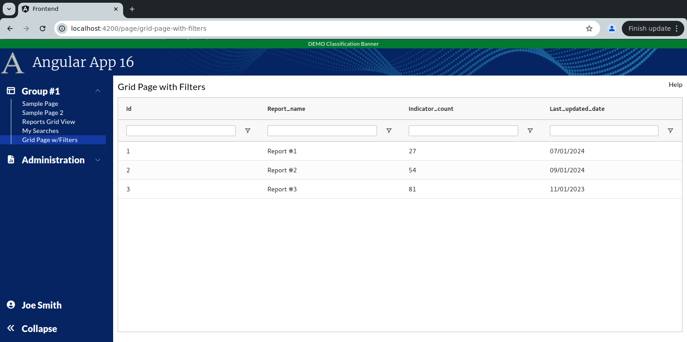
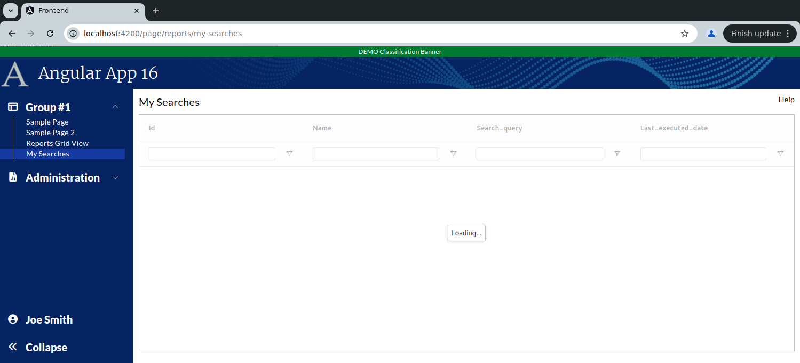

```
Exercise 11c / Client Grid / Add Text Filters  (Answers)
--------------------------------------------------------
Problem:  How do I activate and customize the client-side grid filters
Solution: Make sure you have floatingFilter=TRUE, filter set to the filter type, and filterParams set i


      // Customize the filters (when turned on)
      private textFilterParams: ITextFilterParams = {
        filterOptions: ['contains', 'notContains'],         // Customize the filter to only show "Contains" and "Not Contains"
        caseSensitive: false,                               // Filter is case-insensitive
        debounceMs: 200,
        filterParams.maxNumConditions: 1                    // This causes the and/or condition to be suppressed                       
      };
    
      // By default, turn on the floating filters on all columns
      public defaultColumnDef: ColDef = {
        flex: 1,
        sortable: true,
        floatingFilter: true,                   // Show the floating filter (beneath the column label)
        filter: 'agTextColumnFilter',           // Specify the type of filter
        filterParams: this.textFilterParams,    // Customize the filter
      }
    

```

```


Exercise
--------
 1. Setup the Page
    a. Generate the component:                Call it GridPageWithFilters
    b. Add the route to constants.ts:         the route will be this:   page/grid-page-with-filters
    c. Register the route
    d. Add the route to the database table:  ui_controls        (if using real security)
    e. Add a link to the navbar (using that route)
    f. Use the debugger to verify that the navbar link works


 2. Setup this page layout
     +-------------------------------------------------------------------+
     | Grid Page with Filters                                       Help |
     +-------------------------------------------------------------------+
     |                                                                   |
     |                                                                   |
     +-------------------------------------------------------------------+


     At this point, the HTML looks like this
     ---------------------------------------      
        <div class="m-2.5">
        
         <!-- Top of Page -->
          <div class="grid grid-cols-2">
              <div>
                <span class="text-xl">Grid Page with Filters</span>
              </div>
        
              <div class="flex place-content-end">
                 Help
              </div>
          </div>
        
          <!-- Bottom of Page  -->
          <div class="mt-2.5">
              
            
          </div>
        
        </div>


 3. Change the bottom of the page so use the VISIBLE height of the browser
     +-------------------------------------------------------------------+
     | Grid Page with Filters                                       Help |
     +-------------------------------------------------------------------+
     | Grid is here                                                      |   Height of the bottom of page *STRETCHES*
     |                                                                   |
     +-------------------------------------------------------------------+
 
        <div class="m-2.5">
        
          <div class="grid grid-cols-2">
              <div>
                <span class="text-xl">Grid Page with Filters</span>
              </div>
        
              <div class="flex place-content-end">
                 Help
              </div>
          </div>
        
          <div class="mt-2.5">
              <!-- Add Grid Here -->
              <div class="overflow-y-auto" style="height: calc(100vh - 150px)">
        
                Grid is here
        
              </div>
        
          </div>
        
        
        </div>


 
    
Part 2 / Configure the gridOptions, columnDefs, defaultColumnDefs, and rowData
-------------------------------------------------------------------------------
 1. Add a public class variable:   gridOpptions
    -- The type is GridOptions
    
    -- Set these properties
        domLayout: 'normal',            // Requires the wrapper div to have a height set *OR* a class="h-full" on it
        debug: false,
        rowModelType: 'clientSide',   
        
        
        public gridOptions: GridOptions = {
          domLayout: 'normal',
          debug: true,
          rowModelType: 'clientSide'
        };
        
        
 2. Add a public class variable:  columnDefs
    -- The type is array of ColDef objects
    
    -- Initialize the array to hold an object for each column definition
    
    a. Define columnDefs to hold an array of 4 objects
        the field names will be
                id
                report_name
                indicator_count
                last_updated_date
                


            public columnDefs: ColDef[] = [
              {
                field: 'id'
              },
              {
                field: 'report_name'
              },
              {
                field: 'indicator_count'
              },
              {
                field: 'last_updated_date'
              }
            ];                
                
                
 3. Add class variables to TURN ON FILTERS on all columns
    a. Add a class variable:  textFilterParams     
        
             // Customize the filters (when turned on)
             private textFilterParams: ITextFilterParams = {
                filterOptions: ['contains', 'notContains'],         // Customize the filter to only show "Contains" and "Not Contains"
                caseSensitive: false,                               // Filter is case-insensitive
                debounceMs: 200,
                filterParams.maxNumConditions: 1                    // This causes the and/or condition to be suppressed
              };
      
    b. Add a class variable:  defaultColumnDefs
       -- The type is ColDef
       -- Initialize it so that flex = 1, sortable = true, filter = true, floatingFilter = true

            public defaultColumnDef: ColDef = {
                flex: 1,
                sortable: true,
                floatingFilter: true,                   // Show the floating filter (beneath the column label)
                filter: 'agTextColumnFilter',           // Specify the type of filter
                filterParams: this.textFilterParams,    // Customize the filter
            }
                
 
 
 4. Add the <ag-grid-angular> tag to your HTML 
    -- Place it where you want your grid to appear
    
    
 
 5. Tell the ag-grid-angular to use your class variables
    -- Set gridOptions property     to your public class variable
    -- Set columnDefs property      to use your public class variable
    -- Set defaultColDef property   to use your public class variable
    -- Set the grid to use 100% of the width 
    -- Set the grid to use 100% of the height
    -- Apply the ag-theme-alpine class to the grid (to set the grid's theme to "alpine"
    
        <ag-grid-angular
          [gridOptions]="this.gridOptions"
          [columnDefs]="this.columnDefs"
          [defaultColDef]="this.defaultColumnDef"
        ></ag-grid-angular>


        -- At this point, the grid is shows "Loading..." because there is nothing
```

```


Part 3 / Create the Frontend Service that will simulate a REST call (fake service)
----------------------------------------------------------------------------------
 1. Create a frontend DTO:  GridWithFiltersRowDTO
        id                  // This is numeric
        report_name         // This is text
        indicator_count     // This is numeric 
        last_updated_date   // This is text -- e.g., '05/01/2024'
   
   
        export class GridWithFiltersRowDTO {
          public id:                number;
          public report_name:       string;
          public indicator_count:   number;
          public last_updated_date: string;
        }


 2. Create a frontend service:  MyGridService
     a. Create this front-end service:  MyGridService 
     
     b. Add a public method:  getAllReports() 
        NOTE:  This method returns an observable that holds an array of GridWithFiltersRowDTO

     c. Fill-in this public method
        1) Create a local variable that holds an array of GridWithFiltersRowDTO objects 
        2) Fill-in the array with 3 fake objects
        3) Convert the array into an observable
        4) Return the observable

        
          public getAllReports(): Observable<GridWithFiltersRowDTO[]> {
            let data: GridWithFiltersRowDTO[] = [
              {
                id: 1,
                report_name: 'Report #1',
                indicator_count: 27,
                last_updated_date: '07/01/2024'
              },
              {
                id: 2,
                report_name: 'Report #2',
                indicator_count: 54,
                last_updated_date: '09/01/2024'
              },
              {
                id: 3,
                report_name: 'Report #3',
                indicator_count: 81,
                last_updated_date: '11/01/2023'
              },
            ];
            
            return of(data);
          }


Part 4 / Configure the grid to load it's rowData with the fake service
----------------------------------------------------------------------
 1, In the Grid Page TypeScript / Inject your MySearchService
 
        public constructor(private myGridService: MyGridService) { }
 
 
 
 2. In the Grid Page TypeScript / Add these 2 public class variables:
        gridApi / type is GridApi
        gridColumnApi / type is ColumnApi
    
    
    
 3.  In the Grid Page TypeScript / Add a method:  onGridReady
    -- Pass-in aParams / type is GridReadyEvent
    -- initialize this.gridAPi
    -- initialize this.gridColumnApi
    -- Use the gridApi to show the "loading overlay"
    -- Invoke the fake REST call (you made in the previous step)
    -- When the REST call comes in, set the grid row data
    
    
 
 4. In the HTML, tell the grid to call your onGridReady() when the grid is fully initialized
 
       (gridReady)="this.onGridReady($event)"


```

```

    The Completed MyGridService looks like this
    -------------------------------------------
    import { Injectable } from '@angular/core';
    import {Observable, of} from "rxjs";
    import {GridWithFiltersRowDTO} from "../models/grid-with-filters-row-dto";
    
    @Injectable({
      providedIn: 'root'
    })
    export class MyGridService {
    
      constructor() { }
    
      public getAllReports(): Observable<GridWithFiltersRowDTO[]> {
        let data: GridWithFiltersRowDTO[] = [
          {
            id: 1,
            report_name: 'Report #1',
            indicator_count: 27,
            last_updated_date: '07/01/2024'
          },
          {
            id: 2,
            report_name: 'Report #2',
            indicator_count: 54,
            last_updated_date: '09/01/2024'
          },
          {
            id: 3,
            report_name: 'Report #3',
            indicator_count: 81,
            last_updated_date: '11/01/2023'
          },
        ];
    
        return of(data);
      }
    }
    


    The Completed TypeScript looks like this
    ----------------------------------------
    import { Component } from '@angular/core';
    import {ColDef, ColumnApi, GridApi, GridOptions, GridReadyEvent, ITextFilterParams} from "ag-grid-community";
    import {MyGridService} from "../../services/my-grid.service";
    import {GridWithFiltersRowDTO} from "../../models/grid-with-filters-row-dto";
    
    @Component({
      selector: 'app-grid-page-with-filters',
      templateUrl: './grid-page-with-filters.component.html',
      styleUrls: ['./grid-page-with-filters.component.scss']
    })
    export class GridPageWithFiltersComponent {
    
        public gridOptions: GridOptions = {
          domLayout: 'normal',
          debug: false,
          rowModelType: 'clientSide'
        };
    
      public columnDefs: ColDef[] = [
        {
          field: 'id'
        },
        {
          field: 'report_name'
        },
        {
          field: 'indicator_count'
        },
        {
          field: 'last_updated_date'
        }
      ];
    
    
      private textFilterParams: ITextFilterParams = {
        filterOptions: ['contains', 'notContains'],         // Customize the filter to only show "Contains" and "Not Contains"
        caseSensitive: false,                               // Filter is case-insensitive
        debounceMs: 200,
        suppressAndOrCondition: true
      };
    
    
      public defaultColumnDef: ColDef = {
        flex: 1,
        sortable: true,
        filter: 'agTextColumnFilter',           // Turn on the filters for this column
        filterParams: this.textFilterParams,    // Customize the filter
      }
    
      private gridApi: GridApi;
      private gridColumnApi: ColumnApi;
    
      public constructor(private myGridService: MyGridService) { }
    
      public onGridReady(aParams: GridReadyEvent): void {
        this.gridApi = aParams.api;
        this.gridColumnApi = aParams.columnApi;
    
        // Show the loading overlay
        this.gridApi.showLoadingOverlay();
    
        // Invoke the REST call to get the grid data
        this.myGridService.getAllReports().subscribe( (aData: GridWithFiltersRowDTO[]) => {
          // REST call came back with data
    
          // Load the grid with data from the REST call
          this.gridApi.setRowData(aData);
        })
      }
    }
    

 
 
    The Completed HTML looks like this
    ----------------------------------
    <div class="m-2.5">
    
      <div class="grid grid-cols-2">
        <div>
          <span class="text-xl">Grid Page with Filters</span>
        </div>
    
        <div class="flex place-content-end">
          Help
        </div>
      </div>
    
      <div class="mt-2.5">
        <!-- Add Grid Here -->
        <div class="overflow-y-auto" style="height: calc(100vh - 150px)">
    
          <ag-grid-angular class="w-full h-full ag-theme-alpine"
            [gridOptions]="this.gridOptions"
            [columnDefs]="this.columnDefs"
            [defaultColDef]="this.defaultColumnDef"
            (gridReady)="this.onGridReady($event) "
          ></ag-grid-angular>
    
        </div>
    
      </div>
    
    </div>


 
```


```