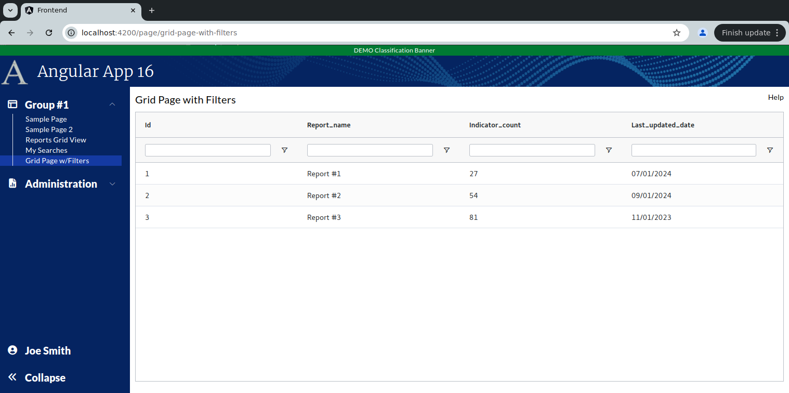

```
Exercise 11c / Client Grid / Add Text Filters
---------------------------------------------
Problem:  How do I activate and customize the client-side grid filters
Solution: Make sure you have filter and filterParams set


```

```


Exercise
--------
 1. Setup the Page
    a. Generate the component:                Call it GridPageWithFilters
    b. Add the route to constants.ts:         the route will be this:   page/grid-page-with-filters
    c. Register the route
    d. Add the route to the database table:  ui_controls        (if using real security)
    e. Add a link to the navbar (using that route)
    f. Use the debugger to verify that the navbar link works


 2. Setup this page layout
     +-------------------------------------------------------------------+
     | Grid Page with Filters                                       Help |
     +-------------------------------------------------------------------+
     |                                                                   |
     |                                                                   |
     +-------------------------------------------------------------------+


 


 3. Change the bottom of the page so use the VISIBLE height of the browser
     +-------------------------------------------------------------------+
     | Grid Page with Filters                                       Help |
     +-------------------------------------------------------------------+
     | Grid is here                                                      |   Height of the bottom of page *STRETCHES*
     |                                                                   |
     +-------------------------------------------------------------------+
 
 
        
        
 
    
Part 2 / Configure the gridOptions, columnDefs, defaultColumnDefs, and rowData
-------------------------------------------------------------------------------
 1. Add a public class variable:   gridOpptions
    -- The type is GridOptions
    
    -- Set these properties
        domLayout: 'normal',            // Requires the wrapper div to have a height set *OR* a class="h-full" on it
        debug: false,
        rowModelType: 'clientSide',   
        
        
        
 2. Add a public class variable:  columnDefs
    -- The type is array of ColDef objects
    -- Initialize the array to hold an object for each column definition
    
    a. Define columnDefs to hold an array of 4 objects
        the field names will be
                id
                report_name
                indicator_count
                last_updated_date
                


                
 3. Add class variables to TURN ON FILTERS on all columns
    a. Add a class variable:  textFilterParams     
       -- The type is ITextFilterParams
       -- Tell it to only show the "Contains" and "Not Contains" options
       -- Tell it to make the filters case-insensitive
       -- Tell it to add a debounce time of 200 msec
       
        STOP HERE:  Let's talk about the filter options and how to apply them to the grid
    
     
    b. Add a class variable:  defaultColumnDefs
       -- The type is ColDef

                    
 
 
 4. Add the <ag-grid-angular> tag to your HTML 
    -- Place it where you want your grid to appear
    
    
 
 5. Tell the ag-grid-angular to use your class variables
    -- Set gridOptions property     to your public class variable
    -- Set columnDefs property      to use your public class variable
    -- Set defaultColDef property   to use your public class variable
    -- Set the grid to use 100% of the width 
    -- Set the grid to use 100% of the height
    -- Apply the ag-theme-alpine class to the grid (to set the grid's theme to "alpine"
    
        -- At this point, the grid is shows "Loading..." because there is nothing
```

```


Part 3 / Create the Frontend Service that will simulate a REST call (fake service)
----------------------------------------------------------------------------------
 1. Create a frontend DTO:  GridWithFiltersRowDTO
        id                  // This is numeric
        report_name         // This is text
        indicator_count     // This is numeric 
        last_updated_date   // This is text -- e.g., '05/01/2024'
   

 2. Create a frontend service:  MyGridService
     a. Create this front-end service:  MyGridService 
     
     b. Add a public method:  getAllReports() 
        NOTE:  This method returns an observable that holds an array of GridWithFiltersRowDTO

     c. Fill-in this public method
        1) Create a local variable that holds an array of GridWithFiltersRowDTO objects 
        2) Fill-in the array with 3 fake objects
        3) Convert the array into an observable
        4) Return the observable

       


Part 4 / Configure the grid to load it's rowData with the fake service
----------------------------------------------------------------------
 1, In the Grid Page TypeScript / Inject your MySearchService
 
        public constructor(private myGridService: MyGridService) { }
 
 
 
 2. In the Grid Page TypeScript / Add these 2 public class variables:
        gridApi / type is GridApi
        gridColumnApi / type is ColumnApi
    
    
    
 3.  In the Grid Page TypeScript / Add a method:  onGridReady
    -- Pass-in aParams / type is GridReadyEvent
    -- initialize this.gridAPi
    -- initialize this.gridColumnApi
    -- Use the gridApi to show the "loading overlay"
    -- Invoke the fake REST call (you made in the previous step)
    -- When the REST call comes in, set the grid row data
    
    
 
 4. In the HTML, tell the grid to call your onGridReady() when the grid is fully initialized
 


```

