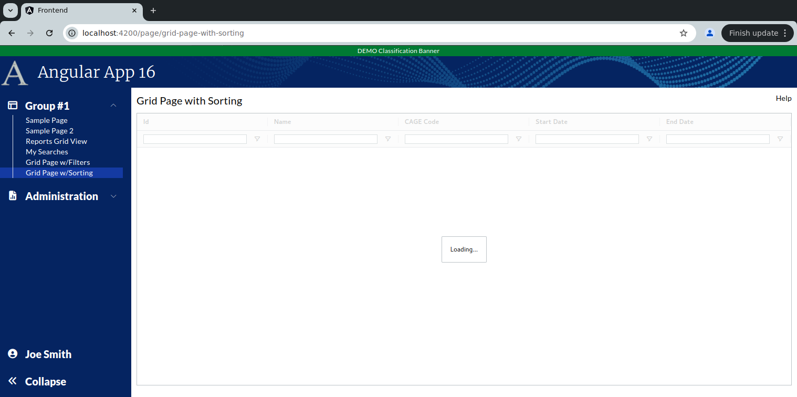

```
Exercise 11d / Client Grid / Sorting  (Answers)
-----------------------------------------------
Problem 1:  In client-Side Grids, How do I sort on text fields?
Problem 2:  In client-side grids, How do I sort on date fields?


```

```


Exercise
--------
 1. Setup the Page
    a. Generate the component:                Call it GridPageWithSorting
    b. Add the route to constants.ts:         the route will be this:   page/grid-page-with-sorting
    c. Register the route
    d. Add the route to the database table:  ui_controls        (if using real security)
    e. Add a link to the navbar (using that route)
    f. Use the debugger to verify that the navbar link works


 2. Setup this page layout
     +-------------------------------------------------------------------+
     | Grid Page with Sorting                                       Help |
     +-------------------------------------------------------------------+
     |                                                                   |
     |                                                                   |
     +-------------------------------------------------------------------+


     At this point, the HTML looks like this
     ---------------------------------------      
        <div class="m-2.5">
        
         <!-- Top of Page -->
          <div class="grid grid-cols-2">
              <div>
                <span class="text-xl">Grid Page with Sorting</span>
              </div>
        
              <div class="flex place-content-end">
                 Help
              </div>
          </div>
        
          <!-- Bottom of Page  -->
          <div class="mt-2.5">
              
            
          </div>
        
        </div>


 3. Change the bottom of the page so use the VISIBLE height of the browser
     +-------------------------------------------------------------------+
     | Grid Page with Sorting                                       Help |
     +-------------------------------------------------------------------+
     | Grid is here                                                      |   Height of the bottom of page *STRETCHES*
     |                                                                   |
     +-------------------------------------------------------------------+
 
        <div class="m-2.5">
        
          <div class="grid grid-cols-2">
              <div>
                <span class="text-xl">Grid Page with Sorting </span>
              </div>
        
              <div class="flex place-content-end">
                 Help
              </div>
          </div>
        
          <div class="mt-2.5">
              <!-- Add Grid Here -->
              <div class="overflow-y-auto" style="height: calc(100vh - 150px)">
        
                Grid is here
        
              </div>
        
          </div>
        
        
        </div>

 
    
Part 2 / Configure the gridOptions, columnDefs, defaultColumnDefs, and rowData 
-------------------------------------------------------------------------------
 1. Add a public class variable:   gridOpptions
    -- The type is GridOptions
    
    -- Set these properties
        domLayout: 'normal',            // Requires the wrapper div to have a height set *OR* a class="h-full" on it
        debug: false,
        rowModelType: 'clientSide',   
        
        
        public gridOptions: GridOptions = {
          domLayout: 'normal',
          debug: true,
          rowModelType: 'clientSide'
        };
        
        
 2. Add a public class variable:  columnDefs
    -- The type is array of ColDef objects
    
    -- Initialize the array to hold an object for each column definition
    
    a. Define columnDefs to hold an array of 5 objects
        the field names will be
                id
                contract_name
                cage_code
                start_date
                end_date
                


          public columnDefs: ColDef[] = [
            {
              field: 'id'
            },
            {
              field: 'contract_name'
            },
            {
              field: 'cage_code'
            },
            {
              field: 'start_date',
            },
            {
              field: 'end_date'
            }
          ];               
                
                
 3. Turn on sorting on *ALL* columns
    -- Define a class variable called defaultColumnDef
    -- The type is ColDef
    -- Initialize it so that flex = 1, sortable = true, filter = true, floatingFilter = true

        public defaultColumnDef: ColDef = {
          flex: 1,
          sortable: true,           // All columns are sortable
        }
        
  
             
 4. Turn on filters on *ALL* columns
    a. Add a class variable:  textFilterParams     
        
             // Customize the filters (when turned on)
             private textFilterParams: ITextFilterParams = {
                filterOptions: ['contains', 'notContains'],         // Customize the filter to only show "Contains" and "Not Contains"
                caseSensitive: false,                               // Filter is case-insensitive
                debounceMs: 200,
                suppressAndOrCondition: true,
              };
      
    b. Add a class variable:  defaultColumnDefs
       -- The type is ColDef
       -- Initialize it so that flex = 1, sortable = true, filter = true, floatingFilter = true

            public defaultColumnDef: ColDef = {
                flex: 1,
                sortable: true,                         // All columns are sortable
                floatingFilter: true,                   // Show the floating filter (beneath the column label)
                filter: 'agTextColumnFilter',           // Specify the type of filter
                filterParams: this.textFilterParams,    // Customize the filter
            }
                        
                
 
 
 5. Add the <ag-grid-angular> tag to your HTML 
    -- Place it where you want your grid to appear
    
    
 
 6. Tell the ag-grid-angular to use your class variables
    -- Set gridOptions property     to your public class variable
    -- Set columnDefs property      to use your public class variable
    -- Set defaultColDef property   to use your public class variable
    -- Set the grid to use 100% of the width 
    -- Set the grid to use 100% of the height
    -- Apply the ag-theme-alpine class to the grid (to set the grid's theme to "alpine"
    
          <ag-grid-angular 
                class="ag-theme-balham w-full h-full"
                [gridOptions]="this.gridOptions"
                [columnDefs]="this.columnDefs"
                [defaultColDef]="this.defaultColumnDef"
          ></ag-grid-angular>


        -- At this point, the grid is shows "Loading..." because there is no row data
```

```


Part 3 / Create the Frontend Service that will simulate a REST call (fake service)
----------------------------------------------------------------------------------
 1. Create a frontend DTO:  GridSortingRowDataDTO
        id                  // This is numeric
        contract_name       // This is text
        cage_code           // This is text 
        start_date          // This is text -- e.g., '05/01/2024'
        end_date            // This is text -- e.g., '05/01/2024'
   
   
        export class GridSortingRowDataDTO {
          public id:               number;
          public contract_name:    string;
          public cage_code:        string;
          public start_date:       string;
          public end_date:         string;
        }


 2. Create a frontend service:  MySearchService
     a. Create this front-end service:  MySearchService 
     
     b. Add a public method:  getAllContracts() 
        NOTE:  This method returns an observable that holds an array of GridSortingRowDataDTO

     c. Fill-in this public method
        1) Create a local variable that holds an array of GridSortingRowDataDTO objects 
        2) Fill-in the array with 3 fake objects
        3) Convert the array into an observable
        4) Return the observable

        NOTE:  Make you use these date values for your first 3 records:
                Contract name      start_date        end_date
                -------------      ---------         --------
                Contract #1        02/01/2023        09/05/2024
                Contract #2        11/05/2023        02/06/2024
                Contract #3        01/05/2024        01/01/2025
        
                    
          public getAllContracts(): Observable<GridSortingRowDataDTO[]> {
            let data: GridSortingRowDataDTO[] = [
              {
                id: 1,
                contract_name: 'Contract #1',
                cage_code:   '6KY98',
                start_date: '02/01/2023',
                end_date: '09/05/2024'
              },
        
              {
                id: 2,
                contract_name: 'Contract #2',
                cage_code:  '66F66',
                start_date: '11/05/2023',
                end_date: '02/06/2024'
              },
              {
                id: 3,
                contract_name: 'Contract #3',
                cage_code:  'ABCDE',
                start_date: '01/05/2024',
                end_date: '01/01/2025'
              },
            ];
        
            return of(data);
          }


Part 4 / Configure the grid to load it's rowData with the fake service
----------------------------------------------------------------------
 1, In the Grid Page TypeScript / Inject your MySearchService
 
        public constructor(private MySearchService: MySearchService) { }
 
 
 
 2. In the Grid Page TypeScript / Add these 2 public class variables:
        gridApi / type is GridApi
        gridColumnApi / type is ColumnApi
    
    
    
 3.  In the Grid Page TypeScript / Add a method:  onGridReady
    -- Pass-in aParams / type is GridReadyEvent
    -- initialize this.gridAPi
    -- initialize this.gridColumnApi
    -- Use the gridApi to show the "loading overlay"
    -- Invoke the fake REST call (you made in the previous step)
    -- When the REST call comes in, set the grid row data
    
  
      public onGridReady(aParams: GridReadyEvent) {
        // Get a reference to the gridApi and gridColumnApi (which we will need later to get selected rows)
        this.gridApi = aParams.api;
        this.gridColumnApi = aParams.columnApi;
    
        // Show the loading overlay
        this.gridApi.showLoadingOverlay();
    
        // Invoke the REST call to get the grid data
        this.mySearchService.getAllContracts().subscribe( (aData: GridSortingRowDataDTO[]) => {
          // REST call came back with data
    
          // Load the grid with data from the REST call
          this.gridApi.setRowData(aData);
        })
    
      }
      
        
 
 4. In the HTML, tell the grid to call your onGridReady() when the grid is fully initialized
 
       (gridReady)="this.onGridReady($event)"


```

```
Houston, we have a problem:  The date fields do *NOT* sort correctly!!!


Part 5 / Get the Date Fields to Sort in a Client Side Grid
----------------------------------------------------------
Problem:  By default client side date fields do not sort -- because the grid treats them as string
Solution: Build a custom "comparator" method that will compare the dates in your date format (in this case MM/DD/YYYY)

 1. Create a DateService
    terminal> cd frontend
    terminal> ng generate service services/date
    


 2. In your DateService / Add a private method that converts the date to a number
 
          private dateToNumber(aDateAsString: string): number | null {
            if (aDateAsString === undefined || aDateAsString === null) {
                return null;
            }
        
            if (aDateAsString.length == 10) {
                // Convert mm/dd/yyyy --> yyyymmdd   (as a number)
                let yearNumber:  string = aDateAsString.substring(6, 10);
                let monthNumber: string = aDateAsString.substring(0, 2);
                let dayNumber:   string = aDateAsString.substring(3, 5);
        
                let resultAsString =  `${yearNumber}${monthNumber}${dayNumber}`;
                return Number(resultAsString);
            }
            else if (aDateAsString.length == 19) {
                // Convert mm/dd/yyyy hh24:mi:ss --> yyyymmddHH24MISS   (as a number)
        
                let yearNumber:   string = aDateAsString.substring(6, 10);
                let monthNumber:  string = aDateAsString.substring(0, 2);
                let dayNumber:    string = aDateAsString.substring(3, 5);
                let hourNumber:   string = aDateAsString.substring(11, 13);
                let minuteNumber: string = aDateAsString.substring(14, 16);
                let secondNumber: string = aDateAsString.substring(17, 19);
        
                let resultAsString =  `${yearNumber}${monthNumber}${dayNumber}${hourNumber}${minuteNumber}${secondNumber}`;
                return Number(resultAsString);
            }
            else {
                return null;
            }
        
          }


    
 3. In your DateService / Add this public method that compares to dates:  dateComparator() that takes-in 2 strings that have dates
     
       public dateComparator(aDate1: string, aDate2: string): number {
            let date1Number = this.dateToNumber(aDate1);
            let date2Number = this.dateToNumber(aDate2);
        
            if (date1Number === null && date2Number === null) {
                return 0;
            }
            if (date1Number === null) {
                return -1;
            }
            if (date2Number === null) {
                return 1;
            }
        
            return date1Number - date2Number;
         }
         
         
  4. In your grid page / Inject your DateService into your grid page
  
  5. In your grid page / Tell your date column to use your dateCompartor() method

      {
    	field: 'start_date',
  		comparator: (a: string, b: string) => this.dateService.dateComparator(a,b)
	  }


  6. Verify that the client side sorting works on your date fields 
     -- Click on the "Start Date" column
     -- Click on the "End Date" column 
     -- Does it sort correctly now?
     
     
     

    The completed DateService looks like this
    -----------------------------------------
    import { Injectable } from '@angular/core';
    
    @Injectable({
      providedIn: 'root'
    })
    export class DateService {
    
      constructor() { }
    
    
      private dateToNumber(aDateAsString: string): number | null {
        if (aDateAsString === undefined || aDateAsString === null) {
          return null;
        }
    
        if (aDateAsString.length == 10) {
          // Convert mm/dd/yyyy --> yyyymmdd   (as a number)
          let yearNumber: string  = aDateAsString.substring(6, 10);
          let monthNumber: string = aDateAsString.substring(0, 2);
          let dayNumber:   string  = aDateAsString.substring(3, 5);
    
          let resultAsString =  `${yearNumber}${monthNumber}${dayNumber}`;
          return Number(resultAsString);
        }
        else if (aDateAsString.length == 19) {
          // Convert mm/dd/yyyy hh24:mi:ss --> yyyymmddHH24MISS   (as a number)
    
          let yearNumber:   string = aDateAsString.substring(6, 10);
          let monthNumber:  string = aDateAsString.substring(0, 2);
          let dayNumber:	  string = aDateAsString.substring(3, 5);
          let hourNumber:   string = aDateAsString.substring(11, 13);
          let minuteNumber: string = aDateAsString.substring(14, 16);
          let secondNumber: string = aDateAsString.substring(17, 19);
    
          let resultAsString =  `${yearNumber}${monthNumber}${dayNumber}${hourNumber}${minuteNumber}${secondNumber}`;
          return Number(resultAsString);
        }
        else {
          return null;
        }
      }
    
    
      public dateComparator(aDate1: string, aDate2: string): number {
        let date1Number = this.dateToNumber(aDate1);
        let date2Number = this.dateToNumber(aDate2);
    
        if (date1Number === null && date2Number === null) {
          return 0;
        }
        if (date1Number === null) {
          return -1;
        }
        if (date2Number === null) {
          return 1;
        }
    
        return date1Number - date2Number;
      }
    
    }
       


    The completed MySearchService looks like this
    ---------------------------------------------
    import { Injectable } from '@angular/core';
    import {Observable, of} from "rxjs";
    import {GridSortingRowDataDTO} from "../models/grid-sorting-row-data-dto";
    
    @Injectable({
      providedIn: 'root'
    })
    export class MySearchService {
    
      constructor() { }
    
    
      public getAllContracts(): Observable<GridSortingRowDataDTO[]> {
        let data: GridSortingRowDataDTO[] = [
          {
            id: 1,
            contract_name: 'Contract #1',
            cage_code:   '6KY98',
            start_date: '02/01/2023',
            end_date: '09/05/2024'
          },
    
          {
            id: 2,
            contract_name: 'Contract #2',
            cage_code:  '66F66',
            start_date: '11/05/2023',
            end_date: '02/06/2024'
          },
          {
            id: 3,
            contract_name: 'Contract #3',
            cage_code:  'ABCDE',
            start_date: '01/05/2024',
            end_date: '01/01/2025'
          },
        ];
    
        return of(data);
      }
    
    }


    The Completed TypeScript looks like this
    ----------------------------------------
    import { Component } from '@angular/core';
    import {ColDef, ColumnApi, GridApi, GridOptions, GridReadyEvent, ITextFilterParams} from "ag-grid-community";
    import {MySearchService} from "../../services/my-search.service";
    import {GridSortingRowDataDTO} from "../../models/grid-sorting-row-data-dto";
    import {DateService} from "../../services/date.service";
    
    @Component({
      selector: 'app-grid-page-with-sorting',
      templateUrl: './grid-page-with-sorting.component.html',
      styleUrls: ['./grid-page-with-sorting.component.scss']
    })
    export class GridPageWithSortingComponent {
    
      public constructor(private mySearchService: MySearchService,
                         private dateService: DateService) { }
    
      private gridApi: GridApi;
      private gridColumnApi: ColumnApi;
    
    
      public gridOptions: GridOptions = {
          domLayout: 'normal',
          debug: false,
          rowModelType: 'clientSide'
        };
    
      public columnDefs: ColDef[] = [
        {
          headerName: 'Id',
          field: 'id'
        },
        {
          headerName: 'Name',
          field: 'contract_name'
        },
        {
          headerName: 'CAGE Code',
          field: 'cage_code'
        },
        {
          headerName: 'Start Date',
          field: 'start_date',
          comparator: (a: string, b: string) => this.dateService.dateComparator(a,b)
        },
        {
          headerName: 'End Date',
          field: 'end_date',
          comparator: (a: string, b: string) => this.dateService.dateComparator(a,b)
        }
      ];
    
    
      // Customize the filters (when turned on)
      private textFilterParams: ITextFilterParams = {
        filterOptions: ['contains', 'notContains'],         // Customize the filter to only show "Contains" and "Not Contains"
        caseSensitive: false,                               // Filter is case-insensitive
        debounceMs: 200,
        suppressAndOrCondition: true,
      };
    
    
      public defaultColumnDef: ColDef = {
        flex: 1,
        sortable: true,                         // All columns are sortable
        floatingFilter: true,                   // Show the floating filter (beneath the column label)
        filter: 'agTextColumnFilter',           // Specify the type of filter
        filterParams: this.textFilterParams,    // Customize the filter
      }
    
      public onGridReady(aParams: GridReadyEvent) {
        // Get a reference to the gridApi and gridColumnApi (which we will need later to get selected rows)
        this.gridApi = aParams.api;
        this.gridColumnApi = aParams.columnApi;
    
        // Show the loading overlay
        this.gridApi.showLoadingOverlay();
    
        // Invoke the REST call to get the grid data
        this.mySearchService.getAllContracts().subscribe( (aData: GridSortingRowDataDTO[]) => {
          // REST call came back with data
    
          // Load the grid with data from the REST call
          this.gridApi.setRowData(aData);
        })
    
      }
    
    
    }

     
 
    The Completed HTML looks like this
    ----------------------------------
    <div class="m-2.5">
    
      <div class="grid grid-cols-2">
        <div>
          <span class="text-xl">Grid Page with Sorting </span>
        </div>
    
        <div class="flex place-content-end">
          Help
        </div>
      </div>
    
      <div class="mt-2.5">
        <!-- Add Grid Here -->
        <div class="overflow-y-auto" style="height: calc(100vh - 150px)">
    
          <ag-grid-angular
              class="ag-theme-balham w-full h-full"
              [gridOptions]="this.gridOptions"
              [columnDefs]="this.columnDefs"
              [defaultColDef]="this.defaultColumnDef"
              (gridReady)="this.onGridReady($event)"
          ></ag-grid-angular>
    
        </div>
    
      </div>
    
    
    </div>
 
```