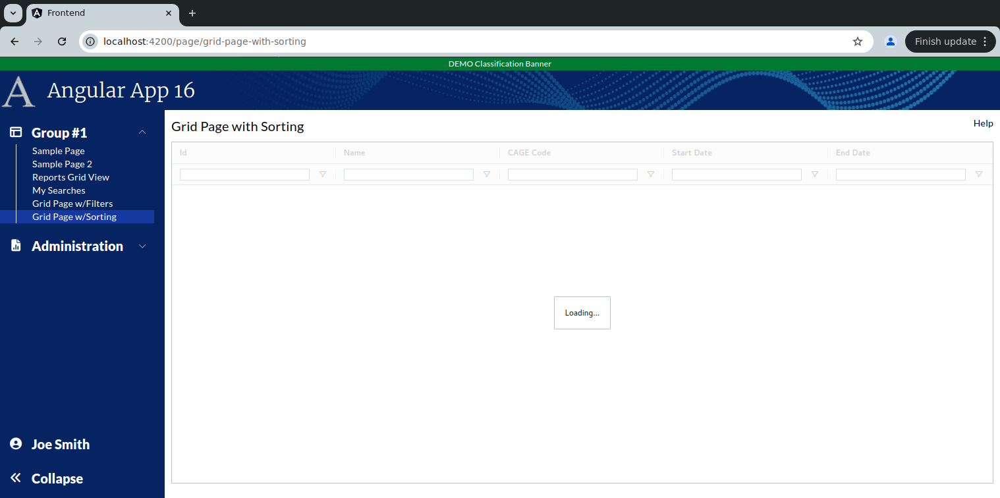

```
Exercise 11d / Client Grid / Sorting
------------------------------------
Problem 1:  In client-Side Grids, How do I sort on text fields?
Problem 2:  In client-side grids, How do I sort on date fields?


```

```


Exercise
--------
 1. Setup the Page
    a. Generate the component:                Call it GridPageWithSorting
    b. Add the route to constants.ts:         the route will be this:   page/grid-page-with-sorting
    c. Register the route
    d. Add the route to the database table:  ui_controls        (if using real security)
    e. Add a link to the navbar (using that route)
    f. Use the debugger to verify that the navbar link works


 2. Setup this page layout
     +-------------------------------------------------------------------+
     | Grid Page with Sorting                                       Help |
     +-------------------------------------------------------------------+
     |                                                                   |
     |                                                                   |
     +-------------------------------------------------------------------+


 3. Change the bottom of the page so use the VISIBLE height of the browser
     +-------------------------------------------------------------------+
     | Grid Page with Sorting                                       Help |
     +-------------------------------------------------------------------+
     | Grid is here                                                      |   Height of the bottom of page *STRETCHES*
     |                                                                   |
     +-------------------------------------------------------------------+
 


 
    
Part 2 / Configure the gridOptions, columnDefs, defaultColumnDefs, and rowData 
-------------------------------------------------------------------------------
 1. Add a public class variable:   gridOpptions
    -- The type is GridOptions
    
    -- Set these properties
        domLayout: 'normal',            // Requires the wrapper div to have a height set *OR* a class="h-full" on it
        debug: false,
        rowModelType: 'clientSide',   
        
        
        
 2. Add a public class variable:  columnDefs
    -- The type is array of ColDef objects
    
    -- Initialize the array to hold an object for each column definition
    
    a. Define columnDefs to hold an array of 5 objects
        the field names will be
                id
                contract_name
                cage_code
                start_date
                end_date
                


 3. Turn on sorting on *ALL* columns
    -- Define a class variable called defaultColumnDef
    -- The type is ColDef
    -- Initialize it so that flex = 1, sortable = true


  
             
 4. Turn on filters on *ALL* columns
    a. Add a class variable:  textFilterParams     
        
      
    b. Add a class variable:  defaultColumnDefs
       -- The type is ColDef
       -- Initialize it so that flex = 1, sortable = true, filter = true, floatingFilter = true
                        
                
 
 
 5. Add the <ag-grid-angular> tag to your HTML 
    -- Place it where you want your grid to appear
    
    
 
 7. Tell the ag-grid-angular to use your class variables
    -- Set gridOptions property     to your public class variable
    -- Set columnDefs property      to use your public class variable
    -- Set defaultColDef property   to use your public class variable
    -- Set the grid to use 100% of the width 
    -- Set the grid to use 100% of the height
    -- Apply the ag-theme-alpine class to the grid (to set the grid's theme to "alpine"
    

        -- At this point, the grid is shows "Loading..." because there is no row data
```

```


Part 3 / Create the Frontend Service that will simulate a REST call (fake service)
----------------------------------------------------------------------------------
 1. Create a frontend DTO:  GridSortingRowDataDTO
        id                  // This is numeric
        contract_name       // Every will hold text
        cage_code           // Every will hold text 
        start_date          // This will hold text -- e.g., '05/01/2024'
        end_date            // This will hold text -- e.g., '05/01/2024'
   
   


 2. Create a frontend service:  MySearchService
     a. Create this front-end service:  MySearchService 
     
     b. Add a public method:  getAllContracts() 
        NOTE:  This method returns an observable that holds an array of GridSortingRowDataDTO

     c. Fill-in this public method
        1) Create a local variable that holds an array of SavedSearchDTO objects 
        2) Fill-in the array with 3 fake objects
        3) Convert the array into an observable
        4) Return the observable

        NOTE:  Make you use these date values for your first 3 records:
                Contract name      start_date        end_date
                -------------      ---------         --------
                Contract #1        02/01/2023        09/05/2024
                Contract #2        11/05/2023        02/06/2024
                Contract #3        01/05/2024        01/01/2025
        
 


Part 4 / Configure the grid to load it's rowData with the fake service
----------------------------------------------------------------------
 1, In the Grid Page TypeScript / Inject your MySearchService
 
 
 2. In the Grid Page TypeScript / Add these 2 public class variables:

    
 3.  In the Grid Page TypeScript / Add a method:  onGridReady
    -- Pass-in aParams / type is GridReadyEvent
    -- initialize this.gridAPi
    -- initialize this.gridColumnApi
    -- Use the gridApi to show the "loading overlay"
    -- Invoke the fake REST call (you made in the previous step)
    -- When the REST call comes in, set the grid row data
    
 
 4. In the HTML, tell the grid to call your onGridReady() when the grid is fully initialized
 
 

```

```
Houston, we have a problem:  The date fields do *NOT* sort correctly!!!


Part 5 / Get the Date Fields to Sort in a Client Side Grid
----------------------------------------------------------
Problem:  By default client side date fields do not sort -- because the grid treats them as string
Solution: Build a custom "comparator" method that will compare the dates in your date format (in this case MM/DD/YYYY)

 1. Create a DateService
  


 2. In your DateService / Add a private method that converts the date to a number
    -- The approach is to convert each date string into a NUMBER
    -- Then compare the numbers
    
    
          private dateToNumber(aDateAsString: string): number | null {
            if (aDateAsString === undefined || aDateAsString === null) {
                return null;
            }
        
            if (aDateAsString.length == 10) {
                // Convert mm/dd/yyyy --> yyyymmdd   (as a number)
                let yearNumber: string  = aDateAsString.substring(6, 10);
                let monthNumber: string = aDateAsString.substring(0, 2);
                let dayNumber:   string  = aDateAsString.substring(3, 5);
        
                let resultAsString =  `${yearNumber}${monthNumber}${dayNumber}`;
                return Number(resultAsString);
            }
            else if (aDateAsString.length == 19) {
                // Convert mm/dd/yyyy hh24:mi:ss --> yyyymmddHH24MISS   (as a number)
        
                let yearNumber:   string = aDateAsString.substring(6, 10);
                let monthNumber:  string = aDateAsString.substring(0, 2);
                let dayNumber:	  string = aDateAsString.substring(3, 5);
                let hourNumber:   string = aDateAsString.substring(11, 13);
                let minuteNumber: string = aDateAsString.substring(14, 16);
                let secondNumber: string = aDateAsString.substring(17, 19);
        
                let resultAsString =  `${yearNumber}${monthNumber}${dayNumber}${hourNumber}${minuteNumber}${secondNumber}`;
                return Number(resultAsString);
            }
            else {
                return null;
            }
        
          }


    
 3. In your DateService / Add this public method that compares to dates:  dateComparator() that takes-in 2 strings that have dates
     
       public dateComparator(aDate1: string, aDate2: string): number {
            let date1Number = this.dateToNumber(aDate1);
            let date2Number = this.dateToNumber(aDate2);
        
            if (date1Number === null && date2Number === null) {
                return 0;
            }
            if (date1Number === null) {
                return -1;
            }
            if (date2Number === null) {
                return 1;
            }
        
            return date1Number - date2Number;
         }
         
         
  4. In your grid page / Inject your DateService into your grid page
  
  5. In your grid page / Tell your date column to use your dateCompartor() method

  6. Verify that the client side sorting works on your date fields 
     -- Click on the "Start Date" column
     -- Click on the "End Date" column 
     -- Does it sort correctly now?

 
 
```