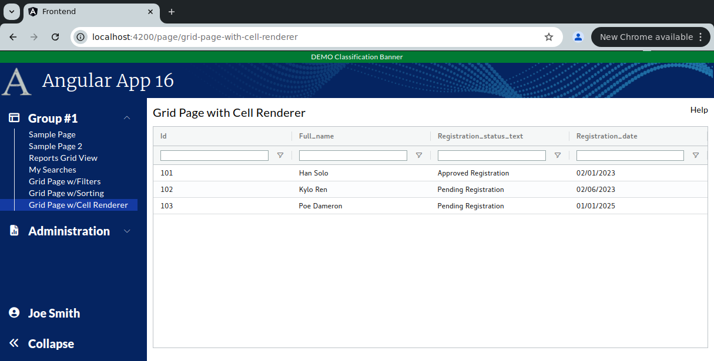

```
Exercise 11e / Client Grid / Format Cells with Cell Renderers  (Answer)
-----------------------------------------------------------------------
Problem 1:  I want to apply CSS to a specific column cell
Problem 2:  I want to display multiple values in a cell
Problem 3:  I want to conditionally show CSS
Problem 4:  I want to show a label with a different color (based on some value)
Solution:   Make a custom cell renderer


```

```


Exercise
--------
 1. Setup the Page
    a. Generate the component:                Call it GridPageWithCellRenderer
    b. Add the route to constants.ts:         the route will be this:   page/grid-page-with-cell-renderer
    c. Register the route
    d. Add the route to the database table:  ui_controls        (if using real security)
    e. Add a link to the navbar (using that route)
    f. Use the debugger to verify that the navbar link works
    


 2. Setup this page layout
     +-------------------------------------------------------------------+
     | Grid Page with Cell Renderer                                 Help |
     +-------------------------------------------------------------------+
     |                                                                   |
     |                                                                   |
     +-------------------------------------------------------------------+


     At this point, the HTML looks like this
     ---------------------------------------      
        <div class="m-2.5">
        
         <!-- Top of Page -->
          <div class="grid grid-cols-2">
              <div>
                <span class="text-xl">Grid Page with Cell Renderer</span>
              </div>
        
              <div class="flex place-content-end">
                 Help
              </div>
          </div>
        
          <!-- Bottom of Page  -->
          <div class="mt-2.5">
              
            
          </div>
        
        </div>


 3. Change the bottom of the page so use the VISIBLE height of the browser
     +-------------------------------------------------------------------+
     | Grid Page with Cell Renderer                                 Help |
     +-------------------------------------------------------------------+
     | Grid is here                                                      |   Height of the bottom of page *STRETCHES*
     |                                                                   |
     +-------------------------------------------------------------------+
 
        <div class="m-2.5">
        
          <div class="grid grid-cols-2">
              <div>
                <span class="text-xl">Grid Page with Cell Renderer</span>
              </div>
        
              <div class="flex place-content-end">
                 Help
              </div>
          </div>
        
          <div class="mt-2.5">
              <!-- Add Grid Here -->
              <div class="overflow-y-auto" style="height: calc(100vh - 150px)">
        
                Grid is here
        
              </div>
        
          </div>
        
        
        </div>

 
    
Part 2 / Configure the gridOptions, columnDefs, defaultColumnDefs, and rowData 
-------------------------------------------------------------------------------
 1. Add a public class variable:   gridOpptions
    -- The type is GridOptions
    
    -- Set these properties
        domLayout: 'normal',            // Requires the wrapper div to have a height set *OR* a class="h-full" on it
        debug: false,
        rowModelType: 'clientSide',   
        
        
        public gridOptions: GridOptions = {
          domLayout: 'normal',
          debug: true,
          rowModelType: 'clientSide'
        };
        
        
 2. Add a public class variable:  columnDefs
    -- The type is array of ColDef objects
    
    -- Initialize the array to hold an object for each column definition
    
    a. Define columnDefs to hold an array of 5 objects
        the field names will be
                id
                full_name
                registration_status_text
                registration_date
                


          public columnDefs: ColDef[] = [
            {
              field: 'id'
            },
            {
              field: 'full_name'
            },
            {
              field: 'registration_status_text'
            },
            {
              field: 'registration_date',
            }
          ];               
                
                
 3. Turn on sorting on *ALL* columns
    -- Define a class variable called defaultColumnDef
    -- The type is ColDef
    -- Initialize it so that flex = 1, sortable = true, filter = true, floatingFilter = true

        public defaultColumnDef: ColDef = {
          flex: 1,
          sortable: true,           // All columns are sortable
        }
        
  
             
 4. Turn on filters on *ALL* columns
    a. Add a class variable:  textFilterParams     
        
             // Customize the filters (when turned on)
             private textFilterParams: ITextFilterParams = {
                filterOptions: ['contains', 'notContains'],         // Customize the filter to only show "Contains" and "Not Contains"
                caseSensitive: false,                               // Filter is case-insensitive
                debounceMs: 200,
                maxNumConditions: 1
              };
      
    b. Update the defaultColumnDefs
        -- Add filter = 'agTextColumnFilter', floatingFilter = true, filterParams is set to your textFilterParams

            public defaultColumnDef: ColDef = {
                flex: 1,
                sortable: true,                         // All columns are sortable
                floatingFilter: true,                   // Show the floating filter (beneath the column label)
                filter: 'agTextColumnFilter',           // Specify the type of filter
                filterParams: this.textFilterParams,    // Customize the filter
            }
                     
 
 
 5. Add the <ag-grid-angular> tag to your HTML 
    -- Place it where you want your grid to appear
    
    
 
 6. Tell the ag-grid-angular to use your class variables
    -- Set gridOptions property     to your public class variable
    -- Set columnDefs property      to use your public class variable
    -- Set defaultColDef property   to use your public class variable
    -- Set the grid to use 100% of the width 
    -- Set the grid to use 100% of the height
    -- Apply the ag-theme-alpine class to the grid (to set the grid's theme to "alpine"
    
          <ag-grid-angular 
                class="ag-theme-balham w-full h-full"
                [gridOptions]="this.gridOptions"
                [columnDefs]="this.columnDefs"
                [defaultColDef]="this.defaultColumnDef"
          ></ag-grid-angular>


        -- At this point, the grid is shows "Loading..." because there is no row data
```

```


Part 3 / Create the Frontend Service that will simulate a REST call (fake service)
----------------------------------------------------------------------------------
 1. Create a frontend DTO:  GridCellRendererRowDataDTO
        id                          // This is numeric
        full_name                   // This is text
        registration_status_text    // This is text
        registration_status_id      // This is numeric 
        registration_date           // This is text -- e.g., '05/01/2024'
   
   
        export class GridCellRendererRowDataDTO {
          public id:                        number;
          public full_name:                 string;
          public registration_status_text:  string;
          public registration_status_id:    number;
          public registration_date:         string;
        }


 2. Create a frontend service:  MySearchService
     a. Create this front-end service:  MySearchService 
     
     b. Add a public method:  getAllUsers() 
        NOTE:  This method returns an observable that holds an array of GridCellRendererRowDataDTO

     c. Fill-in this public method
        1) Create a local variable that holds an array of GridCellRendererRowDataDTO objects 
        2) Fill-in the array with 3 fake objects
        3) Convert the array into an observable
        4) Return the observable

        NOTE:  Make you use these date values for your first 3 records:
             id    full name          registration_status_id  registration_status_text    regustration_date
             ---   -------------      ----------------------  -------------------------   -----------------
             101   Han Solo           3                       Approved Registration        02/01/2023
             102   Kylo Ren           1                       Pending Registration         02/06/2024
             103   Poe Dameron        1                       Pending Registration         01/01/2025
        

          public getAllUsers(): Observable<GridCellRendererRowDataDTO[]> {
            let data: GridCellRendererRowDataDTO[] = [
              {
                id: 101,
                full_name: 'Han Solo',
                registration_status_text: 'Approved Registration',
                registration_status_id: 3,
                registration_date: '02/01/2023'
              },
              {
                id: 102,
                full_name: 'Kylo Ren',
                registration_status_text: 'Pending Registration',
                registration_status_id: 1,
                registration_date: '02/06/2023'
              },
              {
                id: 103,
                full_name: 'Poe Dameron',
                registration_status_text: 'Pending Registration',
                registration_status_id: 1,
                registration_date: '01/01/2025'
              },
            ];
        
            return of(data);
          }
                
                


Part 4 / Configure the grid to load it's rowData with the fake service
----------------------------------------------------------------------
 1, In the Grid Page TypeScript / Inject your MySearchService
 
        public constructor(private MySearchService: MySearchService) { }
 
 
 
 2. In the Grid Page TypeScript / Add these 2 public class variables:
        gridApi / type is GridApi
        gridColumnApi / type is ColumnApi
    
    
    
 3.  In the Grid Page TypeScript / Add a method:  onGridReady
    -- Pass-in aParams / type is GridReadyEvent
    -- initialize this.gridAPi
    -- initialize this.gridColumnApi
    -- Use the gridApi to show the "loading overlay"
    -- Invoke the fake REST call (you made in the previous step)
    -- When the REST call comes in, set the grid row data
    
    
          public onGridReady(aParams: GridReadyEvent) {
            // Get a reference to the gridApi and gridColumnApi (which we will need later to get selected rows)
            this.gridApi = aParams.api;
            this.gridColumnApi = aParams.columnApi;
        
            // Show the loading overlay
            this.gridApi.showLoadingOverlay();
        
            // Invoke the REST call to get the grid data
            this.mySearchService.getAllUsers().subscribe( (aData: GridCellRendererRowDataDTO[]) => {
              // REST call came back with data
        
              // Load the grid with data from the REST call
              this.gridApi.setRowData(aData);
            })
        
          }
 
 4. In the HTML, tell the grid to call your onGridReady() when the grid is fully initialized
 
       (gridReady)="this.onGridReady($event)"


```

```


Part 5 / Get the Registration Date field to sort correctly
----------------------------------------------------------
Problem:  By default client side date fields do not sort -- because the grid treats them as string
 
 1. Inject your Date Service
  
 2. Tell your grid to use your Date Service comparator method

 3. Verify it works by clicking on the "Registration Date" column


Part 6 / Get the "Status" column to show different values based on the status id
--------------------------------------------------------------------------------
 1. Create a component:  registration-status-custom-renderer
 
 2. Edit your cell renderer's typescript 
    a. Change the class so it implements ICellRendererAngularComp

    b. Add the imports
    
    c. Have IntelliJ implement all methods of the interface
    
    d.  Add a public variable called params   (type is ICellRendererParams)
    
    e. Change the agInit() method so that it sets the class variable with the passed-in params
    
    
 3. Edit your cell renderer's HTML 
    a. Create a wrapper div that has padding of 5 pixels
    
    b. Create an inner div that display the actual cell value  (stored in params.value)
    
    c. Conditionally apply a CSS clsas
        If the registration status id == 1, then apply a CSS class called "registration-pending-cell'
        If the registration status id == 3, then apply a CSS class called "registration-approved-cell'
        
    
        <div class="p-[5px]">
          <div [ngClass]="{
                    'registration-pending-cell':  	    this.params.data.registration_status_id == 1,
                    'registration-approved-cell':  	    this.params.data.registration_status_id == 3,
                    }">
            {{params.value}}
          </div>
        </div>
             
 
  4. Add these 2 styles to your frontend/styles.scss
        .registration-pending-cell {
              text-align: center;
              font-size: 1.1em;
              font-weight: 500;
              border-radius: 15px;
              background-color: #ffffb2;
        }
        
        .registration-approved-cell {
              text-align: center;
              font-size: 1.1em;
              font-weight: 500;
              border-radius: 15px;
              background-color: #d8d8d8;
        }

 
  5. Tell your "Registration Status" column to apply the custom cell renderer
  
      {
          field: 'registration_status_text',
          cellRenderer: RegistrationStatusCustomRendererComponent
      },

 ```

```
Custom Cell Renderer V1:  Notice the bottom part of the cells is cut off   (that looks like shit!)
 
 
 
Problem #1:  The Custom Cell Renderer is cut off
------------------------------------------------
Solution:    Use AutoHeight 
Fix the problem in which the bottom part of the custom cell is cut off by setting autoHeight=true on your COLUMN that needs adjustement
  
        {
          field: 'registration_status_text',
          cellRenderer: RegistrationStatusCustomRendererComponent,
          autoHeight: true
        }, 
        
```

```
Custom Cell Renderer V2:  Notice the columns holding text are *NOT* vertically aligned  (still looks like shit!)
 
 
 

Problem #2:  The autoHeight has caused the regular text cells to not be vertically aligned
------------------------------------------------------------------------------------------
Approach #1:  Add autoHeight=true to ALL columns
Approach #2:  Create a custom CSS class and apply it to the regular text-cell columns

 
  1. Create a custom CSS class in styles.scss that has a margin-top of .33em
  
     .grid-text-cell-format {
           margin-top: .33em;	/* Fixes the bug with autoHeight not working in the ag-grid */
      }


  2. Tell ag-grid to apply this class to every regular text column  (not your custom cell renderer)
      
        public columnDefs: ColDef[] = [
            {
              field: 'id',
              cellClass: 'grid-text-cell-format'
            },
            {
              field: 'full_name',
              cellClass: 'grid-text-cell-format'
            },
            {
              field: 'registration_status_text',
              cellRenderer: RegistrationStatusCustomRendererComponent,
              autoHeight: true
            },
            {
              field: 'registration_date',
              cellClass: 'grid-text-cell-format',
              comparator: (a: string, b: string) => this.dateService.dateComparator(a,b)
            }
        ];
      
  
 ```

```
Custom Cell Renderer V3:  The custom cell renderer looks good *AND* the text rows are vertically aligned    
       


    The completed DateService looks like this
    -----------------------------------------
    import { Injectable } from '@angular/core';
    
    @Injectable({
      providedIn: 'root'
    })
    export class DateService {
    
      constructor() { }
    
    
      private dateToNumber(aDateAsString: string): number | null {
        if (aDateAsString === undefined || aDateAsString === null) {
          return null;
        }
    
        if (aDateAsString.length == 10) {
          // Convert mm/dd/yyyy --> yyyymmdd   (as a number)
          let yearNumber: string  = aDateAsString.substring(6, 10);
          let monthNumber: string = aDateAsString.substring(0, 2);
          let dayNumber:   string  = aDateAsString.substring(3, 5);
    
          let resultAsString =  `${yearNumber}${monthNumber}${dayNumber}`;
          return Number(resultAsString);
        }
        else if (aDateAsString.length == 19) {
          // Convert mm/dd/yyyy hh24:mi:ss --> yyyymmddHH24MISS   (as a number)
    
          let yearNumber:   string = aDateAsString.substring(6, 10);
          let monthNumber:  string = aDateAsString.substring(0, 2);
          let dayNumber:	  string = aDateAsString.substring(3, 5);
          let hourNumber:   string = aDateAsString.substring(11, 13);
          let minuteNumber: string = aDateAsString.substring(14, 16);
          let secondNumber: string = aDateAsString.substring(17, 19);
    
          let resultAsString =  `${yearNumber}${monthNumber}${dayNumber}${hourNumber}${minuteNumber}${secondNumber}`;
          return Number(resultAsString);
        }
        else {
          return null;
        }
      }
    
    
      public dateComparator(aDate1: string, aDate2: string): number {
        let date1Number = this.dateToNumber(aDate1);
        let date2Number = this.dateToNumber(aDate2);
    
        if (date1Number === null && date2Number === null) {
          return 0;
        }
        if (date1Number === null) {
          return -1;
        }
        if (date2Number === null) {
          return 1;
        }
    
        return date1Number - date2Number;
      }
    
    }
       


    The completed MySearchService looks like this
    ---------------------------------------------
    import { Injectable } from '@angular/core';
    import {Observable, of} from "rxjs";
    import {GridSortingRowDataDTO} from "../models/grid-sorting-row-data-dto";
    
    @Injectable({
      providedIn: 'root'
    })
    export class MySearchService {
    
       constructor() { }
    
       public getAllUsers(): Observable<GridCellRendererRowDataDTO[]> {
        let data: GridCellRendererRowDataDTO[] = [
          {
            id: 101,
            full_name: 'Han Solo',
            registration_status_text: 'Approved Registration',
            registration_status_id: 3,
            registration_date: '02/01/2023'
          },
          {
            id: 102,
            full_name: 'Kylo Ren',
            registration_status_text: 'Pending Registration',
            registration_status_id: 1,
            registration_date: '02/06/2023'
          },
          {
            id: 103,
            full_name: 'Poe Dameron',
            registration_status_text: 'Pending Registration',
            registration_status_id: 1,
            registration_date: '01/01/2025'
          },
        ];
    
        return of(data);
      }
    
    }


    CSS Classes addeed to the styles.scss
    -------------------------------------
    .registration-pending-cell {
      text-align: center;
      font-size: 1.1em;
      font-weight: 500;
      border-radius: 15px;
      background-color: #ffffb2;
    }
    
    .registration-approved-cell {
      text-align: center;
      font-size: 1.1em;
      font-weight: 500;
      border-radius: 15px;
      background-color: #d8d8d8;
    }
    
    .grid-text-cell-format {
      margin-top: .33em;	/* Fixes the bug with autoHeight not working in the ag-grid */
    }
     
    
    
    The Completed Custom Cell Renderer TypeScript looks like this
    -------------------------------------------------------------
    import { Component } from '@angular/core';
    import {ICellRendererAngularComp} from "ag-grid-angular";
    import {ICellRendererParams} from "ag-grid-community";
    
    @Component({
      selector: 'app-registration-status-custom-renderer',
      templateUrl: './registration-status-custom-renderer.component.html',
      styleUrls: ['./registration-status-custom-renderer.component.scss']
    })
    export class RegistrationStatusCustomRendererComponent implements ICellRendererAngularComp {
      public params: ICellRendererParams;
    
      public agInit(params: ICellRendererParams): void {
        this.params = params;
      }
    
      public refresh(params: ICellRendererParams<any>): boolean {
        return false;
      }
    
    }
   
    
    The Completed Custom Cell Renderer HTML looks like this
    ---------------------------------------------------------   
    <div class="p-[5px]">
      <div [ngClass]="{
                'registration-pending-cell':  	    this.params.data.registration_status_id == 1,
                'registration-approved-cell':  	    this.params.data.registration_status_id == 3,
                }">
        {{params.value}}
      </div>
    </div>


    The Completed Grid Page TypeScript looks like this
    --------------------------------------------------
    import { Component } from '@angular/core';
    import {ColDef, ColumnApi, GridApi, GridOptions, GridReadyEvent, ITextFilterParams} from "ag-grid-community";
    import {MySearchService} from "../../services/my-search.service";
    import {GridCellRendererRowDataDTO} from "../../models/grid-cell-renderer-row-data-dto";
    import {DateService} from "../../services/date.service";
    import {
      RegistrationStatusCustomRendererComponent
    } from "../registration-status-custom-renderer/registration-status-custom-renderer.component";
    
    @Component({
      selector: 'app-grid-page-with-cell-renderer',
      templateUrl: './grid-page-with-cell-renderer.component.html',
      styleUrls: ['./grid-page-with-cell-renderer.component.scss']
    })
    export class GridPageWithCellRendererComponent {
      private gridApi: GridApi;
      private gridColumnApi: ColumnApi;
    
      public gridOptions: GridOptions = {
        domLayout: 'normal',
        debug: true,
        rowModelType: 'clientSide'
      };
    
      public columnDefs: ColDef[] = [
        {
          field: 'id',
          cellClass: 'grid-text-cell-format'
        },
        {
          field: 'full_name',
          cellClass: 'grid-text-cell-format'
        },
        {
          field: 'registration_status_text',
          cellRenderer: RegistrationStatusCustomRendererComponent,
          autoHeight: true
        },
        {
          field: 'registration_date',
          cellClass: 'grid-text-cell-format',
          comparator: (a: string, b: string) => this.dateService.dateComparator(a,b)
        }
      ];
    
    
      // Customize the filters (when turned on)
      private textFilterParams: ITextFilterParams = {
        filterOptions: ['contains', 'notContains'],         // Customize the filter to only show "Contains" and "Not Contains"
        caseSensitive: false,                               // Filter is case-insensitive
        debounceMs: 200,
        maxNumConditions: 1
      };
    
      public defaultColumnDef: ColDef = {
        flex: 1,
        sortable: true,                         // All columns are sortable
        floatingFilter: true,                   // Show the floating filter (beneath the column label)
        filter: 'agTextColumnFilter',           // Specify the type of filter
        filterParams: this.textFilterParams,    // Customize the filter
      }
    
      public constructor(private mySearchService: MySearchService,
                         private dateService: DateService)  { }
    
      public onGridReady(aParams: GridReadyEvent) {
        // Get a reference to the gridApi and gridColumnApi (which we will need later to get selected rows)
        this.gridApi = aParams.api;
        this.gridColumnApi = aParams.columnApi;
    
        // Show the loading overlay
        this.gridApi.showLoadingOverlay();
    
        // Invoke the REST call to get the grid data
        this.mySearchService.getAllUsers().subscribe( (aData: GridCellRendererRowDataDTO[]) => {
          // REST call came back with data
    
          // Load the grid with data from the REST call
          this.gridApi.setRowData(aData);
        })
    
      }
    
    }

    
    The Completed Grid Page HTML looks like this
    --------------------------------------------
    <div class="m-2.5">
    
      <div class="grid grid-cols-2">
        <div>
          <span class="text-xl">Grid Page with Cell Renderer</span>
        </div>
    
        <div class="flex place-content-end">
          Help
        </div>
      </div>
    
      <div class="mt-2.5">
        <!-- Add Grid Here -->
        <div class="overflow-y-auto" style="height: calc(100vh - 150px)">
    
          <ag-grid-angular
            class="ag-theme-balham w-full h-full"
            [gridOptions]="this.gridOptions"
            [columnDefs]="this.columnDefs"
            [defaultColDef]="this.defaultColumnDef"
            (gridReady)="this.onGridReady($event)"
          ></ag-grid-angular>
    
        </div>
    
      </div>
    
    
    </div>
```