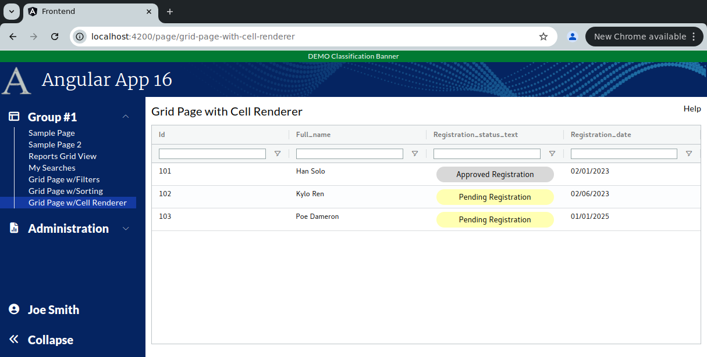

```
Exercise 11e / Client Grid / Format Cells with Cell Renderers
-------------------------------------------------------------
Problem 1:  I want to apply CSS to a specific column cell
Problem 2:  I want to display multiple values in a cell
Problem 3:  I want to conditionally show CSS
Problem 4:  I want to show a label with a different color (based on some value)
Solution:   Make a custom cell renderer


```

```


Exercise
--------
 1. Setup the Page
    a. Generate the component:                Call it GridPageWithCellRenderer
    b. Add the route to constants.ts:         the route will be this:   page/grid-page-with-cell-renderer
    c. Register the route
    d. Add the route to the database table:  ui_controls        (if using real security)
    e. Add a link to the navbar (using that route)
    f. Use the debugger to verify that the navbar link works
    


 2. Setup this page layout
     +-------------------------------------------------------------------+
     | Grid Page with Cell Renderer                                 Help |
     +-------------------------------------------------------------------+
     |                                                                   |
     |                                                                   |
     +-------------------------------------------------------------------+


 3. Change the bottom of the page so use the VISIBLE height of the browser
     +-------------------------------------------------------------------+
     | Grid Page with Cell Renderer                                 Help |
     +-------------------------------------------------------------------+
     | Grid is here                                                      |   Height of the bottom of page *STRETCHES*
     |                                                                   |
     +-------------------------------------------------------------------+
 


 
    
Part 2 / Configure the gridOptions, columnDefs, defaultColumnDefs, and rowData 
-------------------------------------------------------------------------------
 1. Add a public class variable:   gridOpptions
    -- The type is GridOptions
    
    -- Set these properties
        domLayout: 'normal',            // Requires the wrapper div to have a height set *OR* a class="h-full" on it
        debug: false,
        rowModelType: 'clientSide',   
        
        
        
 2. Add a public class variable:  columnDefs
    -- The type is array of ColDef objects
    
    -- Initialize the array to hold an object for each column definition
    
    a. Define columnDefs to hold an array of 5 objects
        the field names will be
                id
                full_name
                registration_status_text
                registration_date
                

                
 3. Turn on sorting on *ALL* columns
    -- Define a class variable called defaultColumnDef
    -- The type is ColDef
    -- Initialize it so that flex = 1, sortable = true, filter = true, floatingFilter = true


             
 4. Turn on filters on *ALL* columns
    a. Add a class variable:  textFilterParams     
       -- The type is ITextFilterParams
       -- Tell it to only show the "Contains" and "Not Contains" options
       -- Tell it to make the filters case-insensitive
       -- Tell it to add a debounce time of 200 msec

      
    b. Update the defaultColumnDefs
        -- Add filter = 'agTextColumnFilter', floatingFilter = true, filterParams is set to your textFilterParams
            
 
 5. Add the <ag-grid-angular> tag to your HTML 
    -- Place it where you want your grid to appear
    
    
 
 6. Tell the ag-grid-angular to use your class variables
    -- Set gridOptions property     to your public class variable
    -- Set columnDefs property      to use your public class variable
    -- Set defaultColDef property   to use your public class variable
    -- Set the grid to use 100% of the width 
    -- Set the grid to use 100% of the height
    -- Apply the ag-theme-alpine class to the grid (to set the grid's theme to "alpine"
    

        -- At this point, the grid is shows "Loading..." because there is no row data
```

```


Part 3 / Create the Frontend Service that will simulate a REST call (fake service)
----------------------------------------------------------------------------------
 1. Create a frontend DTO:  GridCellRendererRowDataDTO
        id                          // This is numeric
        full_name                   // This is text
        registration_status_text    // This is text
        registration_status_id      // This is numeric 
        registration_date           // This is text -- e.g., '05/01/2024'
   


 2. Create a frontend service:  MySearchService
     a. Create this front-end service:  MySearchService 
     
     b. Add a public method:  getAllUsers() 
        NOTE:  This method returns an observable that holds an array of GridCellRendererRowDataDTO

     c. Fill-in this public method
        1) Create a local variable that holds an array of GridCellRendererRowDataDTO objects 
        2) Fill-in the array with 3 fake objects
        3) Convert the array into an observable
        4) Return the observable

        NOTE:  Make you use these date values for your first 3 records:
             id    full name          registration_status_id  registration_status_text    regustration_date
             ---   -------------      ----------------------  -------------------------   -----------------
             101   Han Solo           3                       Approved Registration        02/01/2023
             102   Kylo Ren           1                       Pending Registration         02/06/2024
             103   Poe Dameron        1                       Pending Registration         01/01/2025
        

   
                


Part 4 / Configure the grid to load it's rowData with the fake service
----------------------------------------------------------------------
 1, In the Grid Page TypeScript / Inject your MySearchService
 
 
 2. In the Grid Page TypeScript / Add these 2 public class variables:
        gridApi / type is GridApi
        gridColumnApi / type is ColumnApi
    
    
    
 3.  In the Grid Page TypeScript / Add a method:  onGridReady
    -- Pass-in aParams / type is GridReadyEvent
    -- initialize this.gridAPi
    -- initialize this.gridColumnApi
    -- Use the gridApi to show the "loading overlay"
    -- Invoke the fake REST call (you made in the previous step)
    -- When the REST call comes in, set the grid row data
    
    
 
 4. In the HTML, tell the grid to call your onGridReady() when the grid is fully initialized
 


```

```


Part 5 / Get the Registration Date field to sort correctly
----------------------------------------------------------
Problem:  By default client side date fields do not sort -- because the grid treats them as string
 
 1. Inject your Date Service
  
 2. Tell your grid to use your Date Service comparator method

 3. Verify it works by clicking on the "Registration Date" column


Part 6 / Get the "Status" column to show different values based on the status id
--------------------------------------------------------------------------------

 1. Create a component:  registration-status-custom-renderer
 
 2. Edit your cell renderer's typescript 
    a. Change the class so it implements ICellRendererAngularComp

    b. Add the imports
    
    c. Have IntelliJ implement all methods of the interface
    
    d. Add a public variable called params   (type is ICellRendererParams)
    
    e. Change the agInit() method so that it sets the class variable with the passed-in params
    
    
 3. Edit your cell renderer's HTML 
    a. Create a wrapper div that has padding of 5 pixels
    
    b. Create an inner div that display the actual cell value  (stored in params.value)
    
    c. Conditionally apply a CSS clsas
        If the registration status id == 1, then apply a CSS class called "registration-pending-cell'
        If the registration status id == 3, then apply a CSS class called "registration-approved-cell'
        
    
 
  4. Add these 2 styles to your frontend/styles.scss
     a. Add a class called "registration-pending-cell" that has this:
              text-align: center;
              font-size: 1.1em;
              font-weight: 500;
              border-radius: 15px;
              background-color: #ffffb2;
        
     b. Add a class called "registration-approved-cell" that has this:
              text-align: center;
              font-size: 1.1em;
              font-weight: 500;
              border-radius: 15px;
              background-color: #d8d8d8;

 
  5. Tell your "Registration Status" column to apply the custom cell renderer
  

 ```

```
Custom Cell Renderer V1:  Notice the bottom part of the cells is cut off   (that looks like shit!)
 
 
 
 
 
Problem #1:  The Custom Cell Renderer is cut off
------------------------------------------------
Solution:    Use AutoHeight 
Fix the problem in which the bottom part of the custom cell is cut off by setting autoHeight=true on your COLUMN that needs adjustement
  
```

```
Custom Cell Renderer V2:  Notice the columns holding text are *NOT* vertically aligned  (still looks like shit!)
 


Problem #2:  The autoHeight has caused the regular text cells to not be vertically aligned
------------------------------------------------------------------------------------------
Approach #1:  Add autoHeight=true to ALL columns
Approach #2:  Create a custom CSS class and apply it to the regular text-cell columns

 
  1. Create a custom CSS class in styles.scss called "grid-text-cell-format"
     -- It has a margin-top of .33em
     

  2. Tell ag-grid to apply this class to every regular text column  (not your custom cell renderer)
 ```

```
Custom Cell Renderer V3:  The custom cell renderer looks good *AND* the text rows are vertically aligned
 
 
``` 
       
