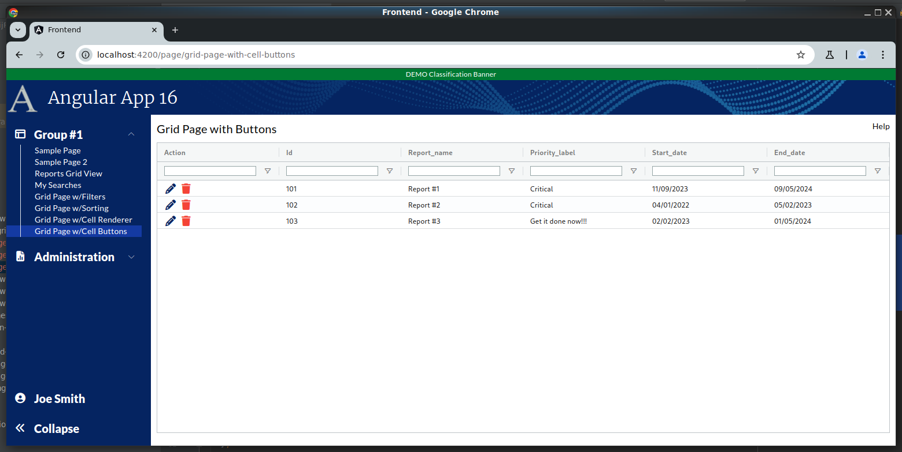
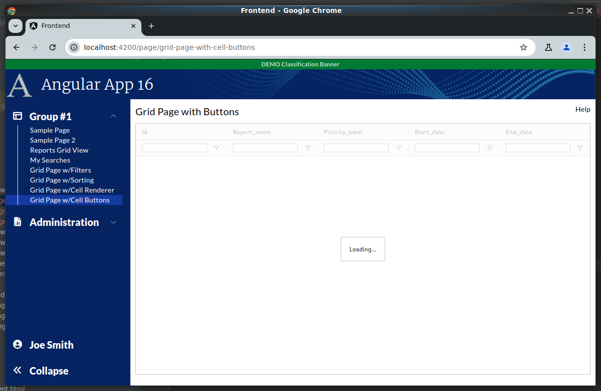
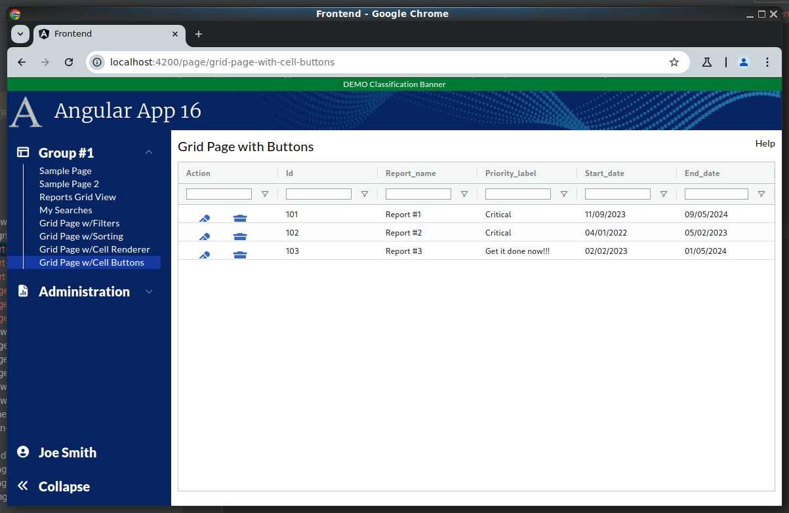

```
Exercise 11f / Client Grid / Add Cell Controls using Cell Renderers
-------------------------------------------------------------------
Problem 1:  I want to add a button (or two) in a cell that runs some TypeScript code in the grid page
Problem 2:  I want to add a control (or two) in a cell that opens a popup


Solution:  Make a custom cell renderer that has a button inside of it
           NOTE:  We can have the custom-cell-renderer run code back in the grid page 

```

```


Exercise
--------
 1. Setup the Page
    a. Generate the component:                Call it GridPageWithButtons
    b. Add the route to constants.ts:         the route will be this:   page/grid-page-with-cell-buttons
    c. Register the route
    d. Add the route to the database table:  ui_controls        (if using real security)
    e. Add a link to the navbar (using that route)
    f. Use the debugger to verify that the navbar link works
    


 2. Setup this page layout
     +-------------------------------------------------------------------+
     | Grid Page with Cell Buttons                                  Help |
     +-------------------------------------------------------------------+
     |                                                                   |
     |                                                                   |
     +-------------------------------------------------------------------+


  


 3. Change the bottom of the page so use the VISIBLE height of the browser
     +-------------------------------------------------------------------+
     | Grid Page with Cell Buttons                                  Help |
     +-------------------------------------------------------------------+
     | Grid is here                                                      |   Height of the bottom of page *STRETCHES*
     |                                                                   |
     +-------------------------------------------------------------------+
 
   

 
    
Part 2 / Configure the gridOptions, columnDefs, defaultColumnDefs, and rowData 
-------------------------------------------------------------------------------
 1. Add a public class variable:   gridOpptions
    -- The type is GridOptions
    
    -- Set these properties
        domLayout: 'normal',            // Requires the wrapper div to have a height set *OR* a class="h-full" on it
        debug: false,
        rowModelType: 'clientSide',   
        
     
        
        
 2. Add a public class variable:  columnDefs
    -- The type is array of ColDef objects
    
    -- Initialize the array to hold an object for each column definition
    
    a. Define columnDefs to hold an array of 5 objects
        the field names will be
                id
                report_name
                priority_label
                start_date
                end_date
                
         
                
                
 3. Turn on sorting on *ALL* columns
    -- Define a class variable called defaultColumnDef
    -- The type is ColDef
    -- Initialize it so that flex = 1, sortable = true


  
             
 4. Turn on filters on *ALL* columns
    a. Add a class variable:  textFilterParams     
        -- Set the filter options, set caseSensitivitiy, set supressAndOrCondition, set debounceMS to 200 milliseconds
      
      
    b. Add a class variable:  defaultColumnDefs
       -- The type is ColDef
       -- Initialize it so that flex = 1, sortable = true, filter = 'agTextColumnFilter', floatingFilter = true, filterParams is set to your textFilterParams

                
 
 
 5. Add the <ag-grid-angular> tag to your HTML 
    -- Place it where you want your grid to appear
    
    
 
 6. Tell the ag-grid-angular to use your class variables
    -- Set gridOptions property     to your public class variable
    -- Set columnDefs property      to use your public class variable
    -- Set defaultColDef property   to use your public class variable
    -- Set the grid to use 100% of the width 
    -- Set the grid to use 100% of the height
    -- Apply the ag-theme-alpine class to the grid (to set the grid's theme to "alpine"
    

        -- At this point, the grid is shows "Loading..." because there is no row data
```

```


Part 3 / Create the Frontend Service that will simulate a REST call (fake service)
----------------------------------------------------------------------------------
 1. Create a frontend DTO:  GridCellRendererWithButtonRowDataDTO
        id                          // This is numeric
        report_name                 // This is text
        priority_label              // This is text
        start_date                  // This is text -- e.g., '05/01/2024' 
        end_date                    // This is text -- e.g., '05/01/2024' 
   
   


 2. Create a frontend service:  MyReportService   (if you have not already!)
     a. Create this front-end service:  MyReportService 
     
     b. Add a public method:  getAllReports() 
        NOTE:  This method returns an observable that holds an array of GridCellRendererWithButtonRowDataDTO

     c. Fill-in this public method
        1) Create a local variable that holds an array of GridCellRendererWithButtonRowDataDTO objects 
        2) Fill-in the array with 3 fake objects
        3) Convert the array into an observable
        4) Return the observable


                


Part 4 / Configure the grid to load it's rowData with the fake service
----------------------------------------------------------------------
 1, In the Grid Page TypeScript / Inject your MyReportService
 
 
 
 2. In the Grid Page TypeScript / Add these 2 public class variables:
        gridApi / type is GridApi
        gridColumnApi / type is ColumnApi
    
    
    
 3.  In the Grid Page TypeScript / Add a method:  onGridReady
    -- Pass-in aParams / type is GridReadyEvent
    -- initialize this.gridAPi
    -- initialize this.gridColumnApi
    -- Use the gridApi to show the "loading overlay"
    -- Invoke the fake REST call (you made in the previous step)
    -- When the REST call comes in, set the grid row data
    
    
 
 4. In the HTML, tell the grid to call your onGridReady() when the grid is fully initialized
 


```

```


Part 5 / Get the start_Date and end_date fields to sort correctly
-----------------------------------------------------------------
Problem:  By default client side date fields do not sort -- because the grid treats them as string
 
 1. Implement your Date Service (if you haven't already created it)
 
 2. Inject your Date Service into your main grid page
  
 3. Tell your grid "date" columns to use your Date Service comparator method 


Part 6 / Create the "Action" Cell Renderer (that will have "Edit" and "Delete" icons
-------------------------------------------------------------------------------------
 1. Create a component:  report-grid-action-cell-renderer
    NOTE:  Place it in the same directory that holds your grid-page-with-buttons component
 
 
 2. Edit report-grid-action-cell-renderer.component.ts
 
 
 3. Change the class so it implements ICellRendererAngularComp


 4. Create the required methods to implement the ICellRendererAngularComp interface
    a. Put your cursor on the class name
    b. Press Alt-Enter
    c. Select Implement all required members
    d. In the "Select Members to Implement", use the defaults and press OK


 5. Add a public variable called params with type of ICellRendererParams
       public params: ICellRendererParams
 
 
 6. Change the agInit() method so that it sets the class variable
     this.params = params
 
 
 7. Add a public method called editClick() that has a console.log that prints a message

      
 8. Add a public method called deleteClick() that has a console log that print a message

      
 9. Edit report-grid-action-cell-renderer.component.html
    a. Remove the existing HTML
    b. Add a wrapper div and 2 buttons and use the mat-icon-button
       NOTE:  Use the mat-icon-button as it makes icon buttons look slick with padding and animation
    
    c. The 1st button should have a font-awesome edit icon -- e.g., pencil icon?
    d. Clicking on this edit icon should run the editClick() method
    e. The 2nd button should have a font-awesome delete icon -- e.g., trash can?
    f. Clicking on this delete icon should run the deleteClick() method
    
       
  
     
    
      

Part 7 / Add the "Action" column to the grid  
--------------------------------------------
 1. Edit grid-page-with-buttons.component.ts
 
 2. Add a new column with the label "Action"
            
 3. Tell the grid's Action column to use your new cell renderer

 4. Take a look at your page
 
 ```

```
PROBLEM:  The icons look like shit.  They are too big!!!!


 5. To make the icons fit, you have a few choices:
    Approach #1:  Remove the mat-icon-button
    Approach #2:  Adjust the size of the icons to be 18px and put a 2px margin around them
    Approach #3:  Add autoHeight=TRUE to the action column and vertically align the text columns
    

 ```

```
After implementing Approach #1 / Remove mat-icon-button / the icons are much smaller / padding is gone


 ```

```
After implementing Approach #2 / Adjust the size of the icons and add a margin


 
Part 8 / Pressing the "Delete" icon should run code in the main page and pass-in the ID and report name
-------------------------------------------------------------------------------------------------------
 1. Edit the main grid page / Add a method called "openDeleteDialog"
    -- What's passed-in?  The report ID and report name
    -- For now, put a console.log in it

       
 2. WEIRD PART #1:  In the grid page, pass-in params.deleteClicked so that the cell-renderer can invoke it
    -- Edit the main grid page / Edit the columnDefs / Edit the Action Column
    -- Set the cellRendererParams
    
    
 3. WEIRD PART #2:  In the cell renderer, pressing delete invokes params.deleteClicked()
    -- Edit the cell renderer / Edit deleteClick() 
    -- have it invoke the params.deleteClicked() and pass-in the params
    

 4. Try it out by pressing the "Delete" icon
    -- Look at your browser console
    -- You should be invoking a method in your main grid page:  openDeleteDialog()
    
    

Part 9 / Pressing the "Edit" icon should run code in the main page and pass-in the ID
-------------------------------------------------------------------------------------
 1. Edit the main grid page / Add a method called "openEditDialog"
    -- What's passed-in?  The report ID
    -- For now, put a console.log in it

       
 2. WEIRD PART #1:  In the grid page, pass-in params.deleteClicked so that the cell-renderer can invoke it
    -- Edit the main grid page / Edit the columnDefs / Edit the Action Column
    -- Set the cellRendererParams
    
    
 3. WEIRD PART #2:  In the cell renderer, pressing delete invokes params.editClicked()
    -- Edit the cell renderer / Edit editClick() 
    -- have it invoke the params.editClicked() and pass-in the params
    

 4. Try it out by pressing the "Edit" icon
    -- Look at your browser console
    -- You should be invoking a method in your main grid page:  openEditDialog()
    

Part 10 / Cleanup
-----------------
 1. Change the grid so that clicking on a cell does NOT highlight the cell
    
 
 2. Change the colors of the button
    -- The delete icon should be red       / use the RGB of #f44336 as that is what Angular uses for the "warn"
    -- The edit icon should be a dark blue / use the RGB of #052461 or the quaternary color
    
    
 ```

