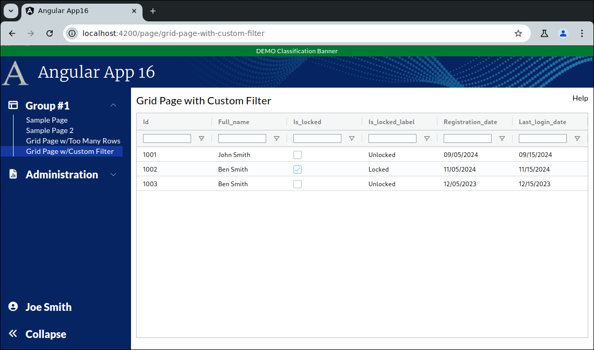

```
Exercise 11i / Client Grid / Build a Custom Dropdown Filter
-----------------------------------------------------------
Problem:  I want my filter to be a dropdown (instead of text)
Solution: Create a special filter


```

```


Exercise
--------
 1. Setup the Page
    a. Generate the component:                Call it GridPageWithCustomFilter
    b. Add the route to constants.ts:         the route will be this:   page/grid-page-with-custom-filter
    c. Register the route
    d. Add the route to the database table:  ui_controls        (if using real security)
    e. Add a link to the navbar (using that route)
    f. Use the debugger to verify that the navbar link works
    


 2. Setup this page layout
     +-------------------------------------------------------------------+
     | Grid Page with Custom Filter                                 Help |
     +-------------------------------------------------------------------+
     |                                                                   |
     |                                                                   |
     +-------------------------------------------------------------------+


 3. Change the bottom of the page so use the VISIBLE height of the browser
     +-------------------------------------------------------------------+
     | Grid Page with Custom Filter                                 Help |
     +-------------------------------------------------------------------+
     | Grid is here                                                      |   Height of the bottom of page *STRETCHES*
     |                                                                   |
     +-------------------------------------------------------------------+
 
  

 
    
Part 2 / Configure the gridOptions, columnDefs, defaultColumnDefs, and rowData 
-------------------------------------------------------------------------------
 1. Add a public class variable:   gridOpptions
    -- The type is GridOptions
    
    -- Set these properties
        domLayout: 'normal',            // Requires the wrapper div to have a height set *OR* a class="h-full" on it
        debug: false,
        rowModelType: 'clientSide',   
        

        
 2. Add a public class variable:  columnDefs
    -- The type is array of ColDef objects
    
    -- Initialize the array to hold an object for each column definition
    
    a. Define columnDefs to hold an array of 5 objects
        the field names will be
                id
                full_name
                is_locked
                is_locked_label
                registration_date
                last_login_date
                

                
 3. Turn on sorting on *ALL* columns
    -- Define a class variable called defaultColumnDefs
    -- The type is ColDef
    -- Initialize it so that flex = 1, sortable = true

        public defaultColumnDefs: ColDef = {
          flex: 1,
          sortable: true,           // All columns are sortable
        }
        
  
             
 4. Turn on filters on *ALL* columns
     a. Add a class variable:  textFilterParams     
       -- The type is ITextFilterParams
       -- Tell it to only show the "Contains" and "Not Contains" options
       -- Tell it to make the filters case-insensitive
       -- Tell it to add a debounce time of 200 msec
       
      
    b. Update the defaultColumnDefs
        -- Add filter = 'agTextColumnFilter', floatingFilter = true, filterParams is set to your textFilterParams

 
 
 5. Add the <ag-grid-angular> tag to your HTML 
    -- Place it where you want your grid to appear
    
    
 
 6. Tell the ag-grid-angular to use your class variables
    -- Set gridOptions property     to your public class variable
    -- Set columnDefs property      to use your public class variable
    -- Set defaultColDef property   to use your public class variable
    -- Set the grid to use 100% of the width 
    -- Set the grid to use 100% of the height
    -- Apply the ag-theme-alpine class to the grid (to set the grid's theme to "alpine"
    

        -- At this point, the grid is shows "Loading..." because there is no row data
```

```


Part 3 / Create the Frontend Service that will simulate a REST call (fake service)
----------------------------------------------------------------------------------
 1. Create a frontend DTO:  GridCellDataForCustomFilterDTO
        id                  // holds a numeric value
        full_name           // holds text
        is_locked           // holds a boolean
        is_locked_label     // holds "Locked" or "Unlocked"
        registration_date   // Holds text -- e.g., "05/01/2024"
        last_login_date     // holds text -- e.g., "05/02/2025"
           
               

 2. Create a frontend service:  MyUserService   (if you have not already!)
     a. Create this front-end service:  MyUserService 
     
     b. Add a public method:  getAllUsers2() 
        NOTE:  This method returns an observable that holds an array of GridCellDataForCustomFilterDTO

     c. Fill-in this public method
        1) Create a local variable that holds an array of GridCellDataForCustomFilterDTO objects 
        2) Fill-in the array with 3 fake objects
        3) Convert the array into an observable
        4) Return the observable

        -- Make sure some of the records are LOCKED and some are UNLOCKED
        


Part 4 / Configure the grid to load it's rowData with the fake service
----------------------------------------------------------------------
 1, In the Grid Page TypeScript / Inject your MyUserService
 
 
 
 2. In the Grid Page TypeScript / Add these 2 public class variables:
        gridApi / type is GridApi
        gridColumnApi / type is ColumnApi
          
          
    
 3.  In the Grid Page TypeScript / Add a method:  onGridReady
    -- Pass-in aParams / type is GridReadyEvent
    -- initialize this.gridAPi
    -- initialize this.gridColumnApi
    -- Use the gridApi to show the "loading overlay"
    -- Invoke the fake REST call (you made in the previous step)
    -- When the REST call comes in, set the grid row data
    
          
         
 4. In the HTML, tell the grid to call your onGridReady() when the grid is fully initialized
 


```

```


Part 5 / Get the date fields to sort correctly
----------------------------------------------
Problem:  By default client side date fields do not sort -- because the grid treats them as string
 
 1. Implement your Date Service (if you haven't already created it)
 
 
 2. Inject your Date Service into your main grid page
  
  
 3. Tell your grid "date" columns to use your Date Service comparator method 


Part 6 / Create the search box that applies filters
---------------------------------------------------
Change the layout by adding some stuff *between the page title and the grid


 1. Change your page wrapper div
    a. Set a background color to be rgb(231,245,250) or "backDropColor"
    
    b. If you're using a margin of 10px, then change it to padding of 10px  (so the new background color fills the edges)
    
    c. Verify that the background color is visible in the edges of the page
    
    
 2. Add a row called "search box line" and a row called "Grid buttons"  between the page title and the grid
 
     +-------------------------------------------------------------------+
     | Grid Page with Custom Filter                                 Help |
     +-------------------------------------------------------------------+
     | Search box line                                                   |   Filter Search Box is
     +-------------------------------------------------------------------|
     | Grid Buttons                                                      |   Grid Buttons are here
     +-------------------------------------------------------------------+
     | Grid is here                                                      |   Height of the bottom of page *STRETCHES*
     |                                                                   |
     |                                                                   |
     |                                                                   |
     |                                                                   |
     +-------------------------------------------------------------------+   
    
 
 
  3. Add 10px of margin between the page title row and the rest of the page
      
  
  
  
  4. Fill-in the Tab and Search Box Row
     a. Setup a row that has a height of 64px
     b. This row has 3 boxes in it:
        -- The 1st box is 5px wide              / it will be a decorative vertical line
        -- The 2nd box is 150px wide            / it will show the total number of records
        -- The 3rd box uses the remaining width / it holds the search box
        
             +--------------------------------------------------------------------------+
             | +--+  +---------------+    +------------------------------------------+  |
             | |  |  | Totals        |    | Search Box                               |  |
             | +--+  +---------------+    +------------------------------------------+  |
             +--------------------------------------------------------------------------|
 
 
           
            <!--  S E A R C H       B O X       L I N E   -->
            <div class="mt-2.5 flex flex-row w-full h-[64px] relative flex-shrink-0">
            
                <!-- Tab -->
                <div class="flex flex-row items-center absolute bg-white rounded-t px-3 py-2 border-x border-t border-borderColor h-full w-[150px] top-[1px]">
                  
                  <!-- Vertical Bar -->
                  <div class="w-[5px] h-full float-left bg-[#1E3059] rounded mr-2.5 flex-shrink-0"></div>

                  <div class="flex flex-col pt-2">
                    <div class="h-[30px] w-[125px] flex place-content-start">
                      <!-- Title (count) -->
                      <ng-container>
                        <!-- Display Total -->
                        <span class="text-2xl font-extrabold">25</span>
                      </ng-container>
                    </div>
            
                    <div class="h-[30px] flex place-content-start">
                      <!-- Total Records on Page Load -->
                      <span>Total Records</span>
                    </div>
                  </div>
                </div>
            
                <!-- Searchbar Container -->
                <div class="h-full w-full py-2 flex flex-row pl-[158px]">
            
                  <!-- Searchbar -->
                  <div class="w-full bg-white rounded border-borderColor border justify-center flex flex-row gap-2.5 pl-3.5 overflow-hidden">
            
                    <!-- Searchbar Input -->
                    <input matInput type="text"
                           class="w-full outline-none"
                           placeholder="Search..."
                           autocomplete="off"
                           title="Search Box"
                           style="background: white"
                           aria-label="Search Box"/>
            
                    <!-- Clear Icon -->
                    <span class="flex clickable items-center justify-center" title="Clear Search" aria-label="Clear Search">
                                <i class="fa-solid fa-xmark-large"></i>
                        </span>
            
                    <!-- Search Icon -->
                    <div class="bg-blue-950 rounded-r w-[42px] items-center justify-center clickable text-white flex h-full" aria-label="Search" title="Search">
                      <i class="fa-regular fa-search"></i>
                    </div>
                  </div>
            
                </div>
          </div>

             
  5. Fill-in the grid buttons
     a. Create a row with a lwft and right-side 
         +-------------------------------------------------------------------+
         | <Settings Icon> Settings                          3 Total Matches |                                                  
         +-------------------------------------------------------------------+
          
     b. On the left-side, make sure you have a popup button
        -- The button that holds the <Settings Icon> and Settings
        -- Pressing the button should open a popup menu that holds an option to "Reset Grid"
     
     
        <!--  G R I D      B U T T O N S         -->
        <div class="flex flex-row w-full bg-white rounded-tr h-10 flex-shrink-0 items-center border-x border-t border-borderColor px-3">
    
            <!-- Settings button -->
            <button [matMenuTriggerFor]="gridMenu" class="-ml-1"
                    type="button" title="Settings" aria-label="Settings">
              <div class="flex flex-row gap-2 items-center">
                <i class="fa-xl fa-solid fa-sliders"></i>
                <span class="font-extrabold">Settings</span>
              </div>
            </button>
    
            <!-- Pop-up menu for the 'Settings' button -->
            <mat-menu #gridMenu="matMenu">
              <button mat-menu-item type="button" title="Reset Grid" aria-label="Reset Grid">
                Reset Grid
              </button>
            </mat-menu>
    
            <div class="flex flex-grow place-content-end">
              <!-- Show the Total Number of Matches -->
              <span class="italic text-primary font-extrabold">3 matches</span>
            </div>
      </div>   
       
```

```

Part 7 / Entering text in the search box should apply filters in real-time
--------------------------------------------------------------------------
 1. Add a public class variable:  totalFilteredMatchesAndLabel
    -- It will hold "No Matches" or "1 Match" or "5 Matches"
 
            
 
 2. Add a private method:  refreshTotalFilteredMatchAndLabels()
    -- Nothing is passed-in
    -- It gets the total number of records visible
    -- If there are zero records visible, then
           set totalFilteredMatchesAndLabel = "No Matches"
    
    -- If there is 1 record visible, then
           set totalFilteredMatchesAndLabel = "1 Match"

    -- If there are 2 records visible, then
           set totalFilteredMatchesAndLabel = "2 Matches"

    -- You get the idea!!!
    
         
    

 3. Add a public method:   runClientGridSearch()
    -- Pass-in the raw search text
    -- It runs the search
    -- It refreshes totalFilteredMatchesAndLabel
    
        

          
 4. Change your HTML / Replace the hard-coded "3 Matches" with totalFilteredMatchesAndLabel 
 
 
 5. Bind the search box to a class variable
    a. Create this class variable:  rawSearchQuery
       -- It holds whatever text the users enters
       -- Initialize it to an empty string
       
    b. Bind the search box to this class variable
       
       
       
 6. Change the search box so that as the user types-in input,
    -- The page calls this.runClientGridSearch()
    -- The page passes-in the entered text into this method
    
 

Part 8 / Cleanup / Update the tab to show the total records on page load / Implement the clear search button
------------------------------------------------------------------------------------------------------------
 1. Create a class variable:  totalRecordsOnPageLoad
    -- It holds the total records loaded on page load

            
 
 2. In the onGridReady(), 
    -- set the totalRecordsOnPageLoad to hold the total number of records returned from the backend
        


 3. Get the clear search icon button to clear the search
    a. Add a public method:  clearSearch()
       -- It should clear the search box text
       -- It should clear the filter
       -- It should refresh the matches label
       
    b. Clicking on the clear search should call clearSearch()
    
    c. Try it out!!
    
 
 4. Replace the deprecated textFiltersParams
      suppressAndOrCondition: true  -->  maxNumConditions: 1


 5. Have the "Reset Grid" button actually resset the grid
    a. Create a public method:  resetGrid()
       -- Your method should reset the column state
       -- Your method should size the columns to fit
    
    b. Add a click handler so that the "Reset Grid" button invoke your method
    


Part 9 / Setup a custom filter 
------------------------------
 1. Create a new component:  dropDownFloatingFilter
 
 2. Edit the typescript of this new component
    a. Have it implement IFloatingFilter *AND* AgFrameworkComponent<any>
    
    b. Have intellij Implement all *REQUIRED* members
        -- This will create 2 methods:  agInit() and onParentModelChanged()
    
    c. Add a public class variable for params / type is IFloatingFilterParams
    
    d. Add a public class variable called currentValue / type is null or string / initialize it to null 
 
    e. Fill-in this method:  agInit()
        -- Set the params class variable to what is passed-in
        
    f. Fill-in this method:  onParentModelChanged()
    
           public onParentModelChanged(parentModel: any, filterChangedEvent?: FilterChangedEvent | null): void {
                // When the filter is empty we will receive a null value here
                if (!parentModel) {
                  this.currentValue = null;
                }
                else {
                  this.currentValue = parentModel.filter;
                }
          }
       
    g. Add a method:  onSelectionChanged()
    
          /*
           * User selected a dropdown value in the filter
           *   If the user cleared the filter, set an empty filter in the parent grid
           *   If the user selected an option, set the filter in the parent grid
           */
          public onSelectionChanged() {
            if (this.currentValue == null) {
              // User cleared the filter
        
              this.params?.parentFilterInstance((instance: any) => {
                // The user selected a null value.  So, *REMOVE* the filter
                instance.onFloatingFilterChanged('equals', null);
              });
            }
            else {
              // Filter has a value
              this.params?.parentFilterInstance((instance: any) => {
                // The user selected a non-null value.  So, *APPLY* the filter
                instance.onFloatingFilterChanged('equals', this.currentValue);
              });
            }
        
          }  // end of onSelectionChanged()
                
        
           
 
 3. Edit the HTML for this floating filter to be a dropdown
    a. Create a dropdown 
       NOTE:  Do **NOT** use the <mat-form-field> wrapper as we want the dropdown to be small
    
    b. Bind the dropdown to the class variable:  this.currentValue
    
    c. When the selection of the dropdown changes, call this.onSelectionChanged()
    
    d. Your dropdown will have 3 values:
            -- All Users --        [null value]
            Locked Users           'true'
            Unlocked Users         'false'
            
     

   
 4. Apply the custom filter to your grid page
    a. Edit the main grid page typescript
    b. Change the column defs for your "is_locked" true/false column
       -- Set floatingFilterComponent to the name of your dropdownComponent
       -- Set floatingFilterComponentParams to hold a map of info
            -- Inside this map, set suppressFilterButton to true
    
    
    
  5. Try it out
  
  ```

```

```