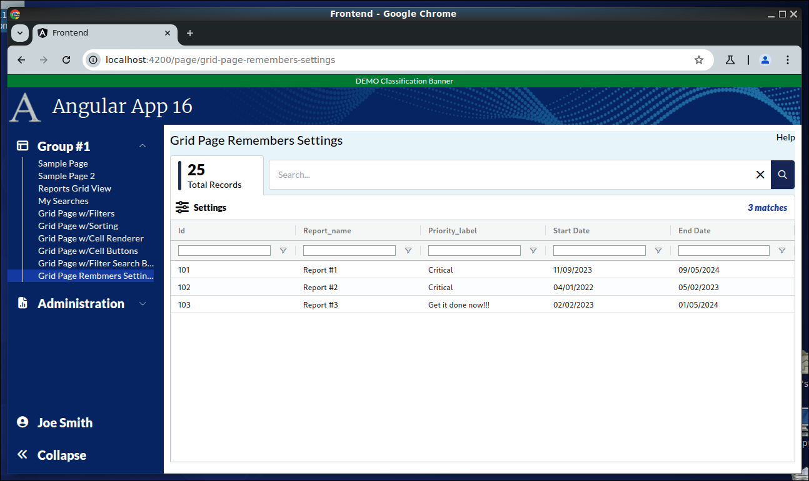
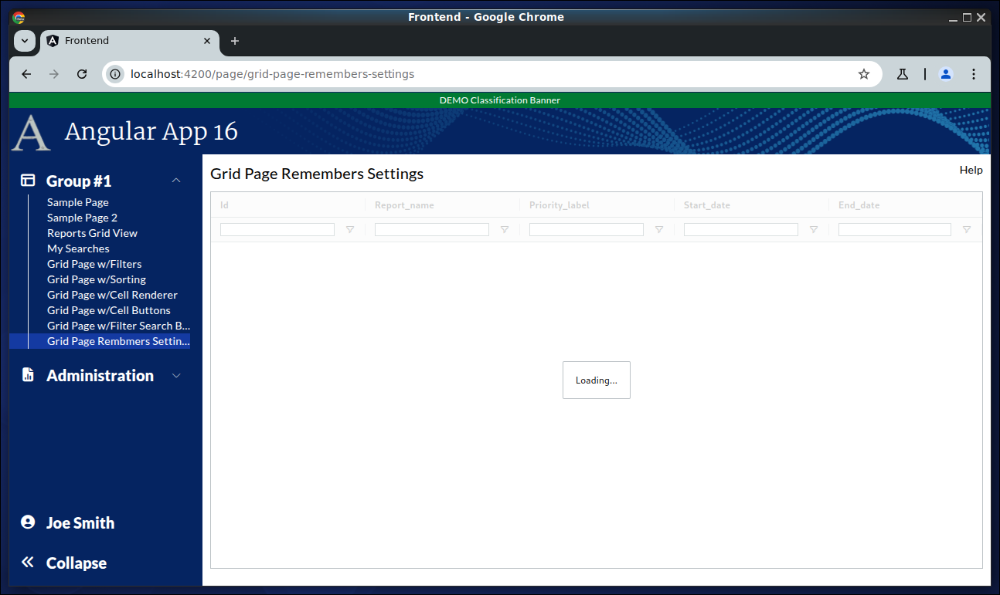
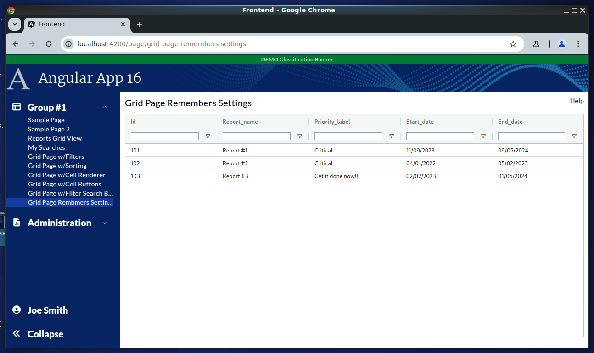

```
Exercise 11j / Client Grid / Remember Grid Columns Settings (Answers)
---------------------------------------------------------------------
Problem:  I want the grid to remember width, order, visibility of columns as the user sets them
          So, when the user returns to this page, the grid columns have the same width, order, and visibility as last time
Solution: Listen for grid changes and save them to the bakcend (as a preference JSON string)


```

```


Exercise
--------
 1. Setup the Page
    a. Generate the component:                Call it GridPageRemembersSettings
    b. Add the route to constants.ts:         the route will be this:   page/grid-page-remembers-settings
    c. Register the route
    d. Add the route to the database table:  ui_controls        (if using real security)
    e. Add a link to the navbar (using that route)
    f. Use the debugger to verify that the navbar link works
    


 2. Setup this page layout
     +-------------------------------------------------------------------+
     | Grid Page Remembers Settings                                 Help |
     +-------------------------------------------------------------------+
     |                                                                   |
     |                                                                   |
     +-------------------------------------------------------------------+


     At this point, the HTML looks like this
     ---------------------------------------      
        <div class="m-2.5">
        
         <!-- Top of Page -->
          <div class="grid grid-cols-2">
              <div>
                <span class="text-xl">Grid Page Remembers Settings</span>
              </div>
        
              <div class="flex place-content-end">
                 Help
              </div>
          </div>
        
          <!-- Bottom of Page  -->
          <div class="mt-2.5">
              
            
          </div>
        
        </div>


 3. Change the bottom of the page so use the VISIBLE height of the browser
     +-------------------------------------------------------------------+
     | Grid Page Remembers Settings                                 Help |
     +-------------------------------------------------------------------+
     | Grid is here                                                      |   Height of the bottom of page *STRETCHES*
     |                                                                   |
     +-------------------------------------------------------------------+
 
        <div class="m-2.5">
        
          <div class="grid grid-cols-2">
              <div>
                <span class="text-xl">Grid Page Remembers Settings</span>
              </div>
        
              <div class="flex place-content-end">
                 Help
              </div>
          </div>
        
          <div class="mt-2.5">
              <!-- Add Grid Here -->
              <div class="overflow-y-auto" style="height: calc(100vh - 150px)">
        
                Grid is here
        
              </div>
        
          </div>
        
        
        </div>

 
    
Part 2 / Configure the gridOptions, columnDefs, defaultColumnDefs, and rowData 
-------------------------------------------------------------------------------
 1. Add a public class variable:   gridOpptions
    -- The type is GridOptions
    
    -- Set these properties
        domLayout: 'normal',            // Requires the wrapper div to have a height set *OR* a class="h-full" on it
        debug: false,
        rowModelType: 'clientSide',   
        
        
        public gridOptions: GridOptions = {
          domLayout: 'normal',
          debug: true,
          rowModelType: 'clientSide'
        };
        
        
 2. Add a public class variable:  columnDefs
    -- The type is array of ColDef objects
    
    -- Initialize the array to hold an object for each column definition
    
    a. Define columnDefs to hold an array of 5 objects
        the field names will be
                id
                report_name
                priority_label
                start_date
                end_date
                


          public columnDefs: ColDef[] = [
            {
              field: 'id'
            },
            {
              field: 'report_name'
            },           
            {
              field: 'priority_label'
            },
            {
              field: 'start_date'
            },
            {
              field: 'end_date',
            }
          ];               
                
                
 3. Turn on sorting on *ALL* columns
    -- Define a class variable called defaultColumnDefs
    -- The type is ColDef
    -- Initialize it so that flex = 1, sortable = true

        public defaultColumnDefs: ColDef = {
          flex: 1,
          sortable: true,           // All columns are sortable
        }
        
  
             
 4. Turn on filters on *ALL* columns
    a. Add a class variable:  textFilterParams     
       -- The type is ITextFilterParams
       -- Tell it to only show the "Contains" and "Not Contains" options
       -- Tell it to make the filters case-insensitive
       -- Tell it to add a debounce time of 200 msec
       
             // Customize the filters (when turned on)
             private textFilterParams: ITextFilterParams = {
                filterOptions: ['contains', 'notContains'],         // Customize the filter to only show "Contains" and "Not Contains"
                caseSensitive: false,                               // Filter is case-insensitive
                debounceMs: 200,
                suppressAndOrCondition: true,
              };
      
    b. Update the defaultColumnDefs
        -- Add filter = 'agTextColumnFilter', floatingFilter = true, filterParams is set to your textFilterParams

            public defaultColumnDef: ColDef = {
                flex: 1,
                sortable: true,                         // All columns are sortable
                floatingFilter: true,                   // Show the floating filter (beneath the column label)
                filter: 'agTextColumnFilter',           // Specify the type of filter
                filterParams: this.textFilterParams,    // Customize the filter
            }
                                
                
 
 
 5. Add the <ag-grid-angular> tag to your HTML 
    -- Place it where you want your grid to appear
    
    
 
 6. Tell the ag-grid-angular to use your class variables
    -- Set gridOptions property     to your public class variable
    -- Set columnDefs property      to use your public class variable
    -- Set defaultColDef property   to use your public class variable
    -- Set the grid to use 100% of the width 
    -- Set the grid to use 100% of the height
    -- Apply the ag-theme-alpine class to the grid (to set the grid's theme to "alpine"
    
          <ag-grid-angular 
                class="ag-theme-balham w-full h-full"
                [gridOptions]="this.gridOptions"
                [columnDefs]="this.columnDefs"
                [defaultColDef]="this.defaultColumnDef"
          ></ag-grid-angular>


        -- At this point, the grid is shows "Loading..." because there is no row data
```

```


Part 3 / Create the Frontend Service that will simulate a REST call (fake service)
----------------------------------------------------------------------------------
 1. Create a frontend DTO:  GridCellDataForRememberingSettingsDTO
        id                          // This is numeric
        report_name                 // This is text
        priority_label              // This is text
        start_date                  // This is text -- e.g., '05/01/2024' 
        end_date                    // This is text -- e.g., '05/01/2024' 
   
   
        export class GridCellDataForRememberingSettingsDTO {
          public id:              number;
          public report_name:     string;
          public priority_label:  string;
          public start_date:      string;
          public end_date:        string;
        }


 2. Create a frontend service:  MyReportService   (if you have not already!)
     a. Create this front-end service:  MyReportService 
     
     b. Add a public method:  getAllReports3() 
        NOTE:  This method returns an observable that holds an array of GridCellDataForRememberingSettingsDTO

     c. Fill-in this public method
        1) Create a local variable that holds an array of GridCellDataForRememberingSettingsDTO objects 
        2) Fill-in the array with 3 fake objects
        3) Convert the array into an observable
        4) Return the observable


          public getAllReports3(): Observable<GridCellDataForRememberingSettingsDTO[]> {
            let data: GridCellDataForRememberingSettingsDTO[] = [
              {
                id: 101,
                report_name: 'Report #1',
                priority_label: 'Critical',
                start_date: '11/09/2023',
                end_date:   '09/05/2024'
              },
              {
                id: 102,
                report_name: 'Report #2',
                priority_label: 'Critical',
                start_date: '04/01/2022',
                end_date:   '05/02/2023'
              },
              {
                id: 103,
                report_name: 'Report #3',
                priority_label: 'Get it done now!!!',
                start_date: '02/02/2023',
                end_date:   '01/05/2024'
              },
            ];
        
            return of(data);
          }
                
                


Part 4 / Configure the grid to load it's rowData with the fake service
----------------------------------------------------------------------
 1, In the Grid Page TypeScript / Inject your MyReportService
 
        public constructor(private myReportService: MyReportService) { }
 
 
 
 2. In the Grid Page TypeScript / Add these 2 public class variables:
        gridApi / type is GridApi
        gridColumnApi / type is ColumnApi
        
            public gridApi: GridApi;
            public gridColumnApi: ColumnApi;
    
    
 3. In the Grid Page TypeScript / Add a method:  onGridReady
    -- Pass-in aParams / type is GridReadyEvent
    -- initialize this.gridAPi
    -- initialize this.gridColumnApi
    -- Use the gridApi to show the "loading overlay"
    -- Invoke the fake REST call (you made in the previous step)
    -- When the REST call comes in, set the grid row data
    
    
          public onGridReady(aParams: GridReadyEvent) {
            // Get a reference to the gridApi and gridColumnApi (which we will need later to get selected rows)
            this.gridApi = aParams.api;
            this.gridColumnApi = aParams.columnApi;
        
            // Show the loading overlay
            this.gridApi.showLoadingOverlay();
        
            // Invoke the REST call to get the grid data
            this.myReportService.getAllReports3().subscribe( (aData: GridCellDataForRememberingSettingsDTO[]) => {
              // REST call came back with data
        
              // Load the grid with data from the REST call
              this.gridApi.setRowData(aData);
            })
        
          }
 
 4. In the HTML, tell the grid to call your onGridReady() when the grid is fully initialized
 
       (gridReady)="this.onGridReady($event)"


```

```


Part 5 / Get the start_date and end_date fields to sort correctly
-----------------------------------------------------------------
Problem:  By default client side date fields do not sort -- because the grid treats them as string
 
 1. Implement your Date Service (if you haven't already created it)
 
        import { Injectable } from '@angular/core';
        
        @Injectable({
          providedIn: 'root'
        })
        export class DateService {
        
          constructor() { }
        
        
          private dateToNumber(aDateAsString: string): number | null {
            if (aDateAsString === undefined || aDateAsString === null) {
              return null;
            }
        
            if (aDateAsString.length == 10) {
              // Convert mm/dd/yyyy --> yyyymmdd   (as a number)
              let yearNumber: string  = aDateAsString.substring(6, 10);
              let monthNumber: string = aDateAsString.substring(0, 2);
              let dayNumber:   string  = aDateAsString.substring(3, 5);
        
              let resultAsString =  `${yearNumber}${monthNumber}${dayNumber}`;
              return Number(resultAsString);
            }
            else if (aDateAsString.length == 19) {
              // Convert mm/dd/yyyy hh24:mi:ss --> yyyymmddHH24MISS   (as a number)
        
              let yearNumber:   string = aDateAsString.substring(6, 10);
              let monthNumber:  string = aDateAsString.substring(0, 2);
              let dayNumber:    string = aDateAsString.substring(3, 5);
              let hourNumber:   string = aDateAsString.substring(11, 13);
              let minuteNumber: string = aDateAsString.substring(14, 16);
              let secondNumber: string = aDateAsString.substring(17, 19);
        
              let resultAsString =  `${yearNumber}${monthNumber}${dayNumber}${hourNumber}${minuteNumber}${secondNumber}`;
              return Number(resultAsString);
            }
            else {
              return null;
            }
        
          }
        
        
          public dateComparator(aDate1: string, aDate2: string): number {
            let date1Number = this.dateToNumber(aDate1);
            let date2Number = this.dateToNumber(aDate2);
        
            if (date1Number === null && date2Number === null) {
              return 0;
            }
            if (date1Number === null) {
              return -1;
            }
            if (date2Number === null) {
              return 1;
            }
        
            return date1Number - date2Number;
          }
        
        }
 
 
 2. Inject your Date Service into your main grid page
  
      public constructor(private myReportService: MyReportService,
                         private dateService: DateService) {
      }
  
  
 3. Tell your grid "date" columns to use your Date Service comparator method 

      {
    	field: 'start_date',
  		comparator: (a: string, b: string) => this.dateService.dateComparator(a,b)
	  }


Part 6 / Create the search box that applies filters
---------------------------------------------------
Change the layout by adding some stuff *between the page title and the grid


 1. Change your page wrapper div
    a. Set a background color to be rgb(231,245,250) or "backDropColor"
    
    b. If you're using a margin of 10px, then change it to padding of 10px  (so the new background color fills the edges)
    
    c. Verify that the background color is visible in the edges of the page
    
    
 2. Add a row called "search box line" and a row called "Grid buttons"  between the page title and the grid
 
     +-------------------------------------------------------------------+
     | Grid Page with Filter Search Box                             Help |
     +-------------------------------------------------------------------+
     | Search box line                                                   |   Filter Search Box is
     +-------------------------------------------------------------------|
     | Grid Buttons                                                      |   Grid Buttons are here
     +-------------------------------------------------------------------+
     | Grid is here                                                      |   Height of the bottom of page *STRETCHES*
     |                                                                   |
     |                                                                   |
     |                                                                   |
     |                                                                   |
     +-------------------------------------------------------------------+   
    
 
 
  3. Add 10px of margin between the page title row and the rest of the page
      
     At this point, the HTML looks like this
     ---------------------------------------    
          <div class="bg-backDropColor m-2.5">
        
            <div class="grid grid-cols-2">
              <div>
                <span class="text-xl">Grid Page Remembers Settings</span>
              </div>
          
              <div class="flex place-content-end">
                Help
              </div>
            </div>
        
          
            <!--  S E A R C H       B O X       L I N E   -->
            <div class="mt-2.5">
              Search box line
            </div>
          
            <!--  G R I D      B U T T O N S         -->
            <div>
              Grid Buttons
            </div>
          
          
            <!--  G R I D      I S    H E R E     -->
            <div class="overflow-y-auto" style="height: calc(100vh - 205px)">
              <ag-grid-angular
                class="ag-theme-balham w-full h-full"
                [gridOptions]="this.gridOptions"
                [columnDefs]="this.columnDefs"
                [defaultColDef]="this.defaultColumnDef"
                (gridReady)="this.onGridReady($event)"
              ></ag-grid-angular>
            </div>
        
        
        </div>

  
  
  4. Fill-in the Tab and Search Box Row
     a. Setup a row that has a height of 64px
     b. This row has 3 boxes in it:
        -- The 1st box is 5px wide              / it will be a decorative vertical line
        -- The 2nd box is 150px wide            / it will show the total number of records
        -- The 3rd box uses the remaining width / it holds the search box
        
             +--------------------------------------------------------------------------+
             | +--+  +---------------+    +------------------------------------------+  |
             | |  |  | Totals        |    | Search Box                               |  |
             | +--+  +---------------+    +------------------------------------------+  |
             +--------------------------------------------------------------------------|
 
 
           
            <!--  S E A R C H       B O X       L I N E   -->
            <div class="mt-2.5 flex flex-row w-full h-[64px] relative flex-shrink-0">
            
                <!-- Tab -->
                <div class="flex flex-row items-center absolute bg-white rounded-t px-3 py-2 border-x border-t border-borderColor h-full w-[150px] top-[1px]">
                  
                  <!-- Vertical Bar -->
                  <div class="w-[5px] h-full float-left bg-[#1E3059] rounded mr-2.5 flex-shrink-0"></div>

                  <div class="flex flex-col pt-2">
                    <div class="h-[30px] w-[125px] flex place-content-start">
                      <!-- Title (count) -->
                      <ng-container>
                        <!-- Display Total -->
                        <span class="text-2xl font-extrabold">25</span>
                      </ng-container>
                    </div>
            
                    <div class="h-[30px] flex place-content-start">
                      <!-- Total Records on Page Load -->
                      <span>Total Records</span>
                    </div>
                  </div>
                </div>
            
                <!-- Searchbar Container -->
                <div class="h-full w-full py-2 flex flex-row pl-[158px]">
            
                  <!-- Searchbar -->
                  <div class="w-full bg-white rounded border-borderColor border justify-center flex flex-row gap-2.5 pl-3.5 overflow-hidden">
            
                    <!-- Searchbar Input -->
                    <input matInput type="text"
                           class="w-full outline-none"
                           placeholder="Search..."
                           autocomplete="off"
                           title="Search Box"
                           style="background: white"
                           aria-label="Search Box"/>
            
                    <!-- Clear Icon -->
                    <span class="flex clickable items-center justify-center" title="Clear Search" aria-label="Clear Search">
                                <i class="fa-solid fa-xmark-large"></i>
                        </span>
            
                    <!-- Search Icon -->
                    <div class="bg-blue-950 rounded-r w-[42px] items-center justify-center clickable text-white flex h-full" aria-label="Search" title="Search">
                      <i class="fa-regular fa-search"></i>
                    </div>
                  </div>
            
                </div>
          </div>

             
  5. Fill-in the grid buttons
     a. Create a row with a lwft and right-side 
         +-------------------------------------------------------------------+
         | <Settings Icon> Settings                          3 Total Matches |                                                  
         +-------------------------------------------------------------------+
          
     b. On the left-side, make sure you have a popup button
        -- The button that holds the <Settings Icon> and Settings
        -- Pressing the button should open a popup menu that holds an option to "Reset Grid"
     
     
        <!--  G R I D      B U T T O N S         -->
        <div class="flex flex-row w-full bg-white rounded-tr h-10 flex-shrink-0 items-center border-x border-t border-borderColor px-3">
    
            <!-- Settings button -->
            <button [matMenuTriggerFor]="gridMenu" class="-ml-1"
                    type="button" title="Settings" aria-label="Settings">
              <div class="flex flex-row gap-2 items-center">
                <i class="fa-xl fa-solid fa-sliders"></i>
                <span class="font-extrabold">Settings</span>
              </div>
            </button>
    
            <!-- Pop-up menu for the 'Settings' button -->
            <mat-menu #gridMenu="matMenu">
              <button mat-menu-item type="button" title="Reset Grid" aria-label="Reset Grid">
                Reset Grid
              </button>
            </mat-menu>
    
            <div class="flex flex-grow place-content-end">
              <!-- Show the Total Number of Matches -->
              <span class="italic text-primary font-extrabold">3 matches</span>
            </div>
      </div>   
       
```

```

Part 7 / Entering text in the search box should apply filters in real-time
--------------------------------------------------------------------------
 1. Add a public class variable:  totalFilteredMatchesAndLabel
    -- It will hold "No Matches" or "1 Match" or "5 Matches"

       public totalFilteredMatchesAndLabel: string;
       
       
 
 2. Add a private method:  refreshTotalFilteredMatchAndLabels()
    -- Nothing is passed-in
    -- It gets the total number of records visible
    -- If there are zero records visible, then
           set totalFilteredMatchesAndLabel = "No Matches"
    
    -- If there is 1 record visible, then
           set totalFilteredMatchesAndLabel = "1 Match"

    -- If there are 2 records visible, then
           set totalFilteredMatchesAndLabel = "2 Matches"

    -- You get the idea!!!
    
     
       private refreshTotalFilteredMatchAndLabels(): void {
            let totalRecordsVisible: number =  this.gridApi.getDisplayedRowCount();
            if (totalRecordsVisible == 0) {
              this.totalFilteredMatchesAndLabel = "No Matches";
            }
            else if (totalRecordsVisible == 1) {
              this.totalFilteredMatchesAndLabel = "1 Match"
            }
            else {
              this.totalFilteredMatchesAndLabel = String(totalRecordsVisible) + " Matches";
            }
       }


 3. Add a public method:   runClientGridSearch()
    -- Pass-in the raw search text
    -- It runs the search
    -- It refreshes totalFilteredMatchesAndLabel
    
          public runClientGridSearch(aRawQuery: string): void {
            // Run the search on this client side grid
            this.gridApi.setQuickFilter(aRawQuery);
        
            // Refresh the total matches label
            this.refreshTotalFilteredMatchAndLabels();
          }
    
    
 4. Change your HTML / Replace the hard-coded "3 Matches" with totalFilteredMatchesAndLabel 
 
 
 5. Bind the search box to a class variable
    a. Create this class variable:  rawSearchQuery
       -- It holds whatever text the users enters
       -- Initialize it to an empty string
       
        public rawSearchQuery: string;
        
       
    b. Bind the search box to this class variable
       <input matInput type="text".... [(ngModel)]="this.rawSearchQuery"
       
       
 6. Change the search box so that as the user types-in input,
    -- The page calls this.runClientGridSearch()
    -- The page passes-in the entered text into this method
            (input)="this.runClientGridSearch(this.rawSearchQuery)"
    
 

Part 8 / Cleanup / Update the tab to show the total records on page load / Implement the clear search button
------------------------------------------------------------------------------------------------------------
 1. Create a class variable:  totalRecordsOnPageLoad
    -- It holds the total records loaded on page load
            
            public totalRecordsOnPageLoad: number;
            
        
 2. In the onGridReady(), 
    -- set the totalRecordsOnPageLoad to hold the total number of records returned from the backend
        
          public onGridReady(aParams: GridReadyEvent) {
            // Get a reference to the gridApi and gridColumnApi (which we will need later to get selected rows)
            this.gridApi = aParams.api;
            this.gridColumnApi = aParams.columnApi;
        
            // Show the loading overlay
            this.gridApi.showLoadingOverlay();
        
            // Invoke the REST call to get the grid data
            this.myReportService.getAllReports3().subscribe( (aData: GridCellDataForRememberingSettingsDTO[]) => {
              // REST call came back with data
        
              if (!aData) {
                this.totalRecordsOnPageLoad = 0;
              }
              else {
                this.totalRecordsOnPageLoad = aData.length;
              }
              
              // Load the grid with data from the REST call
              this.gridApi.setRowData(aData);
            })
          }


 3. Get the clear search icon button to clear the search
    a. Add a public method:  clearSearch()
       -- It should clear the search box text
       -- It should clear the filters
       -- It should refresh the matches label
       
       
        public clearSearch(): void {
            // Clear the search query
            this.rawSearchQuery = "";
            
            // Clear the filters
            this.gridApi.setFilterModel(null);
            
            // Clear the filter and refresh the totals
            this.runClientGridSearch('');
         }
  
    
    
    b. Clicking on the clear search should call clearSearch()
    
    
    c. Try it out!!
    
 
 4. Replace the deprecated textFiltersParams
      suppressAndOrCondition: true  -->  maxNumConditions: 1


 5. Have the "Reset Grid" button actually resset the grid
    a. Create a public method:  resetGrid()
       -- Your method should reset the column state
       -- Your method should size the columns to fit
       
         public resetGrid(): void {
            // Reset the columns back to default  *BEFORE*  auto-sizing them sizing them
            this.gridColumnApi.resetColumnState();
            
            // Size the columns to fit
            this.gridApi.sizeColumnsToFit();
         }
    
    
    b. Add a click handler so that the "Reset Grid" button invoke your method
    
          <button (click)="this.resetGrid()" mat-menu-item type="button" title="Reset Grid" aria-label="Reset Grid">
            Reset Grid
          </button
          
          

Part 9 / Have the Grid Remember Page Settings
---------------------------------------------
 1. Add this contsant to constants.ts
            COLUMN_STATE_PREFERENCE_NAME = "grid_column_state"    
            
      
 2. Edit the main grid page / Add 5 private class variables:
        private readonly PAGE_NAME:               string = "reports-grid-view";
        private userHasPastColumnState:           boolean = false;
        private listenForGridChanges:             boolean = false;
        private saveGridColumnStateEventsSubject: Subject<any> = new Subject();
        private saveGridEventsSubscription:       Subscription;
 
 
 3. Add these 2 methods to your grid page:
 
       private saveColumnState(): void {
            if (this.listenForGridChanges) {
            // The grid has rendered data.  So, save the sort/column changes
        
            // Get the current column state
            let currentColumnState = this.gridColumnApi.getColumnState();
        
            // Send a message to save the current column state
            this.saveGridColumnStateEventsSubject.next(currentColumnState)
            }
      }
    
    
      public firstDataRendered(): void {
            // The grid is fully rendered.  So, set the flag to start saving sort/column changes
            this.listenForGridChanges = true;
      }

        
 4. Modify the gridOptions and add these items to it:
    -- When any sorting has changed,       call saveColumnState()
    -- When any drag and drop has stopped, call saveColumnState()
    -- When any displayed columns changed, call saveColumnState()
    -- When any columns become visible,    call saveColumnState()
    -- When any columns are pinned,        call saveColumnState()
    
        onSortChanged: () => {
            this.saveColumnState();
        },
    
        onDragStopped: () => {
            // User finished resizing or moving column
            this.saveColumnState();
        },
    
        onDisplayedColumnsChanged: () => {
            this.saveColumnState();
        },
    
        onColumnVisible: () => {
            this.saveColumnState();
        },
    
        onColumnPinned: () => {
            this.saveColumnState();
        }


 5. Inject the preference service
 
        public constructor( private myReportService: MyReportService,
                            private dateService: DateService,
                            private preferenceService: PreferenceService) { }
                            
                            
 
 6. Create/Edit ngOnInit() 
    a. listen on the saveGridColumnStateEventsSubject 
    b. use the pipe operator to 
       1) debounce for 250 msecs
       2) invoke switchMap  // causes previous messages to be cancelled
           -- In the switch map, return the observable to set the preference value
    c. subscribe to this observable
      

          public ngOnInit(): void {
        
            // Listen for save-grid-column-state events
            // NOTE:  If a user manipulates the grid, then we could be sending LOTS of save-column-state REST calls
            //    	The debounceTime slows down the REST calls
            //    	The switchMap cancels previous calls
            //    	Thus, if there are lots of changes to the grid, we invoke a single REST call using the *LAST* event (over a span of 250 msecs)
            this.saveGridEventsSubscription = this.saveGridColumnStateEventsSubject.asObservable().pipe(
        
                debounceTime(250),     	// Wait 250 msecs before invoking REST call
        
                switchMap( (aNewColumnState: any) => {
                    // Use the switchMap for its canceling effect: 
                    // On each observable, the previous observable is canceled
        
                    // Return an observable
                    // Invoke the REST call to save it to the back end
                    return this.preferenceService.setPreferenceValueForPageUsingJson(Constants.COLUMN_STATE_PREFERENCE_NAME, aNewColumnState, this.PAGE_NAME)
           
              })
            ).subscribe();
        
          }
          
  
  7. In ngOnDestroy(), stop listening on the saveGridEventsSubscription subscription:
  
            public ngOnDestroy(): void {
                 if (this.saveGridEventsSubscription) {
                    this.saveGridEventsSubscription.unsubscribe();
                  }
             }


 8. Have the grid call your "firstDataRendered()" method when the first data is rendered
    NOTE:  We do not want to save column preferences until *AFTER* the data is rendered
    
        <ag-grid-angular>....
            (firstDataRendered)="this.firstDataRendered()"
        </ag-grid-angular>


 9. Create a method:  reloadGrid()
    -- It should invoke the REST call to get the data, load the dat ainto the grid and set totalRecordsOnPageLoad
    
     private reloadGrid(): void {
        // Invoke the REST call to get the grid data
        this.myReportService.getAllReports2().subscribe( (aData: GridCellDataForSearchingFiltersDTO[]) => {
          // REST call came back with data
    
          if (!aData) {
            this.totalRecordsOnPageLoad = 0;
          }
          else {
            this.totalRecordsOnPageLoad = aData.length;
          }
    
          // Load the grid with data from the REST call
          this.gridApi.setRowData(aData);
        })
    
      }
  

10. Modify onGridReady
    a. Invoke a *FIRST* REST call to get the user's preference *FIRST*
       -- If there is passed-data, then set the column state
    b. After the *FIRST* REST call has returned, then reload the grid by calling your reloadGrid() method
         
        
          public onGridReady(aParams: GridReadyEvent) {
            // Get a reference to the gridApi and gridColumnApi (which we will need later to get selected rows)
            this.gridApi = aParams.api;
            this.gridColumnApi = aParams.columnApi;
        
            // Show the loading overlay
            this.gridApi.showLoadingOverlay();
        
            // Invoke the REST call to get past column state preference info for THIS PAGE
            this.preferenceService.getPreferenceValueForPage(Constants.COLUMN_STATE_PREFERENCE_NAME, this.PAGE_NAME).subscribe( (aPreference: GetOnePreferenceDTO) => {
              // REST call came back.  I have the grid preferences
        
              if (! aPreference.value) {
                // There is no past column state
                this.userHasPastColumnState = false;
              }
              else {
                // There is past column state
                let storedColumnStateObject = JSON.parse(aPreference.value);
        
                // Set the grid to use past column state
                this.gridColumnApi.applyColumnState({
                                                              applyOrder: true,
                                                              state: storedColumnStateObject
                                                    });
        
                this.userHasPastColumnState = true;
              }
        
              // Load the grid with data
              this.reloadGrid();
            });
        
          }


Completed HTML
--------------
<div class="bg-backDropColor m-2.5">

  <div class="grid grid-cols-2">
    <div>
      <span class="text-xl">Grid Page Remembers Settings</span>
    </div>

    <div class="flex place-content-end">
      Help
    </div>
  </div>


  <!--  S E A R C H       B O X       L I N E   -->
  <div class="mt-2.5 flex flex-row w-full h-[64px] relative flex-shrink-0">

    <!-- Tab -->
    <div class="flex flex-row items-center absolute bg-white rounded-t px-3 py-2 border-x border-t border-borderColor h-full w-[150px] top-[1px]">

      <!-- Vertical Bar -->
      <div class="w-[5px] h-full float-left bg-[#1E3059] rounded mr-2.5 flex-shrink-0"></div>

      <div class="flex flex-col pt-2">
        <div class="h-[30px] w-[125px] flex place-content-start">
          <!-- Title (count) -->
          <ng-container>
            <!-- Display Total -->
            <span class="text-2xl font-extrabold">25</span>
          </ng-container>
        </div>

        <div class="h-[30px] flex place-content-start">
          <!-- Total Records on Page Load -->
          <span>Total Records</span>
        </div>
      </div>
    </div>

    <!-- Searchbar Container -->
    <div class="h-full w-full py-2 flex flex-row pl-[158px]">

      <!-- Searchbar -->
      <div class="w-full bg-white rounded border-borderColor border justify-center flex flex-row gap-2.5 pl-3.5 overflow-hidden">

        <!-- Searchbar Input -->
        <input matInput type="text" [(ngModel)]="this.rawSearchQuery"
               class="w-full outline-none"
               placeholder="Search..."
               autocomplete="off"
               title="Search Box"
               (input)="this.runClientGridSearch(this.rawSearchQuery)"
               style="background: white"
               aria-label="Search Box"/>

        <!-- Clear Icon -->
        <span (click)="this.clearSearch()" class="flex clickable items-center justify-center" title="Clear Search" aria-label="Clear Search">
                                <i class="fa-solid fa-xmark-large"></i>
                        </span>

        <!-- Search Icon -->
        <div class="bg-blue-950 rounded-r w-[42px] items-center justify-center clickable text-white flex h-full" aria-label="Search" title="Search">
          <i class="fa-regular fa-search"></i>
        </div>
      </div>

    </div>
  </div>


  <!--  G R I D      B U T T O N S         -->
  <div class="flex flex-row w-full bg-white rounded-tr h-10 flex-shrink-0 items-center border-x border-t border-borderColor px-3">

    <!-- Settings button -->
    <button [matMenuTriggerFor]="gridMenu" class="-ml-1"
            type="button" title="Settings" aria-label="Settings">
      <div class="flex flex-row gap-2 items-center">
        <i class="fa-xl fa-solid fa-sliders"></i>
        <span class="font-extrabold">Settings</span>
      </div>
    </button>

    <!-- Pop-up menu for the 'Settings' button -->
    <mat-menu #gridMenu="matMenu">
      <button mat-menu-item (click)="this.resetGrid()" type="button" title="Reset Grid" aria-label="Reset Grid">
        Reset Grid
      </button>
    </mat-menu>

    <div class="flex flex-grow place-content-end">
      <!-- Show the Total Number of Matches -->
      <span class="italic text-primary font-extrabold">{{ this.totalFilteredMatchesAndLabel }}</span>
    </div>
  </div>


  <!--  G R I D      I S    H E R E     -->
  <div class="overflow-y-auto" style="height: calc(100vh - 250px)">
    <ag-grid-angular
      class="ag-theme-balham w-full h-full"
      [gridOptions]="this.gridOptions"
      [columnDefs]="this.columnDefs"
      [defaultColDef]="this.defaultColumnDef"
      (gridReady)="this.onGridReady($event)"
      (firstDataRendered)="this.firstDataRendered()"
    ></ag-grid-angular>
  </div>


</div>


Completed TypeScript
--------------------
import {Component, OnDestroy, OnInit} from '@angular/core';
import {ColDef, ColumnApi, GridApi, GridOptions, GridReadyEvent, ITextFilterParams} from "ag-grid-community";
import {MyReportService} from "../../services/my-report.service";
import {GridCellDataForSearchingFiltersDTO} from "../../models/grid-cell-data-for-searching-filters-dto";
import {DateService} from "../../services/date.service";
import {debounceTime, Subject, Subscription, switchMap} from "rxjs";
import {PreferenceService} from "../../services/preference.service";
import {GetOnePreferenceDTO} from "../../models/preferences/get-one-preference-dto";
import {Constants} from "../../utilities/constants";

@Component({
  selector: 'app-grid-page-remembers-settings',
  templateUrl: './grid-page-remembers-settings.component.html',
  styleUrls: ['./grid-page-remembers-settings.component.scss']
})
export class GridPageRemembersSettingsComponent implements OnInit, OnDestroy {

  public constructor(private myReportService: MyReportService,
                     private dateService: DateService,
                     private preferenceService: PreferenceService) {
  }

  private readonly PAGE_NAME:               string = "reports-grid-view";
  private userHasPastColumnState:           boolean = false;
  private listenForGridChanges: boolean =   false;
  private saveGridColumnStateEventsSubject: Subject<any> = new Subject();
  private saveGridEventsSubscription:       Subscription;

  public totalFilteredMatchesAndLabel: string;
  public rawSearchQuery: string;
  public totalRecordsOnPageLoad: number;

  public gridApi: GridApi;
  public gridColumnApi: ColumnApi;


  public gridOptions: GridOptions = {
    domLayout: 'normal',
    debug: true,
    rowModelType: 'clientSide',


    onSortChanged: () => {
      this.saveColumnState();
    },

    onDragStopped: () => {
      // User finished resizing or moving column
      this.saveColumnState();
    },

    onDisplayedColumnsChanged: () => {
      this.saveColumnState();
    },

    onColumnVisible: () => {
      this.saveColumnState();
    },

    onColumnPinned: () => {
      this.saveColumnState();
    }
  };

  public columnDefs: ColDef[] = [
    {
      field: 'id'
    },
    {
      field: 'report_name'
    },
    {
      field: 'priority_label'
    },
    {
      field: 'start_date',
      headerName: 'Start Date',
      comparator: (a: string, b: string) => this.dateService.dateComparator(a,b)
    },
    {
      field: 'end_date',
      headerName: 'End Date',
      comparator: (a: string, b: string) => this.dateService.dateComparator(a,b)
    }
  ];

  // Customize the filters (when turned on)
  private textFilterParams: ITextFilterParams = {
    filterOptions: ['contains', 'notContains'],         // Customize the filter to only show "Contains" and "Not Contains"
    caseSensitive: false,                               // Filter is case-insensitive
    debounceMs: 200,
    suppressAndOrCondition: true,
  };

  public defaultColumnDef: ColDef = {
    flex: 1,
    sortable: true,                         // All columns are sortable
    floatingFilter: true,                   // Show the floating filter (beneath the column label)
    filter: 'agTextColumnFilter',           // Specify the type of filter
    filterParams: this.textFilterParams,    // Customize the filter
  }


  public onGridReady(aParams: GridReadyEvent) {
    // Get a reference to the gridApi and gridColumnApi (which we will need later to get selected rows)
    this.gridApi = aParams.api;
    this.gridColumnApi = aParams.columnApi;

    // Show the loading overlay
    this.gridApi.showLoadingOverlay();

    // Invoke the REST call to get past column state preference info for THIS PAGE
    this.preferenceService.getPreferenceValueForPage(Constants.COLUMN_STATE_PREFERENCE_NAME, this.PAGE_NAME).subscribe( (aPreference: GetOnePreferenceDTO) => {
      // REST call came back.  I have the grid preferences

      if (! aPreference.value) {
        // There is no past column state
        this.userHasPastColumnState = false;
      }
      else {
        // There is past column state
        let storedColumnStateObject = JSON.parse(aPreference.value);

        // Set the grid to use past column state
        this.gridColumnApi.applyColumnState({
                                                      applyOrder: true,
                                                      state: storedColumnStateObject
                                            });

        this.userHasPastColumnState = true;
      }

      // Load the grid with data
      this.reloadGrid();
    });

  }

  private reloadGrid(): void {
    // Invoke the REST call to get the grid data
    this.myReportService.getAllReports2().subscribe( (aData: GridCellDataForSearchingFiltersDTO[]) => {
      // REST call came back with data

      if (!aData) {
        this.totalRecordsOnPageLoad = 0;
      }
      else {
        this.totalRecordsOnPageLoad = aData.length;
      }

      // Load the grid with data from the REST call
      this.gridApi.setRowData(aData);
    })

  }

  public clearSearch(): void {
    // Clear the search query
    this.rawSearchQuery = "";

    // Clear the filters
    this.gridApi.setFilterModel(null);
            
    // Clear the filter and refresh the totals
    this.runClientGridSearch('');
  }


  private refreshTotalFilteredMatchAndLabels(): void {
    let totalRecordsVisible: number =  this.gridApi.getDisplayedRowCount();
    if (totalRecordsVisible == 0) {
      this.totalFilteredMatchesAndLabel = "No Matches";
    }
    else if (totalRecordsVisible == 1) {
      this.totalFilteredMatchesAndLabel = "1 Match"
    }
    else {
      this.totalFilteredMatchesAndLabel = String(totalRecordsVisible) + " Matches";
    }
  }


  public runClientGridSearch(aRawQuery: string): void {
    // Run the search on this client side grid
    this.gridApi.setQuickFilter(aRawQuery);

    // Refresh the total matches label
    this.refreshTotalFilteredMatchAndLabels();
  }

  public resetGrid(): void {
    // Reset the columns back to default  *BEFORE*  auto-sizing them sizing them
    this.gridColumnApi.resetColumnState();

    // Size the columns to fit
    this.gridApi.sizeColumnsToFit();
  }

  private saveColumnState(): void {
    if (this.listenForGridChanges) {
      // The grid has rendered data.  So, save the sort/column changes

      // Get the current column state
      let currentColumnState = this.gridColumnApi.getColumnState();

      // Send a message to save the current column state
      this.saveGridColumnStateEventsSubject.next(currentColumnState)
    }
  }


  public firstDataRendered(): void {
    // The grid is fully rendered.  So, set the flag to start saving sort/column changes
    this.listenForGridChanges = true;
  }


  public ngOnInit(): void {

    // Listen for save-grid-column-state events
    // NOTE:  If a user manipulates the grid, then we could be sending LOTS of save-column-state REST calls
    //    	The debounceTime slows down the REST calls
    //    	The switchMap cancels previous calls
    //    	Thus, if there are lots of changes to the grid, we invoke a single REST call using the *LAST* event (over a span of 250 msecs)
    this.saveGridEventsSubscription = this.saveGridColumnStateEventsSubject.asObservable().pipe(

      debounceTime(250),     	// Wait 250 msecs before invoking REST call

      switchMap( (aNewColumnState: any) => {
        // Use the switchMap for its canceling effect:
        // On each observable, the previous observable is canceled

        // Return an observable
        // Invoke the REST call to save it to the back end
        return this.preferenceService.setPreferenceValueForPageUsingJson(Constants.COLUMN_STATE_PREFERENCE_NAME, aNewColumnState, this.PAGE_NAME)

      })
    ).subscribe();

  }


  public ngOnDestroy(): void {
    if (this.saveGridEventsSubscription) {
      this.saveGridEventsSubscription.unsubscribe();
    }
  }


}


    
```