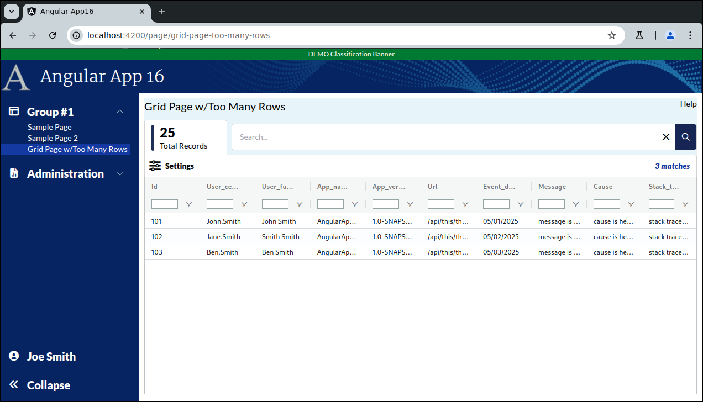

```
Exercise 11j / Client Grid / What happens when you load 1,000,000 records into the grid?  (Answers)
---------------------------------------------------------------------------------------------------
Problem:  What actually happens when you put a million records into the grid?
          -- Let's find out
          -- But, serously, if you do this, your users will hate you!!!

Trick:  Use the generate_series() postgres function to quickly generate 1 million records in a database table


```

```


Part 1 / Setup a table that has lots of records
-----------------------------------------------
 1. Populate the exceptions table with a SHIT LOAD of data!!!

	-- Delete everything from the exceptions
	delete from exceptions;
	
	-- Insert the user record
	insert into users(id, cert_username, first_name, last_name, full_name, email, created_date, last_login_date, last_updated_date)
	values(5001, 'joe.blogs', 'Joe', 'Blogs', 'Joe Bloggs', 'joe@zztop.com', now(), now(), now()  );


	-- Add 1,000,000 records to the exceptions table
	insert into exceptions(id, user_id, cert_username, app_name, app_version, url, event_date, message, cause, stack_trace)
		(
		    select g.id as id, 5001 as user_id,  'joe.blogs' as cert_username, 'AngularApp16' as app_name, '1.0-SNAPSHOT' as version, 'NA' , now() - interval '1 month', 'Something bad happened in id ' || g.id, 'cause is here', 'stack trace is here'
		    from generate_series(1, 1000000) as g(id)
		);


  2. How to execute this SQL:
	 a. Interactively in your console
		 *OR*

	b. Make a V1.2__sample_data.sql and put it in there in the db-migrations/src/main/resources/
                   ^
                   |
                   +--------- 2 fucking underscores!!!  And, a captal V or it will not work!!!!


Part 2 / Build a REST call that will return all of the data
-----------------------------------------------------------
 What is the contract?
                              {noun} / {verb}
                              {verb} / {noun}
	URL:				  /api/exceptions/list

	URL Type:			  GET - it's a read only operation

	What's passed-in?	  Nothing

	What's returned?	  List of DTOs
							id
							user_cert_name
							user_full_name
							app_name
							app_version
							url
							event_date
							message
							cause
							stack_trace


	What security roles are granted access to it?				All 4 roles

	What kind of checks are performed on the passed-in data?	Not Applicable	

	What does it do?

		It's going to run some SQL to generate a list of DTOs

  

 1. Create the DTO:  ExceptionRecordDTO
	-- It has all of the fields
      
        
        package com.lessons.models;
        
        import com.fasterxml.jackson.annotation.JsonProperty;
        
        public class ExceptionRecordDTO {
        
            @JsonProperty("id")
            private Integer id;
        
            @JsonProperty("user_cert_name")
            private String userCertName;
        
            @JsonProperty("user_full_name")
            private String userFullName;
        
            @JsonProperty("app_name")
            private String appName;
        
            @JsonProperty("app_version")
            private String appVersion;
        
            @JsonProperty("url")
            private String url;
        
            @JsonProperty("event_date")
            private String eventDate;
        
            @JsonProperty("message")
            private String message;
        
            @JsonProperty("cause")
            private String cause;
        
            @JsonProperty("stack_trace")
            private String stackTrace;
        
            // ---------------------------- Getters & Setters ------------------------------------
            
            public Integer getId() {
                return id;
            }
        
            public void setId(Integer id) {
                this.id = id;
            }
        
            public String getUserCertName() {
                return userCertName;
            }
        
            public void setUserCertName(String userCertName) {
                this.userCertName = userCertName;
            }
        
            public String getUserFullName() {
                return userFullName;
            }
        
            public void setUserFullName(String userFullName) {
                this.userFullName = userFullName;
            }
        
            public String getAppName() {
                return appName;
            }
        
            public void setAppName(String appName) {
                this.appName = appName;
            }
        
            public String getAppVersion() {
                return appVersion;
            }
        
            public void setAppVersion(String appVersion) {
                this.appVersion = appVersion;
            }
        
            public String getUrl() {
                return url;
            }
        
            public void setUrl(String url) {
                this.url = url;
            }
        
            public String getEventDate() {
                return eventDate;
            }
        
            public void setEventDate(String eventDate) {
                this.eventDate = eventDate;
            }
        
            public String getMessage() {
                return message;
            }
        
            public void setMessage(String message) {
                this.message = message;
            }
        
            public String getCause() {
                return cause;
            }
        
            public void setCause(String cause) {
                this.cause = cause;
            }
        
            public String getStackTrace() {
                return stackTrace;
            }
        
            public void setStackTrace(String stackTrace) {
                this.stackTrace = stackTrace;
            }
        }


 2. Create an ExceptionRecordService
	a. Create a java class
	b. Add the @Service annotation to it
	c. Create a public method that will do the work:   getAllExceptions()
		-- What's passed-in?  Look at your contract
		-- What's returned?   Look at your contract
        
                
        package com.lessons.services;
        
        import com.lessons.models.ExceptionRecordDTO;
        import jakarta.annotation.Resource;
        import org.springframework.jdbc.core.BeanPropertyRowMapper;
        import org.springframework.jdbc.core.JdbcTemplate;
        import org.springframework.stereotype.Service;
        
        import javax.sql.DataSource;
        import java.util.List;
        
        @Service
        public class ExceptionRecordService {
        
            @Resource
            private DataSource dataSource;
        
        
            // Use the rowMapper to convert the results into a list of ReportDTO objects
            private final BeanPropertyRowMapper<ExceptionRecordDTO> rowMapper = new BeanPropertyRowMapper<>(ExceptionRecordDTO.class);
        
            public List<ExceptionRecordDTO> getAllExceptions() {
                String sql = """
                            select u.full_name as user_full_name, e.id as id, e.cert_username as user_cert_name, e.app_name,
                                   e.app_version, e.url, e.message, e.cause, e.stack_trace,
                                   to_char(e.event_date, 'mm/dd/yyyy hh24:mi:ss') as event_date
                            from exceptions e
                            left join users u on (e.user_id = u.id)
                            order by e.id
                            """;
        
                JdbcTemplate jt = new JdbcTemplate(this.dataSource);
        
                // Be careful with jt.query()
                // -- If there are setters that are not found, then it fails SILENTLY!!!!
                List<ExceptionRecordDTO> listOfExceptions = jt.query(sql, rowMapper);
        
                return listOfExceptions;
            }
        
        }


 

 3. Create an ExceptionRecordController
	a. Create a java class
	b. Add the @Controller annotation to it
	c. Inject the ExceptionService
	d. Create a public method that acts as the frontdoor
		-- What is returned?   ResponseEntity<?>
		-- What is passed-in?  Nothing

	e. Place annotations over the etmod
		-- Put annotations over this method for security
		-- put annotations over this method for the url, url type
        
        
        
        package com.lessons.controllers;
        
        import com.lessons.models.ExceptionRecordDTO;
        import com.lessons.services.ExceptionRecordService;
        import jakarta.annotation.Resource;
        import org.springframework.http.HttpStatus;
        import org.springframework.http.ResponseEntity;
        import org.springframework.security.access.prepost.PreAuthorize;
        import org.springframework.stereotype.Controller;
        import org.springframework.web.bind.annotation.RequestMapping;
        import org.springframework.web.bind.annotation.RequestMethod;
        
        import java.util.List;
        
        @Controller
        public class ExceptionRecordController {
        
            @Resource
            private ExceptionRecordService exceptionRecordService;
        
            @RequestMapping(value="/api/exceptions/list", method = RequestMethod.GET, produces = "application/json")
            @PreAuthorize("hasAnyRole('APP16_SPECIALIST', 'APP16_SUPERVISOR',  'APP16_ADMIN', 'APP16_REVIEWER')")
            public ResponseEntity<?> getAllExceptions() {
                
                // Get the list of exceptions (using the service)
                List<ExceptionRecordDTO> listOfExceptions = exceptionRecordService.getAllExceptions();
                
                // Return the information back to the frontend (and convert java objects to JSON objects)
                return ResponseEntity.status(HttpStatus.OK)
                                     .body(listOfExceptions);
            }
        }


 4. Try it out with Postman or your web browesr
    a. Start up your backend
    b. Hit it with Postman or a web browser by connectin to http://localhost:8080/app16/api/exceptions/list
       WARNING:  If 1 million records is too much, then 
                    a. Delete the records in your exceptions table
                    b. Insert only 1000 records 
                    
                    Postman may not handle such a massive REST call
 
 
 
    LAND MINE!!!!  Did you set a breakpoint and check to see that ALL fields in the list actually have something?
                   If you have a null user_cert_name, then perhaps you need to add an "as user_cert_name" to your SQL
                   


Part 3 / Setup the Frontend Client-Side Grid Page
-------------------------------------------------
 1. Build a client-side grid page

 2. It needs to display these fields:
		id
		user_cert_name
		user_full_name
		app_name
		app_version
		url
		event_date
		message
		cause
		stack_trace

 3. It needs to have a big search box on it

 4. It needs columns to be sortable

 5. Setup a fake service to load the page


Part 4a / Build a Client Side Grid Page with a search box
---------------------------------------------------------
 1. Setup the Page
    a. Generate the component:                Call it GridPageWithTooManyRows
    b. Add the route to constants.ts:         the route will be this:   page/grid-page-too-many-rows
    c. Register the route
    d. Add the route to the database table:  ui_controls        (if using real security)
    e. Add a link to the navbar (using that route)
    f. Use the debugger to verify that the navbar link works
    


 2. Setup this page layout
     +-------------------------------------------------------------------+
     | Grid Page w/Too Many Rows                                    Help |
     +-------------------------------------------------------------------+
     |                                                                   |
     |                                                                   |
     +-------------------------------------------------------------------+


     At this point, the HTML looks like this
     ---------------------------------------      
        <div class="m-2.5">
        
         <!-- Top of Page -->
          <div class="grid grid-cols-2">
              <div>
                <span class="text-xl">Grid Page w/Too Many Rows/span>
              </div>
        
              <div class="flex place-content-end">
                 Help
              </div>
          </div>
        
          <!-- Bottom of Page  -->
          <div class="mt-2.5">
              
            
          </div>
        
        </div>


 3. Change the bottom of the page so use the VISIBLE height of the browser
     +-------------------------------------------------------------------+
     | Grid Page w/Too Many Rows                                    Help |
     +-------------------------------------------------------------------+
     | Grid is here                                                      |   Height of the bottom of page *STRETCHES*
     |                                                                   |
     +-------------------------------------------------------------------+
 
        <div class="m-2.5">
        
          <div class="grid grid-cols-2">
              <div>
                <span class="text-xl">Grid Page w/Too Many Rows</span>
              </div>
        
              <div class="flex place-content-end">
                 Help
              </div>
          </div>
        
          <div class="mt-2.5">
              <!-- Add Grid Here -->
              <div class="overflow-y-auto" style="height: calc(100vh - 150px)">
        
                Grid is here
        
              </div>
        
          </div>
        
        
        </div>

 
    
Part 4b / Configure the gridOptions, columnDefs, defaultColumnDefs, and rowData 
-------------------------------------------------------------------------------
 1. Add a public class variable:   gridOptions
    -- The type is GridOptions
    
    -- Set these properties
        domLayout: 'normal',            // Requires the wrapper div to have a height set *OR* a class="h-full" on it
        debug: false,
        rowModelType: 'clientSide',   
        
        
        public gridOptions: GridOptions = {
          domLayout: 'normal',
          debug: true,
          rowModelType: 'clientSide'
        };
        
        
 2. Add a public class variable:  columnDefs
    -- The type is array of ColDef objects
    
    -- Initialize the array to hold an object for each column definition
    
    a. Define columnDefs to hold an array of 5 objects
        the field names will be
                id
                user_cert_name
                user_full_name
                app_name
                app_version
                url
                event_date
                message
                cause
                stack_trace
                
                

          public columnDefs: ColDef[] = [
            {
              field: 'id'
            },
            {
              field: 'user_cert_name'
            },           
            {
              field: 'user_full_name'
            },
            {
              field: 'app_name'
            },
            {
              field: 'app_version',
            },
            {
              field: 'url',
            },
            {
              field: 'event_date',
            },
            {
              field: 'message',
            },
            {
              field: 'cause',
            },
            {
              field: 'stack_trace',
            }
          ];               
                
                
 3. Turn on sorting on *ALL* columns
    -- Define a class variable called defaultColumnDefs
    -- The type is ColDef
    -- Initialize it so that flex = 1, sortable = true

        public defaultColumnDefs: ColDef = {
          flex: 1,
          sortable: true,           // All columns are sortable
        }
        
  
             
 4. Turn on filters on *ALL* columns
    a. Add a class variable:  textFilterParams     
       -- The type is ITextFilterParams
       -- Tell it to only show the "Contains" and "Not Contains" options
       -- Tell it to make the filters case-insensitive
       -- Tell it to add a debounce time of 200 msec
       
             // Customize the filters (when turned on)
             private textFilterParams: ITextFilterParams = {
                filterOptions: ['contains', 'notContains'],         // Customize the filter to only show "Contains" and "Not Contains"
                caseSensitive: false,                               // Filter is case-insensitive
                debounceMs: 200,
                suppressAndOrCondition: true,
              };
      
    b. Update the defaultColumnDefs
        -- Add filter = 'agTextColumnFilter', floatingFilter = true, filterParams is set to your textFilterParams

            public defaultColumnDef: ColDef = {
                flex: 1,
                sortable: true,                         // All columns are sortable
                floatingFilter: true,                   // Show the floating filter (beneath the column label)
                filter: 'agTextColumnFilter',           // Specify the type of filter
                filterParams: this.textFilterParams,    // Customize the filter
            }
                                
                
 
 
 5. Add the <ag-grid-angular> tag to your HTML 
    -- Place it where you want your grid to appear
    
    
 
 6. Tell the ag-grid-angular to use your class variables
    -- Set gridOptions property     to your public class variable
    -- Set columnDefs property      to use your public class variable
    -- Set defaultColDef property   to use your public class variable
    -- Set the grid to use 100% of the width 
    -- Set the grid to use 100% of the height
    -- Apply the ag-theme-alpine class to the grid (to set the grid's theme to "alpine"
    
          <ag-grid-angular 
                class="ag-theme-balham w-full h-full"
                [gridOptions]="this.gridOptions"
                [columnDefs]="this.columnDefs"
                [defaultColDef]="this.defaultColumnDef"
          ></ag-grid-angular>


        -- At this point, the grid is shows "Loading..." because there is no row data
```

```


Part 4c / Create the Frontend Service that will simulate a REST call (fake service)
-----------------------------------------------------------------------------------
 1. Create a frontend DTO:  ExceptionRecordDTO
 
 
        export class ExceptionRecordDTO {
          public id:              number;
          public user_cert_name:  string;
          public user_full_name:  string;
          public app_name:        string;
          public app_version:     string;
          public url:             string;
          public event_date:      string;
          public message:         string;
          public cause:           string;
          public stack_trace:     string;
        }


 2. Create a frontend service:  ExceptionRecordService
    a. Create this front-end service:  ExceptionRecordService 
     
    b. Add a public method:  getAllExceptions() 
        NOTE:  This method returns an observable that holds an array of ExceptionRecordDTO

     c. Fill-in this public method
        1) Create a local variable that holds an array of ExceptionRecordDTO objects 
        2) Fill-in the array with 3 fake objects
        3) Convert the array into an observable
        4) Return the observable

        
          public getAllExceptions(): Observable<ExceptionRecordDTO[]> {
            let data: ExceptionRecordDTO[] = [
              {
                id: 101,
                user_cert_name: 'John.Smith',
                user_full_name: 'John Smith',
                app_name: 'AngularApp16',
                app_version: '1.0-SNAPSHOT',
                url: '/api/this/that/1',
                event_date: '05/01/2025',
                message: 'message is here #1',
                cause: 'cause is here #1',
                stack_trace: 'stack trace is here #1'
              },
              {
                id: 102,
                user_cert_name: 'Jane.Smith',
                user_full_name: 'Smith Smith',
                app_name: 'AngularApp16',
                app_version: '1.0-SNAPSHOT',
                url: '/api/this/that/2',
                event_date: '05/02/2025',
                message: 'message is here #2',
                cause: 'cause is here #2',
                stack_trace: 'stack trace is here #3'
              },
              {
                id: 103,
                user_cert_name: 'Ben.Smith',
                user_full_name: 'Ben Smith',
                app_name: 'AngularApp16',
                app_version: '1.0-SNAPSHOT',
                url: '/api/this/that/3',
                event_date: '05/03/2025',
                message: 'message is here #3',
                cause: 'cause is here #3',
                stack_trace: 'stack trace is here #3'
              },
            ];
        
            return of(data);
          }
                
                


Part 4d / Configure the grid to load it's rowData with the fake service
-----------------------------------------------------------------------
 1, In the Grid Page TypeScript / Inject your MyReportService
 
        public constructor(private exceptionRecordService: ExceptionRecordService) {  }
 
 
 
 2. In the Grid Page TypeScript / Add these 2 public class variables:
        gridApi / type is GridApi
        gridColumnApi / type is ColumnApi
        
            public gridApi: GridApi;
            public gridColumnApi: ColumnApi;
    
    
 3. In the Grid Page TypeScript / Add a method:  onGridReady
    -- Pass-in aParams / type is GridReadyEvent
    -- initialize this.gridAPi
    -- initialize this.gridColumnApi
    -- Use the gridApi to show the "loading overlay"
    -- Invoke the fake REST call (you made in the previous step)
    -- When the REST call comes in, set the grid row data
    
    
          public onGridReady(aParams: GridReadyEvent) {
            // Get a reference to the gridApi and gridColumnApi (which we will need later to get selected rows)
            this.gridApi = aParams.api;
            this.gridColumnApi = aParams.columnApi;
        
            // Show the loading overlay
            this.gridApi.showLoadingOverlay();
        
            // Invoke the REST call to get the grid data
            this.exceptionRecordService.getAllExceptions().subscribe( (aData: ExceptionRecordDTO[]) => {
              // REST call came back with data
        
              // Load the grid with data from the REST call
              this.gridApi.setRowData(aData);
            })
        
          }
 
 4. In the HTML, tell the grid to call your onGridReady() when the grid is fully initialized
 
       (gridReady)="this.onGridReady($event)"


```

```


Part 4e / Get the start_date and end_date fields to sort correctly
------------------------------------------------------------------
Problem:  By default client side date fields do not sort -- because the grid treats them as string
 
 1. Implement your Date Service (if you haven't already created it)
 
        import { Injectable } from '@angular/core';
        
        @Injectable({
          providedIn: 'root'
        })
        export class DateService {
        
          constructor() { }
        
        
          private dateToNumber(aDateAsString: string): number | null {
            if (aDateAsString === undefined || aDateAsString === null) {
              return null;
            }
        
            if (aDateAsString.length == 10) {
              // Convert mm/dd/yyyy --> yyyymmdd   (as a number)
              let yearNumber: string  = aDateAsString.substring(6, 10);
              let monthNumber: string = aDateAsString.substring(0, 2);
              let dayNumber:   string  = aDateAsString.substring(3, 5);
        
              let resultAsString =  `${yearNumber}${monthNumber}${dayNumber}`;
              return Number(resultAsString);
            }
            else if (aDateAsString.length == 19) {
              // Convert mm/dd/yyyy hh24:mi:ss --> yyyymmddHH24MISS   (as a number)
        
              let yearNumber:   string = aDateAsString.substring(6, 10);
              let monthNumber:  string = aDateAsString.substring(0, 2);
              let dayNumber:    string = aDateAsString.substring(3, 5);
              let hourNumber:   string = aDateAsString.substring(11, 13);
              let minuteNumber: string = aDateAsString.substring(14, 16);
              let secondNumber: string = aDateAsString.substring(17, 19);
        
              let resultAsString =  `${yearNumber}${monthNumber}${dayNumber}${hourNumber}${minuteNumber}${secondNumber}`;
              return Number(resultAsString);
            }
            else {
              return null;
            }
        
          }
        
        
          public dateComparator(aDate1: string, aDate2: string): number {
            let date1Number = this.dateToNumber(aDate1);
            let date2Number = this.dateToNumber(aDate2);
        
            if (date1Number === null && date2Number === null) {
              return 0;
            }
            if (date1Number === null) {
              return -1;
            }
            if (date2Number === null) {
              return 1;
            }
        
            return date1Number - date2Number;
          }
        
        }
 
 
 2. Inject your Date Service into your main grid page
  
      public constructor(private exceptionRecordService: ExceptionRecordService,
                         private dateService: DateService) 
      {  }
  
  
 3. Tell your grid "date" columns to use your Date Service comparator method 

      {
    	field: 'event_date',
  		comparator: (a: string, b: string) => this.dateService.dateComparator(a,b)
	  }


Part 4f / Create the search box that applies filters
----------------------------------------------------
Change the layout by adding some stuff *between the page title and the grid


 1. Change your page wrapper div
    a. Set a background color to be rgb(231,245,250) or "backDropColor"
    
    b. If you're using a margin of 10px, then change it to padding of 10px  (so the new background color fills the edges)
    
    c. Verify that the background color is visible in the edges of the page
    
    
 2. Add a row called "search box line" and a row called "Grid buttons"  between the page title and the grid
 
     +-------------------------------------------------------------------+
     | Grid Page with Filter Search Box                             Help |
     +-------------------------------------------------------------------+
     | Search box line                                                   |   Filter Search Box is
     +-------------------------------------------------------------------|
     | Grid Buttons                                                      |   Grid Buttons are here
     +-------------------------------------------------------------------+
     | Grid is here                                                      |   Height of the bottom of page *STRETCHES*
     |                                                                   |
     |                                                                   |
     |                                                                   |
     |                                                                   |
     +-------------------------------------------------------------------+   
    
 
 
  3. Add 10px of margin between the page title row and the rest of the page
      
     At this point, the HTML looks like this
     ---------------------------------------    
          <div class="bg-backDropColor m-2.5">
        
            <div class="grid grid-cols-2">
              <div>
                <span class="text-xl">Grid Page w/Too Many Rows</span>
              </div>
          
              <div class="flex place-content-end">
                Help
              </div>
            </div>
        
          
            <!--  S E A R C H       B O X       L I N E   -->
            <div class="mt-2.5">
              Search box line
            </div>
          
            <!--  G R I D      B U T T O N S         -->
            <div>
              Grid Buttons
            </div>
          
          
            <!--  G R I D      I S    H E R E     -->
            <div class="overflow-y-auto" style="height: calc(100vh - 205px)">
              <ag-grid-angular
                class="ag-theme-balham w-full h-full"
                [gridOptions]="this.gridOptions"
                [columnDefs]="this.columnDefs"
                [defaultColDef]="this.defaultColumnDef"
                (gridReady)="this.onGridReady($event)"
              ></ag-grid-angular>
            </div>
        
        
        </div>

  
  
  4. Fill-in the Tab and Search Box Row
     a. Setup a row that has a height of 64px
     b. This row has 3 boxes in it:
        -- The 1st box is 5px wide              / it will be a decorative vertical line
        -- The 2nd box is 150px wide            / it will show the total number of records
        -- The 3rd box uses the remaining width / it holds the search box
        
             +--------------------------------------------------------------------------+
             | +--+  +---------------+    +------------------------------------------+  |
             | |  |  | Totals        |    | Search Box                               |  |
             | +--+  +---------------+    +------------------------------------------+  |
             +--------------------------------------------------------------------------|
 
 
           
            <!--  S E A R C H       B O X       L I N E   -->
            <div class="mt-2.5 flex flex-row w-full h-[64px] relative flex-shrink-0">
            
                <!-- Tab -->
                <div class="flex flex-row items-center absolute bg-white rounded-t px-3 py-2 border-x border-t border-borderColor h-full w-[150px] top-[1px]">
                  
                  <!-- Vertical Bar -->
                  <div class="w-[5px] h-full float-left bg-[#1E3059] rounded mr-2.5 flex-shrink-0"></div>

                  <div class="flex flex-col pt-2">
                    <div class="h-[30px] w-[125px] flex place-content-start">
                      <!-- Title (count) -->
                      <ng-container>
                        <!-- Display Total -->
                        <span class="text-2xl font-extrabold">25</span>
                      </ng-container>
                    </div>
            
                    <div class="h-[30px] flex place-content-start">
                      <!-- Total Records on Page Load -->
                      <span>Total Records</span>
                    </div>
                  </div>
                </div>
            
                <!-- Searchbar Container -->
                <div class="h-full w-full py-2 flex flex-row pl-[158px]">
            
                  <!-- Searchbar -->
                  <div class="w-full bg-white rounded border-borderColor border justify-center flex flex-row gap-2.5 pl-3.5 overflow-hidden">
            
                    <!-- Searchbar Input -->
                    <input matInput type="text"
                           class="w-full outline-none"
                           placeholder="Search..."
                           autocomplete="off"
                           title="Search Box"
                           style="background: white"
                           aria-label="Search Box"/>
            
                    <!-- Clear Icon -->
                    <span class="flex clickable items-center justify-center" title="Clear Search" aria-label="Clear Search">
                                <i class="fa-solid fa-xmark-large"></i>
                        </span>
            
                    <!-- Search Icon -->
                    <div class="bg-blue-950 rounded-r w-[42px] items-center justify-center clickable text-white flex h-full" aria-label="Search" title="Search">
                      <i class="fa-regular fa-search"></i>
                    </div>
                  </div>
            
                </div>
          </div>

             
  5. Fill-in the grid buttons
     a. Create a row with a lwft and right-side 
         +-------------------------------------------------------------------+
         | <Settings Icon> Settings                          3 Total Matches |                                                  
         +-------------------------------------------------------------------+
          
     b. On the left-side, make sure you have a popup button
        -- The button that holds the <Settings Icon> and Settings
        -- Pressing the button should open a popup menu that holds an option to "Reset Grid"
     
     
        <!--  G R I D      B U T T O N S         -->
        <div class="flex flex-row w-full bg-white rounded-tr h-10 flex-shrink-0 items-center border-x border-t border-borderColor px-3">
    
            <!-- Settings button -->
            <button [matMenuTriggerFor]="gridMenu" class="-ml-1"
                    type="button" title="Settings" aria-label="Settings">
              <div class="flex flex-row gap-2 items-center">
                <i class="fa-xl fa-solid fa-sliders"></i>
                <span class="font-extrabold">Settings</span>
              </div>
            </button>
    
            <!-- Pop-up menu for the 'Settings' button -->
            <mat-menu #gridMenu="matMenu">
              <button mat-menu-item type="button" title="Reset Grid" aria-label="Reset Grid">
                Reset Grid
              </button>
            </mat-menu>
    
            <div class="flex flex-grow place-content-end">
              <!-- Show the Total Number of Matches -->
              <span class="italic text-primary font-extrabold">3 matches</span>
            </div>
      </div>   
       
```

```

Part 4g / Entering text in the search box should apply filters in real-time
---------------------------------------------------------------------------
 1. Add a public class variable:  totalFilteredMatchesAndLabel
    -- It will hold "No Matches" or "1 Match" or "5 Matches"

       public totalFilteredMatchesAndLabel: string;
       
       
 
 2. Add a private method:  refreshTotalFilteredMatchAndLabels()
    -- Nothing is passed-in
    -- It gets the total number of records visible
    -- If there are zero records visible, then
           set totalFilteredMatchesAndLabel = "No Matches"
    
    -- If there is 1 record visible, then
           set totalFilteredMatchesAndLabel = "1 Match"

    -- If there are 2 records visible, then
           set totalFilteredMatchesAndLabel = "2 Matches"

    -- You get the idea!!!
    
     
       private refreshTotalFilteredMatchAndLabels(): void {
            let totalRecordsVisible: number =  this.gridApi.getDisplayedRowCount();
            if (totalRecordsVisible == 0) {
              this.totalFilteredMatchesAndLabel = "No Matches";
            }
            else if (totalRecordsVisible == 1) {
              this.totalFilteredMatchesAndLabel = "1 Match"
            }
            else {
              this.totalFilteredMatchesAndLabel = String(totalRecordsVisible) + " Matches";
            }
       }


 3. Add a public method:   runClientGridSearch()
    -- Pass-in the raw search text
    -- It runs the search
    -- It refreshes totalFilteredMatchesAndLabel
    
          public runClientGridSearch(aRawQuery: string): void {
            // Run the search on this client side grid
            this.gridApi.setQuickFilter(aRawQuery);
        
            // Refresh the total matches label
            this.refreshTotalFilteredMatchAndLabels();
          }
    
    
 4. Change your HTML / Replace the hard-coded "3 Matches" with totalFilteredMatchesAndLabel 
 
 
 5. Bind the search box to a class variable
    a. Create this class variable:  rawSearchQuery
       -- It holds whatever text the users enters
       -- Initialize it to an empty string
       
        public rawSearchQuery: string;
        
       
    b. Bind the search box to this class variable
       <input matInput type="text".... [(ngModel)]="this.rawSearchQuery"
       
       
 6. Change the search box so that as the user types-in input,
    -- The page calls this.runClientGridSearch()
    -- The page passes-in the entered text into this method
            (input)="this.runClientGridSearch(this.rawSearchQuery)"
    
 

Part 4h / Cleanup / Update the tab to show the total records on page load / Implement the clear search button
-------------------------------------------------------------------------------------------------------------
 1. Create a class variable:  totalRecordsOnPageLoad
    -- It holds the total records loaded on page load
            
            public totalRecordsOnPageLoad: number;
            
        
 2. In the onGridReady(), 
    -- set the totalRecordsOnPageLoad to hold the total number of records returned from the backend
        
        
          public onGridReady(aParams: GridReadyEvent) {
            // Get a reference to the gridApi and gridColumnApi (which we will need later to get selected rows)
            this.gridApi = aParams.api;
            this.gridColumnApi = aParams.columnApi;
        
            // Show the loading overlay
            this.gridApi.showLoadingOverlay();
        
            // Invoke the REST call to get the grid data
            this.exceptionRecordService.getAllExceptions().subscribe( (aData: ExceptionRecordDTO[]) => {
              // REST call came back with data
        
              if (!aData) {
                this.totalRecordsOnPageLoad = 0;
              }
              else {
                this.totalRecordsOnPageLoad = aData.length;
              }
        
              // Load the grid with data from the REST call
              this.gridApi.setRowData(aData);
            })
          }


 3. Get the clear search icon button to clear the search
    a. Add a public method:  clearSearch()
       -- It should clear the search box text
       -- It should clear the filters
       -- It should refresh the matches label
       
       
        public clearSearch(): void {
            // Clear the search query
            this.rawSearchQuery = "";
            
            // Clear the filters
            this.gridApi.setFilterModel(null);
            
            // Clear the filter and refresh the totals
            this.runClientGridSearch('');
        }
  
    
    
    b. Clicking on the clear search should call clearSearch()
    
    
    c. Try it out!!
    
 
 4. Replace the deprecated textFiltersParams
      suppressAndOrCondition: true  -->  maxNumConditions: 1


 5. Have the "Reset Grid" button actually resset the grid
    a. Create a public method:  resetGrid()
       -- Your method should reset the column state
       -- Your method should size the columns to fit
       
         public resetGrid(): void {
            // Reset the columns back to default  *BEFORE*  auto-sizing them sizing them
            this.gridColumnApi.resetColumnState();
            
            // Size the columns to fit
            this.gridApi.sizeColumnsToFit();
         }
    
    
    b. Add a click handler so that the "Reset Grid" button invoke your method
    
          <button (click)="this.resetGrid()" mat-menu-item type="button" title="Reset Grid" aria-label="Reset Grid">
            Reset Grid
          </button
          


Part 5 / Integrate the frontend & backend
-----------------------------------------
 1. Update the frontend service to invoke the real REST call
	a. Inject the httpClient

	b. Have your frontend service use httpClient to create an observable that will invoke your REST call

        
        import { Injectable } from '@angular/core';
        import {ExceptionRecordDTO} from "../models/exception-record-dto";
        import {Observable, of} from "rxjs";
        import {HttpClient} from "@angular/common/http";
        import {environment} from "../../environments/environment";
        
        @Injectable({
          providedIn: 'root'
        })
        export class ExceptionRecordService {
        
          constructor(private httpClient: HttpClient) { }
        
          public getAllExceptions(): Observable<ExceptionRecordDTO[]> {
            // Construct the URL of the REST call
            const restUrl: string = environment.baseUrl + '/api/exception/list';
        
            // Return an observable that (when invoked) returns an array of  ExceptionRecordDTO objects
            return this.httpClient.get <ExceptionRecordDTO[]> (restUrl);
          }
        }


Completed HTML
--------------
<div class="bg-backDropColor m-2.5">

  <div class="grid grid-cols-2">
    <div>
      <span class="text-xl">Grid Page w/Too Many Rows</span>
    </div>

    <div class="flex place-content-end">
      Help
    </div>
  </div>


  <!--  S E A R C H       B O X       L I N E   -->
  <div class="mt-2.5 flex flex-row w-full h-[64px] relative flex-shrink-0">

    <!-- Tab -->
    <div class="flex flex-row items-center absolute bg-white rounded-t px-3 py-2 border-x border-t border-borderColor h-full w-[150px] top-[1px]">

      <!-- Vertical Bar -->
      <div class="w-[5px] h-full float-left bg-[#1E3059] rounded mr-2.5 flex-shrink-0"></div>

      <div class="flex flex-col pt-2">
        <div class="h-[30px] w-[125px] flex place-content-start">
          <!-- Title (count) -->
          <ng-container>
            <!-- Display Total -->
            <span class="text-2xl font-extrabold">{{ this.totalRecordsOnPageLoad }}</span>
          </ng-container>
        </div>

        <div class="h-[30px] flex place-content-start">
          <!-- Total Records on Page Load -->
          <span>Total Records</span>
        </div>
      </div>
    </div>

    <!-- Searchbar Container -->
    <div class="h-full w-full py-2 flex flex-row pl-[158px]">

      <!-- Searchbar -->
      <div class="w-full bg-white rounded border-borderColor border justify-center flex flex-row gap-2.5 pl-3.5 overflow-hidden">

        <!-- Searchbar Input -->
        <input matInput type="text"
               [(ngModel)]="this.rawSearchQuery"
               (input)="this.runClientGridSearch(this.rawSearchQuery)"
               class="w-full outline-none"
               placeholder="Search..."
               autocomplete="off"
               title="Search Box"
               style="background: white"
               aria-label="Search Box"/>

        <!-- Clear Icon -->
        <span (click)="this.clearSearch()"  class="flex clickable items-center justify-center" title="Clear Search" aria-label="Clear Search">
                                <i class="fa-solid fa-xmark-large"></i>
                        </span>

        <!-- Search Icon -->
        <div class="bg-blue-950 rounded-r w-[42px] items-center justify-center clickable text-white flex h-full" aria-label="Search" title="Search">
          <i class="fa-regular fa-search"></i>
        </div>
      </div>

    </div>
  </div>


  <!--  G R I D      B U T T O N S         -->
  <div class="flex flex-row w-full bg-white rounded-tr h-10 flex-shrink-0 items-center border-x border-t border-borderColor px-3">

    <!-- Settings button -->
    <button [matMenuTriggerFor]="gridMenu" class="-ml-1"
            type="button" title="Settings" aria-label="Settings">
      <div class="flex flex-row gap-2 items-center">
        <i class="fa-xl fa-solid fa-sliders"></i>
        <span class="font-extrabold">Settings</span>
      </div>
    </button>

    <!-- Pop-up menu for the 'Settings' button -->
    <mat-menu #gridMenu="matMenu">
      <button (click)="this.resetGrid()" mat-menu-item type="button" title="Reset Grid" aria-label="Reset Grid">
        Reset Grid
      </button>
    </mat-menu>

    <div class="flex flex-grow place-content-end">
      <!-- Show the Total Number of Matches -->
      <span class="italic text-primary font-extrabold">{{ this.totalFilteredMatchesAndLabel }}</span>
    </div>
  </div>


  <!--  G R I D      I S    H E R E     -->
  <div class="overflow-y-auto" style="height: calc(100vh - 245px)">
    <ag-grid-angular
      class="ag-theme-balham w-full h-full"
      [gridOptions]="this.gridOptions"
      [columnDefs]="this.columnDefs"
      [defaultColDef]="this.defaultColumnDef"
      (gridReady)="this.onGridReady($event)"
    ></ag-grid-angular>
  </div>


</div>


Completed TypeScript
--------------------
import { Component } from '@angular/core';
import {ColDef, ColumnApi, GridApi, GridOptions, GridReadyEvent, ITextFilterParams} from "ag-grid-community";
import {ExceptionRecordService} from "../../services/exception-record.service";
import {ExceptionRecordDTO} from "../../models/exception-record-dto";
import {DateService} from "../../services/date.service";

@Component({
  selector: 'app-grid-page-with-too-many-rows',
  templateUrl: './grid-page-with-too-many-rows.component.html',
  styleUrls: ['./grid-page-with-too-many-rows.component.scss']
})
export class GridPageWithTooManyRowsComponent {

  public constructor(private exceptionRecordService: ExceptionRecordService,
                     private dateService: DateService)
  {  }

  public gridApi: GridApi;
  public gridColumnApi: ColumnApi;

  public totalFilteredMatchesAndLabel: string;
  public rawSearchQuery: string;
  public totalRecordsOnPageLoad: number;


  public gridOptions: GridOptions = {
    domLayout: 'normal',
    debug: true,
    rowModelType: 'clientSide'
  };

  public columnDefs: ColDef[] = [
    {
      field: 'id'
    },
    {
      field: 'user_cert_name'
    },
    {
      field: 'user_full_name'
    },
    {
      field: 'app_name'
    },
    {
      field: 'app_version',
    },
    {
      field: 'url',
    },
    {
      field: 'event_date',
      comparator: (a: string, b: string) => this.dateService.dateComparator(a,b)
    },
    {
      field: 'message',
    },
    {
      field: 'cause',
    },
    {
      field: 'stack_trace',
    }
  ];


  // Customize the filters (when turned on)
  private textFilterParams: ITextFilterParams = {
    filterOptions: ['contains', 'notContains'],         // Customize the filter to only show "Contains" and "Not Contains"
    caseSensitive: false,                               // Filter is case-insensitive
    debounceMs: 200,
    maxNumConditions: 1
  };


  public defaultColumnDef: ColDef = {
    flex: 1,
    sortable: true,                         // All columns are sortable
    floatingFilter: true,                   // Show the floating filter (beneath the column label)
    filter: 'agTextColumnFilter',           // Specify the type of filter
    filterParams: this.textFilterParams,    // Customize the filter
  }


  public onGridReady(aParams: GridReadyEvent) {
    // Get a reference to the gridApi and gridColumnApi (which we will need later to get selected rows)
    this.gridApi = aParams.api;
    this.gridColumnApi = aParams.columnApi;

    // Show the loading overlay
    this.gridApi.showLoadingOverlay();

    // Invoke the REST call to get the grid data
    this.exceptionRecordService.getAllExceptions().subscribe( (aData: ExceptionRecordDTO[]) => {
      // REST call came back with data

      if (!aData) {
        this.totalRecordsOnPageLoad = 0;
      }
      else {
        this.totalRecordsOnPageLoad = aData.length;
      }

      // Load the grid with data from the REST call
      this.gridApi.setRowData(aData);
    })
  }


  private refreshTotalFilteredMatchAndLabels(): void {
    let totalRecordsVisible: number =  this.gridApi.getDisplayedRowCount();
    if (totalRecordsVisible == 0) {
      this.totalFilteredMatchesAndLabel = "No Matches";
    }
    else if (totalRecordsVisible == 1) {
      this.totalFilteredMatchesAndLabel = "1 Match"
    }
    else {
      this.totalFilteredMatchesAndLabel = String(totalRecordsVisible) + " Matches";
    }
  }


  public runClientGridSearch(aRawQuery: string): void {
    // Run the search on this client side grid
    this.gridApi.setQuickFilter(aRawQuery);

    // Refresh the total matches label
    this.refreshTotalFilteredMatchAndLabels();
  }


  public clearSearch(): void {
    // Clear the search query
    this.rawSearchQuery = "";
    
    // Clear the filters
    this.gridApi.setFilterModel(null);
    
    // Clear the filter and refresh the totals
    this.runClientGridSearch('');
  }

  public resetGrid(): void {
    // Reset the columns back to default  *BEFORE*  auto-sizing them sizing them
    this.gridColumnApi.resetColumnState();

    // Size the columns to fit
    this.gridApi.sizeColumnsToFit();
  }

}


```