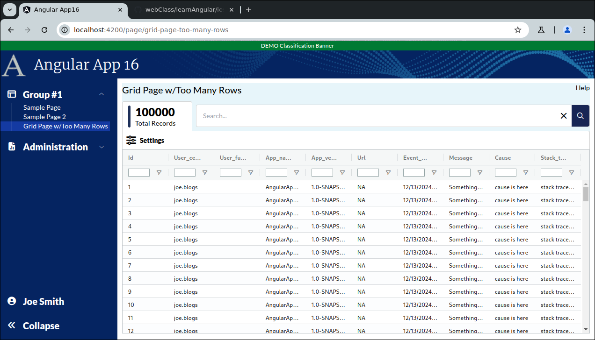

```
Exercise 11j / Client Grid / What happens when you load 1,000,000 records into the grid?
----------------------------------------------------------------------------------------
Problem:  What actually happens when you put a million records into the grid?
          -- Let's find out
          -- But, serously, if you do this, your users will hate you!!!
          
          
Trick:  Use the generate_series() postgres function to quickly generate 1 million records in a database table


```

```


Part 1 / Setup a table that has lots of records
-----------------------------------------------
 1. Populate the exceptions table with a SHIT LOAD of data!!!

	-- Delete everything from the exceptions
	delete from exceptions;
	
	-- Insert the user record
	insert into users(id, cert_username, first_name, last_name, full_name, email, created_date, last_login_date, last_updated_date)
	values(5001, 'joe.blogs', 'Joe', 'Blogs', 'Joe Bloggs', 'joe@zztop.com', now(), now(), now()  );


	-- Add 1,000,000 records to the exceptions table
	insert into exceptions(id, user_id, cert_username, app_name, app_version, url, event_date, message, cause, stack_trace)
		(
		    select g.id as id, 5001 as user_id,  'joe.blogs' as cert_username, 'AngularApp16' as app_name, '1.0-SNAPSHOT' as version, 'NA' , now() - interval '1 month', 'Something bad happened in id ' || g.id, 'cause is here', 'stack trace is here'
		    from generate_series(1, 1000000) as g(id)
		);


  2. How to execute this SQL:
	 a. Interactively in your console
		 *OR*

	b. Make a V1.2__sample_data.sql and put it in there in the db-migrations/src/main/resources/
                   ^
                   |
                   +--------- 2 fucking underscores!!!  And, a captal V or it will not work!!!!


Part 2 / Build a REST call that will return all of the data
-----------------------------------------------------------
 What is the contract?
                              {noun} / {verb}
                              {verb} / {noun}
	URL:				  /api/exceptions/list

	URL Type:			  GET - it's a read only operation

	What's passed-in?	  Nothing

	What's returned?	  List of DTOs
							id
							user_cert_name
							user_full_name
							app_name
							app_version
							url
							event_date
							message
							cause
							stack_trace


	What security roles are granted access to it?				All 4 roles

	What kind of checks are performed on the passed-in data?	Not Applicable	

	What does it do?

		It's going to run some SQL to generate a list of DTOs

  

 1. Create the DTO:  ExceptionRecordDTO
	-- It has all of the fields


 2. Create an ExceptionRecordService
	a. Create a java class
	b. Add the @Service annotation to it
	c. Create a public method that will do the work:   getAllExceptions()
		-- What's passed-in?  Look at your contract
		-- What's returned?   Look at your contract
 

 3. Create an ExceptionRecordController
	a. Create a java class
	b. Add the @Controller annotation to it
	c. Inject the ExceptionService
	d. Create a public method that acts as the frontdoor
		-- What is returned?   ResponseEntity<?>
		-- What is passed-in?  Nothing

	e. Place annotations over the etmod
		-- Put annotations over this method for security
		-- put annotations over this method for the url, url type


 4. Try it out with Postman or your web browesr
    a. Start up your backend
    b. Hit it with Postman or a web browser
       WARNING:  Postman may not handle such a massive REST call

 
 


Part 3 / Setup the Frontend Client-Side Grid Page
-------------------------------------------------
 1. Build a client-side grid page

 2. It needs to display these fields:
		id
		user_cert_name
		user_full_name
		app_name
		app_version
		url
		event_date
		message
		cause
		stack_trace

 3. It needs to have a big search box on it

 4. It needs columns to be sortable

 5. Setup a fake service to load the page


Part 4a / Build a Client Side Grid Page with a search box
---------------------------------------------------------
 1. Setup the Page
    a. Generate the component:                Call it GridPageWithTooManyRows
    b. Add the route to constants.ts:         the route will be this:   page/grid-page-too-many-rows
    c. Register the route
    d. Add the route to the database table:  ui_controls        (if using real security)
    e. Add a link to the navbar (using that route)
    f. Use the debugger to verify that the navbar link works
    


 2. Setup this page layout
     +-------------------------------------------------------------------+
     | Grid Page w/Too Many Rows                                    Help |
     +-------------------------------------------------------------------+
     |                                                                   |
     |                                                                   |
     +-------------------------------------------------------------------+
     
     

 3. Change the bottom of the page so use the VISIBLE height of the browser
     +-------------------------------------------------------------------+
     | Grid Page w/Too Many Rows                                    Help |
     +-------------------------------------------------------------------+
     | Grid is here                                                      |   Height of the bottom of page *STRETCHES*
     |                                                                   |
     +-------------------------------------------------------------------+


Part 4b / Configure the gridOptions, columnDefs, defaultColumnDefs, and rowData 
-------------------------------------------------------------------------------
 1. Add a public class variable:   gridOptions
    -- The type is GridOptions
    
    -- Set these properties
        domLayout: 'normal',            // Requires the wrapper div to have a height set *OR* a class="h-full" on it
        debug: false,
        rowModelType: 'clientSide',   
        
       
        
 2. Add a public class variable:  columnDefs
    -- The type is array of ColDef objects
    
    -- Initialize the array to hold an object for each column definition
    
    a. Define columnDefs to hold an array of 5 objects
        the field names will be
                id
                user_cert_name
                user_full_name
                app_name
                app_version
                url
                event_date
                message
                cause
                stack_trace
                
 3. Turn on sorting on *ALL* columns
 
 4. Turn on filters on *ALL* columns
  
 5. Add the <ag-grid-angular> tag to your HTML 
   
 6. Tell the ag-grid-angular to use your class variables


Part 4c / Create the Frontend Service that will simulate a REST call (fake service)
-----------------------------------------------------------------------------------
 1. Create a frontend DTO:  ExceptionRecordDTO
    -- It should hold one row of data
    
    
 2. Create a frontend service:  ExceptionRecordService
    a. Create this front-end service:  ExceptionRecordService 
     
    b. Add a public method:  getAllExceptions() 
        NOTE:  This method returns an observable that holds an array of ExceptionRecordDTO
    
    c. Fill-in this public method
       1) Create a local variable that holds an array of ExceptionRecordDTO objects 
       2) Fill-in the array with 3 fake objects
       3) Convert the array into an observable
       4) Return the observable   
        
        

Part 4d / Configure the grid to load it's rowData with the fake service
-----------------------------------------------------------------------
 1, In the Grid Page TypeScript / Inject your MyReportService
 
 2. In the Grid Page TypeScript / Add these 2 public class variables:
        gridApi / type is GridApi
        gridColumnApi / type is ColumnApi
        
 3. In the Grid Page TypeScript / Add a method:  onGridReady
         


Part 4e / Get the date fields to sort correctly
-----------------------------------------------


Part 4f / Create the search box that applies filters
----------------------------------------------------
Change the layout by adding some stuff *between the page title and the grid


 1. Change your page wrapper div
    a. Set a background color to be rgb(231,245,250) or "backDropColor"
    
    b. If you're using a margin of 10px, then change it to padding of 10px  (so the new background color fills the edges)
    
    c. Verify that the background color is visible in the edges of the page
    
    
 2. Add a row called "search box line" and a row called "Grid buttons"  between the page title and the grid
 
     +-------------------------------------------------------------------+
     | Grid Page with Filter Search Box                             Help |
     +-------------------------------------------------------------------+
     | Search box line                                                   |   Filter Search Box is
     +-------------------------------------------------------------------|
     | Grid Buttons                                                      |   Grid Buttons are here
     +-------------------------------------------------------------------+
     | Grid is here                                                      |   Height of the bottom of page *STRETCHES*
     |                                                                   |
     |                                                                   |
     |                                                                   |
     |                                                                   |
     +-------------------------------------------------------------------+   
    
 
 
  3. Add 10px of margin between the page title row and the rest of the page
      
        
  
  4. Fill-in the Tab and Search Box Row
     a. Setup a row that has a height of 64px
     b. This row has 3 boxes in it:
        -- The 1st box is 5px wide              / it will be a decorative vertical line
        -- The 2nd box is 150px wide            / it will show the total number of records
        -- The 3rd box uses the remaining width / it holds the search box
        
             +--------------------------------------------------------------------------+
             | +--+  +---------------+    +------------------------------------------+  |
             | |  |  | Totals        |    | Search Box                               |  |
             | +--+  +---------------+    +------------------------------------------+  |
             +--------------------------------------------------------------------------|
 
 
           
            <!--  S E A R C H       B O X       L I N E   -->
            <div class="mt-2.5 flex flex-row w-full h-[64px] relative flex-shrink-0">
            
                <!-- Tab -->
                <div class="flex flex-row items-center absolute bg-white rounded-t px-3 py-2 border-x border-t border-borderColor h-full w-[150px] top-[1px]">
                  
                  <!-- Vertical Bar -->
                  <div class="w-[5px] h-full float-left bg-[#1E3059] rounded mr-2.5 flex-shrink-0"></div>

                  <div class="flex flex-col pt-2">
                    <div class="h-[30px] w-[125px] flex place-content-start">
                      <!-- Title (count) -->
                      <ng-container>
                        <!-- Display Total -->
                        <span class="text-2xl font-extrabold">25</span>
                      </ng-container>
                    </div>
            
                    <div class="h-[30px] flex place-content-start">
                      <!-- Total Records on Page Load -->
                      <span>Total Records</span>
                    </div>
                  </div>
                </div>
            
                <!-- Searchbar Container -->
                <div class="h-full w-full py-2 flex flex-row pl-[158px]">
            
                  <!-- Searchbar -->
                  <div class="w-full bg-white rounded border-borderColor border justify-center flex flex-row gap-2.5 pl-3.5 overflow-hidden">
            
                    <!-- Searchbar Input -->
                    <input matInput type="text"
                           class="w-full outline-none"
                           placeholder="Search..."
                           autocomplete="off"
                           title="Search Box"
                           style="background: white"
                           aria-label="Search Box"/>
            
                    <!-- Clear Icon -->
                    <span class="flex clickable items-center justify-center" title="Clear Search" aria-label="Clear Search">
                                <i class="fa-solid fa-xmark-large"></i>
                        </span>
            
                    <!-- Search Icon -->
                    <div class="bg-blue-950 rounded-r w-[42px] items-center justify-center clickable text-white flex h-full" aria-label="Search" title="Search">
                      <i class="fa-regular fa-search"></i>
                    </div>
                  </div>
            
                </div>
          </div>

             
  5. Fill-in the grid buttons
     a. Create a row with a lwft and right-side 
         +-------------------------------------------------------------------+
         | <Settings Icon> Settings                          3 Total Matches |                                                  
         +-------------------------------------------------------------------+
          
     b. On the left-side, make sure you have a popup button
        -- The button that holds the <Settings Icon> and Settings
        -- Pressing the button should open a popup menu that holds an option to "Reset Grid"
     
     
        <!--  G R I D      B U T T O N S         -->
        <div class="flex flex-row w-full bg-white rounded-tr h-10 flex-shrink-0 items-center border-x border-t border-borderColor px-3">
    
            <!-- Settings button -->
            <button [matMenuTriggerFor]="gridMenu" class="-ml-1"
                    type="button" title="Settings" aria-label="Settings">
              <div class="flex flex-row gap-2 items-center">
                <i class="fa-xl fa-solid fa-sliders"></i>
                <span class="font-extrabold">Settings</span>
              </div>
            </button>
    
            <!-- Pop-up menu for the 'Settings' button -->
            <mat-menu #gridMenu="matMenu">
              <button mat-menu-item type="button" title="Reset Grid" aria-label="Reset Grid">
                Reset Grid
              </button>
            </mat-menu>
    
            <div class="flex flex-grow place-content-end">
              <!-- Show the Total Number of Matches -->
              <span class="italic text-primary font-extrabold">3 matches</span>
            </div>
      </div>   
       


Part 4g / Entering text in the search box should apply filters in real-time
---------------------------------------------------------------------------


Part 4h / Cleanup / Update the tab to show the total records on page load / Implement the clear search button
-------------------------------------------------------------------------------------------------------------


Part 5 / Integrate the frontend & backend
-----------------------------------------
 1. Update the frontend service to invoke the real REST call
	a. Inject the httpClient

	b. Have your frontend service use httpClient to create an observable that will invoke your REST call


```