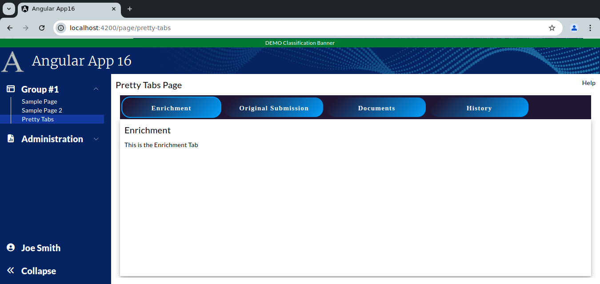

```
Exercise 12b / Make the Tabs Pretty (Answers)
---------------------------------------------
Problem:  The standard mat-tab looks pretty boring
Solution: Use CSS to make it look better


	Showing the "Enrichment" tab
	+------------------------------------------------------------------------------+
	| Pretty Tab Group Page                                                   Help |
	+------------------------------------------------------------------------------+
	|                                                                              |
	|  +-----------------+-------------------------+---------------+------------+  |
	|  | Enrichment Tab  | Original Submission Tab | Documents Tab | History Tab|  |
	|  +-----------------+-------------------------+---------------+------------+  |
	|  | Enrichment Tab                                                         |  |
	|  |                                                                        |  |
	|  | This is the Enrichment Tab                                             |  |
	|  |                                                                        |  |
	|  +------------------------------------------------------------------------+  |
	+------------------------------------------------------------------------------+


	Showing the "Original Submission" tab
	+------------------------------------------------------------------------------+
	| Pretty Tab Group Page                                                   Help |
	+------------------------------------------------------------------------------+
	|                                                                              |
	|  +-----------------+-------------------------+---------------+------------+  |
	|  | Enrichment Tab  | Original Submission Tab | Documents Tab | History Tab|  |
	|  +-----------------+-------------------------+---------------+------------+  |
	|  | Original Submission Tab                                                |  |
	|  |                                                                        |  |
	|  | This is the Original Submission Tab                                    |  |
	|  |                                                                        |  |
	|  +------------------------------------------------------------------------+  |
	+------------------------------------------------------------------------------+


	Showing the "Documents" tab
	+------------------------------------------------------------------------------+
	| Pretty Tab Group Page                                                   Help |
	+------------------------------------------------------------------------------+
	|                                                                              |
	|  +-----------------+-------------------------+---------------+------------+  |
	|  | Enrichment Tab  | Original Submission Tab | Documents Tab | History Tab|  |
	|  +-----------------+-------------------------+---------------+------------+  |
	|  | Documents Tab                                                          |  |
	|  |                                                                        |  |
	|  | This is the Documeents Tab                                             |  |
	|  |                                                                        |  |
	|  +------------------------------------------------------------------------+  |
	+------------------------------------------------------------------------------+


	Showing the "History" tab
	+------------------------------------------------------------------------------+
	| Pretty Tab Group Page                                                   Help |
	+------------------------------------------------------------------------------+
	|                                                                              |
	|  +-----------------+-------------------------+---------------+------------+  |
	|  | Enrichment Tab  | Original Submission Tab | Documents Tab | History Tab|  |
	|  +-----------------+-------------------------+---------------+------------+  |
	|  | History   Tab                                                          |  |
	|  |                                                                        |  |
	|  | This is the History Tab                                                |  |
	|  |                                                                        |  |
	|  +------------------------------------------------------------------------+  |
	+------------------------------------------------------------------------------+


Exercise
--------
 1. Setup the Page
    a. Generate the component:                Call it PrettyTabsPage
    b. Add the route to constants.ts:         the route will be this:   page/pretty-tabs
    c. Register the route
    d. Add the route to the database table:  ui_controls        (if using real security)
    e. Add a link to the navbar (using that route)
    f. Use the debugger to verify that the navbar link works


 
 2. Setup this page layout
     +-------------------------------------------------------------------+
     | Tab Group Page                                               Help |
     +-------------------------------------------------------------------+
     |                                                                   |
     |                                                                   |
     +-------------------------------------------------------------------+


 3. Create a component for each tab
    NOTE:  Create these components in the same directory as your tab group page
 	a. Create this component:   tabEnrichment
 	b. Create this component:   tabOriginalSubmission
 	c. Create this component:   tabDocuments
 	d. Create this component:   tabHistory


 4. Create the tab-group by adding a <mat-tab-group> tag to the main page


 5. Add each tab **COMPONENT** to the <mat-tab-group>


 6. Within each tab, create a simple outline with a tab title and a one-liner
	-- Setup each tab with a title and a one-sentence description

        Showing the "Enrichment" tab
        +------------------------------------------------------------------------------+
        | Pretty Tab Group Page                                                   Help |
        +------------------------------------------------------------------------------+
        |                                                                              |
        |  +-----------------+-------------------------+---------------+------------+  |
        |  | Enrichment Tab  | Original Submission Tab | Documents Tab | History Tab|  |
        |  +-----------------+-------------------------+---------------+------------+  |
        |  | Enrichment Tab                                                         |  |
        |  |                                                                        |  |
        |  | This is the Enrichment Tab                                             |  |
        |  |                                                                        |  |
        |  +------------------------------------------------------------------------+  |
        +------------------------------------------------------------------------------+
        


	
 7. Within each tab, have the tab use *REMAINING VISIBLE HEIGHT* of the web browser
	-- At this point, you have 4 somewhat empty tabs


 8. Create a 3D effect within each tab
    NOTE:  Make sure the tab buttons LEFT-ALIGN with the tab	

	
Tab Group v1  (bare bones Angular Material styles)
+ We have established a tab group with 4 tabs
+ Each tab uses the REMAINING VISIBLE HEIGHT 
+ Each tab has a 3D effect 
+ Overall, the tabs look pretty boring
```

```


Part 2:  Build Tab Group v2 (round the tab edges)
-------------------------------------------------
 1. Change the tabs so that they have a dark-grey #364150 background and white taxt
 
         :host ::ng-deep .mdc-tab.mdc-tab {
          /* Change background color of all tabs */
          background-color: #364150;
        }
        
        :host ::ng-deep  .mat-mdc-tab-group, .mat-mdc-tab-nav-bar {
            /* Change the text color of the tabs -- there are many states */
          --mat-tab-header-active-focus-label-text-color: white;
          --mat-tab-header-active-label-text-color : white;
          --mat-tab-header-inactive-label-text-color: white;
          --mat-tab-header-inactive-focus-label-text-color: white;
          --mat-tab-header-inactive-hover-label-text-color : white;
          --mdc-tab-indicator-active-indicator-color: white;
          --mat-tab-header-active-hover-label-text-color: white;
          --mat-tab-header-active-ripple-color: white;
          --mat-tab-header-inactive-ripple-color: white;
        }
         
 2. Remove the border to the bottom of the ACTIVE TAB

        :host ::ng-deep .mdc-tab-indicator__content {
          /* Remove the the bar underneath the ACTIVE tab */
          display: none;
        }


 3. Change the tabs so that are rounded
  
        :host ::ng-deep .mdc-tab {
          /* label style */
          color: white;
          width: 200px !important;
        
          font-family: 'Open Sans';
          font-style: normal;
          font-weight: 700;
          font-size: 16px;
          margin: 5px;
        
          border-radius: 20px;
        }
        
 4. Adjust the tabs height calcs (so that you do not see a vertical scrollbar)


+ Tab Group v2 has rounded tabs
+ Overall, the tabs look a little better 
```

```


        The SCSS for V2 is as follows
        -----------------------------
        :host ::ng-deep .mat-mdc-tab-header {
          // Indent the Tab Headers
          margin-left: 10px;
          margin-right: 10px;
        }
        
        :host ::ng-deep .mdc-tab.mdc-tab {
          /* Change background color of all tabs */
          background-color: #364150;
        }
        
        :host ::ng-deep .mdc-tab-indicator__content {
          /* Remove the the bar underneath the ACTIVE tab */
          display: none;
        }
        
        :host ::ng-deep .mdc-tab {
          /* label style */
          color: white;
          width: 200px !important;
        
          font-family: 'Open Sans';
          font-style: normal;
          font-weight: 700;
          font-size: 16px;
          margin: 5px;
        
          /* Add a transparent border so that when a user clicks on a tab, there is no "bump" */
          border-radius: 20px;
        }
        
        
        :host ::ng-deep  .mat-mdc-tab-group, .mat-mdc-tab-nav-bar{
          --mat-tab-header-active-focus-label-text-color: white;
          --mat-tab-header-active-label-text-color : white;
          --mat-tab-header-inactive-label-text-color: white;
          --mat-tab-header-inactive-focus-label-text-color: white;
          --mat-tab-header-inactive-hover-label-text-color : white;
          --mdc-tab-indicator-active-indicator-color: white;
          --mat-tab-header-active-hover-label-text-color: white;
          --mat-tab-header-active-ripple-color: white;
          --mat-tab-header-inactive-ripple-color: white;
        }


Part 3:  Build Tab Group v3  (Change the tab header background to be a gradient)
--------------------------------------------------------------------------------
 1. Change the tab header to be a gradient from #000000 TO #485b6b to #000000
        https://www.colorzilla.com/gradient-editor

        :host ::ng-deep .mat-mdc-tab-header {
          // Indent the Tab Headers
          margin-left: 10px;
          margin-right: 10px;
        
          /* Permalink - use to edit and share this gradient: https://colorzilla.com/gradient-editor/#000000+1,485b6b+50,000000+100 */
          background: linear-gradient(to right,  #000000 1%,#485b6b 50%,#000000 100%); /* W3C, IE10+, FF16+, Chrome26+, Opera12+, Safari7+ */
        }


 2. Add 1 px white border to the active tab

        :host ::ng-deep .mdc-tab--active {
          /* Active tabs have a white border */
          border: 1px solid white;
          box-sizing: border-box;
          border-radius: 20px;
        }


 3. Add 1 px transparent border to the non-active tabs
 
        :host ::ng-deep .mdc-tab {
          /* All tabs have a transparent border */
          border: 1px solid transparent;
          box-sizing: border-box;
          border-radius: 20px;
        }


+ Tab Group v3 has rounded tabs on the active tab only and a gradient
+ Overall, the tabs look better
```

```

        The SCSS for Part 3
        -------------------
        :host ::ng-deep .mat-mdc-tab-header {
          // Indent the Tab Headers
          margin-left: 10px;
          margin-right: 10px;
        
          /* Permalink - use to edit and share this gradient: https://colorzilla.com/gradient-editor/#000000+1,485b6b+50,000000+100 */
          background: linear-gradient(to right,  #000000 1%,#485b6b 50%,#000000 100%); /* W3C, IE10+, FF16+, Chrome26+, Opera12+, Safari7+ */
        }
        
        :host ::ng-deep  .mat-mdc-tab-group, .mat-mdc-tab-nav-bar {
          /* Change the text color of the tabs -- there are many states */
          --mat-tab-header-active-focus-label-text-color: white;
          --mat-tab-header-active-label-text-color : white;
          --mat-tab-header-inactive-label-text-color: white;
          --mat-tab-header-inactive-focus-label-text-color: white;
          --mat-tab-header-inactive-hover-label-text-color : white;
          --mdc-tab-indicator-active-indicator-color: white;
          --mat-tab-header-active-hover-label-text-color: white;
          --mat-tab-header-active-ripple-color: white;
          --mat-tab-header-inactive-ripple-color: white;
        }
        
        :host ::ng-deep .mdc-tab-indicator__content {
          /* Remove the the bar underneath the ACTIVE tab */
          display: none;
        }
        
        :host ::ng-deep .mdc-tab {
          /* label style */
          color: white;
          width: 200px !important;
        
          font-family: 'Open Sans';
          font-style: normal;
          font-weight: 700;
          font-size: 16px;
          margin: 5px;
        
          /* Add a transparent border so that when a user clicks on a tab, there is no "bump" */
          border: 1px solid white;
          box-sizing: border-box;
          border-radius: 20px;
        }
        


Part 4:  Build Tab Group v4  (Change the gradient colors)
---------------------------------------------------------
 1. Change all tabs so that they have a gradient of #009ffd (light blue) to #201735 (dark blue)
    
 2. Change all tabs to have a border of 2px solid with the dark blue
 
 3. Change all tabs to have a border-radius of 20px
  
 4. The active tab should have a border of 2px solid #201735 with a radius of 20 px

 5. Change all tabs so that the mininum width and maximum width is 225px

+ Tab Group v4 has rounded tabs and a light-blue-to-dark-blue gradient
+ Every tab has the same width of 225px
+ Overall, the tabs look better
```

```

    
    The SCSS for Part 4
    -------------------
    :host ::ng-deep .mat-mdc-tab-header {
      // Indent the Tab Headers
      margin-left: 10px;
      margin-right: 10px;
    
      /* Set the default background color of the header */
      background-color: #201735;
    }
    
    
    :host ::ng-deep  .mat-mdc-tab-group, .mat-mdc-tab-nav-bar {
      /* Change the text color of the tabs -- there are many states */
      --mat-tab-header-active-focus-label-text-color: white;
      --mat-tab-header-active-label-text-color : white;
      --mat-tab-header-inactive-label-text-color: white;
      --mat-tab-header-inactive-focus-label-text-color: white;
      --mat-tab-header-inactive-hover-label-text-color : white;
      --mdc-tab-indicator-active-indicator-color: white;
      --mat-tab-header-active-hover-label-text-color: white;
      --mat-tab-header-active-ripple-color: white;
      --mat-tab-header-inactive-ripple-color: white;
    }
    
    :host ::ng-deep .mdc-tab-indicator__content {
      /* Remove the the bar underneath the ACTIVE tab */
      display: none;
    }
    
    :host ::ng-deep .mdc-tab {
      /* label style */
      min-width: 225px !important;           /* Set every tab to be 175px wide */
      max-width: 225px !important;           /* Set every tab to be 175px wide */
      color: white;
      font-family: 'Open Sans';
      font-style: normal;
      font-weight: 700;
      font-size: 15px;
      margin: 3px;
    
      border: 2px solid #201735;
      border-radius: 20px;
    
      /* Set color when tab loses focus */
      background-image: linear-gradient(315deg, #009ffd 0%, #201735 91%);
      opacity: 1;
    }
    
    :host ::ng-deep .mdc-tab--active {
      /* Styles for the active tab label */
      border: 2px solid #009ffd;
      border-radius: 20px;
    }


Part 5:  Build Tab Group v5  (Apply the gradient on the *Active* tab only)
--------------------------------------------------------------------------
 1. Set the active tab to have the gradient only
 
 
 ```

```

      
    The SCSS for Part 4
    -------------------
    :host ::ng-deep .mat-mdc-tab-header {
      // Indent the Tab Headers
      margin-left: 10px;
      margin-right: 10px;
    
      /* Set the default background color of the header */
      background-color: #201735;
    }
    
    
    :host ::ng-deep  .mat-mdc-tab-group, .mat-mdc-tab-nav-bar {
      /* Change the text color of the tabs -- there are many states */
      --mat-tab-header-active-focus-label-text-color: white;
      --mat-tab-header-active-label-text-color : white;
      --mat-tab-header-inactive-label-text-color: white;
      --mat-tab-header-inactive-focus-label-text-color: white;
      --mat-tab-header-inactive-hover-label-text-color : white;
      --mdc-tab-indicator-active-indicator-color: white;
      --mat-tab-header-active-hover-label-text-color: white;
      --mat-tab-header-active-ripple-color: white;
      --mat-tab-header-inactive-ripple-color: white;
    }
    
    :host ::ng-deep .mdc-tab-indicator__content {
      /* Remove the the bar underneath the ACTIVE tab */
      display: none;
    }
    
    :host ::ng-deep .mdc-tab {
      /* label style */
      min-width: 225px !important;           /* Set every tab to be 175px wide */
      max-width: 225px !important;           /* Set every tab to be 175px wide */
      color: white;
      font-style: normal;
      font-weight: 700;
      font-size: 15px;
      margin: 3px;
    
      border: 2px solid #201735;
      border-radius: 20px;
    
    
      opacity: 1;
    }
    
    :host ::ng-deep .mdc-tab--active {
      /* Styles for the active tab label */
      border: 2px solid #009ffd;
      border-radius: 20px;
    
      /* Set color when tab loses focus */
      background-image: linear-gradient(315deg, #009ffd 0%, #201735 91%);
    }


    The HTML for the first tab
    --------------------------
    <div class="mat-elevation-z4 mx-2.5 mb-[5px]">
      <div class="overflow-y-auto" style="height: calc(100vh - 200px)">
    
        <div class="p-2.5">
          <div>
            <span class="text-xl">Enrichment</span>
          </div>
    
          <div class="mt-[5px]">
            This is the Enrichment Tab
          </div>
        </div>
      </div>
    </div>


Part 5:  Build Tab Group v6  (have square tabs blend in with the tab contents)
------------------------------------------------------------------------------
 1. Set the regular tabs to have a background color of #201735
         
         :host ::ng-deep  .mat-mdc-tab-group, .mat-mdc-tab-nav-bar {
          /* Change the text color of the tabs -- there are many states */
          --mat-tab-header-active-focus-label-text-color: #201735;
          --mat-tab-header-active-label-text-color : #201735;
          --mat-tab-header-inactive-label-text-color: white;
          --mat-tab-header-inactive-focus-label-text-color: white;
          --mat-tab-header-inactive-hover-label-text-color : white;
          --mdc-tab-indicator-active-indicator-color: white;
          --mat-tab-header-active-hover-label-text-color: white;
          --mat-tab-header-active-ripple-color: white;
          --mat-tab-header-inactive-ripple-color: white;
        }

 2. Set the regular tabs to have a border of 2px/solid/#201735
 
        :host ::ng-deep .mdc-tab {
          /* Set the style for INACTIVE tabs */
          min-width: 225px !important;           /* Set every tab to be 175px wide */
          max-width: 225px !important;           /* Set every tab to be 175px wide */
          color: white;
          font-style: normal;
          font-weight: 700;
          font-size: 15px;
          margin-top: 3px;
          margin-bottom: 3px;
        
          /* Set the background color of regular tabs */
          background-color: #201735;
        
          /* Put a blue border around the tab */
          border: 2px solid #201735;
        
          opacity: 1;
        }

 
 3. Set the active tab to have a background color of white
 4. Set the active tab to have a border-bottom of 2px/solid/white
 
        :host ::ng-deep .mdc-tab--active {
          /* Set the styles for the *ACTIVE* label */
        
          /* Set background color of the active tab */
          background: white;
        
          /* Change the *BOTTOM* of the border to be white so the tab "blends" in with the tab contents */
          border-bottom: 2px solid white;
        }


 
 
 5. Change the active text color to be #201735 
 
         :host ::ng-deep  .mat-mdc-tab-group, .mat-mdc-tab-nav-bar {
          /* Change the text color of the tabs -- there are many states */
          --mat-tab-header-active-focus-label-text-color: #201735;
          --mat-tab-header-active-label-text-color : #201735;
          --mat-tab-header-inactive-label-text-color: white;
          --mat-tab-header-inactive-focus-label-text-color: white;
          --mat-tab-header-inactive-hover-label-text-color : white;
          --mdc-tab-indicator-active-indicator-color: white;
          --mat-tab-header-active-hover-label-text-color: white;
          --mat-tab-header-active-ripple-color: white;
          --mat-tab-header-inactive-ripple-color: white;
        }
        
        
 6. Remove the bar underneath the active tab

        :host ::ng-deep .mdc-tab-indicator__content {
          /* Remove the the bar underneath the ACTIVE tab */
          display: none;
        } 
 
 ```

```


    The completed SCCS
    ------------------
    :host ::ng-deep .mat-mdc-tab-header {
      // Indent the Tab Headers
      margin-left: 10px;
      margin-right: 10px;
    }
    
    
    :host ::ng-deep  .mat-mdc-tab-group, .mat-mdc-tab-nav-bar {
      /* Change the text color of the tabs -- there are many states */
      --mat-tab-header-active-focus-label-text-color: #201735;
      --mat-tab-header-active-label-text-color : #201735;
      --mat-tab-header-inactive-label-text-color: white;
      --mat-tab-header-inactive-focus-label-text-color: white;
      --mat-tab-header-inactive-hover-label-text-color : white;
      --mdc-tab-indicator-active-indicator-color: white;
      --mat-tab-header-active-hover-label-text-color: white;
      --mat-tab-header-active-ripple-color: white;
      --mat-tab-header-inactive-ripple-color: white;
    }
    
    :host ::ng-deep .mdc-tab-indicator__content {
      /* Remove the the bar underneath the ACTIVE tab */
      display: none;
    }
    
    :host ::ng-deep .mdc-tab {
      /* Set the style for INACTIVE tabs */
      min-width: 225px !important;           /* Set every tab to be 175px wide */
      max-width: 225px !important;           /* Set every tab to be 175px wide */
      color: white;
      font-style: normal;
      font-weight: 700;
      font-size: 15px;
      margin-top: 3px;
      margin-bottom: 3px;
    
      /* Set the background color of regular tabs */
      background-color: #201735;
    
      /* Put a blue border around the tab */
      border: 2px solid #201735;
    
      opacity: 1;
    }
    
    :host ::ng-deep .mdc-tab--active {
      /* Set the styles for the *ACTIVE* label */
    
      /* Set background color of the active tab */
      background: white;
    
      /* Change the *BOTTOM* of the border to be white so the tab "blends" in with the tab contents */
      border-bottom: 2px solid white;
    }
    
