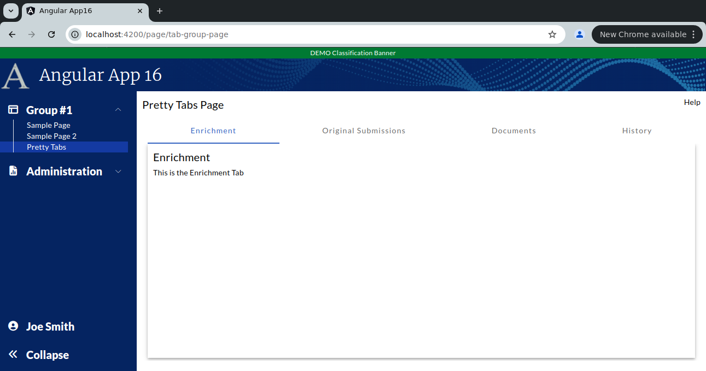

```
Exercise 12b / Make the Tabs Pretty (Answers)
-----------------------------------
Problem:  The standard mat-tab looks pretty boring
Solution: Use CSS to make it look better


	Showing the "Enrichment" tab
	+------------------------------------------------------------------------------+
	| Pretty Tab Group Page                                                   Help |
	+------------------------------------------------------------------------------+
	|                                                                              |
	|  +-----------------+-------------------------+---------------+------------+  |
	|  | Enrichment Tab  | Original Submission Tab | Documents Tab | History Tab|  |
	|  +-----------------+-------------------------+---------------+------------+  |
	|  | Enrichment Tab                                                         |  |
	|  |                                                                        |  |
	|  | This is the Enrichment Tab                                             |  |
	|  |                                                                        |  |
	|  +------------------------------------------------------------------------+  |
	+------------------------------------------------------------------------------+


	Showing the "Original Submission" tab
	+------------------------------------------------------------------------------+
	| Pretty Tab Group Page                                                   Help |
	+------------------------------------------------------------------------------+
	|                                                                              |
	|  +-----------------+-------------------------+---------------+------------+  |
	|  | Enrichment Tab  | Original Submission Tab | Documents Tab | History Tab|  |
	|  +-----------------+-------------------------+---------------+------------+  |
	|  | Original Submission Tab                                                |  |
	|  |                                                                        |  |
	|  | This is the Original Submission Tab                                    |  |
	|  |                                                                        |  |
	|  +------------------------------------------------------------------------+  |
	+------------------------------------------------------------------------------+


	Showing the "Documents" tab
	+------------------------------------------------------------------------------+
	| Pretty Tab Group Page                                                   Help |
	+------------------------------------------------------------------------------+
	|                                                                              |
	|  +-----------------+-------------------------+---------------+------------+  |
	|  | Enrichment Tab  | Original Submission Tab | Documents Tab | History Tab|  |
	|  +-----------------+-------------------------+---------------+------------+  |
	|  | Documents Tab                                                          |  |
	|  |                                                                        |  |
	|  | This is the Documeents Tab                                             |  |
	|  |                                                                        |  |
	|  +------------------------------------------------------------------------+  |
	+------------------------------------------------------------------------------+


	Showing the "History" tab
	+------------------------------------------------------------------------------+
	| Pretty Tab Group Page                                                   Help |
	+------------------------------------------------------------------------------+
	|                                                                              |
	|  +-----------------+-------------------------+---------------+------------+  |
	|  | Enrichment Tab  | Original Submission Tab | Documents Tab | History Tab|  |
	|  +-----------------+-------------------------+---------------+------------+  |
	|  | History   Tab                                                          |  |
	|  |                                                                        |  |
	|  | This is the History Tab                                                |  |
	|  |                                                                        |  |
	|  +------------------------------------------------------------------------+  |
	+------------------------------------------------------------------------------+


Exercise
--------
 1. Setup the Page
    a. Generate the component:                Call it PrettyTabsPage
    b. Add the route to constants.ts:         the route will be this:   page/pretty-tabs
    c. Register the route
    d. Add the route to the database table:  ui_controls        (if using real security)
    e. Add a link to the navbar (using that route)
    f. Use the debugger to verify that the navbar link works


 
 2. Setup this page layout
     +-------------------------------------------------------------------+
     | Tab Group Page                                               Help |
     +-------------------------------------------------------------------+
     |                                                                   |
     |                                                                   |
     +-------------------------------------------------------------------+


 3. Create a component for each tab
    NOTE:  Create these components in the same directory as your tab group page
 	a. Create this component:   tabEnrichment
 	b. Create this component:   tabOriginalSubmission
 	c. Create this component:   tabDocuments
 	d. Create this component:   tabHistory


 4. Create the tab-group by adding a <mat-tab-group> tag to the main page


 5. Add each tab **COMPONENT** to the <mat-tab-group>


 6. Within each tab, create a simple outline with a tab title and a one-liner
	-- Setup each tab with a title and a one-sentence description

        Showing the "Enrichment" tab
        +------------------------------------------------------------------------------+
        | Pretty Tab Group Page                                                   Help |
        +------------------------------------------------------------------------------+
        |                                                                              |
        |  +-----------------+-------------------------+---------------+------------+  |
        |  | Enrichment Tab  | Original Submission Tab | Documents Tab | History Tab|  |
        |  +-----------------+-------------------------+---------------+------------+  |
        |  | Enrichment Tab                                                         |  |
        |  |                                                                        |  |
        |  | This is the Enrichment Tab                                             |  |
        |  |                                                                        |  |
        |  +------------------------------------------------------------------------+  |
        +------------------------------------------------------------------------------+
        


	
 7. Within each tab, have the tab use *REMAINING VISIBLE HEIGHT* of the web browser
	-- At this point, you have 4 somewhat empty tabs


 8. Create a 3D effect within each tab
    NOTE:  Make sure the tab buttons LEFT-ALIGN with the tab	
	
    Tab Group v1  (bare bones Angular Material styles)
```

```
+ We have established a tab group with 4 tabs
+ The tabs fit inside the page
+ The tabs look pretty boring


 
 9. Change the tabs so that they have a dark-grey background and white taxt
 
 
10. Change the tabs so thaty are rounded
  
   


```