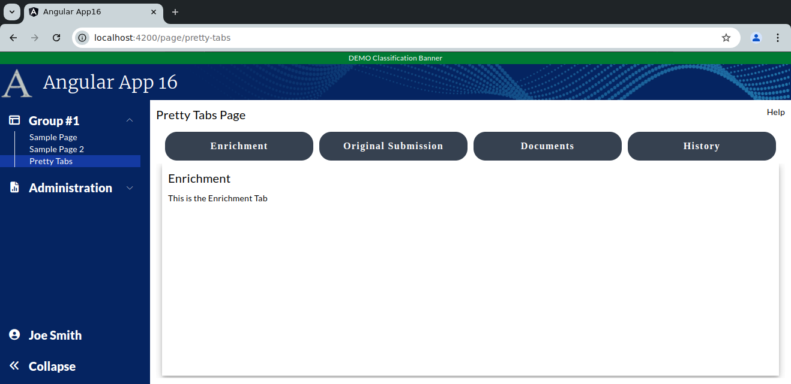
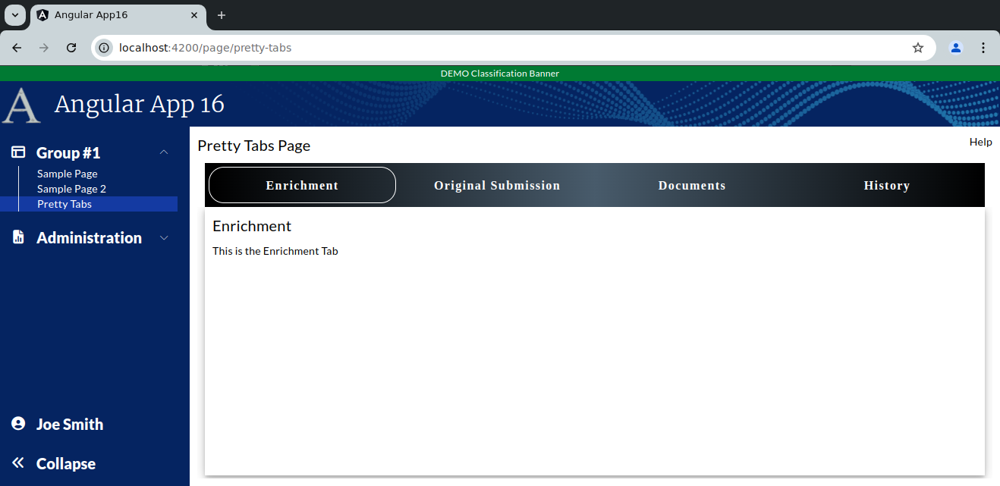

```
Exercise 12b / Make the Tabs Pretty
---------------------------------------------
Problem:  The standard mat-tab looks pretty boring
Solution: Use CSS to make it look better


	Showing the "Enrichment" tab
	+------------------------------------------------------------------------------+
	| Pretty Tab Group Page                                                   Help |
	+------------------------------------------------------------------------------+
	|                                                                              |
	|  +-----------------+-------------------------+---------------+------------+  |
	|  | Enrichment Tab  | Original Submission Tab | Documents Tab | History Tab|  |
	|  +-----------------+-------------------------+---------------+------------+  |
	|  | Enrichment Tab                                                         |  |
	|  |                                                                        |  |
	|  | This is the Enrichment Tab                                             |  |
	|  |                                                                        |  |
	|  +------------------------------------------------------------------------+  |
	+------------------------------------------------------------------------------+


	Showing the "Original Submission" tab
	+------------------------------------------------------------------------------+
	| Pretty Tab Group Page                                                   Help |
	+------------------------------------------------------------------------------+
	|                                                                              |
	|  +-----------------+-------------------------+---------------+------------+  |
	|  | Enrichment Tab  | Original Submission Tab | Documents Tab | History Tab|  |
	|  +-----------------+-------------------------+---------------+------------+  |
	|  | Original Submission Tab                                                |  |
	|  |                                                                        |  |
	|  | This is the Original Submission Tab                                    |  |
	|  |                                                                        |  |
	|  +------------------------------------------------------------------------+  |
	+------------------------------------------------------------------------------+


	Showing the "Documents" tab
	+------------------------------------------------------------------------------+
	| Pretty Tab Group Page                                                   Help |
	+------------------------------------------------------------------------------+
	|                                                                              |
	|  +-----------------+-------------------------+---------------+------------+  |
	|  | Enrichment Tab  | Original Submission Tab | Documents Tab | History Tab|  |
	|  +-----------------+-------------------------+---------------+------------+  |
	|  | Documents Tab                                                          |  |
	|  |                                                                        |  |
	|  | This is the Documeents Tab                                             |  |
	|  |                                                                        |  |
	|  +------------------------------------------------------------------------+  |
	+------------------------------------------------------------------------------+


	Showing the "History" tab
	+------------------------------------------------------------------------------+
	| Pretty Tab Group Page                                                   Help |
	+------------------------------------------------------------------------------+
	|                                                                              |
	|  +-----------------+-------------------------+---------------+------------+  |
	|  | Enrichment Tab  | Original Submission Tab | Documents Tab | History Tab|  |
	|  +-----------------+-------------------------+---------------+------------+  |
	|  | History   Tab                                                          |  |
	|  |                                                                        |  |
	|  | This is the History Tab                                                |  |
	|  |                                                                        |  |
	|  +------------------------------------------------------------------------+  |
	+------------------------------------------------------------------------------+


Exercise
--------
 1. Setup the Page
    a. Generate the component:                Call it PrettyTabsPage
    b. Add the route to constants.ts:         the route will be this:   page/pretty-tabs
    c. Register the route
    d. Add the route to the database table:  ui_controls        (if using real security)
    e. Add a link to the navbar (using that route)
    f. Use the debugger to verify that the navbar link works


 
 2. Setup this page layout
     +-------------------------------------------------------------------+
     | Tab Group Page                                               Help |
     +-------------------------------------------------------------------+
     |                                                                   |
     |                                                                   |
     +-------------------------------------------------------------------+


 3. Create a component for each tab
    NOTE:  Create these components in the same directory as your tab group page
 	a. Create this component:   tabEnrichment
 	b. Create this component:   tabOriginalSubmission
 	c. Create this component:   tabDocuments
 	d. Create this component:   tabHistory


 4. Create the tab-group by adding a <mat-tab-group> tag to the main page


 5. Add each tab **COMPONENT** to the <mat-tab-group>


 6. Within each tab, create a simple outline with a tab title and a one-liner
	-- Setup each tab with a title and a one-sentence description

        Showing the "Enrichment" tab
        +------------------------------------------------------------------------------+
        | Pretty Tab Group Page                                                   Help |
        +------------------------------------------------------------------------------+
        |                                                                              |
        |  +-----------------+-------------------------+---------------+------------+  |
        |  | Enrichment Tab  | Original Submission Tab | Documents Tab | History Tab|  |
        |  +-----------------+-------------------------+---------------+------------+  |
        |  | Enrichment Tab                                                         |  |
        |  |                                                                        |  |
        |  | This is the Enrichment Tab                                             |  |
        |  |                                                                        |  |
        |  +------------------------------------------------------------------------+  |
        +------------------------------------------------------------------------------+
        


	
 7. Within each tab, have the tab use *REMAINING VISIBLE HEIGHT* of the web browser
	-- At this point, you have 4 somewhat empty tabs


 8. Create a 3D effect within each tab
    NOTE:  Make sure the tab buttons LEFT-ALIGN with the tab	

	
Tab Group v1  (bare bones Angular Material styles)
+ We have established a tab group with 4 tabs
+ Each tab uses the REMAINING VISIBLE HEIGHT 
+ Each tab has a 3D effect 
+ Overall, the tabs look pretty boring
```

```


Part 2:  Build Tab Group v2 (round the tab edges)
-------------------------------------------------
 1. Change the tabs so that they have a dark-grey #364150 background and white taxt
    
 2. Remove the border to the bottom of the ACTIVE TAB

 3. Change the tabs so that are rounded

 4. Adjust the tabs height calcs (so that you do not see a vertical scrollbar)


+ Tab Group v2 has rounded tabs
+ Overall, the tabs look a little better
```

```


Part 3:  Build Tab Group v3  (Change the tab header background to be a gradient)
--------------------------------------------------------------------------------
 1. Change the tab header to be a gradient from #000000 TO #485b6b to #000000
        https://www.colorzilla.com/gradient-editor

 2. Add 1 px white border to the active tab

 3. Add 1 px transparent border to the non-active tabs
 

+ Tab Group v3 has rounded tabs on the active tab only and a gradient
+ Overall, the tabs look better
```

```


Part 4:  Build Tab Group v4  (Change the gradient colors)
---------------------------------------------------------
 1. Change all tabs so that they have a gradient of #009ffd (light blue) to #201735 (dark blue)
    
 2. Change all tabs to have a border of 2px solid with the dark blue
 
 3. Change all tabs to have a border-radius of 20px
  
 2. The active tab should have a border of 2px solid #201735 with a radius of 20 px


+ Tab Group v4 has rounded tabs and a light-blue-to-dark-blue gradient
+ Overall, the tabs look better
```

```


Part 5:  Build Tab Group v5  (Apply the gradient on the *Active* tab only)
--------------------------------------------------------------------------
 1. Set the active tab to have the gradient only
 
  


    
 
