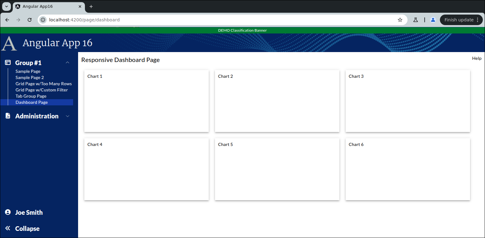
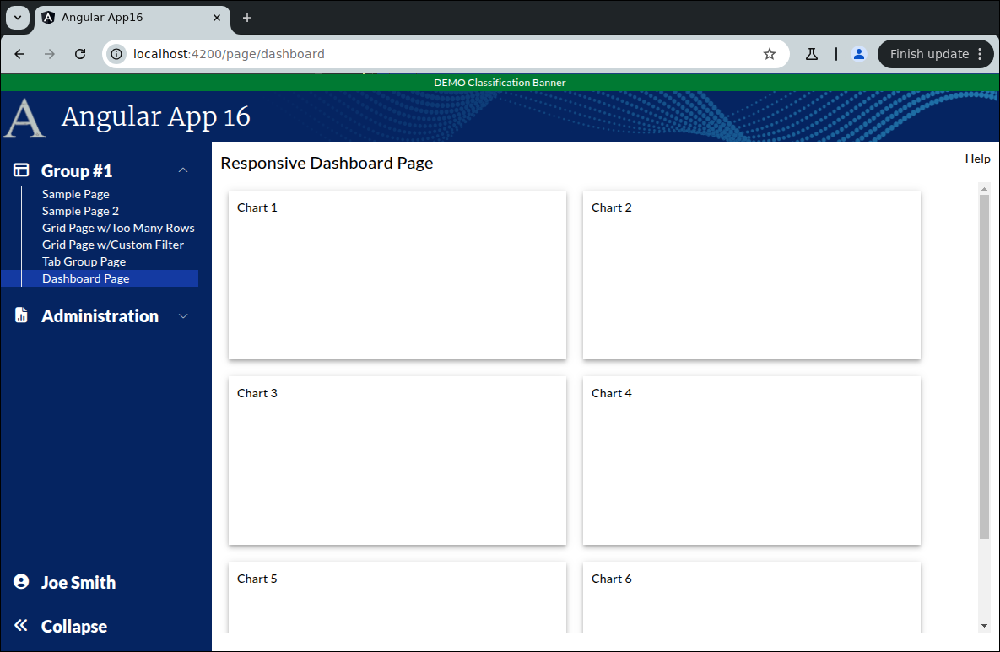

```
Exercise 25a / Setup a Responsive Dashboard Page  (Answer)
----------------------------------------------------------
Problem:  I need to create a responsive page that holds lots of little charts
Solution: Make a responsive layout

```



```


Exercise
--------
 1. Setup the Page
    a. Generate the component:                Call it DashboardPage
    b. Add the route to constants.ts:         the route will be this:   page/dashboard
    c. Register the route
    d. Add the route to the database table:  ui_controls        (if using real security)
    e. Add a link to the navbar (using that route)
    f. Use the debugger to verify that the navbar link works


 2. Setup this page layout
     +-------------------------------------------------------------------+
     | Responsive Dashboard Page                                    Help |
     +-------------------------------------------------------------------+
     |                                                                   |
     |                                                                   |
     +-------------------------------------------------------------------+


        At this point, the HTML looks like this
        ---------------------------------------
        <div class="m-2.5">
        
          <!-- Top of Page -->
          <div class="grid grid-cols-2">
            <div>
              <span class="text-xl">Responsive Dashboard Page</span>
            </div>
        
            <div class="flex place-content-end">
              Help
            </div>
          </div>
        
          <!-- Bottom of Page  -->
          <div class="mt-2.5">
        
        
          </div>
        
        </div>
    


 3. Change the bottom of the page so use the VISIBLE height of the browser
     +-------------------------------------------------------------------+
     | Responsive Dashboard Page                                    Help |
     +-------------------------------------------------------------------+
     | Charts will be here                                               |   Height of the bottom of page *STRETCHES*
     |                                                                   |
     +-------------------------------------------------------------------+

    
        At this point, the HTML looks like this
        ---------------------------------------
        <div class="m-2.5">
        
          <div class="grid grid-cols-2">
            <div>
              <span class="text-xl">Responsive Dashboard Page</span>
            </div>
        
            <div class="flex place-content-end">
              Help
            </div>
          </div>
        
          <div class="mt-2.5">
            <!-- Add Grid Here -->
            <div class="overflow-y-auto" style="height: calc(100vh - 150px)">
        
              Charts will be here
        
            </div>
        
          </div>
        
        </div>


 4. Add 6 divs (one for each chart)
     +-------------------------------------------------------------------+
     | Responsive Dashboard Page                                    Help |
     +-------------------------------------------------------------------+
     |                                                                   |
     |   +-----------+     +-----------+     +-----------+               |
     |   |  Chart1   |     |  Chart2   |     |  Chart3   |               |
     |   +-----------+     +-----------+     +-----------+               |
     |                                                                   |
     |   +-----------+     +-----------+     +-----------+               |
     |   |  Chart4   |     |  Chart5   |     |  Chart6   |               |
     |   +-----------+     +-----------+     +-----------+               |
     |                                                                   |
     +-------------------------------------------------------------------+
     Each chart is 200px tall
     Each chart is 400px wide
     There is a 20px gap between each chart


 5. Make the divs responsive so that they expand with the browser width

    In a crazy-wide screen
    +-----------------------------------------------------------------------------+
    |   Chart1       Chart2        Chart3     Chart4       Chart5        Chart6   |
    +-----------------------------------------------------------------------------+
    
    In a less-wide screen
    +---------------------------------------+
    |   Chart1       Chart2        Chart3   |
    |                                       |
    |   Chart4       Chart5        Chart6   |
    +---------------------------------------+

    
        At this point, the HTML looks like this
        ---------------------------------------
        <div class="m-2.5">
        
          <div class="grid grid-cols-2">
            <div>
              <span class="text-xl">Responsive Dashboard Page</span>
            </div>
        
            <div class="flex place-content-end">
              Help
            </div>
          </div>
        
          <div class="mt-2.5">
            <!-- Add Grid Here -->
            <div class="overflow-y-auto" style="height: calc(100vh - 150px)">
        
              <div class="flex flex-row flex-wrap gap-x-5 gap-y-5 m-2.5">
        
                <div class="w-[400px] h-[200px] p-2.5">
                    Chart 1
                </div>
        
                <div class="w-[400px] h-[200px] p-2.5">
                  Chart 2
                </div>
        
                <div class="w-[400px] h-[200px] p-2.5">
                  Chart 3
                </div>
        
                <div class="w-[400px] h-[200px] p-2.5">
                  Chart 4
                </div>
        
                <div class="w-[400px] h-[200px] p-2.5">
                  Chart 5
                </div>
        
                <div class="w-[400px] h-[200px] p-2.5">
                  Chart 6
                </div>
              </div>
        
            </div>
        
          </div>
        
        
        </div>


 6. Give each div a 3d-effect
        
        At this point, the HTML looks like this
        ---------------------------------------
        <div class="m-2.5">
        
          <div class="grid grid-cols-2">
            <div>
              <span class="text-xl">Responsive Dashboard Page</span>
            </div>
        
            <div class="flex place-content-end">
              Help
            </div>
          </div>
        
          <div class="mt-2.5">
            <!-- Add Grid Here -->
            <div class="overflow-y-auto" style="height: calc(100vh - 150px)">
        
              <div class="flex flex-row flex-wrap gap-x-5 gap-y-5 m-2.5">
        
                <div class="w-[400px] h-[200px] mat-elevation-z4 p-2.5">
                    Chart 1
                </div>
        
                <div class="w-[400px] h-[200px] mat-elevation-z4 p-2.5">
                  Chart 2
                </div>
        
                <div class="w-[400px] h-[200px] mat-elevation-z4 p-2.5">
                  Chart 3
                </div>
        
                <div class="w-[400px] h-[200px] mat-elevation-z4 p-2.5">
                  Chart 4
                </div>
        
                <div class="w-[400px] h-[200px] mat-elevation-z4 p-2.5">
                  Chart 5
                </div>
        
                <div class="w-[400px] h-[200px] mat-elevation-z4 p-2.5">
                  Chart 6
                </div>
              </div>
        
            </div>
        
          </div>
        </div>


 7. Give each div a unique id -- e.g., id="chart1"
    NOTE:  HighCharts needs this so it knows where to RENDER the chart


        At this point, the HTML looks like this
        ---------------------------------------
        <div class="m-2.5">
        
          <div class="grid grid-cols-2">
            <div>
              <span class="text-xl">Responsive Dashboard Page</span>
            </div>
        
            <div class="flex place-content-end">
              Help
            </div>
          </div>
        
          <div class="mt-2.5">
            <!-- Add Grid Here -->
            <div class="overflow-y-auto" style="height: calc(100vh - 150px)">
        
              <div class="flex flex-row flex-wrap gap-x-5 gap-y-5 m-2.5">
        
                <div id="chart1" class="w-[400px] h-[200px] mat-elevation-z4 p-2.5">
                    Chart 1
                </div>
        
                <div id="chart2" class="w-[400px] h-[200px] mat-elevation-z4 p-2.5">
                  Chart 2
                </div>
        
                <div id="chart3" class="w-[400px] h-[200px] mat-elevation-z4 p-2.5">
                  Chart 3
                </div>
        
                <div id="chart4" class="w-[400px] h-[200px] mat-elevation-z4 p-2.5">
                  Chart 4
                </div>
        
                <div id="chart5" class="w-[400px] h-[200px] mat-elevation-z4 p-2.5">
                  Chart 5
                </div>
        
                <div id="chart6" class="w-[400px] h-[200px] mat-elevation-z4 p-2.5">
                  Chart 6
                </div>
              </div>
        
            </div>
        
          </div>
        
        
        </div>

```