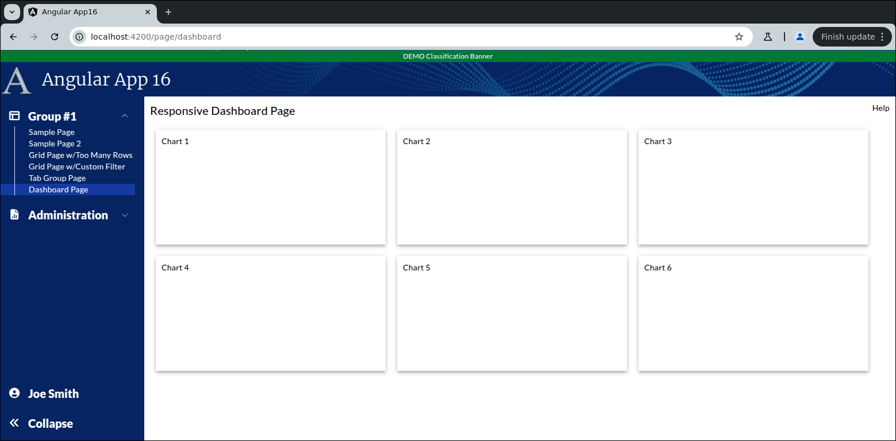
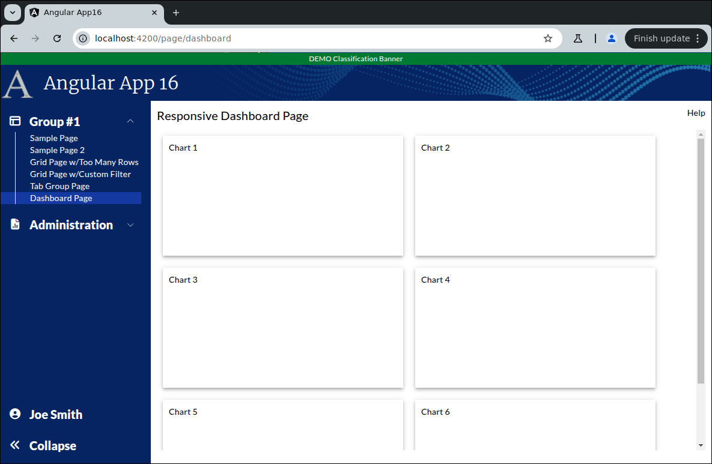

```
Exercise 25a / Setup a Responsive Dashboard Page
------------------------------------------------
Problem:  I need to create a responsive page that holds lots of little charts
Solution: Make a responsive layout

```



```

Exercise
--------
 1. Setup the Page
    a. Generate the component:                Call it DashboardPage
    b. Add the route to constants.ts:         the route will be this:   page/dashboard
    c. Register the route
    d. Add the route to the database table:  ui_controls        (if using real security)
    e. Add a link to the navbar (using that route)
    f. Use the debugger to verify that the navbar link works


 2. Setup this page layout
     +-------------------------------------------------------------------+
     | Responsive Dashboard Page                                    Help |
     +-------------------------------------------------------------------+
     |                                                                   |
     |                                                                   |
     +-------------------------------------------------------------------+


 3. Change the bottom of the page so use the VISIBLE height of the browser
     +-------------------------------------------------------------------+
     | Responsive Dashboard Page                                    Help |
     +-------------------------------------------------------------------+
     | Charts will be here                                               |   Height of the bottom of page *STRETCHES*
     |                                                                   |
     +-------------------------------------------------------------------+


 4. Add 6 divs (one for each chart)
     +-------------------------------------------------------------------+
     | Responsive Dashboard Page                                    Help |
     +-------------------------------------------------------------------+
     |                                                                   |
     |   +-----------+     +-----------+     +-----------+               |
     |   |  Chart1   |     |  Chart2   |     |  Chart3   |               |
     |   +-----------+     +-----------+     +-----------+               |
     |                                                                   |
     |   +-----------+     +-----------+     +-----------+               |
     |   |  Chart4   |     |  Chart5   |     |  Chart6   |               |
     |   +-----------+     +-----------+     +-----------+               |
     |                                                                   |
     +-------------------------------------------------------------------+
     Each chart is 200px tall and 400px wide


 5. Make the divs responsive so that they expand with the browser width

    In a crazy-wide screen
    +-----------------------------------------------------------------------------+
    |   Chart1       Chart2        Chart3     Chart4       Chart5        Chart6   |
    +-----------------------------------------------------------------------------+
    
    In a less-wide screen
    +---------------------------------------+
    |   Chart1       Chart2        Chart3   |
    |                                       |
    |   Chart4       Chart5        Chart6   |
    +---------------------------------------+


 6. Give each div a 3d-effect


 7. Give each div a unique id -- e.g., id="chart1"
    NOTE:  HighCharts needs this so it knows where to RENDER the chart


```