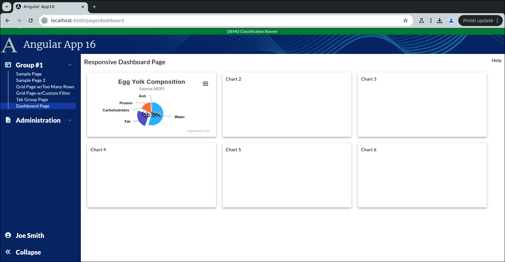

```
Exercise 25b / Add a Small Pie Chart to the Dashboard
-----------------------------------------------------
Goal:  I want to create a component that asks as a small pie chart

```

```


Exercise
--------
 1. Create the pie chart component:   PieChartSmallComponent
 
 2. Edit the Main Dashboard Page / HTML
    a. Remove the hard-coded "Chart 1"
    b. Add-in the component to your pie chart   
    c. Make sure your app-pie-chart-small uses 100% of the height and width
        

       
 
 3. Edit the pie chart component / HTML
    NOTE:  The entire HTML is just a div with a unique ID -- e.g., "pie-chart1"
           The div should use 100% of the height and width
               


        
 4. Edit the pie chart component / TypeScript
 
 5. Add the high chart options (before the @Component)
    
        import * as Highcharts from "highcharts";
        window.Highcharts = Highcharts;
        
        // Turn on the high-chart context menu view/print/download options
        import HC_exporting from "highcharts/modules/exporting";
        HC_exporting(Highcharts);
        
        // Turn on the high-chart context menu *export* options
        // NOTE:  This provides these menu options: Download CSV, Download XLS, View Data Table
        import HC_exportData from "highcharts/modules/export-data";
        HC_exportData(Highcharts);
        
        // Do client-side exporting (so that the exporting does *NOT* go to https://export.highcharts.com/
        // NOTE:  This does not work on all web browsers
        import HC_offlineExport from "highcharts/modules/offline-exporting";
        HC_offlineExport(Highcharts);
        
        // Turn on the drill-down capabilities
        import HC_drillDown from "highcharts/modules/drilldown";
        HC_drillDown(Highcharts);
           
    
    
 6. Add a private class variable that holds the pie chart options:  chartOptions
    
        private chartOptions: any =  {
            chart: {
              type: "pie",
            },
            title: {
              text: "Egg Yolk Composition",
            },
            tooltip: {
              valueSuffix: "%",
            },
            subtitle: {
              text: 'Source:<a href="https://www.mdpi.com/2072-6643/11/3/684/htm" target="_default">MDPI</a>',
            },
            plotOptions: {
              series: {
                allowPointSelect: true,
                cursor: "pointer",
                dataLabels: [
                  {
                    enabled: true,
                    distance: 20,
                  },
                  {
                    enabled: true,
                    distance: -40,
                    format: "{point.percentage:.1f}%",
                    style: {
                      fontSize: "1.2em",
                      textOutline: "none",
                      opacity: 0.7,
                    },
                    filter: {
                      operator: ">",
                      property: "percentage",
                      value: 10,
                    },
                  },
                ],
              },
            },
            series: [
              {
                name: "Percentage",
                colorByPoint: true,
                data: [],
              },
            ],
        };
         
  
 7. Create a private method:  reloadData()

    a. This method set the series[0].data on the chartOptions

            // Update chart 1 with hard-coded data
            this.chartOptions.series[0].data = [
              {
                name: "Water",
                y: 55.02,
              },
              {
                name: "Fat",
                sliced: true,
                selected: true,
                y: 26.71,
              },
              {
                name: "Carbohydrates",
                y: 1.09,
              },
              {
                name: "Protein",
                y: 15.5,
              },
              {
                name: "Ash",
                y: 1.68,
              },
            ];
     
     
    b. This method will tell Highcharts to render the chart in the div called "pie-chart1"
           
            // This renders the chart
            // NOTE:  You cannot render a chart from ngOnInit().  You can from ngAfterViewInit().
            Highcharts.chart('pie-chart1', this.chartOptions);
    
            // Redraw all of the charts on this page (so they fit perfectly within the mat-card tags
            Highcharts.charts.forEach(function (chart: Chart | undefined) {
                chart?.reflow();
            });  
      
      
 8. After the component has rendered the HTML, call your reloadData() method 
        


 9. Verify that you see the chart in the dashboard page

```

