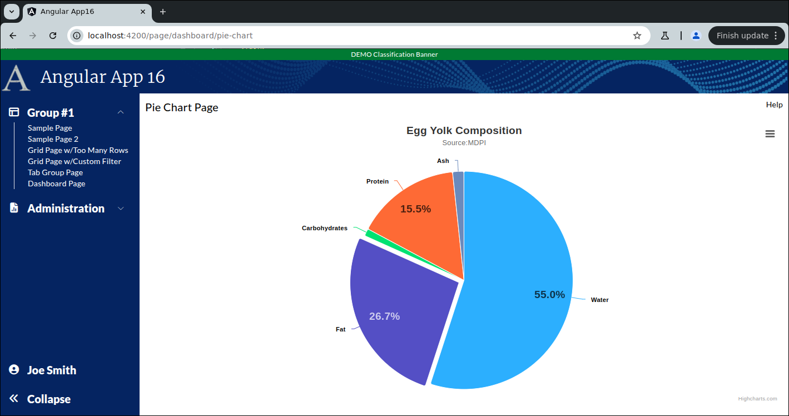

```
Exercise 25c / Clcking on the Little Pie Chart takes you to a Pie Chart Page
----------------------------------------------------------------------------
Goal:  If a user clicks on the little pie chart, open this full-size pie chart page

```

```


Exercise
--------
 1. Setup the Page
    a. Generate the component:                PieChartLarge
    b. Add the route to constants.ts:         the route will be this:   page/dashboard/pie-chart
    c. Register the route
    d. Add the route to the database table:  ui_controls        (if using real security)
    e. Add a link to the navbar (using that route)
    f. Use the debugger to verify that the navbar link works
    
    
    NOTE:  Do *NOT* add it to the navigation bar


 2. Setup this page layout
     +-------------------------------------------------------------------+
     | Pie Chart Page                                               Help |
     +-------------------------------------------------------------------+
     |                                                                   |
     |                                                                   |
     +-------------------------------------------------------------------+


 3. Change the bottom of the page so use the VISIBLE height of the browser
     +-------------------------------------------------------------------+
     | Pie Chart Pag                                                Help |
     +-------------------------------------------------------------------+
     | Chart is here                                                     |   Height of the bottom of page *STRETCHES*
     |                                                                   |
     +-------------------------------------------------------------------+
 
    
        
        
 4. Put your little pie chart in the big page
 
 
 
 5. Edit the Dashboard Page / TypeScript
    a. Inject the router
    b. Add a method:  navigateToPieChartPage()
       -- This method should take the user to the large pie chart page
    
    
    
 8. Edit the Dashboard Page / HTML
    a. Add a click handler to the div around pie chart 1 so it calles navigateToPieChartPage()
    
    
    
 9. Edit the Dashboard Page / HTML
     a. Change the cursor to a pointer if the mouse is over pie chart 1  (as it is clickable)
     
     
     
10. Try it out
    a. Go to the Dashboard Page
    b. Click on the pie chart
       -- It should take you to the full size page

```

