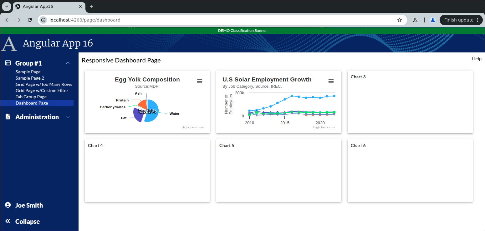

```
Exercise 25d / Load Charts using a Front-end Service  (Answer)
--------------------------------------------------------------
Problem:  The chart will be loaded from a REST call so it needs to get its data using an observable
Solution: Make a frontend service that returns an observable with the data (in the correct format)

```

```


Part 1 / Create the Chart Component w/hard-coded data
-----------------------------------------------------
 1. Create the pie chart component:   LineChartSmallComponent
 
 2. Edit the Main Dashboard Page / HTML
    a. Remove the hard-coded "Chart 2"
    b. Add-in the reference to the newly-created LineChartSmallComponent
    c. Make sure your LineChartSmallComponent uses 100% of the height and width
        
        <div class="w-[400px] h-[200px] mat-elevation-z4 p-2.5">
            <!-- C H A R T    2  -->
            <app-line-chart-small class="h-full w-full"></app-line-chart-small>
        </div>
        
        
 
 3. Edit the line chart component / HTML
    NOTE:  The entire HTML is just a div with a unique ID -- e.g., "chart2"
           The div should use 100% of the height and width
               
        <div class="h-full w-full" id="chart2"></div>

        
        
 4. Edit the line chart component / TypeScript
 
 5. Add the high chart options (before the @Component)

            import * as Highcharts from "highcharts";
            window.Highcharts = Highcharts;
            
            // Turn on the high-chart context menu view/print/download options
            import HC_exporting from "highcharts/modules/exporting";
            HC_exporting(Highcharts);
            
            // Turn on the high-chart context menu *export* options
            // NOTE:  This provides these menu options: Download CSV, Download XLS, View Data Table
            import HC_exportData from "highcharts/modules/export-data";
            HC_exportData(Highcharts);
            
            // Do client-side exporting (so that the exporting does *NOT* go to https://export.highcharts.com/
            // NOTE:  This does not work on all web browsers
            import HC_offlineExport from "highcharts/modules/offline-exporting";
            HC_offlineExport(Highcharts);
            
            // Turn on the drill-down capabilities
            import {Chart} from "highcharts";
            import HC_drillDown from "highcharts/modules/drilldown";
            HC_drillDown(Highcharts);
               
               
    
 6. Add a private class variable called chartOptions
        private charOptions: any;
        
        
  
 7. Set the chartOptions to hold the chart options for a line chart
    a. Go to https://www.highcharts.com/
    b. Click on Demos
    c. Select a line chart you like
       *OR*
       Go to https://www.highcharts.com/demo/highcharts/line-chart
       
    d. Press JSfiddle button
    e. Copy the chart configuration from the javaScript
    f. Set your chartOptions variable equal to it
    
    
        private chartOptions: any =   {

            title: {
                text: 'U.S Solar Employment Growth',
                align: 'left'
            },
        
            subtitle: {
                text: 'By Job Category. Source: <a href="https://irecusa.org/programs/solar-jobs-census/" target="_blank">IREC</a>.',
                align: 'left'
            },
        
            yAxis: {
                title: {
                    text: 'Number of Employees'
                }
            },
        
            xAxis: {
                accessibility: {
                    rangeDescription: 'Range: 2010 to 2022'
                }
            },
        
            legend: {
                layout: 'vertical',
                align: 'right',
                verticalAlign: 'middle'
            },
        
            plotOptions: {
                series: {
                    label: {
                        connectorAllowed: false
                    },
                    pointStart: 2010
                }
            },
        
            series: [{
                name: 'Installation & Developers',
                data: [
                    43934, 48656, 65165, 81827, 112143, 142383,
                    171533, 165174, 155157, 161454, 154610, 168960, 171558
                ]
            }, {
                name: 'Manufacturing',
                data: [
                    24916, 37941, 29742, 29851, 32490, 30282,
                    38121, 36885, 33726, 34243, 31050, 33099, 33473
                ]
            }, {
                name: 'Sales & Distribution',
                data: [
                    11744, 30000, 16005, 19771, 20185, 24377,
                    32147, 30912, 29243, 29213, 25663, 28978, 30618
                ]
            }, {
                name: 'Operations & Maintenance',
                data: [
                    null, null, null, null, null, null, null,
                    null, 11164, 11218, 10077, 12530, 16585
                ]
            }, {
                name: 'Other',
                data: [
                    21908, 5548, 8105, 11248, 8989, 11816, 18274,
                    17300, 13053, 11906, 10073, 11471, 11648
                ]
            }],
        
            responsive: {
                rules: [{
                    condition: {
                        maxWidth: 500
                    },
                    chartOptions: {
                        legend: {
                            layout: 'horizontal',
                            align: 'center',
                            verticalAlign: 'bottom'
                        }
                    }
                }]
            }
        
        };
         

 8. Edit the chartOptions object:  Remove the series information from it
 
         private chartOptions: any =   {

            title: {
                text: 'U.S Solar Employment Growth',
                align: 'left'
            },
        
            subtitle: {
                text: 'By Job Category. Source: <a href="https://irecusa.org/programs/solar-jobs-census/" target="_blank">IREC</a>.',
                align: 'left'
            },
        
            yAxis: {
                title: {
                    text: 'Number of Employees'
                }
            },
        
            xAxis: {
                accessibility: {
                    rangeDescription: 'Range: 2010 to 2022'
                }
            },
        
            legend: {
                layout: 'vertical',
                align: 'right',
                verticalAlign: 'middle'
            },
        
            plotOptions: {
                series: {
                    label: {
                        connectorAllowed: false
                    },
                    pointStart: 2010
                }
            },
        
            responsive: {
                rules: [{
                    condition: {
                        maxWidth: 500
                    },
                    chartOptions: {
                        legend: {
                            layout: 'horizontal',
                            align: 'center',
                            verticalAlign: 'bottom'
                        }
                    }
                }]
            }
        
        };
        
            
 9. Create a private method:  reloadData()
    
    a. This method set the series on the chartOptions
    
            // Update chart  with hard-coded data
            this.chartOptions.series = [
                {
                    name: 'Installation & Developers',
                    data: [
                        43934, 48656, 65165, 81827, 112143, 142383,
                        171533, 165174, 155157, 161454, 154610, 168960, 171558
                    ]
                }, {
                    name: 'Manufacturing',
                    data: [
                        24916, 37941, 29742, 29851, 32490, 30282,
                        38121, 36885, 33726, 34243, 31050, 33099, 33473
                    ]
                }, {
                    name: 'Sales & Distribution',
                    data: [
                        11744, 30000, 16005, 19771, 20185, 24377,
                        32147, 30912, 29243, 29213, 25663, 28978, 30618
                    ]
                }, {
                    name: 'Operations & Maintenance',
                    data: [
                        null, null, null, null, null, null, null,
                        null, 11164, 11218, 10077, 12530, 16585
                    ]
                }, {
                    name: 'Other',
                    data: [
                        21908, 5548, 8105, 11248, 8989, 11816, 18274,
                        17300, 13053, 11906, 10073, 11471, 11648
                    ]
                }];
         
         
         
         
    b. This method will tell Highcharts to render the chart in the div called "pie-chart1"
               
            // This renders the chart
            // NOTE:  You cannot render a chart from ngOnInit().  You can from ngAfterViewInit().
            Highcharts.chart('chart2', this.chartOptions);
    
            // Redraw all of the charts on this page (so they fit perfectly within the mat-card tags
            Highcharts.charts.forEach(function (chart: Chart | undefined) {
                chart?.reflow();
            });
    
  
          
10. After the component has rendered the HTML, call your reloadData() method
        
          public ngAfterViewInit(): void {
            // NOTE:  This call must be in ngAfterViewInit() and not in ngOnInit()
            setTimeout( () => {
              // Reload the data in a setTimeout block so Angular has time to build the page
              this.reloadData();
            });
          }


11. Verify that you see the chart in the dashboard page

12. Disable the legend in the chart

        legend: {
          enabled: false,          // Disable the legend
          layout: 'vertical',
          align: 'right',
          verticalAlign: 'middle'
        },


Part 2 / Load the Chart with a Frontend Service
-----------------------------------------------
 1. Create a frontend DTO:   GetChart2DataDTO
    -- It should hold name field    (that holds text)
    -- It should hold a data field  (that is an array of numbers/null values)

        export class GetChart2DataDTO {
          public name: string;
          public data: (number | null)[];
        }


 
 2. Create a frontend service:  ChartService
 
 3. Add a public method to the ChartService:   getAllDataForChart2()
    -- What is passed-in?  Nothing
    -- What is returned?   Observlable that holds an array of GetChart2DataDTO
 
 
 4. Fill-in the public method:     getAllDataForChart2()
    a. Create a local variable that holds an your fake data
    b. Convert your data into an observable
    c. Return the observable
 
          public getAllDataForChart2(): Observable<GetChart2DataDTO[]> {
            let data: GetChart2DataDTO[] = [
              {
                name: 'Installation & Developers',
                data: [
                  43934, 48656, 65165, 81827, 112143, 142383,
                  171533, 165174, 155157, 161454, 154610, 168960, 171558
                ]
              }, {
                name: 'Manufacturing',
                data: [
                  24916, 37941, 29742, 29851, 32490, 30282,
                  38121, 36885, 33726, 34243, 31050, 33099, 33473
                ]
              }, {
                name: 'Sales & Distribution',
                data: [
                  11744, 30000, 16005, 19771, 20185, 24377,
                  32147, 30912, 29243, 29213, 25663, 28978, 30618
                ]
              }, {
                name: 'Operations & Maintenance',
                data: [
                  null, null, null, null, null, null, null,
                  null, 11164, 11218, 10077, 12530, 16585
                ]
              }, {
                name: 'Other',
                data: [
                  21908, 5548, 8105, 11248, 8989, 11816, 18274,
                  17300, 13053, 11906, 10073, 11471, 11648
                ]
              }];
        
            return of(data);
          }   


 5. Edit your Line Chart Component / TypeScript
    a. Inject your ChartService
    
        public constructor(private chartService: ChartService) { }  
    
    
    b. Edit the reloadData() by removing the hard-coded data 
    
    c. Edit the reloadData() so it uses your ChartService to load the chartOptions.series info

          private reloadData(): void {
            // Update chart  with hard-coded data
        
            this.chartService.getAllDataForChart2().subscribe( (aData: GetChart2DataDTO[]) => {
              // The REST call came back with data
        
              // Set the data in the chartOptions object
              this.chartOptions.series = aData;
        
              // This renders the chart
              // NOTE:  You cannot render a chart from ngOnInit().  You can from ngAfterViewInit().
              Highcharts.chart('chart2', this.chartOptions);
        
              // Redraw all of the charts on this page (so they fit perfectly within the mat-card tags
              Highcharts.charts.forEach(function (chart: Chart | undefined) {
                chart?.reflow();
              });
            });
            
          }

    
       -- At this point, the LineChartComponent should not have any hard-coded data
       

    The Completed HTML for the Line Chart Component
    -----------------------------------------------
    <div class="h-full w-full" id="chart2"></div>
    
    
    The Completed TypeScript for the Line Chart Component
    -----------------------------------------------------
    import {AfterViewInit, Component} from '@angular/core';
    import * as Highcharts from "highcharts";
    window.Highcharts = Highcharts;
    
    // Turn on the high-chart context menu view/print/download options
    import HC_exporting from "highcharts/modules/exporting";
    HC_exporting(Highcharts);
    
    // Turn on the high-chart context menu *export* options
    // NOTE:  This provides these menu options: Download CSV, Download XLS, View Data Table
    import HC_exportData from "highcharts/modules/export-data";
    HC_exportData(Highcharts);
    
    // Do client-side exporting (so that the exporting does *NOT* go to https://export.highcharts.com/
    // NOTE:  This does not work on all web browsers
    import HC_offlineExport from "highcharts/modules/offline-exporting";
    HC_offlineExport(Highcharts);
    
    // Turn on the drill-down capabilities
    import {Chart} from "highcharts";
    import HC_drillDown from "highcharts/modules/drilldown";
    import {ChartService} from "../../../services/chart.service";
    import {GetChart2DataDTO} from "../../../models/dashboard/get-chart2-data-dto";
    HC_drillDown(Highcharts);
    
    
    @Component({
      selector: 'app-line-chart-small',
      templateUrl: './line-chart-small.component.html',
      styleUrls: ['./line-chart-small.component.scss']
    })
    export class LineChartSmallComponent implements AfterViewInit {
    
      public constructor(private chartService: ChartService) { }
    
      private chartOptions: any =   {
    
        title: {
          text: 'U.S Solar Employment Growth',
          align: 'left'
        },
    
        subtitle: {
          text: 'By Job Category. Source: <a href="https://irecusa.org/programs/solar-jobs-census/" target="_blank">IREC</a>.',
          align: 'left'
        },
    
        yAxis: {
          title: {
            text: 'Number of Employees'
          }
        },
    
        xAxis: {
          accessibility: {
            rangeDescription: 'Range: 2010 to 2022'
          }
        },
    
        legend: {
          enabled: false,
          layout: 'vertical',
          align: 'right',
          verticalAlign: 'middle'
        },
    
        plotOptions: {
          series: {
            label: {
              connectorAllowed: false
            },
            pointStart: 2010
          }
        },
    
        responsive: {
          rules: [{
            condition: {
              maxWidth: 500
            },
            chartOptions: {
              legend: {
                layout: 'horizontal',
                align: 'center',
                verticalAlign: 'bottom'
              }
            }
          }]
        }
    
      };
    
    
      private reloadData(): void {
        // Update chart  with hard-coded data
    
        this.chartService.getAllDataForChart2().subscribe( (aData: GetChart2DataDTO[]) => {
          // The REST call came back with data
    
          // Set the data in the chartOptions object
          this.chartOptions.series = aData;
    
          // This renders the chart
          // NOTE:  You cannot render a chart from ngOnInit().  You can from ngAfterViewInit().
          Highcharts.chart('chart2', this.chartOptions);
    
          // Redraw all of the charts on this page (so they fit perfectly within the mat-card tags
          Highcharts.charts.forEach(function (chart: Chart | undefined) {
            chart?.reflow();
          });
        });
        
      }
    
      public ngAfterViewInit(): void {
        // NOTE:  This call must be in ngAfterViewInit() and not in ngOnInit()
        setTimeout( () => {
          // Reload the data in a setTimeout block so Angular has time to build the page
          this.reloadData();
        });
      }
    
    
    }

```