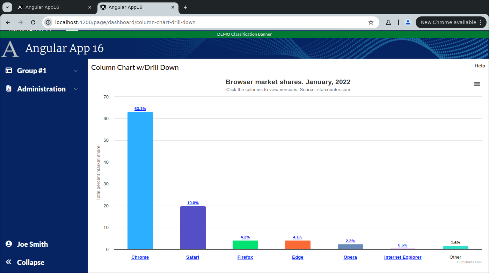
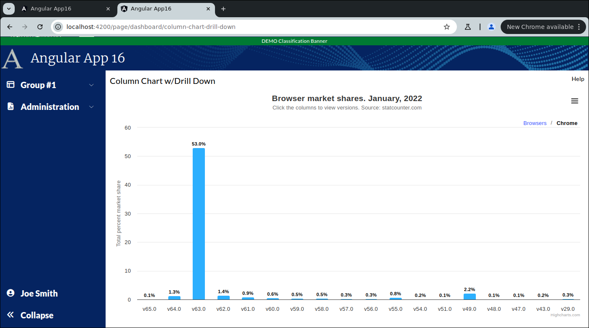

```
Exercise 25f / Create a Column Chart w/Drill Down  (Answer)
-----------------------------------------------------------
Problem:  As users click-in one parent chart, I want Highcharts to render a new "drill down" child chart


```

```
Clicking on a column or hyperlink opens a drill down column chart [see below]
```

```


Part 1 / Create the small column chart component
------------------------------------------------
 1. Create the small column chart component:   ColumnChartSmallComponent
 
 2. Edit the Main Dashboard Page / HTML
    a. Remove the hard-coded "Chart 3"
    b. Add-in the component to your dashboard chart
    c. Make sure your this chart uses 100% of the height and width (of the parent div)
        
        <div class="w-[400px] h-[200px] mat-elevation-z4 p-2.5">
          <!-- C H A R T     3  -->
          <app-column-chart-small class="h-full w-full"></app-column-chart-small>
        </div>
     
    d. Verify that you see "column-chart-small-component works!" in your dashboard
        
        
        
 
 3. Edit the little column chart component / HTML
    NOTE:  The entire HTML is just a div with a unique ID -- e.g., "chart3"
           The div should use 100% of the height and width
               
        <div class="h-full w-full" id="chart3"></div>

        
        
 4. Edit the little column chart component / TypeScript

 
 5. Add the imports for high chart (before the @Component)
 
        import * as Highcharts from "highcharts";
        window.Highcharts = Highcharts;
        
        // Turn on the high-chart context menu view/print/download options
        import HC_exporting from "highcharts/modules/exporting";
        HC_exporting(Highcharts);
        
        // Turn on the high-chart context menu *export* options
        // NOTE:  This provides these menu options: Download CSV, Download XLS, View Data Table
        import HC_exportData from "highcharts/modules/export-data";
        HC_exportData(Highcharts);
        
        // Do client-side exporting (so that the exporting does *NOT* go to https://export.highcharts.com/
        // NOTE:  This does not work on all web browsers
        import HC_offlineExport from "highcharts/modules/offline-exporting";
        HC_offlineExport(Highcharts);
        
        // Turn on the drill-down capabilities
        import {Chart} from "highcharts";
        import HC_drillDown from "highcharts/modules/drilldown";
        HC_drillDown(Highcharts);
               
               
    
 6. Add a private class variable called chartOptions
        private charOptions: any;
        
  
 7. Set the chartOptions to hold the chart options for a line chart
    a. Go to https://www.highcharts.com/demo/highcharts/column-drilldown
       *OR*
       Go to https://www.highcharts.com/
       Click on Demos
       Select "Column and bar charts" -> Column with drilldown
       
    b. Press JSfiddle button
    c. Copy the chart configuration from the javaScript
    d. Set your chartOptions variable equal to it
           


        private chartOption: any = {
              chart: {
                type: 'column'
              },
              title: {
                text: 'Browser market shares. January, 2022'
              },
              subtitle: {
                text: 'Click the columns to view versions. Source: <a href="http://statcounter.com" target="_blank">statcounter.com</a>'
              },
              accessibility: {
                announceNewData: {
                  enabled: true
                }
              },
              xAxis: {
                type: 'category'
              },
              yAxis: {
                title: {
                  text: 'Total percent market share'
                }
          
              },
              legend: {
                enabled: false
              },
              plotOptions: {
                series: {
                  borderWidth: 0,
                  dataLabels: {
                    enabled: true,
                    format: '{point.y:.1f}%'
                  }
                }
              },
          
              tooltip: {
                headerFormat: '<span style="font-size:11px">{series.name}</span><br>',
                pointFormat: '<span style="color:{point.color}">{point.name}</span>: ' +
                  '<b>{point.y:.2f}%</b> of total<br/>'
              },
          
              series: [
                {
                  name: 'Browsers',
                  colorByPoint: true,
                  data: [
                    {
                      name: 'Chrome',
                      y: 63.06,
                      drilldown: 'Chrome'
                    },
                    {
                      name: 'Safari',
                      y: 19.84,
                      drilldown: 'Safari'
                    },
                    {
                      name: 'Firefox',
                      y: 4.18,
                      drilldown: 'Firefox'
                    },
                    {
                      name: 'Edge',
                      y: 4.12,
                      drilldown: 'Edge'
                    },
                    {
                      name: 'Opera',
                      y: 2.33,
                      drilldown: 'Opera'
                    },
                    {
                      name: 'Internet Explorer',
                      y: 0.45,
                      drilldown: 'Internet Explorer'
                    },
                    {
                      name: 'Other',
                      y: 1.582,
                      drilldown: null
                    }
                  ]
                }
              ],
              drilldown: {
                breadcrumbs: {
                  position: {
                    align: 'right'
                  }
                },
                series: [
                  {
                    name: 'Chrome',
                    id: 'Chrome',
                    data: [
                      [
                        'v65.0',
                        0.1
                      ],
                      [
                        'v64.0',
                        1.3
                      ],
                      [
                        'v63.0',
                        53.02
                      ],
                      [
                        'v62.0',
                        1.4
                      ],
                      [
                        'v61.0',
                        0.88
                      ],
                      [
                        'v60.0',
                        0.56
                      ],
                      [
                        'v59.0',
                        0.45
                      ],
                      [
                        'v58.0',
                        0.49
                      ],
                      [
                        'v57.0',
                        0.32
                      ],
                      [
                        'v56.0',
                        0.29
                      ],
                      [
                        'v55.0',
                        0.79
                      ],
                      [
                        'v54.0',
                        0.18
                      ],
                      [
                        'v51.0',
                        0.13
                      ],
                      [
                        'v49.0',
                        2.16
                      ],
                      [
                        'v48.0',
                        0.13
                      ],
                      [
                        'v47.0',
                        0.11
                      ],
                      [
                        'v43.0',
                        0.17
                      ],
                      [
                        'v29.0',
                        0.26
                      ]
                    ]
                  },
                  {
                    name: 'Firefox',
                    id: 'Firefox',
                    data: [
                      [
                        'v58.0',
                        1.02
                      ],
                      [
                        'v57.0',
                        7.36
                      ],
                      [
                        'v56.0',
                        0.35
                      ],
                      [
                        'v55.0',
                        0.11
                      ],
                      [
                        'v54.0',
                        0.1
                      ],
                      [
                        'v52.0',
                        0.95
                      ],
                      [
                        'v51.0',
                        0.15
                      ],
                      [
                        'v50.0',
                        0.1
                      ],
                      [
                        'v48.0',
                        0.31
                      ],
                      [
                        'v47.0',
                        0.12
                      ]
                    ]
                  },
                  {
                    name: 'Internet Explorer',
                    id: 'Internet Explorer',
                    data: [
                      [
                        'v11.0',
                        6.2
                      ],
                      [
                        'v10.0',
                        0.29
                      ],
                      [
                        'v9.0',
                        0.27
                      ],
                      [
                        'v8.0',
                        0.47
                      ]
                    ]
                  },
                  {
                    name: 'Safari',
                    id: 'Safari',
                    data: [
                      [
                        'v11.0',
                        3.39
                      ],
                      [
                        'v10.1',
                        0.96
                      ],
                      [
                        'v10.0',
                        0.36
                      ],
                      [
                        'v9.1',
                        0.54
                      ],
                      [
                        'v9.0',
                        0.13
                      ],
                      [
                        'v5.1',
                        0.2
                      ]
                    ]
                  },
                  {
                    name: 'Edge',
                    id: 'Edge',
                    data: [
                      [
                        'v16',
                        2.6
                      ],
                      [
                        'v15',
                        0.92
                      ],
                      [
                        'v14',
                        0.4
                      ],
                      [
                        'v13',
                        0.1
                      ]
                    ]
                  },
                  {
                    name: 'Opera',
                    id: 'Opera',
                    data: [
                      [
                        'v50.0',
                        0.96
                      ],
                      [
                        'v49.0',
                        0.82
                      ],
                      [
                        'v12.1',
                        0.14
                      ]
                    ]
                  }
                ]
              }
            };
               
           
 
 8. Edit the chartOptions object:  
    -- Remove the series    from the object
    -- Remove the drilldown from the object
    
    HINT:  Collapse the series section in IntelliJ and then delete that line
    
         private chartOptions: any = {
            chart: {
              type: 'column'
            },
            title: {
              text: 'Browser market shares. January, 2022'
            },
            subtitle: {
              text: 'Click the columns to view versions. Source: <a href="http://statcounter.com" target="_blank">statcounter.com</a>'
            },
            accessibility: {
              announceNewData: {
                enabled: true
              }
            },
            xAxis: {
              type: 'category'
            },
            yAxis: {
              title: {
                text: 'Total percent market share'
              }
        
            },
            legend: {
              enabled: false
            },
            plotOptions: {
              series: {
                borderWidth: 0,
                dataLabels: {
                  enabled: true,
                  format: '{point.y:.1f}%'
                }
              }
            },
        
            tooltip: {
              headerFormat: '<span style="font-size:11px">{series.name}</span><br>',
              pointFormat: '<span style="color:{point.color}">{point.name}</span>: ' +
                '<b>{point.y:.2f}%</b> of total<br/>'
            }
         };


   

 9. Create a private method:  reloadData()
    a. This method set the series section of your chartOptions object
              
         
    b. This method will tell Highcharts to render the chart in the div called "chart3"
               
            // This renders the chart
            // NOTE:  You cannot render a chart from ngOnInit().  You can from ngAfterViewInit().
            Highcharts.chart('chart3', this.chartOptions);
    
            // Redraw all of the charts on this page (so they fit perfectly within the mat-card tags
            Highcharts.charts.forEach(function (chart: Chart | undefined) {
                chart?.reflow();
            });
    
  
          
10. After the component has rendered the HTML, call your reloadData() method
        
          public ngAfterViewInit(): void {
            // NOTE:  This call must be in ngAfterViewInit() and not in ngOnInit()
            setTimeout( () => {
              // Reload the data in a setTimeout block so Angular has time to build the page
              this.reloadData();
            });
          }


11. Verify that you see the chart in the dashboard page


Part 2 / Create the full-size version of this column chart component
--------------------------------------------------------------------
 1. Setup the Page
    a. Generate the component:                ColumnChartLargeComponent
    b. Add the route to constants.ts:         the route will be this:   page/dashboard/column-chart-drill-down
    c. Register the route
    d. Add the route to the database table:  ui_controls        (if using real security)
    e. Use the debugger to verify that the navbar link works
    
    
    NOTE:  Do *NOT* add it to the navigation bar


 2. Setup this page layout
     +-------------------------------------------------------------------+
     | Column Chart w/Drill Down                                    Help |
     +-------------------------------------------------------------------+
     |                                                                   |
     |                                                                   |
     +-------------------------------------------------------------------+


     At this point, the HTML looks like this
     ---------------------------------------      
        <div class="m-2.5">
        
         <!-- Top of Page -->
          <div class="grid grid-cols-2">
              <div>
                <span class="text-xl">Column Chart w/Drill Down</span>
              </div>
        
              <div class="flex place-content-end">
                 Help
              </div>
          </div>
        
          <!-- Bottom of Page  -->
          <div class="mt-2.5">
              
            
          </div>
        
        </div>


 3. Change the bottom of the page so use the VISIBLE height of the browser
     +-------------------------------------------------------------------+
     | Column Chart w/Drill Down                                    Help |
     +-------------------------------------------------------------------+
     | Chart is here                                                     |   Height of the bottom of page *STRETCHES*
     |                                                                   |
     +-------------------------------------------------------------------+
 
        <div class="m-2.5">
        
          <div class="grid grid-cols-2">
              <div>
                <span class="text-xl">Column Chart w/Drill Down</span>
              </div>
        
              <div class="flex place-content-end">
                 Help
              </div>
          </div>
        
          <div class="mt-2.5">
              <!-- Add Grid Here -->
              <div class="overflow-y-auto" style="height: calc(100vh - 150px)">
        
                Grid is here
        
              </div>
        
          </div>
        
        
        </div>
        
        
        
 4. Put your little chart in the big page

        <div class="m-2.5">
        
          <div class="grid grid-cols-2">
            <div>
              <span class="text-xl">Column Chart w/Drill Down</span>
            </div>
        
            <div class="flex place-content-end">
              Help
            </div>
          </div>
        
          <div class="mt-2.5">
            <!-- Add Grid Here -->
            <div class="overflow-y-auto" style="height: calc(100vh - 150px)">
        
                <!-- C H A R T     -->
                <app-column-chart-small class="h-full w-full"></app-column-chart-small>
        
            </div>
        
          </div>
        
        </div>


 
 5. Edit the Dashboard Page / TypeScript
    a. Inject the router
    
    b. Add a method:  navigateToColumnChartPage()
       -- This method should take the user to the large column chart page
 
          public navigateToColumnChartPage(): void {
            this.router.navigate([Constants.COLUMN_CHART_DRILL_DOWN_PAGE_ROUTE]).then()
          }
  
     
    
 6. Edit the Dashboard Page / HTML
    a. Add a click handler to the div around small column chart so it calls your method
 
    b. Change the cursor to a pointer if the mouse is over your new chart  (as it is clickable)
     
        <div class="w-[400px] h-[200px] mat-elevation-z4 p-2.5 cursor-pointer" (click)="this.navigateToColumnChartPage()">
            <!-- C H A R T     3  -->
            <app-column-chart-small class="h-full w-full"></app-column-chart-small>
        </div>
           
           
           
 7. Try it out
    a. Go to the Dashboard Page
    b. Click on the drill down chart
       -- It should take you to the full size page


 8. Correct the problem with the hamburger
    Problem:  Clicking on the hamburger in the large column chart page causes scrollbars to appear
    Solution: Hide the scrollbars 
    
    a. Edit the large column chart HTML
    b. Change the overflow-y-auto to overflow-y-hidden and overflow-x-hidden 
        
        <div class="overflow-y-hidden overflow-x-hidden" style="height: calc(100vh - 150px)">
    
          <!--   C H A R T   -->
          <app-column-chart-small class="h-full w-full"></app-column-chart-small>
    
        </div>
        
        
        
        
    Large Chart Page / HTML
    -----------------------
    <div class="m-2.5">
    
      <div class="grid grid-cols-2">
        <div>
          <span class="text-xl">Column Chart w/Drill Down</span>
        </div>
    
        <div class="flex place-content-end">
          Help
        </div>
      </div>
    
      <div class="mt-2.5">
        <div class="overflow-y-hidden overflow-x-hidden" style="height: calc(100vh - 150px)">
    
          <!-- C H A R T     -->
          <app-column-chart-small class="h-full w-full"></app-column-chart-small>
        </div>
    
      </div>
    
    </div>
    
    
    Large Chart Page / TypeScript
    ------------------------------
    import { Component } from '@angular/core';
    
    @Component({
      selector: 'app-column-chart-large',
      templateUrl: './column-chart-large.component.html',
      styleUrls: ['./column-chart-large.component.scss']
    })
    export class ColumnChartLargeComponent {
    
    }
      
        
        
        
    Small Chart Page / HTML
    -----------------------
    <div class="h-full w-full" id="chart3"></div>
    
    
    Small Chart Page / TypeScript
    -----------------------------
    import {AfterViewInit, Component} from '@angular/core';
    
    import * as Highcharts from "highcharts";
    window.Highcharts = Highcharts;
    
    // Turn on the high-chart context menu view/print/download options
    import HC_exporting from "highcharts/modules/exporting";
    HC_exporting(Highcharts);
    
    // Turn on the high-chart context menu *export* options
    // NOTE:  This provides these menu options: Download CSV, Download XLS, View Data Table
    import HC_exportData from "highcharts/modules/export-data";
    HC_exportData(Highcharts);
    
    // Do client-side exporting (so that the exporting does *NOT* go to https://export.highcharts.com/
    // NOTE:  This does not work on all web browsers
    import HC_offlineExport from "highcharts/modules/offline-exporting";
    HC_offlineExport(Highcharts);
    
    // Turn on the drill-down capabilities
    import {Chart} from "highcharts";
    import HC_drillDown from "highcharts/modules/drilldown";
    HC_drillDown(Highcharts);
    
    
    @Component({
      selector: 'app-column-chart-small',
      templateUrl: './column-chart-small.component.html',
      styleUrls: ['./column-chart-small.component.scss']
    })
    export class ColumnChartSmallComponent implements AfterViewInit {
    
      private chartOptions: any = {
        chart: {
          type: 'column'
        },
        title: {
          text: 'Browser market shares. January, 2022'
        },
        subtitle: {
          text: 'Click the columns to view versions. Source: <a href="http://statcounter.com" target="_blank">statcounter.com</a>'
        },
        accessibility: {
          announceNewData: {
            enabled: true
          }
        },
        xAxis: {
          type: 'category'
        },
        yAxis: {
          title: {
            text: 'Total percent market share'
          }
    
        },
        legend: {
          enabled: false
        },
        plotOptions: {
          series: {
            borderWidth: 0,
            dataLabels: {
              enabled: true,
              format: '{point.y:.1f}%'
            }
          }
        },
    
        tooltip: {
          headerFormat: '<span style="font-size:11px">{series.name}</span><br>',
          pointFormat: '<span style="color:{point.color}">{point.name}</span>: ' +
            '<b>{point.y:.2f}%</b> of total<br/>'
        }
      };
    
    
      public reloadData(): void {
        this.chartOptions.series =  [
          {
            name: 'Browsers',
            colorByPoint: true,
            data: [
              {
                name: 'Chrome',
                y: 63.06,
                drilldown: 'Chrome'
              },
              {
                name: 'Safari',
                y: 19.84,
                drilldown: 'Safari'
              },
              {
                name: 'Firefox',
                y: 4.18,
                drilldown: 'Firefox'
              },
              {
                name: 'Edge',
                y: 4.12,
                drilldown: 'Edge'
              },
              {
                name: 'Opera',
                y: 2.33,
                drilldown: 'Opera'
              },
              {
                name: 'Internet Explorer',
                y: 0.45,
                drilldown: 'Internet Explorer'
              },
              {
                name: 'Other',
                y: 1.582,
                drilldown: null
              }
            ]
          }
        ];
    
        this.chartOptions.drilldown = {
          breadcrumbs: {
            position: {
              align: 'right'
            }
          },
          series: [
            {
              name: 'Chrome',
              id: 'Chrome',
              data: [
                [
                  'v65.0',
                  0.1
                ],
                [
                  'v64.0',
                  1.3
                ],
                [
                  'v63.0',
                  53.02
                ],
                [
                  'v62.0',
                  1.4
                ],
                [
                  'v61.0',
                  0.88
                ],
                [
                  'v60.0',
                  0.56
                ],
                [
                  'v59.0',
                  0.45
                ],
                [
                  'v58.0',
                  0.49
                ],
                [
                  'v57.0',
                  0.32
                ],
                [
                  'v56.0',
                  0.29
                ],
                [
                  'v55.0',
                  0.79
                ],
                [
                  'v54.0',
                  0.18
                ],
                [
                  'v51.0',
                  0.13
                ],
                [
                  'v49.0',
                  2.16
                ],
                [
                  'v48.0',
                  0.13
                ],
                [
                  'v47.0',
                  0.11
                ],
                [
                  'v43.0',
                  0.17
                ],
                [
                  'v29.0',
                  0.26
                ]
              ]
            },
            {
              name: 'Firefox',
              id: 'Firefox',
              data: [
                [
                  'v58.0',
                  1.02
                ],
                [
                  'v57.0',
                  7.36
                ],
                [
                  'v56.0',
                  0.35
                ],
                [
                  'v55.0',
                  0.11
                ],
                [
                  'v54.0',
                  0.1
                ],
                [
                  'v52.0',
                  0.95
                ],
                [
                  'v51.0',
                  0.15
                ],
                [
                  'v50.0',
                  0.1
                ],
                [
                  'v48.0',
                  0.31
                ],
                [
                  'v47.0',
                  0.12
                ]
              ]
            },
            {
              name: 'Internet Explorer',
              id: 'Internet Explorer',
              data: [
                [
                  'v11.0',
                  6.2
                ],
                [
                  'v10.0',
                  0.29
                ],
                [
                  'v9.0',
                  0.27
                ],
                [
                  'v8.0',
                  0.47
                ]
              ]
            },
            {
              name: 'Safari',
              id: 'Safari',
              data: [
                [
                  'v11.0',
                  3.39
                ],
                [
                  'v10.1',
                  0.96
                ],
                [
                  'v10.0',
                  0.36
                ],
                [
                  'v9.1',
                  0.54
                ],
                [
                  'v9.0',
                  0.13
                ],
                [
                  'v5.1',
                  0.2
                ]
              ]
            },
            {
              name: 'Edge',
              id: 'Edge',
              data: [
                [
                  'v16',
                  2.6
                ],
                [
                  'v15',
                  0.92
                ],
                [
                  'v14',
                  0.4
                ],
                [
                  'v13',
                  0.1
                ]
              ]
            },
            {
              name: 'Opera',
              id: 'Opera',
              data: [
                [
                  'v50.0',
                  0.96
                ],
                [
                  'v49.0',
                  0.82
                ],
                [
                  'v12.1',
                  0.14
                ]
              ]
            }
          ]
        };
    
        // This renders the chart
        // NOTE:  You cannot render a chart from ngOnInit().  You can from ngAfterViewInit().
        Highcharts.chart('chart3', this.chartOptions);
    
        // Redraw all of the charts on this page (so they fit perfectly within the mat-card tags
        Highcharts.charts.forEach(function (chart: Chart | undefined) {
          chart?.reflow();
        });
    
      }
    
    
      public ngAfterViewInit(): void {
        // NOTE:  This call must be in ngAfterViewInit() and not in ngOnInit()
        setTimeout( () => {
          // Reload the data in a setTimeout block so Angular has time to build the page
          this.reloadData();
        });
      }
    
    }

```
