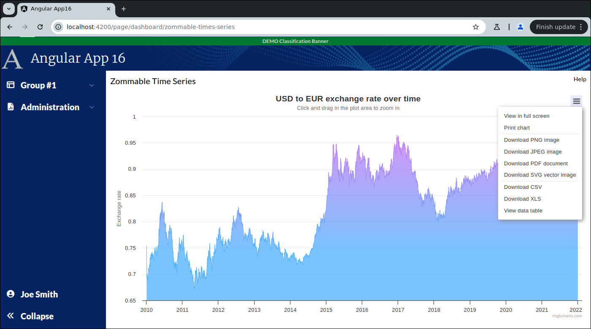
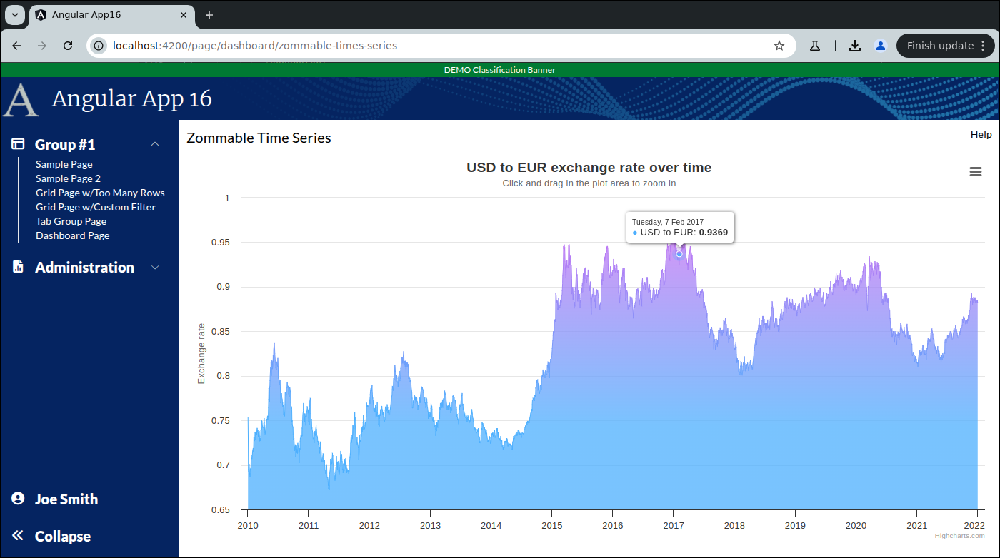

```
Exercise 25g / Customize the Context Menu, Tool Tips, Add Click Handler  (Answer)
----------------------------------------------------------------------------------
Problem 1:  I don't want to use the default context menu
Problem 2:  I want to change the tool tips when a user hovers over a data point
Problem 3:  I want to run some code when a user clicks on a section of a chart


```


```


Part 1 / Create the small column chart component
------------------------------------------------
 1. Create the small column chart component:   ZommableTimeSeriesLineChartSmallComponent
 
 2. Edit the Main Dashboard Page / HTML
    a. Remove the hard-coded "Chart 4"
    b. Add-in the component to your dashboard chart
    c. Make sure your this chart uses 100% of the height and width (of the parent div)
        
        <div class="w-[400px] h-[200px] mat-elevation-z4 p-2.5">
          <!-- C H A R T     4  -->
          <app-zommable-time-series-line-chart-small class="h-full w-full"></app-zommable-time-series-line-chart-small>
        </div>
     
    d. Verify that you see "zommable-time-series-line-chart-small works!" in your dashboard
        
        
        
 
 3. Edit the little chart component / HTML
    NOTE:  The entire HTML is just a div with a unique ID -- e.g., "chart4"
           The div should use 100% of the height and width
               
        <div class="h-full w-full" id="chart4"></div>

        
        
 4. Edit the little chart component / TypeScript

 
 
 5. Add the imports for high charts (before the @Component)
 
        import * as Highcharts from "highcharts";
        window.Highcharts = Highcharts;
        
        // Turn on the high-chart context menu view/print/download options
        import HC_exporting from "highcharts/modules/exporting";
        HC_exporting(Highcharts);
        
        // Turn on the high-chart context menu *export* options
        // NOTE:  This provides these menu options: Download CSV, Download XLS, View Data Table
        import HC_exportData from "highcharts/modules/export-data";
        HC_exportData(Highcharts);
        
        // Do client-side exporting (so that the exporting does *NOT* go to https://export.highcharts.com/
        // NOTE:  This does not work on all web browsers
        import HC_offlineExport from "highcharts/modules/offline-exporting";
        HC_offlineExport(Highcharts);
        
        // Turn on the drill-down capabilities
        import {Chart} from "highcharts";
        import HC_drillDown from "highcharts/modules/drilldown";
        HC_drillDown(Highcharts);
               
               
    
 6. Add a private class variable called chartOptions
        private charOptions: any;
        
  
 7. Set the chartOptions to hold the chart options for a line chart
    a. Go to https://www.highcharts.com/demo/highcharts/line-time-series
       *OR*
       Go to https://www.highcharts.com/
       Click on Demos
       Select "Line charts" -> "Time series, zommable"
       
    b. Press JSfiddle button or "Code"
    c. Copy the chart configuration from the javaScript
    d. Set your chartOptions variable equal to it
       
       
        Problem:  How will you get the data into your char component?
   
           private data: any = [
           
           ];
                   
        
           private chartOptions: any = {
            chart: {
              zooming: {
                type: 'x'
              }
            },
            title: {
              text: 'USD to EUR exchange rate over time'
            },
            subtitle: {
              text: document.ontouchstart === undefined ?
                'Click and drag in the plot area to zoom in' :
                'Pinch the chart to zoom in'
            },
            xAxis: {
              type: 'datetime'
            },
            yAxis: {
              title: {
                text: 'Exchange rate'
              }
            },
            legend: {
              enabled: false
            },
            plotOptions: {
              area: {
                marker: {
                  radius: 2
                },
                lineWidth: 1,
                color: {
                  linearGradient: {
                    x1: 0,
                    y1: 0,
                    x2: 0,
                    y2: 1
                  },
                  stops: [
                    [0, 'rgb(199, 113, 243)'],
                    [0.7, 'rgb(76, 175, 254)']
                  ]
                },
                states: {
                  hover: {
                    lineWidth: 1
                  }
                },
                threshold: null
              }
            },
        
            series: [{
              type: 'area',
              name: 'USD to EUR',
              data: this.data
            }]
          };
                       
           
 
 8. Edit the chartOptions object:  
    -- Remove the series    from the object
    
          private chartOptions: any = {
            chart: {
              zooming: {
                type: 'x'
              }
            },
            title: {
              text: 'USD to EUR exchange rate over time'
            },
            subtitle: {
              text: document.ontouchstart === undefined ?
                'Click and drag in the plot area to zoom in' :
                'Pinch the chart to zoom in'
            },
            xAxis: {
              type: 'datetime'
            },
            yAxis: {
              title: {
                text: 'Exchange rate'
              }
            },
            legend: {
              enabled: false
            },
            plotOptions: {
              area: {
                marker: {
                  radius: 2
                },
                lineWidth: 1,
                color: {
                  linearGradient: {
                    x1: 0,
                    y1: 0,
                    x2: 0,
                    y2: 1
                  },
                  stops: [
                    [0, 'rgb(199, 113, 243)'],
                    [0.7, 'rgb(76, 175, 254)']
                  ]
                },
                states: {
                  hover: {
                    lineWidth: 1
                  }
                },
                threshold: null
              }
            }
            
          };

   

 9. Create a private method:  reloadData()
    a. This method set the series section of your chartOptions object
              
         
    b. This method will tell Highcharts to render the chart in the div called "chart3"
               
            // This renders the chart
            // NOTE:  You cannot render a chart from ngOnInit().  You can from ngAfterViewInit().
            Highcharts.chart('chart4', this.chartOptions);
    
            // Redraw all of the charts on this page (so they fit perfectly within the mat-card tags
            Highcharts.charts.forEach(function (chart: Chart | undefined) {
                chart?.reflow();
            });
    
  
          
10. After the component has rendered the HTML, call your reloadData() method
        
          public ngAfterViewInit(): void {
            // NOTE:  This call must be in ngAfterViewInit() and not in ngOnInit()
            setTimeout( () => {
              // Reload the data in a setTimeout block so Angular has time to build the page
              this.reloadData();
            });
          }


11. Verify that you see the chart in the dashboard page


Part 2 / Create the full-size version of this column chart component
--------------------------------------------------------------------
 1. Setup the Page
    a. Generate the component:                ZommableTimeSeriesLineChartLargeComponent
    b. Add the route to constants.ts:         the route will be this:   page/dashboard/zommable-times-series
    c. Register the route
    d. Add the route to the database table:  ui_controls        (if using real security)
    e. Use the debugger to verify that the navbar link works
    
    
    NOTE:  Do *NOT* add it to the navigation bar


 2. Setup this page layout
     +-------------------------------------------------------------------+
     | Zommable Time Series                                         Help |
     +-------------------------------------------------------------------+
     |                                                                   |
     |                                                                   |
     +-------------------------------------------------------------------+


     At this point, the HTML looks like this
     ---------------------------------------      
        <div class="m-2.5">
        
         <!-- Top of Page -->
          <div class="grid grid-cols-2">
              <div>
                <span class="text-xl">Zommable Time Series</span>
              </div>
        
              <div class="flex place-content-end">
                 Help
              </div>
          </div>
        
          <!-- Bottom of Page  -->
          <div class="mt-2.5">
              
            
          </div>
        
        </div>


 3. Change the bottom of the page so use the VISIBLE height of the browser
     +-------------------------------------------------------------------+
     | Zommable Time Series                                         Help |
     +-------------------------------------------------------------------+
     | Chart is here                                                     |   Height of the bottom of page *STRETCHES*
     |                                                                   |
     +-------------------------------------------------------------------+
 
        <div class="m-2.5">
        
          <div class="grid grid-cols-2">
              <div>
                <span class="text-xl">Zommable Time Series</span>
              </div>
        
              <div class="flex place-content-end">
                 Help
              </div>
          </div>
        
          <div class="mt-2.5">
              
              <div class="overflow-y-auto" style="height: calc(100vh - 150px)">
        
                <!--   C H A R T     -->
                Chart is here
        
              </div>
        
          </div>
        
        
        </div>
        
        
        
 4. Put your little chart in the big page

        <div class="m-2.5">
        
          <div class="grid grid-cols-2">
            <div>
              <span class="text-xl">Zommable Time Series</span>
            </div>
        
            <div class="flex place-content-end">
              Help
            </div>
          </div>
        
          <div class="mt-2.5">
            
            <div class="overflow-y-auto" style="height: calc(100vh - 150px)">
        
                  <!--   C H A R T     -->
                  <app-zommable-time-series-line-chart-small class="h-full w-full"></app-zommable-time-series-line-chart-small>
        
            </div>
        
          </div>
        
        </div>


 
 5. Edit the Dashboard Page / TypeScript
    a. Inject the router
    
    b. Add a method:  navigateToZommableTimeSeriesLineChartPage()
       -- This method should take the user to the large column chart page
 
          public navigateToZommableTimeSeriesLineChartPage(): void {
            this.router.navigate([Constants.COLUMN_CHART_DRILL_DOWN_PAGE_ROUTE]).then()
          }
  
     
    
 6. Edit the Dashboard Page / HTML
    a. Add a click handler to the div around small column chart so it calls your method
 
    b. Change the cursor to a pointer if the mouse is over your new chart  (as it is clickable)
     
        <div class="w-[400px] h-[200px] mat-elevation-z4 p-2.5 cursor-pointer" (click)="this.navigateToZommableTimeSeriesLineChartPage()">
          <!-- C H A R T     4  -->
          <app-zommable-time-series-line-chart-small class="h-full w-full"></app-zommable-time-series-line-chart-small>
        </div>
           
           
           
 7. Try it out
    a. Go to the Dashboard Page
    b. Click on the small chart
       -- It should take you to the full size page


 8. Correct the problem with the hamburger
    Problem:  Clicking on the hamburger in the large column chart page causes scrollbars to appear
    Solution: Hide the scrollbars 
    
    a. Edit the large chart HTML
    b. Change the overflow-y-auto to overflow-y-hidden and overflow-x-hidden 
        
        <div class="overflow-x-hidden overflow-y-hidden" style="height: calc(100vh - 150px)">
    
          <!--   C H A R T     -->
          <app-zommable-time-series-line-chart-small class="h-full w-full"></app-zommable-time-series-line-chart-small>
        </div>
        
   
   
   
Part 3 / Customize the Context Menu on the chart component
----------------------------------------------------------     
 1. By default, highcharts provides these context menu options
    
           exporting: {
                 buttons: {
                    contextButton: {
                        menuItems:  [
                                'viewFullscreen',
                                'printChart',
                                'separator',
                                'downloadPNG',
                                'downloadJPEG',
                                'downloadPDF',
                                'downloadSVG',
                                'separator',
                                'downloadCSV',
                                'downloadXLS',
                                'viewData'
                        ]
                    }
                }
           }
    
    So, add these options explicitly to chartOptions
    
 ```

```

 2. Remove the "View Data" option from the context menu
 
            exporting: {
                 buttons: {
                    contextButton: {
                        menuItems:  [
                                'viewFullscreen',
                                'printChart',
                                'separator',
                                'downloadPNG',
                                'downloadJPEG',
                                'downloadPDF',
                                'downloadSVG',
                                'separator',
                                'downloadCSV',
                                'downloadXLS'
                        ]
                    }
                }
           }
 
 3. Verify that the "View Data" option is NOT present
 
 
 4. Add a menu option:  "Return to Dashboard Page"
    a. Inject the router
    
    
    b. Add a method:  goToDashboardPage()
       -- This method will take the user back to the Dashboard Page
 
            private goToDashboardPage(): void {
                // Navigate to the Dashboard Page
                this.router.navigate([Constants.DASHBOARD_PAGE_ROUTE]).then();
            } 
            
               
                  
    c. Add the custom Context Menu option
       
            {
                text: 'Return to Dashboard Page',
                onclick: () => {
                    this.goToDashboardPage()
                }
            }


     
Part 4 / Change the Tooltips that appear (when a user hovers over a data point)
--------------------------------------------------------------------------------     
Problem:  The default tooltip appears to use this format:
               +-----------------------------+
               | Day of Week, DD MON YYYY    |
               | Series.name  y value        |
               +-----------------------------+
                      
          Change the tooltip formatter to be a one-liner
               +-----------------------------------+
               | Series.name  y value   MM/DD/YYYY |
               +-----------------------------------+            


 
    The default formatter is a function that can access certain values:
                this.x:           holds the x value / in this case, a date (stored as the milliseconds since the epoch)
                this.y:           holds the y value / in this case, the exchange rate value
                this.series.name  holds the name of this series
                

    Approach
      1. Get the this.x and convert it to a Date object
      2. Use the Date object to pull out the day, month, and year values
      3. Pad the day and month so that they start with a leading zero
      4. Build a new HTML string that has the value


 1. Add a custom tooltip formatter
    -- The key is formatter
    -- The value is a regular function that returns a string (that holds some HTML)
    
 
    tooltip: {
      formatter: function(): any {

        // Convert the milliseconds since epoch into a Date object
        // @ts-ignore
        let date = new Date(this.x);

        // Build the formatted date as mm/dd/yyyy
        // NOTE:  We must add 1 to the date.getMonth() as January has value of zero
        let formattedDate: string = String(date.getMonth() + 1).padStart(2, "0") + '/' +
          String(date.getDate()).padStart(2, "0") + '/' +
          date.getFullYear();

        // Return the string that holds the HTML to display for the tool tip
        // @ts-ignore
        return '<span style="color:{this.color}">' + this.series.name + '</span>: <b>' + this.y + '</b> on ' + formattedDate + '<br/>';
      }
    },


Part 5 / How to Run Code when a user Clicks on a data point
-----------------------------------------------------------
 1. Create a private method:  logPointInfo()
    -- This method will log the point info
    
          private logPointInfo(event: any): void {
            console.log('event.point.x=', event.point.x, '   event.point.y=', event.point.y, '   event=', event);
          }
          
         
 2. Tell highcharts to call this method when a user clicks on it
 
 	series: [
  	   {
	    	name: "Browsers",
    		colorByPoint: true,
    		data: [],

    		point: {
      			events:{
        				click: (event: any) => {
          					this.logPointInfo(event)
        				}
      			}
    		}

  	   }
	],


Part 5 / How to Run Code when a user Clicks on a data point or *AREA* beneath it
--------------------------------------------------------------------------------
 1. Remove the click handler from series
 2. Add the click handler to plotOptions.area.events
 3. Add plotOptions.area.trackByArea = true

        plotOptions: {
                area: {
                    ...
                    
                           trackByArea: true,
                            events: {
                              click: (event: any) => {
                                this.logPointInfo(event)
                              }
                            }                 
                }
            }
            
	
```