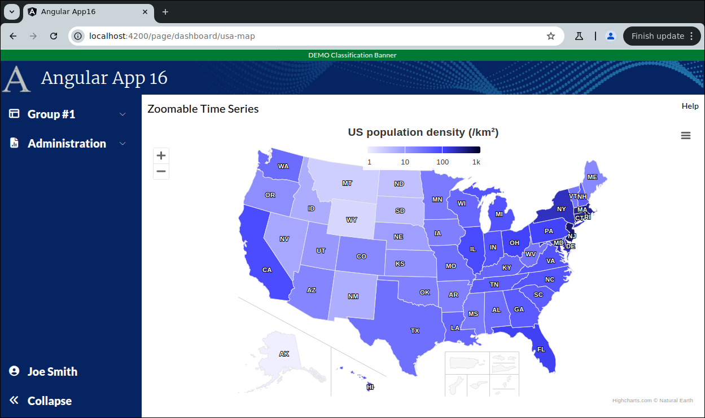

```
Exercise 25h / Add a MAP of the USA  (Answer)
---------------------------------------------
Problem:  I have data broken down by the 50 USA states and territories
          And, I want to display darker colors for higher numbers in those states


```

```

Part 1 / Install the Highcharts "Map Collerctions"
--------------------------------------------------
 1. Look at the different map collections that are available for download
    Go to https://code.highcharts.com/mapdata/
    
 2. Install the "Map Collections" frontend library to the project
    terminal> cd frontend
    terminal> npm install @highcharts/map-collection
 
 3. Verify that it was installed correctly
    -- Look at your package.json
    -- You should see this:
            "@highcharts/map-collection": "^2.3.0",

 4. Remove the carrot from the package.json entry
            "@highcharts/map-collection": "2.3.0",
  
     
 5. Verify that the topographical JSON map file is found:  us-all-territories.topo.json
    -- Verify this file exists
          angularApp16/frontend/node_modules/@highcharts/map-collection/countries/us/custom/us-all-territories.topo.json
    
    
    NOTE:  Highcharts v10 has built-in TopoJSON support
           + This means smaller map files, faster loading, and more flexible map layouts.
           + TopoJSON is an extension of GeoJSON that identifies shared polygon or line segments,
              typically a border between two countries, and refers it instead of repeating it.
              This, together with data compression of coordinates, greatly reduces file size compared to GeoJSON, and
              makes it highly suitable for use on the web. 
           + Highcharts Map Collection v2 we provide TopoJSON versions of its maps
           
           

Part 2 / Update your ChartService to it has a method to return the usa map data
-------------------------------------------------------------------------------
 1. Create your Chart Service (if you have not already done so)
    -- Inject the httpClient  (if you have not already done so)
    
 2. Add a method:  getUsaMapData()
    -- Nothing is passed-in
    -- It returns an observable with the data
    --  Have this method invoke a REST call to 
           https://www.highcharts.com/samples/data/us-population-density.json
           

        public getUsaMapData(): Observable<any> {
                // Construct the URL to get the USA map data
                const restUrl: string = 'https://www.highcharts.com/samples/data/us-population-density.json';
            
                // Return an observable that will invoke this REST call
                return this.httpClient.get(restUrl);
        }
          
    
      
      
Part 3 / Create the small map component
---------------------------------------
 1. Create the small column chart component:   UsaMapSmallComponent
 
 2. Edit the Main Dashboard Page / HTML
    a. Remove the hard-coded "Chart 5"
    b. Add-in the component to your dashboard chart
    c. Make sure your this chart uses 100% of the height and width (of the parent div)
        
        <div class="w-[400px] h-[200px] mat-elevation-z4 p-2.5">
            <!-- M A P      O F    U S A   -->
            <app-usa-map-small class="h-full w-full"></app-usa-map-small>
        </div>
     
    d. Verify that you see "usa-map-small work!" in your dashboard
        
        
        
 
 3. Edit the small USA map component / HTML
    NOTE:  The entire HTML is just a div with a unique ID -- e.g., "usaMap"
           The div should use 100% of the height and width
               
        <div class="h-full w-full" id="usaMap"></div>

        
        
 4. Edit the small USA map component / TypeScript
    a. Inject your chartService
 
 
 5. Add the imports for maps (before the @Component)
 
        import * as Highcharts from "highcharts";
        import MapModule from 'highcharts/modules/map';
        
        MapModule(Highcharts);
        
        // Turn on the highchart context menu *View/Print/Download* options
        //  -- Gives you these menu options: View in Full Screen, Print Chart, Download PNG, Download JPEG, Download PDF, Download SVG
        import HC_exporting from 'highcharts/modules/exporting';
        HC_exporting(Highcharts);
        
        // Turn on the highchart context menu *export* options
        // -- Gives you these menu options: Download CSV, Download XLS, View Data Table
        import HC_exportData from 'highcharts/modules/export-data';
        HC_exportData(Highcharts);
        
        // Do client-side exporting (so that calls do *NOT* go to https://export.highcharts.com/ but does not work on all browsers
        import HC_offlineExport from 'highcharts/modules/offline-exporting';
        HC_offlineExport(Highcharts);
        
        
        
 6. Read the contents of us-all-territories.topo.json into a class variable:  usaMapDataAsJson
    NOTE:  The file should be located here:
                  frontend/node_modules/@highcharts/map-collection/countries/us/custom/us-all-territories.topo.json
                  
        // Read the JSON (stored in us-all-territories.topo.json) into a variable called usaMapDataAsJson
        // @ts-ignore
        import usaMapDataAsJson from "@highcharts/map-collection/countries/us/custom/us-all-territories.topo.json";          
        
                   
           
 7. Add a private class variable called mapOptions
        private mapOptions: any;
        
        
        
  
 8. Set the mapOptions to hold map options for this map
    a. Go to https://www.highcharts.com/demo/maps/color-axis
       *OR*
       Go to https://www.highcharts.com/
       Click on Demos
       Select "Maps" -> "General" -> Color axis and data labels"
       
    b. Press JSfiddle button or "Code"
    c. Copy the configuration from the javaScript
    d. Set your mapOptions variable equal to it
    e. Change the mapOptions.chart.map to hold the usaMapDataAsJson
    
    
          private mapOptions: any = {
                chart: {
                  map: usaMapDataAsJson
                },
                title: {
                  text: 'US population density (/km²)'
                },
        
                exporting: {
                  sourceWidth: 600,
                  sourceHeight: 500
                },
        
                legend: {
                  layout: 'horizontal',
                  borderWidth: 0,
                  backgroundColor: 'rgba(255,255,255,0.85)',
                  floating: true,
                  verticalAlign: 'top',
                  y: 25
                },
        
                mapNavigation: {
                  enabled: true
                },
        
                colorAxis: {
                  min: 1,
                  type: 'logarithmic',
                  minColor: '#EEEEFF',
                  maxColor: '#000022',
                  stops: [
                    [0, '#EFEFFF'],
                    [0.67, '#4444FF'],
                    [1, '#000022']
                  ]
                },
        
                series: [{
                  accessibility: {
                    point: {
                      valueDescriptionFormat: '{xDescription}, {point.value} ' +
                        'people per square kilometer.'
                    }
                  },
                  animation: {
                    duration: 1000
                  },
                  joinBy: ['postal-code', 'code'],
                  dataLabels: {
                    enabled: true,
                    color: '#FFFFFF',
                    format: '{point.code}'
                  },
                  name: 'Population density',
                  tooltip: {
                    pointFormat: '{point.code}: {point.value}/km²'
                  }
                }]
             };
 
 9. Edit the mapOptions object:  
    -- Remove the data
    
   

10. Create a private method:  reloadData()
    a. This method will invoke a REST call to get the data
    
    b. Convert the returned code to upper case  
    
    c. set the data section of your mapOptions object

    e. Tell Highcharts to render the map in the div called "usaMap"
               
        
        private reloadData(): void {
    
          this.chartService.getUsaMapData().subscribe( (aMapData: any) => {
            // The REST Call came back with the USA Map data
    
            // Convert the codes to upper case *BEFORE* inserting it into the mapOptions object
            aMapData.forEach( (p: any) => {
              p.code = p.code.toUpperCase();
            });
    
            // Store the map data in the mapOptions object
            this.mapOptions.series[0].data = aMapData;
    
            // Render the map
            // NOTE:  You cannot render a chart or map from ngOnInit().  You can from ngAfterViewInit().
            Highcharts.mapChart('usaMap', this.mapOptions);
          });
    
        }   // end of reloadData()
          
          
          
11. After the component has rendered the HTML, call your reloadData() method
        
          public ngAfterViewInit(): void {
          
            // NOTE:  This call must be in ngAfterViewInit() and not in ngOnInit()
            setTimeout( () => {
              // Reload the data in a setTimeout block so Angular has time to build the page
              this.reloadData();
            });
            
          }


12. Verify that you see the map in the dashboard page


Part 4 / Create the full-size version of this small map component
-----------------------------------------------------------------
 1. Setup the Page
    a. Generate the component:                UsaMapLargeComponent
    b. Add the route to constants.ts:         the route will be this:   page/dashboard/usa-map
    c. Register the route
    d. Add the route to the database table:  ui_controls        (if using real security)
    e. Use the debugger to verify that the navbar link works
    
    
    NOTE:  Do *NOT* add it to the navigation bar


 2. Setup this page layout
     +-------------------------------------------------------------------+
     | USA Map                                                      Help |
     +-------------------------------------------------------------------+
     |                                                                   |
     |                                                                   |
     +-------------------------------------------------------------------+


     At this point, the HTML looks like this
     ---------------------------------------      
        <div class="m-2.5">
        
         <!-- Top of Page -->
          <div class="grid grid-cols-2">
              <div>
                <span class="text-xl">USA Map</span>
              </div>
        
              <div class="flex place-content-end">
                 Help
              </div>
          </div>
        
          <!-- Bottom of Page  -->
          <div class="mt-2.5">
              
            
          </div>
        
        </div>


 3. Change the bottom of the page so use the VISIBLE height of the browser
     +-------------------------------------------------------------------+
     | USA Map                                                      Help |
     +-------------------------------------------------------------------+
     | Map is here                                                       |   Height of the bottom of page *STRETCHES*
     |                                                                   |
     +-------------------------------------------------------------------+
 
        <div class="m-2.5">
        
          <div class="grid grid-cols-2">
              <div>
                <span class="text-xl">USA Map</span>
              </div>
        
              <div class="flex place-content-end">
                 Help
              </div>
          </div>
        
          <div class="mt-2.5">
              
              <div class="overflow-y-auto" style="height: calc(100vh - 150px)">
        
                <!--   U S A    M A P  -->
                Map is here
        
              </div>
        
          </div>
        
        
        </div>
        
        
        
 4. Put your little map in the big page

        <div class="m-2.5">
        
          <div class="grid grid-cols-2">
            <div>
              <span class="text-xl">Zoomable Time Series</span>
            </div>
        
            <div class="flex place-content-end">
              Help
            </div>
          </div>
        
          <div class="mt-2.5">
            
            <div class="overflow-hidden" style="height: calc(100vh - 150px)">
        
                  <!--   U S A    M A P  -->
                  <app-usa-map-small class="h-full w-full"></app-usa-map-small>
        
            </div>
        
          </div>
        
        </div>


 
 5. Edit the Dashboard Page / TypeScript
    a. Inject the router
    
    b. Add a method:  navigateToUsaMapPage()
       -- This method should take the user to the large map page
 
          public navigateToUsaMapPage(): void {
            this.router.navigate([Constants.LARGE_USA_MAP_PAGE_ROUTE]).then()
          }
  
     
    
 6. Edit the Dashboard Page / HTML
    a. Add a click handler to the div around small column map so it calls your method
 
    b. Change the cursor to a pointer if the mouse is over your new map  (as it is clickable)
     
        <div class="w-[400px] h-[200px] mat-elevation-z4 p-2.5" (click)="this.navigateToUsaMapPage()">
            <!--   U S A    M A P  -->
            <app-usa-map-small class="h-full w-full"></app-usa-map-small>
        </div>
           
           
           
 7. Try it out
    a. Go to the Dashboard Page
    b. Click on the small map
       -- It should take you to the full size page


 8. Correct the problem with the hamburger
    Problem:  Clicking on the hamburger in the large column map page causes scrollbars to appear
    Solution: Hide the scrollbars 
    
    a. Edit the large map HTML
    b. Change the overflow-y-auto to overflow-y-hidden and overflow-x-hidden 
        
        <div class="overflow-hidden" style="height: calc(100vh - 150px)">
    
          <!--   U S A    M A P  -->
          <app-usa-map-small class="h-full w-full"></app-usa-map-small>
    
        </div>
            

    Large Map Page / HTML
    ---------------------
    <div class="m-2.5">
    
      <div class="grid grid-cols-2">
        <div>
          <span class="text-xl">Zoomable Time Series</span>
        </div>
    
        <div class="flex place-content-end">
          Help
        </div>
      </div>
    
      <div class="mt-2.5">
    
        <div class="overflow-hidden" style="height: calc(100vh - 150px)">
    
          <!--   U S A    M A P  -->
          <app-usa-map-small class="h-full w-full"></app-usa-map-small>
    
        </div>
    
      </div>
    
    </div>

    
    Large Chart Page / TypeScript
    -----------------------------
    import { Component } from '@angular/core';
    
    @Component({
      selector: 'app-usa-map-large-component',
      templateUrl: './usa-map-large-component.component.html',
      styleUrls: ['./usa-map-large-component.component.scss']
    })
    export class UsaMapLargeComponentComponent {
    
    }


    
    
    Small Map Page / HTML
    ---------------------
    <div class="h-full w-full" id="usaMap"></div>
  
    
    
    Small Chart Page / TypeScript
    -----------------------------
    import {ChartService} from "../../../services/chart.service";
    import {AfterViewInit, Component} from '@angular/core';
    
    import * as Highcharts from "highcharts";
    import MapModule from 'highcharts/modules/map';
    
    MapModule(Highcharts);
    
    // Turn on the highchart context menu *View/Print/Download* options
    //  -- Gives you these menu options: View in Full Screen, Print Chart, Download PNG, Download JPEG, Download PDF, Download SVG
    import HC_exporting from 'highcharts/modules/exporting';
    HC_exporting(Highcharts);
    
    // Turn on the highchart context menu *export* options
    // -- Gives you these menu options: Download CSV, Download XLS, View Data Table
    import HC_exportData from 'highcharts/modules/export-data';
    HC_exportData(Highcharts);
    
    // Do client-side exporting (so that calls do *NOT* go to https://export.highcharts.com/ but does not work on all browsers
    import HC_offlineExport from 'highcharts/modules/offline-exporting';
    HC_offlineExport(Highcharts);
    
    // Read the JSON (stored in us-all-territories.geo.json) into a variable called usaMapDataAsJson
    // @ts-ignore
    import usaMapDataAsJson from "@highcharts/map-collection/countries/us/custom/us-all-territories.geo.json";
    
    
    @Component({
      selector: 'app-usa-map-small',
      templateUrl: './usa-map-small.component.html',
      styleUrls: ['./usa-map-small.component.scss']
    })
    export class UsaMapSmallComponent implements AfterViewInit {
    
      public constructor(private chartService: ChartService) {}
    
    
    
    
      private mapOptions: any = {
            chart: {
              map: usaMapDataAsJson
            },
            title: {
              text: 'US population density (/km²)'
            },
    
            exporting: {
              sourceWidth: 600,
              sourceHeight: 500
            },
    
            legend: {
              layout: 'horizontal',
              borderWidth: 0,
              backgroundColor: 'rgba(255,255,255,0.85)',
              floating: true,
              verticalAlign: 'top',
              y: 25
            },
    
            mapNavigation: {
              enabled: true
            },
    
            colorAxis: {
              min: 1,
              type: 'logarithmic',
              minColor: '#EEEEFF',
              maxColor: '#000022',
              stops: [
                [0, '#EFEFFF'],
                [0.67, '#4444FF'],
                [1, '#000022']
              ]
            },
    
            series: [{
              accessibility: {
                point: {
                  valueDescriptionFormat: '{xDescription}, {point.value} ' +
                    'people per square kilometer.'
                }
              },
              animation: {
                duration: 1000
              },
              joinBy: ['postal-code', 'code'],
              dataLabels: {
                enabled: true,
                color: '#FFFFFF',
                format: '{point.code}'
              },
              name: 'Population density',
              tooltip: {
                pointFormat: '{point.code}: {point.value}/km²'
              }
            }]
         };
    
        private reloadData(): void {
    
          this.chartService.getUsaMapData().subscribe( (aMapData: any) => {
            // The REST Call came back with the USA Map data
    
            // Convert the codes to upper case *BEFORE* inserting it into the mapOptions object
            aMapData.forEach( (p: any) => {
              p.code = p.code.toUpperCase();
            });
    
            // Store the map data in the mapOptions object
            this.mapOptions.series[0].data = aMapData;
    
            // Render the map
            // NOTE:  You cannot render a chart or map from ngOnInit().  You can from ngAfterViewInit().
            Highcharts.mapChart('usaMap', this.mapOptions);
          });
    
        }   // end of reloadData()
    
    
      public ngAfterViewInit(): void {
        setTimeout( () => {
          // Reload the data in a setTimeout block so Angular has time to build the page
          // NOTE:  This call must be in ngAfterViewInit() and not in ngOnInit()
          this.reloadData();
        });
      }
    
    
    
    }
        
    
    
```